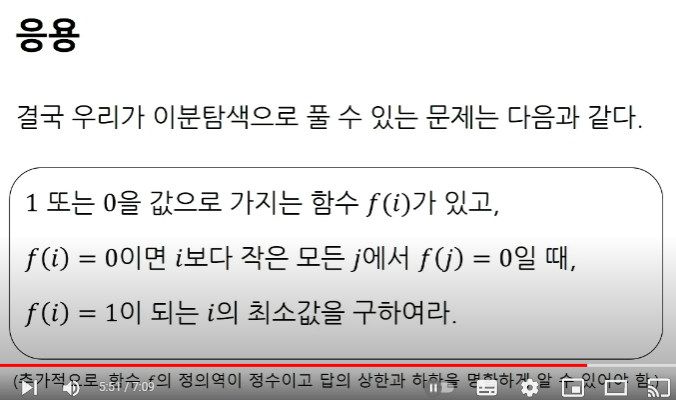
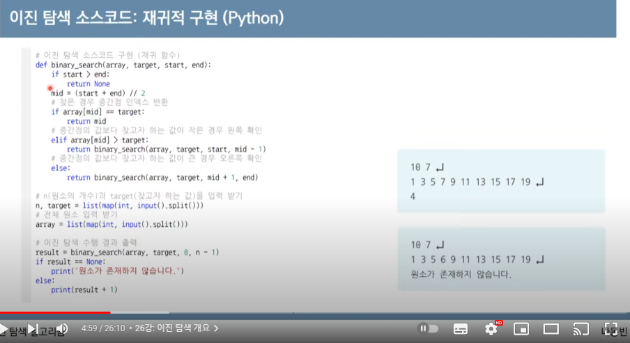
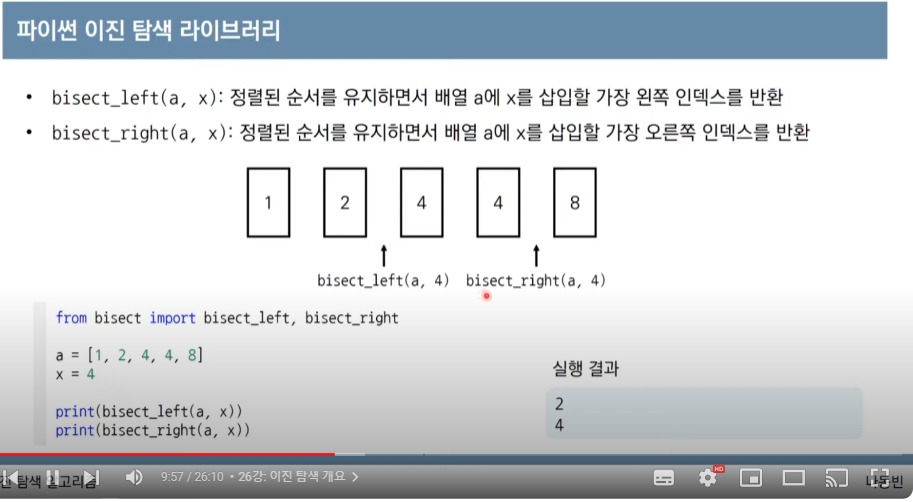

특정 조건을 만족하는 최소한의 점을 찾을 때 이용

시간복잡도는 log(n)

추가적으로 함수의 상한과 하한을 정확히 알고 있어야 함

- 정렬되어 있어야 함
- 3가지 변수, 시작 중간 끝(인덱스)

<소스코드>

<bisec>

이걸 통해서 현재 범위의 데이터의 갯수를 구할 수 있다. 

## 파라메트릭 서치

- 최적화 문제(함수의 최소값, 또는 최대값을 찾는 문제)를 결정 문제(예 혹은 아니오)로 바꾸어 해결하는 기법
    - ex) 특정 조건을 만족하는 가장 알맞은 값을 빠르게 찾는 최적화 문제
- 일반적으로 코딩 테스트에서 파라메트릭 서치 문제는 이진 탐색을 이용하여 해결 가능ㄹ
