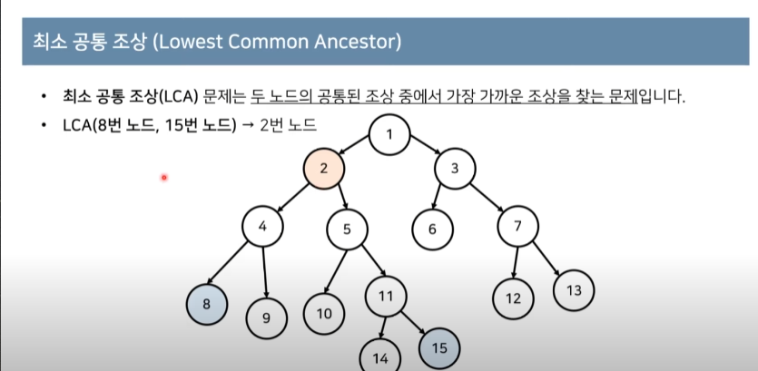
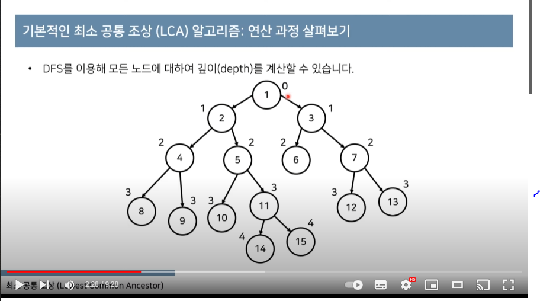
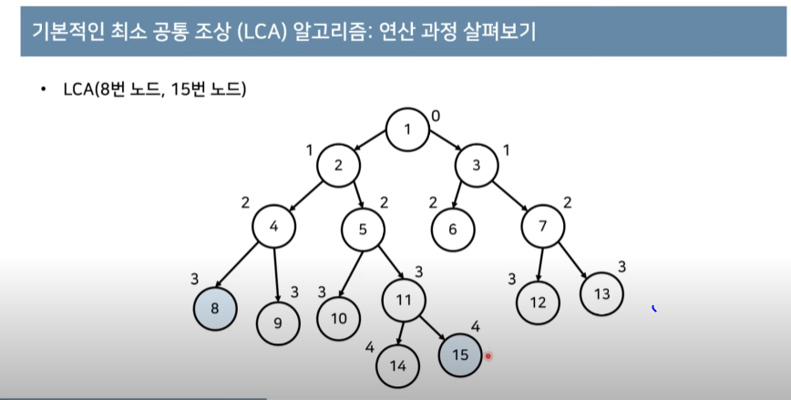
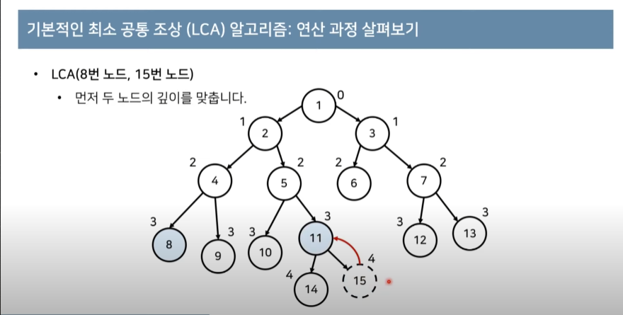
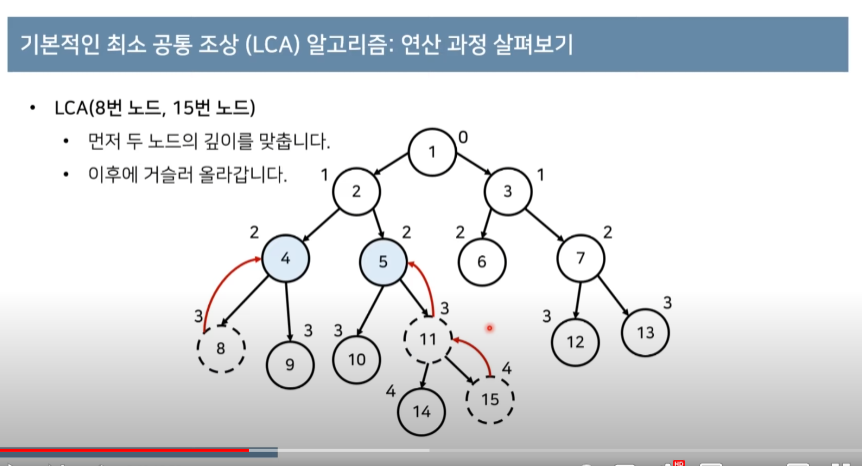
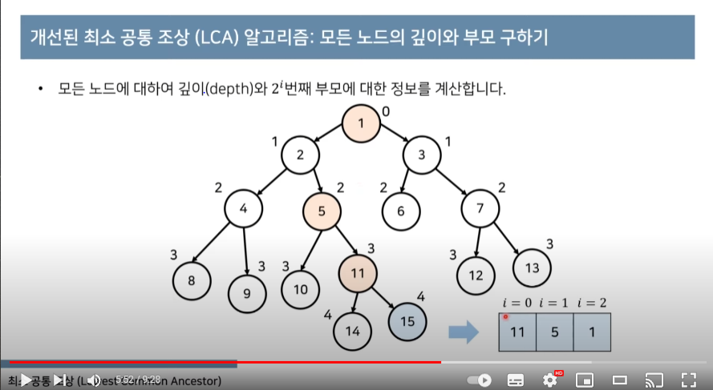
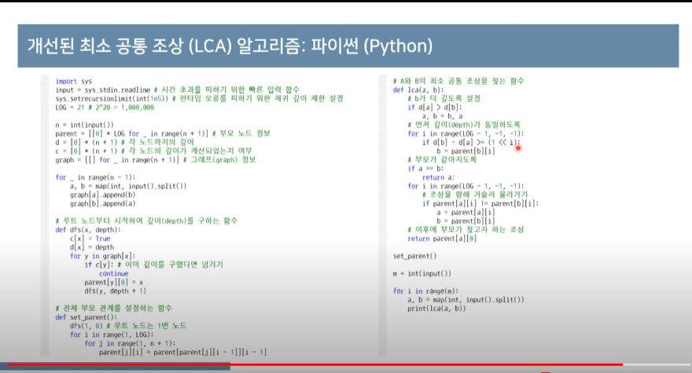

'''
N개의 정점으로 이루어진 트리가 주어진다.
트리의 각 정점은 1번부터 N번까지 번호가 매겨져 있으며, 루트는 1번이다.
두 노드의 쌍 M 개가 주어졌을 때, 두 노드의 가장 가까운 공통 조상이 몇 번인지 출력한다.
'''

최소 공통 조상(LCA): 두 노드의 공통된 조상 중에서 가장 가까운 조상을 찾는 문제.



# LCA 알고리즘

1. 모든 노드에 대한 깊이를 계산한다.
2. 최소 공통 조상을 찾을 두 노드를 확인한다
    1. 먼저 두 노드의 깊이가 동일하도록 거슬러 올라간다,
    2. 이후에 부모가 같아질 때까지 반복적으로 두 노드의 부모 방향으로 거슬러 올라간다.
   3. 결과적으로 언젠가는 두 노드가 같아진다.
3. 모든 LCA(a,b)연산에 대하여 2번의 과정을 반복한다.









```python
n = int(input())

parent = [0]*(n+1) # 부모 노드 정보
d = [0] *(n+1) # 각 노드까지의 깊이
c = [0] * (n+1) # 각 노드의 깊이가 계산되었는지 여부

graph = [[] for _ in range(n+1)] # 그래프 정보

# 인접 그래프 입력 받기 
for _ in range(n-1):
    a,b = map(int,input().split())
    graph[a].append(b)
    graph[b].append(a)

# 루트 노드부터 시작하여 깊이(depth, d)를 구하는 함수
def dfs(x,depth):
    c[x] = True
    d[x] = depth # 해당 노드의 깊이 할당 
    for y in graph[x]: # 인접한 애들한테서
        if c[y]: # 이미 깊이를 구했다면(방문했다면) 넘기기
            continue
        parent[y] = x #자식 노드를 인덱스로 부모 노드 넣기
        # -> 거슬러 올라가기 위해서, 자식 노드로 부모 노드를 찾을 수 있어야 함
        dfs(y,depth+1) # 다음 깊이로

# A와 B의 공통 조상을 찾는 함수
def LCA(a,b):
    #먼저 깊이(depth)가 동일하도록
    while d[a] != d[b]:
        if d[a] > d[b]:
            a = parent[a] # 부모 노드로 이동   
        else:
            b = parent[b]
    # 이제 레벨은 같아졌으니, 노드가 같아지도록
    while a != b:
        a = parent[a]
        b = parent[b]
    return a

dfs(1,0) # 루트 노드는 1번 노드, 해당 노드의 깊이는 0

m = int(input())

for i in range(m):
    a,b = map(int,input().split())
    print(LCA(a,b))
```   

## 개선된 최소 공통 조상 알고리즘

- 각 노드가 거슬러 올라가는 속도를 빠르게 만드는 방법?
  - 만약 총 15칸 거슬러 올라가야 한다면?
    - 8칸 -> 4칸 -> 2칸 -> 1칸
- 2의 제곱 형태로 거슬러 올라가도록 하면 O(logN)의 시간복잡도를 보장할 수 있다.
- 메모리를 조금 더 사용하여 각 노드 모두에 대하여 2**i번째 부모에 대한 정보를 *별도로* 기록한다.







