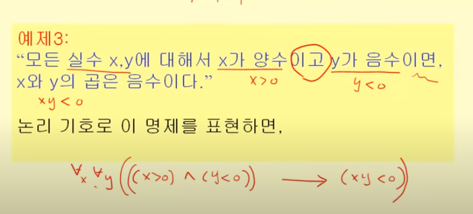
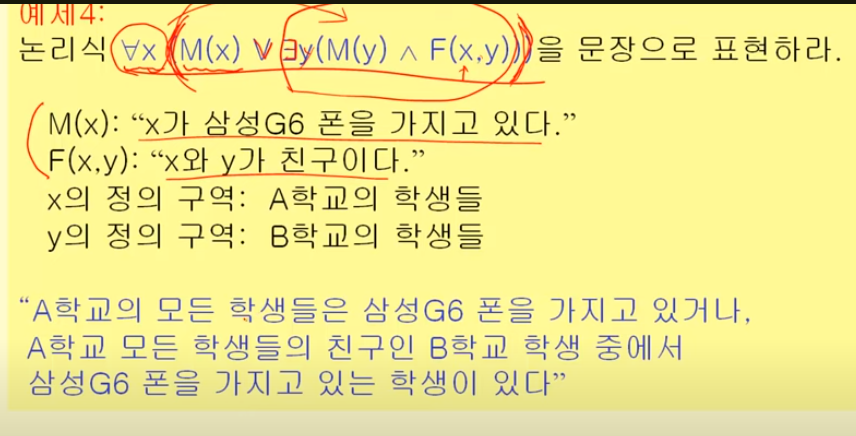
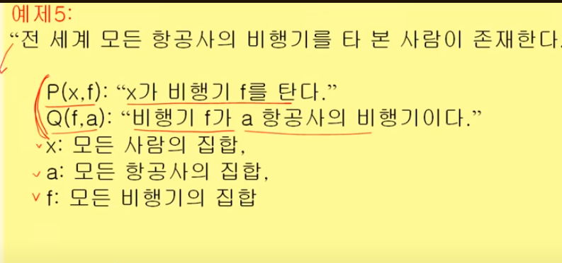
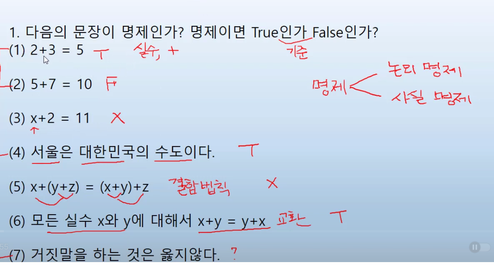
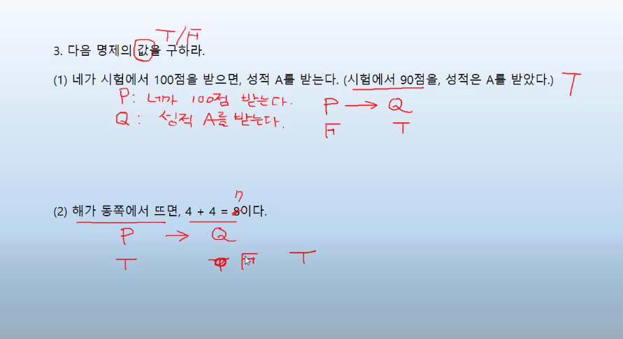
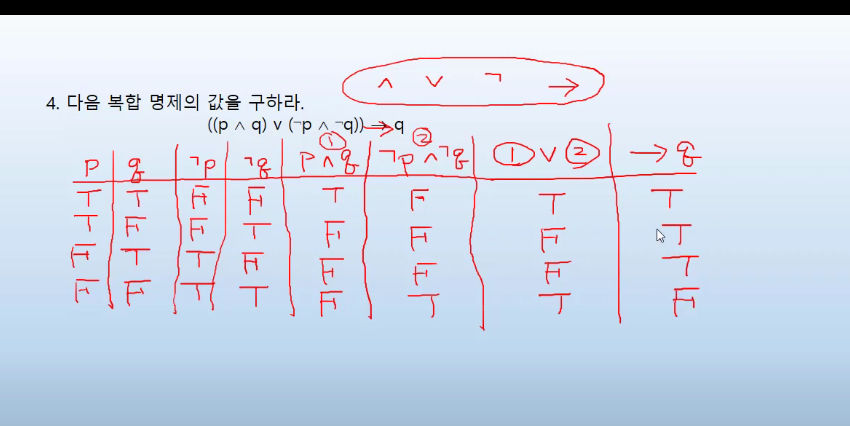
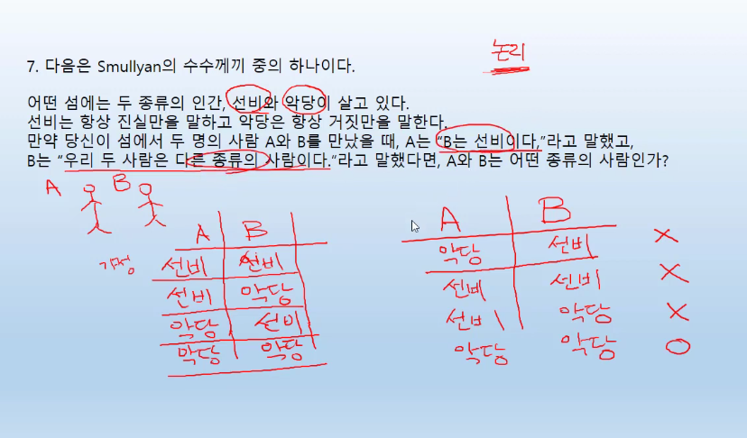

# 명제의 구성
명제는 주어와 술어로 구성되어 있다

정의역과 치역

All과 Some의 차이 파악

## 논리적 기호로 명제를 표현

>why?
1. 명료
2. 복합 명제의 판단

 

 

 

 Va(Ex Vf P(x,f)^Q(f,a))

 ### 문제풀이 1

#### 1번

 

 3은 x의 값이 정의되지 않았으므로 참 거짓 판단이 불가능 

 5도 정의영역이 정해지지 않음

참 거짓을 따질 수 없다면 과학이 아니라 사상, 주장, 믿음, 선호

마지막 문항은 가치 판단이지 명제가 아님.

명제
 - 논리 명제 - 수학, 논리학
 - 사실 명제 - 관찰, 실험, 자연과학

#### 2번 - 합성명제

#### 3번 복합명제

#### 4번 복합명제

진리표를 작성해서 보면 명료하다

#### 5번 동치

1) 진리표를 그려서 확인 

#### 6번 중복문제와 모순명제

중복문제 : 항상 참인 복합 명제

모순명제 : 항상 거짓인 복합 명제

#### 7번 수수께끼

A : B는 선비이다
B : 우리 둘은 다른 종류다

A B가 각각 선비, 악당일 경우의 수(4개)로 놔두고 계산

#### 8번 논리 연산자 사용

