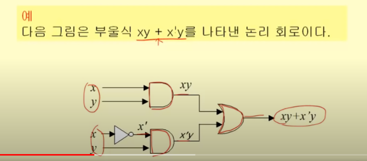
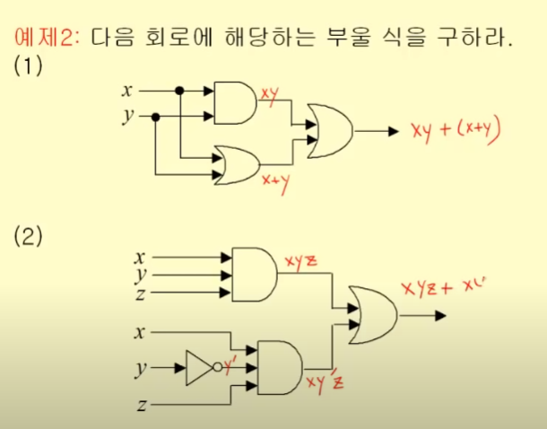
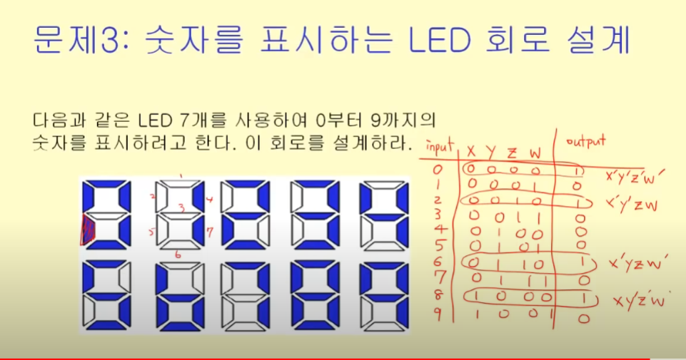
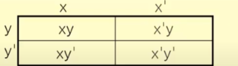
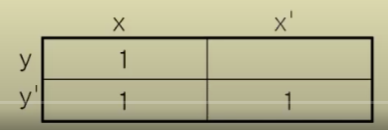

논리 회로를 설계하기 위해

[논리회로 설계 문제] -> [입력,출력 정의] -> [부울함수] -> [부울식] -> [부울식 최소화] -> [논리회로]

< 목차 >

- 부울 대수
- 부울 함수의 표현
- 부울식의 최소화
- 논리회로의 설계

# 부울 대수(Boolean algebra)

정의 : 집합 S = {0,1}에 대해 다음의 세가지 연산이 가능하다

- 보수 : ', 반대
- 부울 합 : +,OR
- 부울 곱 : \*, AND

- 부울 변수 : 집합 S = {0,1}의 원소 값만을 갖는 변수
- 부울 함수 : 0 또는 1의 입력값들에 대해 0또는 1의 출력값을 갖는 함수
- 차수 n의 부울 함수 : n-튜플의 입력 변수를 갖는 함수

< 부울 식>

< 항등 >

부울 함수의 형태가 달라도 모든 입력에 대해 값이 같다면 '항등'. 둘을 같다고 본다.

### 부울 식의 증명

1. 정의를 통해 진리표를 이용해서
2. 이미 증명된 명제(규칙)를 이용해서 : 수학의 이론 체계

### 부울 대수의 법칙

동치에서 배웠던 내용과 비슷

< 쌍대성의 원리 >

> x+0=x <=> x\*1 = x

0은 1로, +는 \*로 바뀌어도 같다

x(x+y) = x <=> x+x\*y

# 부울 함수

> 부울 함수 값이 주어졌을 때, 이 함수를 부울식으로 표현할 수 있다.

### 최소항

모든 요소들이 곱으로 연결되어 있는 것

### 논리합 형식 : 곱들의 합 -> 부울식 만들기

부울 함수를 최소항들의 부울 합으로 나타내는 형식

> 부울 함수의 부울식은, _함수의 값이 1이 되는_ 변수값의 조합들에 대하여 최소항들을 구하고, 그 최소항들의 부울 합(논리합 형식)을 취하면 구할 수 있다.

## 부울 함수의 최소화

가장 간단한 부울식으로 함수를 나타내기

### 카르노 맵

## 게이트와 부울 연산

게이트 : 회로의 기본 요소

전자 장치의 입 출력은 0 또는 1 -> 전자 회로를 설계하는데 부울 대수를 사용할 수 있다.

- 기본 게이트와 부울 연산
  - 인버터 -> 보수
  - OR 게이트 -> 부울 합
  - AND 게이트 -> 부울 곱

# 부울식과 논리 회로

부울 식은 논리 회로로 표현할 수 있다.

반대의 경우도 가능(논리 회로 -> 부울식)

### 논리 회로 설계

> 문제 -> 입력과 출력 정의(부울 함수) -> 부울식(논리식) -> 논리회로

이제 문제를 논리회로로 표현할 수 있다.

이제 논리를 시각적으로 표현할 수도 있다 == 전구

#### 문제 3: LED 회로

하나의 세그먼트만 생각했을 때

# 부울 식의 최소화

항등 관계에 있는 더 간단한 부울 식이 없을까?

부울식을 어떻게 하면 가장 간단한 방식으로?

## 카르노 맵

부울 함수의 가장 간단한 논리합 형식을 찾아내는 방법

1. 두 변수 x,y를 갖는 부울식을 위한 카르노 맵은 사각형에서 2\*2개의 칸으로 구성된다. 각 칸은 부울 함수의 최소항을 의미한다.

2. 부울 함수에서 해당 최소항이 있으면 그 칸을 1로 표시한다.

3m21s
