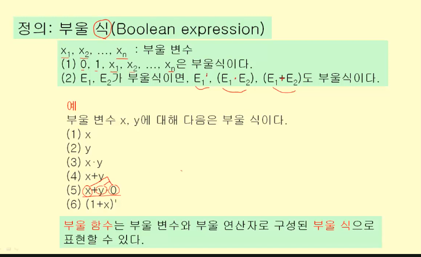
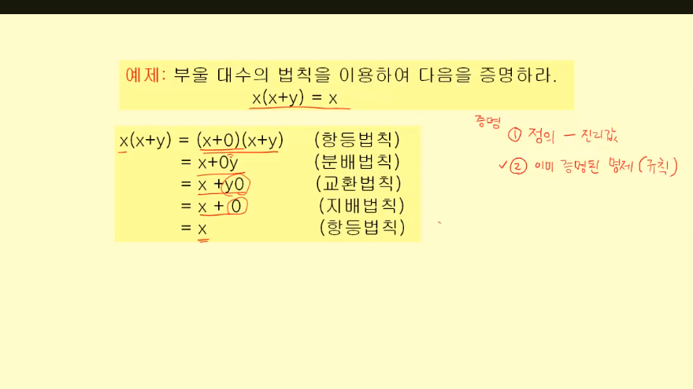
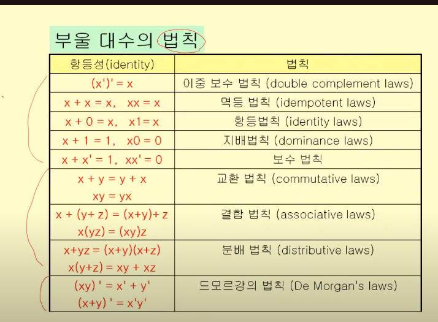
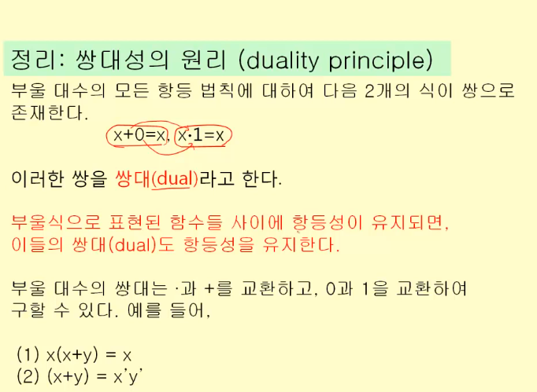
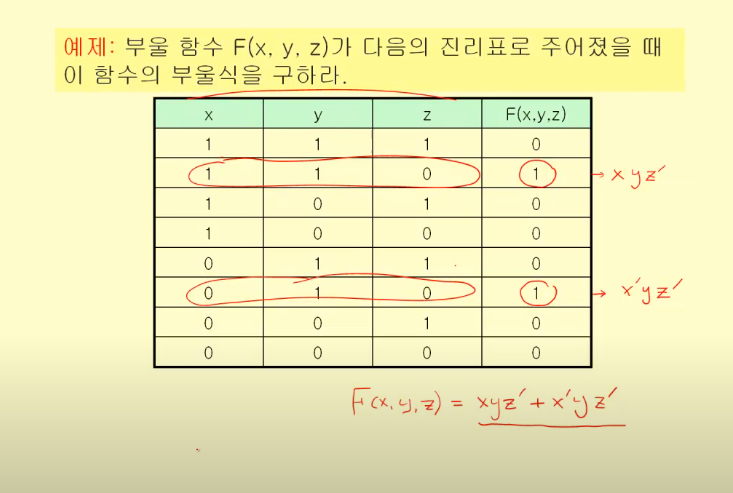

논리 회로를 설계하기 위해

[논리회로 설계 문제] -> [입력,출력 정의] -> [부울함수] -> [부울식] -> [부울식 최소화] -> [논리회로]

# 부울 대수(Boolean algebra)

정의 : 집합 S = {0,1}에 대해 다음의 세가지 연산이 가능하다
- 보수 : ', 반대
- 부울 합 : +,OR
- 부울 곱 : *, AND

- 부울 변수 : 집합 S = {0,1}의 원소 값만을 갖는 변수
- 부울 함수 : 0 또는 1의 입력값들에 대해 0또는 1의 출력값을 갖는 함수
- 차수 n의 부울 함수 : n-튜플의 입력 변수를 갖는 함수

< 부울 식>

< 항등 >

부울 함수의 형태가 달라도 모든 입력에 대해 값이 같다면 '항등'. 둘을 같다고 본다.

### 부울 식의 증명

1) 정의를 통해 진리표를 이용해서
2) 이미 증명된 명제(규칙)를 이용해서 : 수학의 이론 체계

### 부울 대수의 법칙

동치에서 배웠던 내용과 비슷

< 쌍대성의 원리 >

> x+0=x <=> x*1 = x

0은 1로, +는 *로 바뀌어도 같다

x(x+y) = x <=> x+x*y

## 부울 함수

> 부울 함수 값이 주어졌을 때, 이 함수를 부울식으로 표현할 수 있다.

### 최소항

모든 요소들이 곱으로 연결되어 있는 것

### 논리합 형식 : 곱들의 합

부울 함수를 최소항들의 부울 합으로 나타내는 형식

> 부울 함수의 부울식은, *함수의 값이 1이 되는* 변수값의 조합들에 대하여 최소항들을 구하고, 그 최소항들의 부울 합(논리합 형식)을 취하면 구할 수 있다.

## 부울 함수의 최소화

가장 간단한 부울식으로 함수를 나타내기

### 카르노 맵
