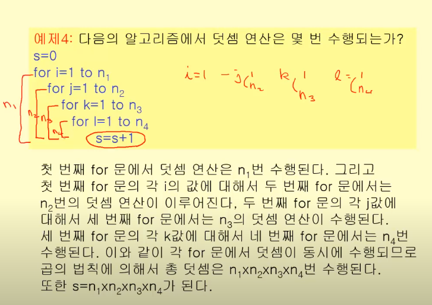
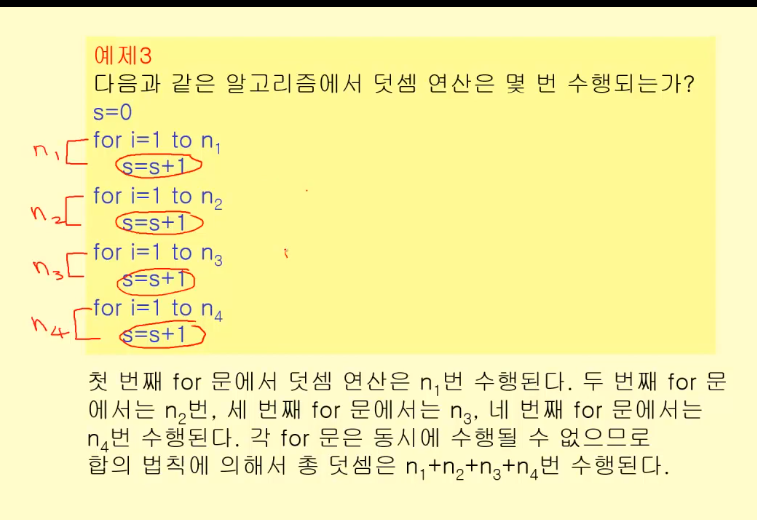
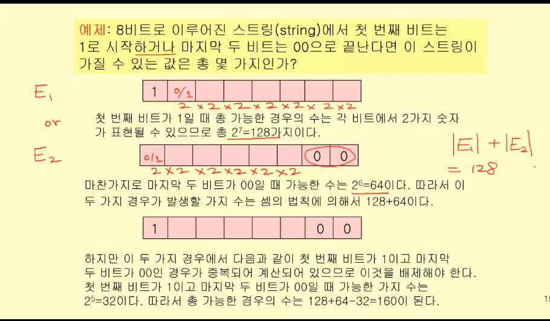

# 셈

셈: 어떤 사건이 발생할 수 있는 경우의 수를 계산

확률을 계산할 떄 꼭 필요한 과정

## 두 개 이상의 사건의 경우의 수를 따질 때

1. 서로 연계되서 발생 -> 시간적일 수도 있지만, 분리해서 발생할 수 없을 때 => 곱의 법칙
2. 사건이 별개로 발생 => 합의 법칙

### 곱의 법칙
두 사건이 분리할 수 없을 떄(동시에 일어날 때)

중첩 for문의 경우 대표적인 곱의 법칙

분리해서 발생할 수 없다.

### 합의 법칙

두 사건이 별개로 발생하는 경우

for문이 중첩 없이 이어질 때

## 포함-배제 원리

합의 법칙을 적용할 떄, 중복되어 계산된 경우의 수를 고려해서 제외해야 한다. 

A v B = A + B - A ^ B

