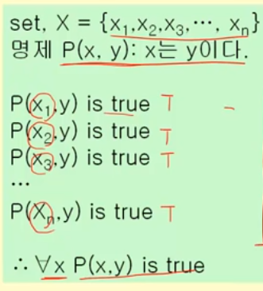
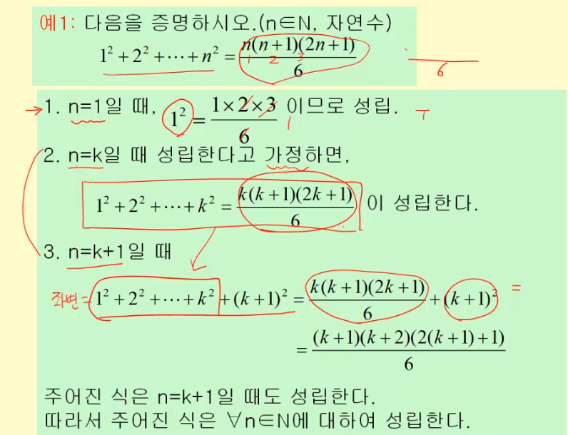

# 이산수학 : 연역법과 귀납법, 수학적 귀납법

추론 : 참인 명제로부터 새로운 참인 명제를 찾는 과정

추론의 타당성 : 우리가 이미 T로 알고 있는 명제를 전제, 새로운 명제를 결론이라 한다.

>추론의 대표적 방식 2가지가 연역법과 귀납법

## 연역법

P->Q가 T이고(전제), P가 T이면(전제), Q도 T(결론) ( 대표적으로 삼단논법)

이게 올바른 추론이냐?

> 연역법의 함정 : 전제가 T이면 결론이 T, 과연 전제가 True이냐?

### 수학과 연역법

수학의 이론은 연역법에 의해 만들어진 명제들로 이루어진다.

전제: 공리(=가정), 정의, 이미 증명된 정리 

결론 : 정리

> 과학의 이론 체계?

## 귀납법

개별적인 사실을 말하는 명제들로부터 일반적인 결론을 도출하는 방법(Top-Down)

집합 내의 모든 x가 y라면, 집합 외의 모든 x도 y이다.

### 귀납법의 한계

현실적으로 모든 원소가 참인 것을 보여줄 수 없다. 결국 특정 표본에 대해서만 참인걸 증명함.

확률의 문제 => 성립할 *가능성*이 있다

### 수학적 귀납법

- 하지만, 수학적 귀납법은 이러한 귀납법의 한계를 극복
- 집합(무한 집합이어도 됨)의 모든 원소가 참인 것을 보일 수 있음

1. n=1일 떄 P(x1)이 True
2. n=k (k>1)일 때, P(xk)가 True
3. n = k+1 일 때, P(xk+1)가 True

=> 모든 x에 대해서 True

#### 예시

