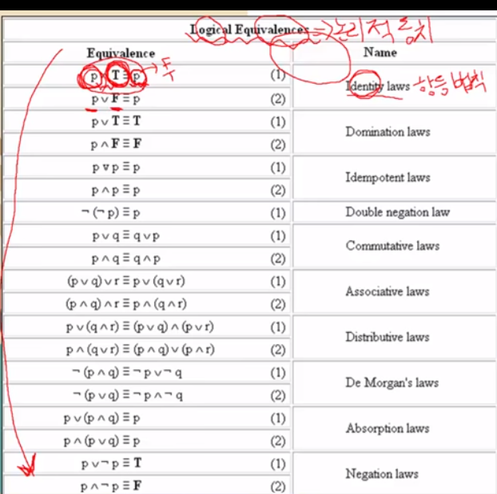

# 동치

- A와 B가 일치한다. 명제끼리 같은 진리값을 가질 떄, 동치라고 표현함

- 논리적으로 일치한다
- 흔히 동치는 같은 의미를 가진 더 쉬운 명제를 발견하는데 사용한다
- 동치 법치의 증명을 통해 합성 명제를 바꿀 수 있다.

### 주의할 규칙 3가지

1. 드모르간의 법칙

> ~(A&B) = ~A OR ~B

> ~(A OR B) = ~A & ~B

2. **흡수 법칙**

> P OR (P&Q) == P
> P & (P OR Q) == P

3. 부정 법칙

> P OR ~P == T
> P & ~P ==  F

4. 함축 법칙

> p->q <=> ~p OR q