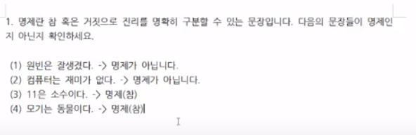
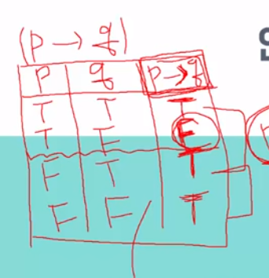
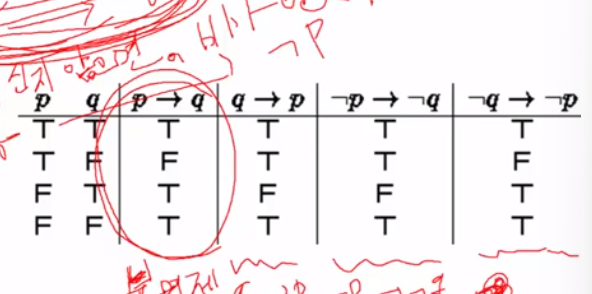

# 이산수학 개요
- 보편적인 컴퓨터 수학
- 일종의 베이스
- 알고리즘을 배우기 전에 배우면 좋음

### 명제

- 진실 혹은 거짓으로 진리를 명확하게 구분할 수 있는 문장
- 명제는 0 또는 1만을 가지는 컴퓨터 메모리처럼 둘 중 하나의 값만 가짐
- 명제를 여러개 조합할 수 있음 

### 연산자로 명제 다루기

6가지(Not,And,Or,Exclusive or, Implication, Biconditional)

- 연산자는 명제를 연산하기 위한 도구
1. Not : 거짓이면 참이다, 값 바꾸기
2. And(논리곱) : 둘 다 참일 때 참
3. Or(논리합) : 둘 중 하나만 참이라면 참 = 둘 다 거짓일 때 거짓
4. Exclusive or(배타적 논리합) -> 단 한개만 참일 떄 참.
5. Implication(함축) : 조건 명제, P일 떄 Q이다 식으로. 흐름 표현

< 함축 주의점 >

- 시작 명제가 F면 무조건 T
- 시작명제가 T고 끝 명제가 F일 때만 F

6. 쌍방조건명제(필요충분조건) : 두 명제 결과가 같을 때만 True

### shb 왜 F->T : T 이냐?

전제가 부정되면 결론의 참 거짓은 확인하는게 불가능하다.

그래서 그냥 전제가 거짓이면 무조건 참이라고 약속함.

vacuously true

## 진리표

- 각 명제 사이의 관계식의 진릿값을 보여주는 표
- 아무리 복잡한 합성명제라도 진리표로 풀어낼 수 있음

## 역 이 대우

- 조건 명제에서 사용
- 역 이 대우는 하나의 명제를 변형해 표현한다
- 증명하기 어려운 명제는 대우를 이용해 증명할 수 있다

- 본명제의 진리값 == 대우의 진리값

