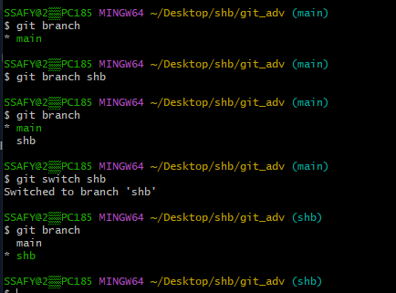
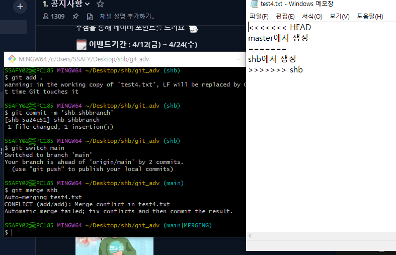
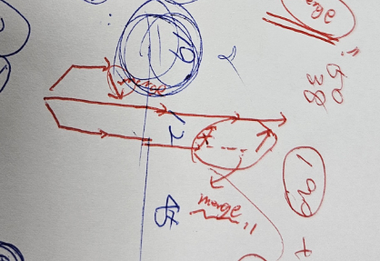

일단 pull 하고, 각자 pc에 현재 저장된 내용이 다르다.

> 문제가 생기는 이유? Branch가 master 브랜치 하나밖에 없어서

## Branch

- 작업 공간을 나뭇가지처러 작업 공간을 여러 갈래로 나누어서 독립적으로 작업할 수 있도록
- 왜 나눠야 할까?
  - 버그 있는 코드를 master 브랜치에다가 올림. -> 사용자는 버그를 만나버린다. 
  - 개발을 하는 코드와, 서비스를 하는 코드를 분리할 필요성이 생김
    - 개발, 서비스, 테스트 등등
  - 저장소를 여러개 두면 괜찮지 않나?
    - 물론 가능하지만, 코드 관리가 너무 어렵다
  - 하나의 저장소에 독립적인 공간을 만들 수 있는게 **Branch**


> git branch

현재 깃이 바라보고 있는 브랜치




```리눅스 명령어
touch text2.txt -> text2.txt 만들기

vi text2.txt -> 메모장 같은거
a -> insert 모드
esc -> 입력 종료
:wq -> 저장 및 모드 종료

```

> git status

깃에 들어갔는지 여부

> git log

> 그럼 master에 이걸 반영하려면? 
>
> merge

### 먼저 master로 switch 해줘야 한다

> git switch master
>
> git merge (개인 브랜치)



head는 우리가 보고 있는거

이건 수정을 해줘야 함




> extensions 중에 git graph라고 있음