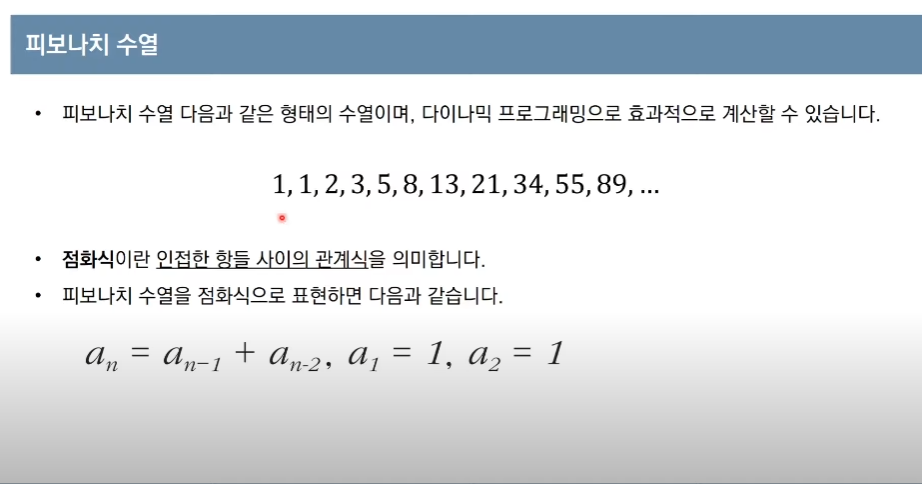
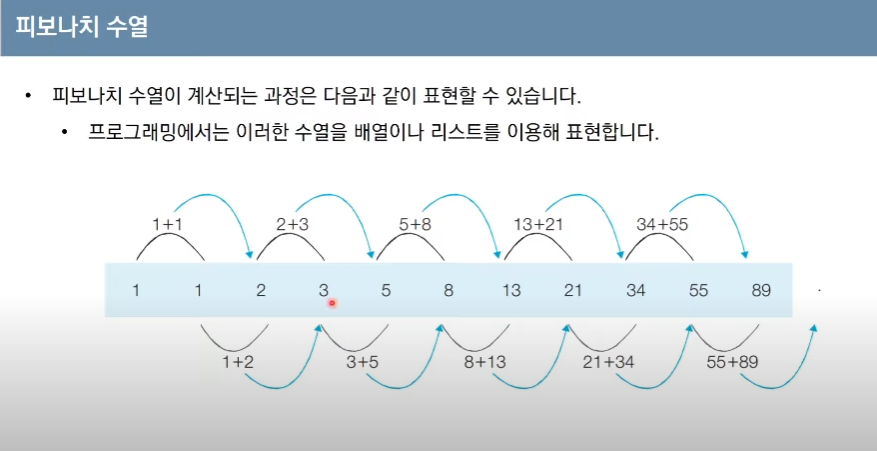
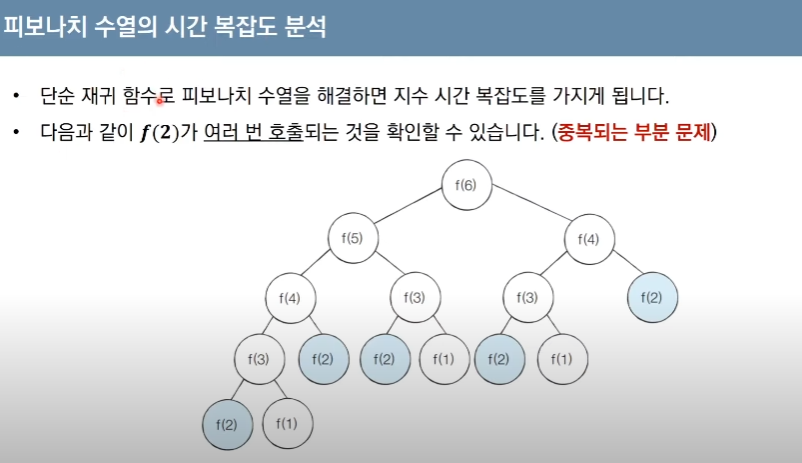
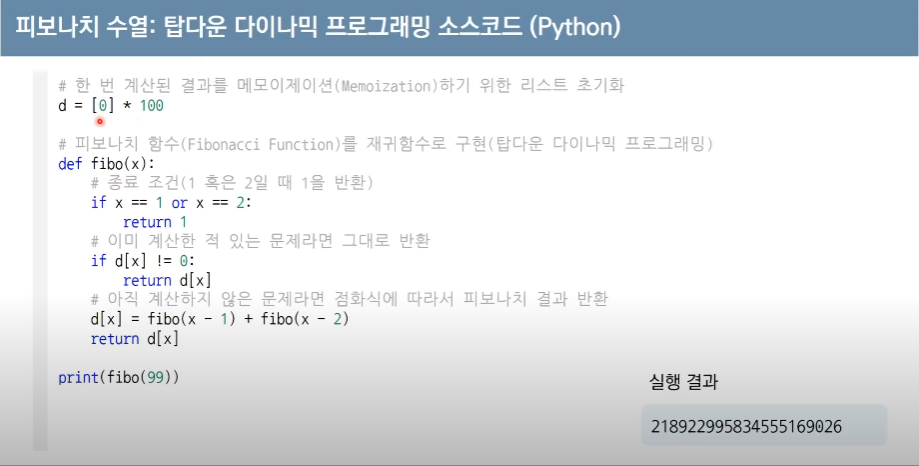
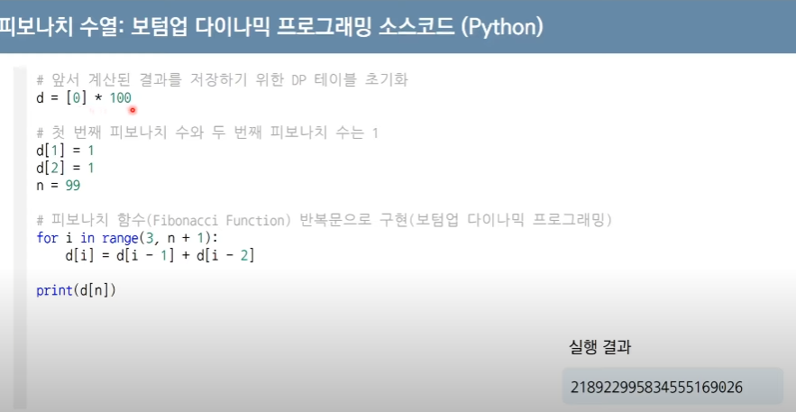
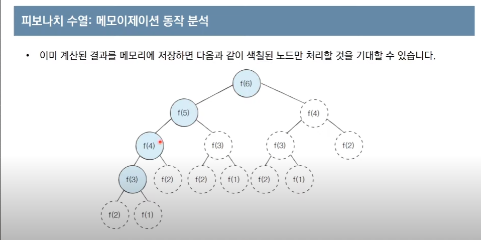
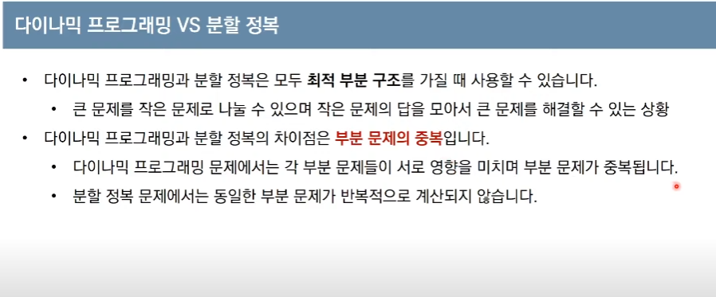

https://www.youtube.com/watch?v=5Lu34WIx2Us&list=PLiS9CQCglrJdw55O1J_5OCGfdlizXqaNp&index=2&t=62s

# 다이나믹 프로그래밍

- 메모리를 적절히 사용하여 수행 시간 효율성을 비약적으로 향상시키는 방법
- *이미 계산된 결과(작은 문제)는 별도의 메모리 영역에 저장*하여 다시 계산하지 않도록 한다.
- 구현방식은 일반적으로 두 가지(탑다운과 바텀업)으로 구성됨

-> 완전 탐색에서는 비효율적인 문제도 DP로는 굉장히 효율적으로 풀어낼 수 있음

- 다이나믹 이란 단어는 딱히 의미 없이 사용된 단어임

## 다이나믹 프로그래밍의 조건

1. 최적 부분 구조(Optimal Substructure)
   - 큰 문제를 작은 문제로 나눌 수 있으며, 작은 문제의 답을 모아서 큰 문제를 해결할 수 있음
2. 중복되는 부분 문제(Overlapping Subproblem)
   - 동일한 작은 문제(부분문제)를 반복적으로 해결해야 함

### 피보나치 수열

작은 수(a1과 a2)로 최종 값을 구할 수 있음

### 피보나치 수열의 시간 복잡도 분석

- 단순 재귀 함수로 피보나치 수열을 해결하면 지수 시간 복잡도를 가지게 된다. O(2**N)
- 근데 해당 과정 중 f(2)와 같이 여러번 호출 되는 케이스가 존재한다 (*중복되는 부분 문제*)

f(100)만 되도 말도 안된다.

### 피보나치 수열의 효율적인 해법 : 다이나믹  프로그래밍

- 사용조건 만족?
  - 1. 최적 부분 구조 : 큰 문제를 작은 문제로 나눌 수 있다, f(6) = f(4) + f(5)
  - 2. 중복되는 부분 문제: 동일한 작은 문제를 반복적으로 해결, f(2) 등 작은 부분이 반복된다.

## 메모이제이션(Memoization)
- 주로 탑다운 방식에서 사용
- *한 번 계산한 결과를 메모리 공간에 메모하는 기법*
  - 같은 문제를 다시 호출하면 메모했던 결과를 그대로 가져옴
  - 값을 기록해 놓는다는 점에서 캐싱(Caching)이라고도 함
  - 주로 메모장을 dp라 둠

### 탑다운 vs 바텀업

- 탑다운(메모이제이션) 방식은 하향식이라고 주로 함. 구현과정에서 재귀를 주로 사용. 작은 문제들을 재귀적으로 호출하면서 저장하고, 큰 문제에 닿으면 이를 호출
- 바텀업 방식은 상향식이라고도 부름. 아래쪽부터 작은 크기의 문제를 차례대로, 반복적으로 해결해나가면서 최종값에 닿는다. 주로 반복문을 사용
- DP는 주로 바텀업을 사용
  - 결과 저장용 리스트를 *DP 테이블* 이라고 부름
- 메모이제이션은 *이전에 계산된 결과를 일시적으로 기록해놓는 넓은 개념*
  - 따라서 DP에 국한된 개념은 아님
  - 한 번 계산된 결과를 담아 놓기만 하고 DP를 위해 활용되지 않을 수도 있음

<탑다운 방식을 이용한 구현 >

< 바텀업 방식을 이용한 구현 >

### DP와 분할 정복의 차이

## DP 문제 접근 방법
- 주어진 문제가 DP 유형임을 파악하는것이 가장 중요
- 가장 먼저 그리디, 구현, 완전 탐색 등의 아이디어로 문제를 해결할 수 있는지 검토
  - 다른 알고리즘으로 풀이 방법이 떠오르지 않으면 DP를 고려
- 일단 재귀로 비효율적인 완전탐색을 작성한 뒤에(탑다운), 작은 문제에서 구한 답이 큰 문제에서 그대로 사용될 수 있으면, 코드를 개선하는 방법을 사용할 수 있다.
- 일반적인 코테는 기본 유형의 DP 문제가 출제되는 경우가 많음

31m

