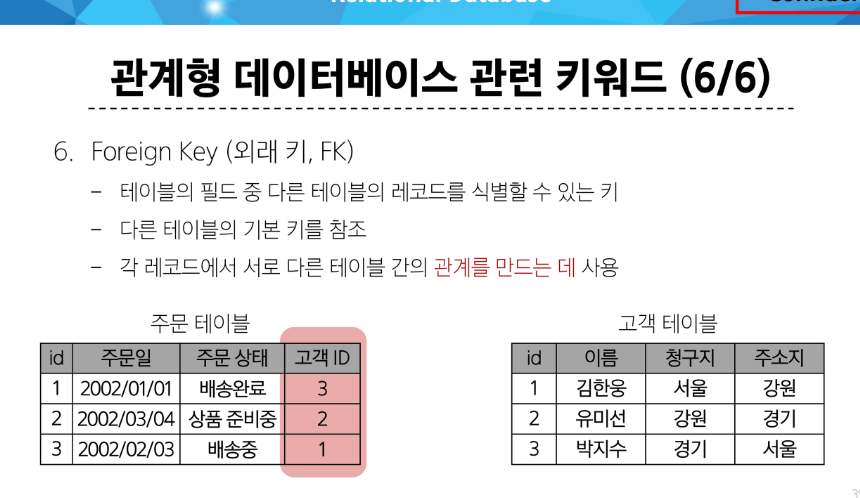
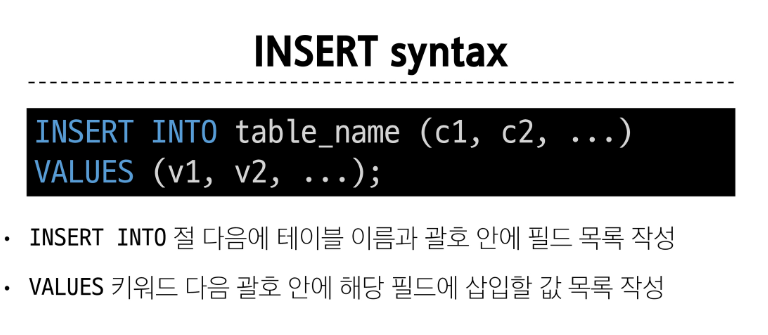

# DB 01 SQL

## DataBase

장고에선 db.sdqlite3

- 체계적인 데이터의 모음
- 데이터: 저장이나 처리에 효율적인 형태로 변환된 정보

> 데이터를 저장하고 잘 관리하여 활용할 수 있는 기술이 중요해짐
>
> 우리가 알고 있는 데이터 저장 방식?

1. 파일을 이용한 방식
   - 어디에서나 쉽게 사용 가능 but 구조적으로 관리하긴 어려움
2. 스프레드 시트를 이용한 관리
   - 테이블 행렬로 데이터 구조적 관리 가능 but 
   - 크기: 일반적으로 100만행까지만 저장 가능
   - 보안: 단순한 접근권한 기능 제공

### 관계형 데이터베이스

데이터 베이스 역할 : 데이터를 저장하고 조작(CRUD)함

- 관계형 -> 데이터 간에 **관계**가 있는 데이터 항목들의 모음


> id를 통해서 서로 다른 두 테이블을 연결(관계: 테이블 간에 논리적 연결)할 수 있음

#### 관계로 할 수 있는 것


-> 고객 id가 없으면 할 수 없음


#### 관계형 데이터베이스의 형성 


PK와 FK가 존재

#### 관계형 DB 관련 키워드




### RDBMS 

#### DBMS


#### RDBMS

- 관계형 데이터베이스를 관리하는 소프트웨어 프로그램


#### SQLite

- *경량*의 오픈 소스 데이터 베이스 관리 시스템
  


## SQL

Structure Query Language


데이터베이스와 소통하기 위한 프로그램


### SQL 문법

1. 키워드는 대소문자를 구분하지 않음 (하지만 대문자 권장)
2. 각 statements 끝에 세미콜론 필요 (명령어 마침표) -> 엔터 상관 없음


### 수행 목적에 따른 sql statements 4가지 유형


> 학습 방향 : 문법 암기 실행 뿐만 아니라 관계형 데이터베이스를 잘 이해하고 다루는 방법을 학습


### Query

- 데이터베이스로부터 정보를 요청하는 것
- 그래서 SQL로 작성하는 글을 Query문이라고도 함


## Single Table Statements

DQL(조회) 파트

### Querying Data

#### Select -> 테이블에서 데이터를 조회


> SELECT '조회할 데이터' FROM '데이터베이스'

```sql
-- 01. Querying data
-- SELECT 필드명 FROM 테이블명 ;

-- 특정 필드
SELECT 
LastName 
FROM 
employees;

-- 여러개
SELECT LastName ,FirstName
FROM
employees;


-- 전부
SELECT 
*
FROM
employees;

-- 필드 이름 바꿔서 출력
SELECT
FirstName AS '이름'
FROM
employees;

-- 특정 조건 사용
SELECT
Name,
Milliseconds/60000 as '재생시간(분)'
FROM
tracks;
```

### sorting data - 정렬

#### ORDER BY


```sql
-- 02. Sorting data

--  1.오름차순
SELECT
FirstName
FROM
employees
ORDER BY
FirstName; 
--  2. 디폴트는 오름차순

-- 내림차순
SELECT
FirstName
FROM
employees
ORDER BY
FirstName DESC;

-- 3. 두개의 필드 정렬

-- 내림차순 오름차순 섞을 수도 있음

SELECT
Country,City
FROM
Customers
ORDER BY
Country DESC
City ASC; --City는 ASC 안 써줘도 됨
-- 한 번 정렬한건(Country) 안 바뀜. 이제 그 안의 영역(UK 안의 London, 맨체스터 등등)을 정렬

-- 4. 섞어서

SELECT Name,Milliseconds/60000 as '재생시간(분)' -- 항상 최종적으로 출력할 걸 먼저 생각하고 그 다음에 처리
FROM tracks
ORDER BY Milliseconds DESC;

-- 5. NULL 정렬 예시
--  Null은 오름차순 정리시 결과에 가장 먼저임(0이라 생각)
SELECT ReportsTo
From employees
ORDER BY ReportsTo;
```


### Filtreing


#### DISTINCT -중복제거


#### Where - 조건문


```sql

-- 03. Filtering data

-- #1) DISTINCT

SELECT DISTINCT Country 
FROM customers 
ORDER BY Country;

-- #2) where -> 조건문

-- 1. 기본
SELECT LastName,FirstName,City
FROM customers
WHERE city = 'Prague';

-- 2. not

SELECT LastName,FirstName,City
FROM customers
WHERE city != 'Prague';

-- 3. 여러 조건 - AND, IS(==)

SELECT LastName,FirstName,Company,Country
from customers
where Company IS NULL
AND Country = 'USA';

-- 4. OR

SELECT LastName,FirstName,Company,Country
from customers
where Company IS NULL
OR Country = 'USA';

-- 5. 범위 지정
SELECT Name,Bytes
from tracks
-- where Bytes >= 100000
-- AND Bytes <= 500000;
WHERE Bytes BETWEEN 100000 AND 500000;

-- 6. 범위지정 + 정렬

SELECT Name,Bytes
from tracks
WHERE Bytes BETWEEN 100000 AND 500000
ORDER BY Bytes -- 정렬은 where보다 뒤로 가야함

-- 7. or 여러개

SELECT LastName,FirstName,Country
FROM customers
WHERE 
Country = 'Canada',
OR Country = 'Germany',
OR Country = 'France';

-- 다른 방식도 있다. -> IN 키워드

SELECT LastName,FirstName,Country
FROM customers
WHERE 
-- Country = 'Canada',
-- OR Country = 'Germany',
-- OR Country = 'France';
Country IN ('Canada','Germany','France')

-- IN 앞에 NOT 을 붙여서 NOT IN 도 사용 가능

-- 8. NOT IN
SELECT LastName,FirstName,Country
FROM customers
WHERE 
Country Not IN ('Canada','Germany','France')

-- 9. 특정 데이터의 끝자리가 조건과 일치하는지 -> LIKE

SELECT LastName,FirstName
FROM customers
WHERE LastName LIKE '%son'; --끝이 son이라 끝난다
-- '%~%' 라 하면 내용물에 포함된 것도 가능

-- 10. 자릿수까지

SELECT LastName,FirstName
FROM customers
WHERE FirstName LIKE '___a'; -- 총 4글자고 끝자리가 a

```

#### LIMIT & offset -> 제한

조회하는 레코드의 수를 제한


offser 2 -> 앞에서 2개 빼고 

```sql
-- # 3) OFFSET & LIMIT

-- 1. 단순 리미트
SELECT TrackId, Name, Bytes
FROM customers
ORDER BY Bytes DESC
LIMIT 7; -- 이건 무조건 order by 다음에 나와야 한다

-- 2. 오프셋 추가

SELECT TrackId, Name, Bytes
FROM customers
ORDER BY Bytes DESC
LIMIT 3,4; -- 오프셋3 리미트 4
-- LIMIT 4 OFFSET 3; 이렇게 써도 됨
```

### Grouping Data - 같은 카테고리끼리 묶는 것

묶는다 -> 평균, 최대, 최소... 묶어서 무언가 계산해야 하는 경우

#### GROUP BY


ex) 국적별 인원수

-> 항상 집계 함수(sum 같은거)와 함계 쓴다

> 집계함수


where 있으면 where보다 뒤에서 

```SQL
-- 04. Grouping data

-- 1. 그룹화

SELECT Country
From customers
GROUP By Country; --->DISTINCT + 함수 

-- 2. 함수 추가

SELECT Country, COUNT(*) --> 전체 인원수 세기
From customers
GROUP By Country;

-- 3. 내림차순 정렬까지

SELECT Composer, AVG(Bytes) AS avgOfBytes -- 변수지정한거라 생각
FROM tracks
GROUP By Composer
-- ORDER BY AVG(Bytes) DESC;
ORDER BY avgOfBytes DESC;

-- 4. 그룹 + 조건

SELECT Composer, AVG(Milliseconds/60000) AS avgOfMinutes
FROM tracks
-- WHERE avgOfMinutes <10  # where 조건은 그룹에서 사용할 수 없음 => HAVING
GROUP BY Composer
HAVING BY avgOfMinutes < 10;
``` 


# OFF-LINE

PostgreSQL -> 작년부터 뜨는 DBMS

오라클과 mysql은 직접 쓰려면 돈 내야해서 연습은 postgresql

앞으로도 sqlite는 순위가 좀 떨어질거다

## DB

### 데이터베이스

- 사용하기 편하도록 데이터를 정리한 *데이터 덩어리*
  - 데이터를 정리해놓은것
  - 엑셀도 하나의 데이터베이스라 생각해도 됨
  - 다만 엑셀과의 차이는, 프로그래밍에서 사용하는 단어라는 것
### DBSM
일반적으로 사용하는건 DBMS(DataBase Management System)
- 일반적으로 DB라고 부름
- 앞으로 DB라 하면 데이터베이스를 다루는 프로그램이기도 함
- 왜 관리 시스템이 필요할까?
  - 우리가 필요한 데이터만 조작 및 관리
  - 조회, 추가, 삭제 등등
  - -> 이런 동작을 할 수 있도록 명령어를 DBMS가 지원
    - 사실 굉장히 어려운 영역임. 회사에서 3년 정도는 배우고 깨져야 실력이 느는 영역
    - 완벽을 기하지 마라. 불가능함. CSS마냥 굉장히 방대함
    - 오늘 수업은 단순히 '이런게 있다' 소개. 구글링해서 CSS마냥 자연스럽게 익혀라
    - DB 쪽으로 취업하려면 많은 준비가 필요

### DB의 종류
1. 관계형 데이터베이스(RDBMS,Relational)
   - 일반적으로 많이 사용되는 DB
   - 데이터를 테이블, 행, 열 등으로 나누어 *구조화* 하는 방식으로 저장
   - *특징
     - 테이블 간 관계를 설정하여 여러 종류의 데이터를 조작, 관리함
       - -> 관계가 있다면 연결해서 관리한다는 뜻
     - 왜 관계를 설정? 
       - 목적 : 데이터의 무결성 유지에 장점이 있음(데이터에 결함이 없다 == 데이터가 **정확**하고 **일관적**이다.)
         - 정확성 : 데이터가 정확한 값을 갖는 것
           - 1)제약조건에 위반하지 않는가. 2)누락은 없는가. 3)중복은 없는가.
         - 일관성 : DB내의 모든 데이터가 일관된 상태를 유지하는 것
           - ex) 1번 게시글에 달린 댓글은, 1번 게시글이 지워지면 함께 삭제되어야 한다.(shb.카테고리 구분)
       - 단점 : **테이블이** **나눠져있다** => 
         - **쿼리문이** **복잡하다**
         - 대용량데이터 처리가 어렵다(성능이슈) -> AI 쪽으론 현실적으로 힘듦
         - 데이터의 규모가 초기 예상보다 커지면, 수평적 확장이 불가능하다.
           - 수직적 확장 : 서버의 성능을 높이는 것 (더 좋은 PC 구매)
           - 수평적 확장 : 여러 대의 서버를 추가해서 DB 처리 능력을 확장하는 방식
             - 하나의 DB를 여러 서버에 분산해서 처리 -> 요즘은 가능하기 시작했으나, 아직은 좀...


2. 비관계형 데이터베이스(NoSQl)
   - 관계형 데이터베이스의 한계를 극복하기 위해 사용
   - 대표적인 예로,
     - 캐시로 사용하는 REDIS
     - MONGOS DB
     
  - 확장성: 수직, 수평적 확장이 모두 가능함
  - 유연성: 스키마가 고정된 RDB 와 달리 스키마가 유동적이어서 데이터의 구조를 유연하게 변경할 수 있음
  - 다양한 데이터 모델: 다양한 형태의 데이터를 효율적으로 처리 가능
    - 데이터 모델: 데이터의 구조와 관계, 속성 등을 정의하는 방법. 즉, 데이터를 어떻게 저장할 것인가?
  - 높은 가용성: 분산 데이터베이스 구조를 사용할 경우, 하나의 서버가 죽더라도 데이터 유실 없이 서비스 가능
   - 데이터 모델에 따른 종류
     1. key-value Database
       - 데이터가 Key, Value 의 쌍으로 저장됨
       - Key 가 고유하게 레코드를 식별하며, 데이터ㅔ이스 내에서 저장과 검색을 하는 데 사용됨
       - 대표적인 DB: Redis
         - 캐시 DB로 많이 사용함(하드 디스크가 아닌 RAM 에 데이터를 저장함)
       - 자주 사용되는 데이터를 굉장히 빠르게 조회 가능

     2. Document Database
       - 다양한 형태의 비정형 데이터를 저장하고 처리할 수 있는 DB
       - 데이터를 문서(document) 형태로 저장함. 대게는 JSON, XML 등의 형태이며, key-value 형식으로 구성되어 있음
       - 사전 정의된 스키마가 필요 없다. -> 데이터의 유연성을 높이고, 개발 및 유지보수가 편하다
       - 대표적인 DB: MongoDB, Amazon DocumentDB
       - 대부분 분산을 염두하여 만들어짐
       - 따라서, 데이터 입출력이 잦은 서비스에 사용(SNS, 실시간채팅, 게시판 등)

     3.  Graph, Column-family 등등 다양한 DB가 존재한다.


# SQL

## DDL - 테이블 구조 및 형식 변경 -생성, 삭제


- Data Definition Language

### 생성


```sql
-- 1. Create a table

-- CREATE TABLE 테이블명(
--     컬럼이름1 데이터타입 제약조건,
--     컬럼이름2 데이터타입 제약조건

-- );

CREATE TABLE examples(
    ExamId INTEGER PRIMARY KEY AUTOINCREMENT,
    -- DB의 KEY란? 테이블에서 특정 레코드(행)를 고유하게 식별할 수 있는 필드, 혹은 집합
    -- > 식별할 수 있다? 중복x, Null x -> KEY 제약조건에 이미 들어있음
    -- 데이터를 검색, 조작할 때 
    -- AUTOINCREMENT : 자동으로 1씩 늘어나는거
    -- PRIMARY KEY : 이제부터 이게 기본키라고 설정

    LastName VARCHAR(50) NOT NULL, -- 50글자 이내
    FirstName VARCHAR(50) NOT NULL
);

-- 테이블 구조 확인

PRAGMA table_info('examples');
```
#### KEY

- DB의 KEY란? 테이블에서 특정 레코드(행)를 고유하게 식별할 수 있는 필드, 혹은 집합
- 식별할 수 있다? 중복x, Null x -> key 제약조건에 이미 들어있음
- ->데이터를 검색, 조작할 때 

< key의 종류 >

1. 기본키(Primary Key)
   - 테이블 내에서 각각 레코드를 식별하는 역할을 하는 키
   - ex) 게시글의 ID
2. 후보키
   - 기본키로 사용될 수 있는 필드(후보인 키)
   - 하나의 테이블에 기본키는 무조건 하나만 존재! -> 후보키는 여러개가 존재할 수 있음
   -  ex) 주민번호(기본키) - 휴대폰번호, 이메일 (후보키)
   -  언제 사용? 
   -  테이블에서 특정 필드를 기준으로 조회할 때 유용하게 사용됨
   -  일반적으로 기본키는 사용자가 직접 정의, 후보키는 데이터에 따라 자동으로 생성될 수 있음
3. 외래키(Foreign Key)
   - 하나의 테이블에서 다른 테이블의 기본키(PK)를 참조하는 필드
   - 외래키를 사용해서 두 개 이상의 테이블을 연결
   - 1:1, 1:N, M:N 관계를 외래키를 통해서 표현(내일 강의)
4. 복합키
5. 대체키
6. 슈퍼키


#### 데이터 타입


#### 제약 조건


### 수정


```sql

-- 2. Modifying table fields
-- 2.1 ADD COLUMN

ALTER TABLE
    examples -- 대상
ADD COLUMN -- 처리
    Country VARCHAR(100) NOT NULL DEFAULT 'default value';

ALTER TABLE 
    examples
ADD Column
    Address VARCHAR(100) NOT NULL DEFAULT 'default value';

ALTER TABLE
    examples
ADD Column
    Age INTEGER NOT NULL DEFAULT 0;

-- sqlite는 단일 문을 사용하여 한번에 여러 열을 추가하는 것을 지원하지 않음

-- 2.2 RENAME COLUMN

ALTER TABLE 
    examples
Rename COLUMN
    Address TO PostCode;

-- 2.3 RENAME TO
ALTER TABLE examples
RENAME TO new_example;

--  추가  : 테이블의 데이터타입을 바꿀 순 없을까? int -> char 
-- sqlite는 컬럼 수정 불가
-- 대신 테이블의 이름을 바꾸고, 새 테이블을 만들고 데이터를 새 테이블에 복사하는 형태로 수정
--  => 처음에 설계 잘못하면 테이블 새로 만들고 해야함

```

### 삭제


```sql
-- 3. Delete a table
DROP TABLE new_example;
```

## 참고


- 빈 문자열과 Null의 차이?
- 실제로 빈 문자열 ' '를 많이 사용
- NULL은 '데이터가 없다' 보단 '받아야하는 데이터를 못 받았다'에 가까움


## MODIFYING DATA


- 조작하는 언어

### INSERT




```sql
INSERT INTO 테이블명(필드1,필드2,필드3)
VALUES (값1,값2,값3); -- 필드에 각각 맞는 데이터
```

```sql
-- 1. Insert data into table

INSERT INTO articles(title,content,createdAt)
VALUES ('hello','world','2000-01-01');

-- 여러 개의 레코드를 삽입

INSERT INTO articles(title,content,createdAt)
VALUES ('hello','world','2000-01-01'),
 ('hello','world','2000-01-02'),
 ('hello','world','2000-01-03'),
 ('hello','world','2000-01-04'),
 ('hello','world','2000-01-05');

-- id를 직접 넣을 수도 있다
INSERT INTO articles(id,title,content,createdAt)
VALUES (100,'hello','world','2000-01-01'); 

-- 지금 날짜를 넣는거
INSERT INTO articles(title,content,createdAt)
VALUES ('time','now',DATE()); 
```

### UPDATE


```sql
UPDATE 테이블이름
SET 행 이름 = 새 값,
WHERE --> 없어도 됨
검색조건

-- 2. Update data in table

UPDATE articles
Set title = 'update Title' -- title에 들어있는 애를 update title로 바꿔라
WHERE id = 1; -- id가 1인 애를

-- 동시 변경도 지원

UPDATE articles
SET title = 'update Title2',
content = 'update content2'
where id = 4;
```

### DELETE

```sql
-- 3. Delete data from table

DELETE FROM articles
WHERE id = 1;

-- 여러개 동시 삭제
DELETE From articles
WHERE id BETWEEN 5 AND 7;

-- 작성일이 오래된 순으로 2개만 삭제-> 정렬 => order by 사용할거 같다. + LIMIT도 쓸거다(2개만) 

DELETE From articles
WHERE id IN (
    SELECT id From articles -- 이런 식으로 조건을 추가할 때 select를 활용할 수 있다.
    ORDER By createdAt
    LIMIT 2 -- 이 결과로 나온 id 2개와 id가 일치하는 애들을 삭제
);
```

## JOIN - 관계

**여러** 테이블 간의 (논리적) 연결

### JOIN


#### JOINING TABLES

#### INNER JOIN


> TIP 보통 sql 문제는 뒤에서 부터 해석하는게 편함


```sql
SELECT * FROM articles INNER JOIN users ON articles.userId = users.id;
```

< 결과 >


```sql
-- INNER JOIN

-- 1. 기본
SELECT * FROM articles INNER JOIN users ON articles.userId = users.id;

-- 2. 테이블의 필드 이름이 같을 때
-- SELECT id,title,content,name FROM articles INNER JOIN users ON articles.userId = users.id;
-- 그냥 이렇게 쓰면 오류 생긴다. why? 양쪽 테이블에 id가 둘 다 있어서
SELECT articles.id,title,content,name FROM articles INNER JOIN users ON articles.userId = users.id;

-- 3. 특정 조건 추가
SELECT title,name 
FROM articles 
INNER JOIN users
ON articles.userId == users.id 
AND users.id = 1;

SELECT title,name 
FROM articles 
INNER JOIN users
ON articles.userId == users.id 
WHERE users.id = 1;
-- > 같은거다.

-- 4. 참고: 별칭 사용

SELECT A.title,B.name 
FROM articles as A
INNER JOIN users as B
ON A.userId == B.id 
WHERE B.id = 1;

```

#### Left Join


> TIP 항상 기준(뒤쪽)을 어떻게 잡느냐가 중요 => 뒤부터 봐라


```sql
-- LEFT JOIN

-- 1. 기본
SELECT * FROM users 
LEFT JOIN articles 
ON articles.userId = users.id;

-- 2. 조건 추가

-- 작성한 기록이 없다면?

SELECT * FROM users 
LEFT JOIN articles 
ON articles.userId = users.id
WHERE articles.userId IS NULL;
```