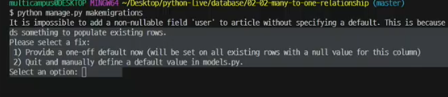
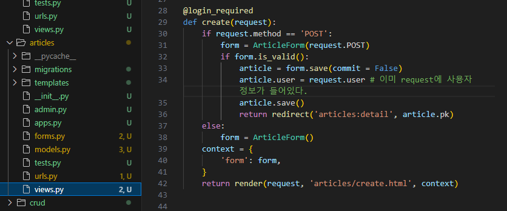

# MANY TO ONE RELATIONSHIPS 2

오늘은 User에 대한 정보를 추가할거다

댓글에 '누가' 썼냐 까지

-> User 모델과 다른 테이블의 관계

## 1. Article & User

> Article 쪽에 외래키

User을 참조해야 하는데, User는 절대 직접 참조하지 않는다.

근데 models.py가 user 객체 만들어지는 것보다 빠르게 사용된다.

> 그래서 AUTH_USER_MODEL을 사용해서 문자열로 일단 넣어두고(변수만 지정) 나중에 참조한다.

> models.py에서만 get_user_model()을 사용하지 않는다. 

테이블에 추가할 때, 기본값 설정을 해줘야 한다. 

### 게시글 create

> 이제 '누가 썼냐' 라는 내용도 포함을 시켜야 한다.

1. 먼저 forms에서 user 부분을 제외해야한다 -> 이걸 views에서 작성해야함

2. views에서 articles.user 정보를 넣어야 함

### READ

#### 각 게시글의 작성자 이름 출력

#### 사용자가 쓴 게시글 모두 확인 -> 역참조

### UPDATE

> 수정 요청자와 작성자가 일치하는지 확인해야 한다. by if문

아예 detail.html에서 수정해도 된다

### DELETE

> 이거도 마찬가지

## Comment & User 

이건 그냥 article이랑 똑같음

## 수업 마지막에 ERD와 다이어그램 컨벤션은 다시 들어라

## 참고

### decorator

### 참조와 역참조

