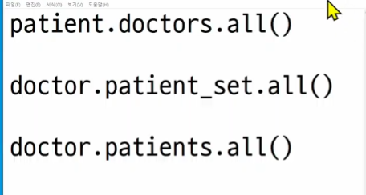
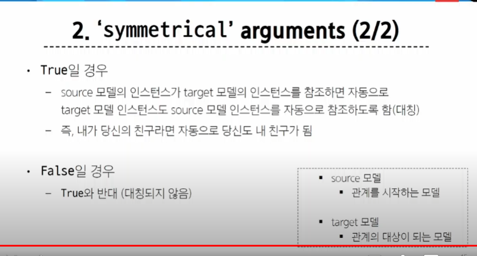
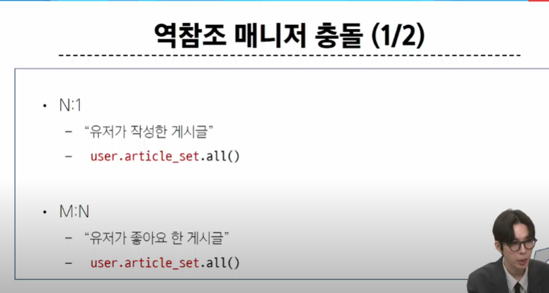

# 4. Many to Many relationship

ex) 좋아요 기능

## MToM Relationship

양 쪽 모두 다수의 관계

한 테이블의 0 갱 이상의 레코드가 다른 테이블의 0개 이상의 레코드와 관련된 경우

> 양 쪽 모두에서 N:1 관계를 가짐


- 환자와 의사 모델 2개가 필요
- 환자도 여러 명의 의사가 필요, 의사도 담당 환자가 여러명

## N:1의 한계

### 의사와 환자 간 모델 관계 설정

- 한 명의 의사(1)에게 여러 환자(N)가 예약할 수 있도록


- 외래키를 환자가 갖고 있음


> 파이썬 문법 상 불가능하다.

> 그럼 어떻게 해결?


> 환자테이블에서 보는게 아니라, 예약 테이블(중개모델)을 아예 따로 만들자

#### 중개모델

## 중개모델

1. 예약 모델 생성 

- 환자 모델의 외래 키를 삭제하고, 별도의 예약 모델을 새로 생성
- 예약 모델은 의사와 환자에 각각 N:1의 관계를 가짐
- 얘가 외래키를 모두 가져감


```py
from django.db import models


class Doctor(models.Model):
    name = models.TextField()

    def __str__(self):
        return f'{self.pk}번 의사 {self.name}'


# 외래키 삭제
class Patient(models.Model):
    name = models.TextField()

    def __str__(self):
        return f'{self.pk}번 환자 {self.name}'


# 중개모델 작성
class Reservation(models.Model):
    doctor = models.ForeignKey(Doctor, on_delete=models.CASCADE)
    patient = models.ForeignKey(Patient, on_delete=models.CASCADE)

    def __str__(self):
        return f'{self.doctor_id}번 의사의 {self.patient_id}번 환자'

```


> 의사가 예약을, 환자가 예약을 참조하는 것 -> 외래키가 없는것에서 있는것으로 => 역참조


> 중개 모델을 자동으로 만들어주는 필드가 존재한다.
>
> ManyToManyField

### ManyToManyField

```python
from django.db import models


class Doctor(models.Model):
    name = models.TextField()

    def __str__(self):
        return f'{self.pk}번 의사 {self.name}'


class Patient(models.Model):
    # ManyToManyField 작성
    doctors = models.ManyToManyField(Doctor) # 중개 모델을 만드는 것 -> 실제 patient라는 모델엔 스키마 변화 없음
    name = models.TextField()

    def __str__(self):
        return f'{self.pk}번 환자 {self.name}'


# Reservation Class 주석 처리

'''
코드 예시
doctor1 = Doctor.objects.create(name='allie')
patient1 = Patient.objects.create(name='carol')
patient2 = Patient.objects.create(name='duke')

patient1.doctors.add(doctor1)
patient1.doctors.all()
doctor1.patient_set.all()

doctor1.patient_set.add(patient2)
doctor1.patient_set.all()
patient2.doctors.all()
patient1.doctors.all()

doctor1.patient_set.remove(patient1)
doctor1.patient_set.all()
patient1.doctors.all()

patient2.patient_set.remove(doctor1)
patient2.doctors.all()
doctor1.patient_set.all()
'''
```


이렇게 써도 결관 똑같다. 무슨 차이?

> 참조와 역참조 관계만 변함


> 갈 수 있는 경로가 존재하냐의 여부. 필드가 존재하는 쪽이 갈 수 있는 경로가 있다.(상대방 쪽으로 가는게 참조)


> 진료 취소도 서로 삭제할 수 있음(remove(삭제할 인스턴스))


#### 참조 삭제


#### 역참조 삭제


한쪽에서 하는걸 반대쪽에서도 똑같이 할 수 있음


> 만약 예약 정보에 병의 증상, 예약일 등 추가 정보가 포함되어야 한다면? 
>
> 중개 테이블에 정보 추가

> 다시 만든다. 하지만 through 메서드를 쓰면 아까 썼던 add/remove 기능을 그대로 가져갈 수 있음


### 'through' argument

```py
from django.db import models


class Doctor(models.Model):
    name = models.TextField()

    def __str__(self):
        return f'{self.pk}번 의사 {self.name}'


class Patient(models.Model):
    doctors = models.ManyToManyField(Doctor, through='Reservation')
    name = models.TextField()

    def __str__(self):
        return f'{self.pk}번 환자 {self.name}'


class Reservation(models.Model):
    doctor = models.ForeignKey(Doctor, on_delete=models.CASCADE)
    patient = models.ForeignKey(Patient, on_delete=models.CASCADE)
    symptom = models.TextField()
    reserved_at = models.DateTimeField(auto_now_add=True)

    def __str__(self):
        return f'{self.doctor.pk}번 의사의 {self.patient.pk}번 환자'

'''# 코드 예시
doctor1 = Doctor.objects.create(name='allie')
patient1 = Patient.objects.create(name='carol')
patient2 = Patient.objects.create(name='duke')

# 1. Reservation class를 통한 예약 생성
reservation1 = Reservation(doctor=doctor1, patient=patient1, symptom='headache')
reservation1.save()
doctor1.patient_set.all()
patient1.doctors.all()

# 2. Patient 객체를 통한 예약 생성
patient2.doctors.add(doctor1, through_defaults={'symptom': 'flu'})
doctor1.patient_set.all()
patient2.doctors.all()

doctor1.patient_set.remove(patient1)
patient2.doctors.remove(doctor1)
'''
```


#### through를 쓰면서 예약을 생성하는 방법

M1 ) 우리가 처음 하던 것처럼


##### M2) through 홣용


```py
patient2.doctors.add(doctor1, through_defaults = {'symptom':'flu'}) # 딕셔너리 형태
```

### related_name()

> 역참조 표현도 참조 표현이랑 똑같이 만들어주고 싶다면?



how? related_name()

```py
from django.db import models


class Doctor(models.Model):
    name = models.TextField()

    def __str__(self):
        return f'{self.pk}번 의사 {self.name}'


class Patient(models.Model):
    # ManyToManyField - related_name 작성
    doctors = models.ManyToManyField(Doctor, related_name='patients') #####
    name = models.TextField()

    def __str__(self):
        return f'{self.pk}번 환자 {self.name}'

```

역참조 이름을 patient_set 에서 patients로 바꿔줌


## 정리


to는 누구와 mtom을 만들지, option 키워드는 아까 했던 related_name이나 through


#### related_name 

역참조 이름을 바꾸는 키워드 인자


#### symmetricla -> 대칭 만들기


> 대칭?


대칭 설정이 True라면 다음 같이 만들어짐

>when? 자신과 똑같이 생긴 모델을 참조할 때, ex) 친구 맺기


> 우리가 지금까지 한 건 팔로우 관계, 맞 팔로우는 대칭이 켜져 있을 떄


일반적으로는 꺼져 있음, default는 True로 되어있음





### M : N에서의 대표 methods

- add와 remove


## 좋아요 기능 구현하기


> 역참조에서 명령어가 같아서 에러가 난다.
> => 하나는 realted_name으로 바꾼다.





> 1번 article은 좋아요 한 사람이 (1,2) 2명, 1번 user는 좋아요 한 게시글이 (1,2) 2개
>
> => 양쪽 다 확인 가능

### 명령어 정리


### 기능 구현


```py
# articles.urls

path('<int:article_pk>/likes/',views.likes, name = 'likes'),
```

```py
# articles.views
@login_required
def likes(request,article_pk): # article_pk는 대부분 조회를 위해
    # 어떤 게시글에 좋아요가 눌리는건지 조회를 하기 위해 valuable routing
    
    article = Article.objects.get(pk=article_pk)
    
    # 좋아요를 요청하는 유저
    user = request.user
    
    # 좋아요 여부를 설정
    
    # 해당 게시글에 좋아요를 누른 유저 목록에 현재 요청하는 유저가 있을 경우 -> 관계 삭제(좋아요 두 번 누른거)
    if request.user in article.like_users.all(): # 좋아요 취소
        # article.like_users.all() -> 해당 게시글에 좋아요를 누른 모든 유저
        article.like_users.remove(user)
    else: 
        article.like_users.add(user)
       
    
    # *똑같음* 요청하는 유저가 좋아요를 누른 게시글 목록에 지금 좋아요를 요청하는 게시글이 있을 경우
    '''
        
    if article in user.like_articles.all(): # 만약 해당 유저가 좋아요 누른 게시글 중에 해당 게시글이 존재하면
        user.like_users.remove(article)
    else: 
        user.like_users.add(article)
    
    '''
    
    return redirect('articles:index')
    
```

```html

# articles/index.html #

<!DOCTYPE html>
<html lang="en">
<head>
  <meta charset="UTF-8">
  <meta name="viewport" content="width=device-width, initial-scale=1.0">
  <title>Document</title>
</head>
<body>
  
    <h2>반갑습니다, {{ user.username }} 님</h2>
    <form action="" method="POST">
      
      <input type="submit" value="Logout">
    </form>
    <form action="" method="POST">
      
      <input type="submit" value="회원탈퇴">
    </form>
    <a href="">회원정보수정</a>
    <a href="">CREATE</a>
  
    <a href="">Login</a>
    <a href="">Signup</a>
  
  <h1>Articles</h1>
  <hr>
  
    <p>작성자: {{ article.user }}</p>
    <p>글 번호: {{ article.pk }}</p>
    <a href="">
      <p>글 제목: {{ article.title }}</p>
    </a>
    <p>글 내용: {{ article.content }}</p>
    <!-- 좋아요 수 -->
    <p>{{article.like_user.all|len}}명이 이 글을 좋아합니다.</p>
    <p>{{article.like_user.count}}명이 이 글을 좋아합니다.</p>
     <p>{{article.like_user.cnt}}명이 이 글을 좋아합니다.</p> 
     마지막껀 index함수에서 context로 article을 받아올 때 가능 

    <!-- 좋아요 버튼 -->
     좋아요 만들기 
    <form action="" method = 'POST'>
      
      
       장고 html에서는 메서드 호출할 때 all()이 아니라 all 
      <input type="submit" value = '좋아요취소'>
      
      <input type="submit" value = '좋아요'>
      
    </form>

    <hr>
  
</body>
</html>
```

> 좋아요 버튼 누를 때 다시 맨 위로 안 올라가게 하려면(redirect 수정)
>
> JS를 배워야 가능

