# ManyToMany Relationship (2)


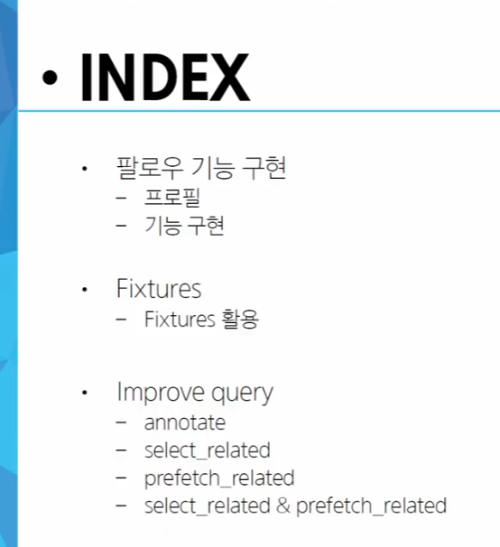

## 팔로우 기능 구현

### 프로필 페이지

#### urls

```py
from django.urls import path
from . import views

app_name = 'accounts'
urlpatterns = [
    path('login/', views.login, name='login'),
    path('logout/', views.logout, name='logout'),
    path('signup/', views.signup, name='signup'),
    path('delete/', views.delete, name='delete'),
    path('update/', views.update, name='update'),
    path('profile/<username>/',views.profile, naem = 'profile'), # 이게 '<username>/'로 위에 있으면 모든 링크가 죽어버림. login이나 logout도 username이라 인식해버리기 때문에
]
```

#### views

```py
from django.contrib.auth import get_user_model
def profile(request,username):
    User = get_user_model()
    person = User.objects.get(username = username) # User는 직접 참조하지 않는다!
    
    context = {
        'person' : person
    }
    
    return render(request,'accounts/profile',context)

```

#### html

```html
<!-- profile.html -->
<!DOCTYPE html>
<html lang="en">
<head>
    <meta charset="UTF-8">
    <meta name="viewport" content="width=device-width, initial-scale=1.0">
    <title>Document</title>
</head>
<body>
    <h1>{{person.username}}</h1>

    <h2>{{preson.username}}님이 작성한 게시글</h2>
    
        <div>{{article.title}}</div>
    

    <h2>{{person.username}}님이 좋아요한 게시글</h2>
    
        <div>{{article.title}}</div>
    
</body>
</html>

```

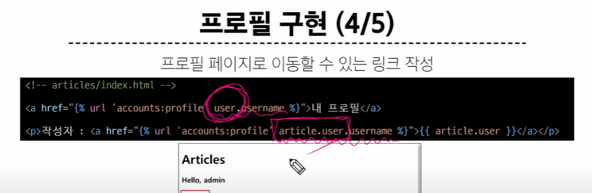

주의: 작성자 user와 현재 접속한 user는 다르다


```html
<!-- index.html -->

<!DOCTYPE html>
<html lang="en">
<head>
  <meta charset="UTF-8">
  <meta name="viewport" content="width=device-width, initial-scale=1.0">
  <title>Document</title>
</head>
<body>
  
    <h2>반갑습니다, {{ user.username }} 님</h2>
    <!-- 현재 접속해있는 user -->
    <a href="">내 프로필</a>
    <form action="" method="POST">
      
      <input type="submit" value="Logout">
    </form>
    <form action="" method="POST">
      
      <input type="submit" value="회원탈퇴">
    </form>
    <a href="">회원정보수정</a>
    <a href="">CREATE</a>
  
    <a href="">Login</a>
    <a href="">Signup</a>
  
  <h1>Articles</h1>
  <hr>
  
    <!-- 작성자의 profile -->
    <p>작성자 : <a href="">{{article.user}}</a></p>
    <p>작성자: {{ article.user }}</p>
    <p>글 번호: {{ article.pk }}</p>
    <a href="">
      <p>글 제목: {{ article.title }}</p>
    </a>
    <p>글 내용: {{ article.content }}</p>
    <p>{{ article.like_users.all|length }} 명이 이 글을 좋아합니다.</p>
    <p>{{ article.like_users.count }} 명이 이 글을 좋아합니다.</p>
    <form action="" method="POST">
      
      
        <input type="submit" value="좋아요 취소">
      
        <input type="submit" value="좋아요">
      
    </form>
    <hr>
  
</body>
</html>
\
```

### 팔로우 기능


#### user 모델

```py
#models.py

from django.db import models
from django.contrib.auth.models import AbstractUser

# Create your models here.
class User(AbstractUser):
    # 기본적으로 MTM 필드는 복수형으로 쓴다
    followings = models.ManyToManyField('self', symmetrical= False, related_name = 'followers')# 팔로잉 -> 내가 누군가를 참조하는것, 팔로잉과 팔로워 생각. 기준은 '나'

# 만약 related_name 설정을 안 하면?
## 정참조(내가 팔로우하고 있는 사람들) : user1.followings.all()
## 역참조(나를 팔로우하고 있는 사람들) : user2.user_set.all()

# manytomany의 가장 큰 특징? 모델을 직접적으로 바꾸는게 아니라 '중개테이블을 만든다'
```

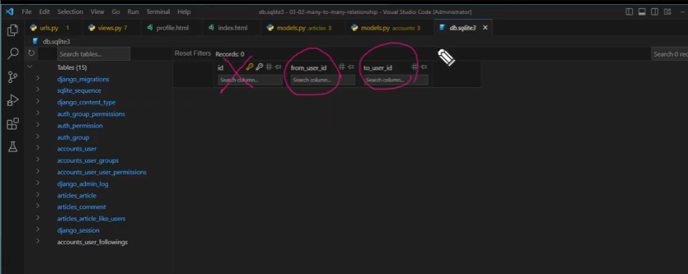

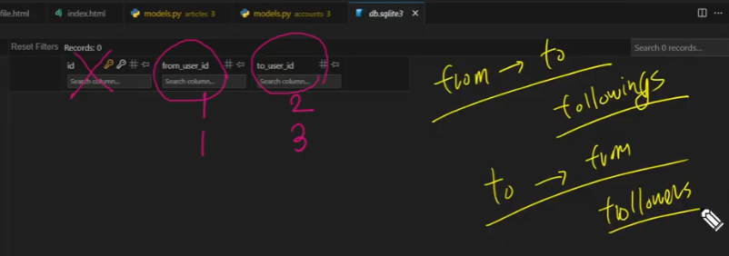

#### urls
```py
#urls

from django.urls import path
from . import views

app_name = 'accounts'
urlpatterns = [
    path('login/', views.login, name='login'),
    path('logout/', views.logout, name='logout'),
    path('signup/', views.signup, name='signup'),
    path('delete/', views.delete, name='delete'),
    path('update/', views.update, name='update'),
    path('profile/<username>/',views.profile, name = 'profile'), # 이게 '<username>/'로 위에 있으면 모든 링크가 죽어버림. login이나 logout도 username이라 인식해버리기 때문에
    path('<int:user_pk>/follow/',views.follow,name = ;'follow'), # 먼저 상대방 요청 정보가 팔로우 되어있는 계정에 있는지 여부에 따라 팔로우/언팔로우가 결정됨 ==> 상대방 계정 정보가 필요함
]
```

#### views

```py
@login_required
def follow(request,user_pk):
    me = request.user # 팔로우를 거는 사람
    you = get_user_model().objects.get(pk = user_pk) # 팔로우를 받는 사람
    
    if me != you: # 나는 팔로우가 불가능함
        # 이제부터 좋아요랑 비슷
        # 현재 요청하는 사람이 상대방의 팔로워 목록에 있는지, 없는지 => 역참조 
        if me in you.followers.all():
            you.followers.remove(me)
            # me.followings.remove(you) # 이거랑 똑같음
        
        else:
            you.followers.add(me)
            # me.followings.add(you) # 이거랑 똑같음
    
    return redirect('acoounts:progile',you.username) # 상대 프로필 페이지로
```

#### html

```html
<!-- profile.html -->
<!DOCTYPE html>
<html lang="en">
<head>
    <meta charset="UTF-8">
    <meta name="viewport" content="width=device-width, initial-scale=1.0">
    <title>Document</title>
</head>
<body>
    <h1>{{person.username}}님의 프로필 페이지</h1>
    <!--  -->
    <div>
        팔로잉 : {{person.followings.all|length}}
        팔로워 : {{person.followers.all|length}}
    </div>
    
    <form action="" method = "POST">
        
        
        <input type="submit" value = '언팔로우'>
        
        <input type="submit" value = '팔로우'>
        
    </form>
    
    <!--  -->
    <h2>{{preson.username}}님이 작성한 게시글</h2>
    
        <div>{{article.title}}</div>
    

    <h2>{{person.username}}님이 좋아요한 게시글</h2>
    
        <div>{{article.title}}</div>
    
</body>
</html>
```

> 좋아요 누르는거랑 같음, 그냥 자기 자신과의 N:N과 기타 등등 종종 다른게 존재


 ### 참고

 #### .exists()

 해당 데이터 셋 내에서 특정 데이터가 존재하는지 확인용

 역할은 in과 똑같음. 다만 크기가 큰 데이터셋에서 월등히 빠름

 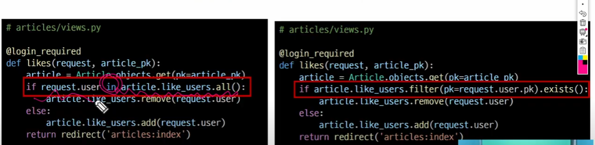

 


 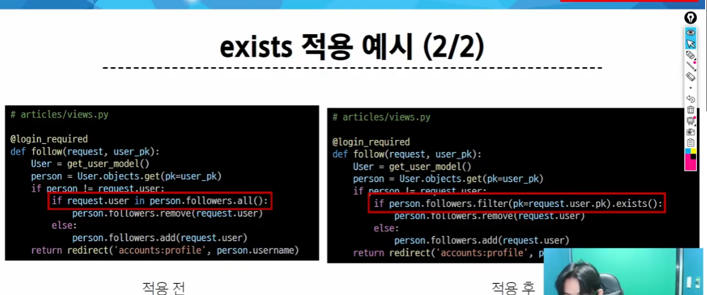

# 앞으로는 추가 내용이라 생각

## Fixtures - 데이터를 담은 requirements.txt 같은거


> 초기 데이터 제공 : fixtures의 사용 목적

데이터 베이스에 들어갈 초기 데이터를 제공하는거, gitignore하면 데이터베이스가 안 들어가서 데이터도 날아감


### Fixtures 활용

> 추출과 불러오기 2가지


### 1. 추출 - dumpdata

> 데이터 베이스의 데이터를 모두 추출.
> 
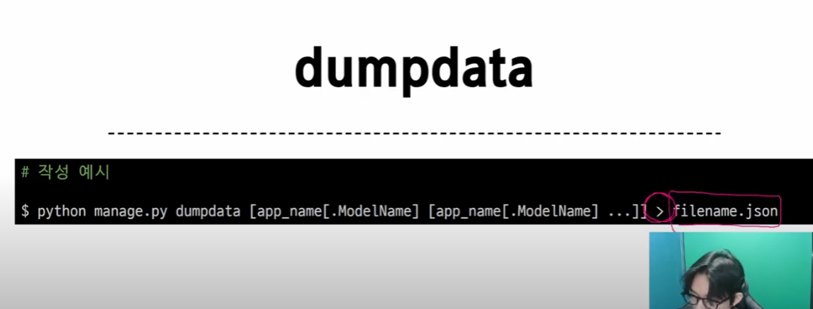

appname등을 쓰지 않으면 모두 씀(옵션들)

'>' 뒤에는 ~ 형식으로 저장하겠다 라는 뜻

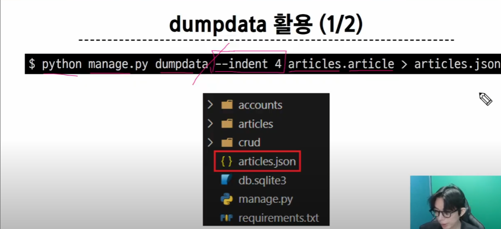

indent 4 는 들여쓰기를 4칸씩 하겠다는 뜻

### 2. 불러오기 - loaddata

fixtures 데이터를 데이터베이스로 불러오기

> fixtures의 위치?
>
> app_name/fixtures/ 폴더 이후의 경로. app_name/templates마냥 여기가 디폴트로 안 써도 나옴

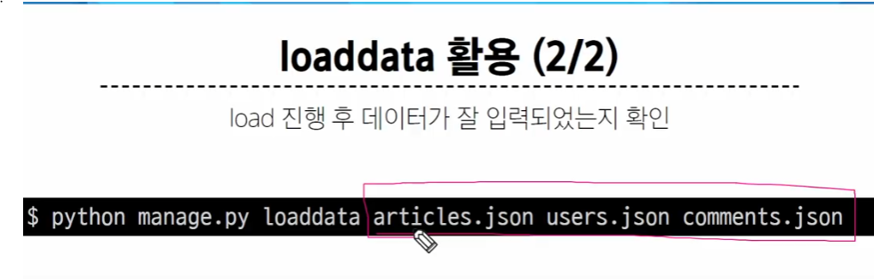

> 그리고 당연히 migrate 해서 데이터셋을 만들고 데이터를 로드해야함

#### 팁 - utf-8 오류

json을 메모장으로 열고 utf-8로 다르게 저장하면 된다


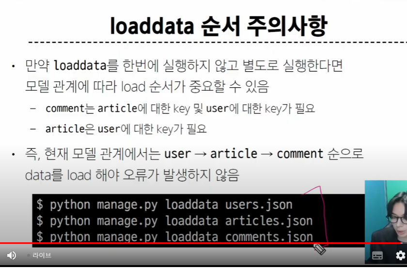


#### ====

차례대로 로드할 땐 순서가 중요함 

why? article과 comment 안에 user가 존재

> 신경쓰기 싫으면 그냥 한 줄로 써라


#### 모든 모델 한 번에 dump 하기


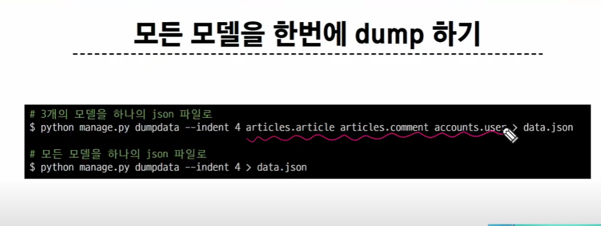


#### 주의사항

> json 파일을 직접 만들지 마라


## Improve Query -> 쿼리 개선, 최적화

결국 최적화는 query에서 db에 보내는 요청을 줄여서 같은 결과를 내야 함


# OFF-LINE

- SQL ~ M:N Relationshp
- join 제외 sql에서 많이 나옴. orm이랑 sql 위주로 공부


## 쿼리 성능 개선


```py
def index_1(request):
    articles = Article.objects.order_by('-pk')
    # articles = Article.objects.annotate(Count('comment')).order_by('-pk')
    context = {
        'articles': articles,
    }
    return render(request, 'articles/index_1.html', context)

```

> 어디서 sql이 호출될까?
>
> context를 내보내고, 그 이후 context가 사용되는 시점(렌더링, 혹은 html에서 사용할 때)

1. 지연 로딩
   - 객체의 연관된 데이터를 **필요한 시점**에만 가져오는 것을 의미
     - 필요한 시점? 사용할 때
   - 관계가 있는 모든 데이터를 가져오지 않고, 필요한 데이터만 가져오도록 구현
   - why? 목적 : 성능향상과 코드 유지보수 때문에
   - 장점
     - DB에서 필요한 데이터만 가져오기 때문에 '부하'를 줄일 수 있다. 
       - 부하 -> DB에게 가해지는 압력 -> 호출될 수록 높아진다
     - 메모리 사용량을 줄일 수 있다.
   - 단점
     - N + 1 Problem 발생
     - 해결방법은 유튜브에서 했음


2. 즉시 로딩(Eager Loading)
   - 위의 지연 로딩 시에 쿼리 문을 여러 번 날리는 문제점을/ 한 번에 필요한 데이터를 모두 가져오도록 수정해서 처리
   - 즉, 관계가 있는 테이블 데이터를 모두 한 번에 가져온 것
   - 3가지 방법
   - 1. 집계 함수를 쓸 때 한 번에 가져오기
   - 2. 정참조 할 때
   - 3. 역참조 할 때 


1. 로그(=로그 파일)
   - 시스템의 동작 상태 , 이벤트, **오류** 등을 기록한 정보
   - 이런 정보를 일반적으로 파일이나 DB에 기록해둔다
   - 추후에 분석하거나 디버깅하는데 사용됨
   - why? 왜 쓰냐? 타인과 함께 공유할 때, 특정 상황을 전하기 위해
   - 장고에서는 어떻게?
     - 장고 다큐먼트의 Logging 확인(공식문서)
   - 기본적으로 로그를 구분하기 위해 로그 레벨이라는 5개로 나뉨
     - DEBUG : 디버깅을 목적으로 낮은 수준의 시스템 정보
     - INFO : 일반적인 시스템 정보, 유저가 ~을 했다. ~에 접속했다 등
     - WARNING : 발생한 작은 문제에 대한 정보
     - ERROR : 발생한 심각한 문제에 대한 정보
     - CRITICAL : 곧 시스템 터진다는 뜻, 시스템이 중단될 수 있는 상황에 대한 정보
   - SQL을 보내는 것? DEBUG 또는 INFO에 포함


```py
# settings.py
# 콘솔창에 저장하기
LOGGING = {
    "version": 1,
    "disable_existing_loggers": False,
    "handlers": {
        "console": {
            "level": "DEBUG",
            "class": "logging.StreamHandler",
        },
    },
    "loggers": {
        "django.db.backends": {
            "handlers": ["console"],
            "level": "DEBUG",
        },
    },
}
```

```py
# 파일로 저장하기
LOGGING = {
    'version': 1,
    'disable_existing_loggers': False,
    'handlers': {
        'file': {
            'level': 'DEBUG',
            'class': 'logging.handlers.RotatingFileHandler',
            'filename': 'django.log',
            'maxBytes': 1024*1024*5,  # 5MB
            'backupCount': 5,
            'formatter': 'verbose',
        },
    },
    'formatters': {
        'verbose': {
            'format': '%(levelname)s %(asctime)s %(module)s %(process)d %(thread)d %(message)s'
        },
    },
    'loggers': {
        'django.db.backends': {
            'handlers': ['file'],
            'level': 'DEBUG',
            'propagate': True,
        },
    },
}
```


```py
# SQL 뿐만 아니라, 사용자 요청까지 파일에서 확인하기

LOGGING = {
    'version': 1,
    'disable_existing_loggers': False,
    'handlers': {
        'file': {
            'level': 'DEBUG',
            'class': 'logging.handlers.RotatingFileHandler',
            'filename': 'django.log',
            'maxBytes': 1024*1024*5,  # 5MB
            'backupCount': 5,
            'formatter': 'verbose',
        },
    },
    'formatters': {
        'verbose': {
            'format': '%(levelname)s %(asctime)s %(module)s %(process)d %(thread)d %(message)s'
        },
    },
    'loggers': {
        "django": {
            "handlers": ["file"],
            "propagate": True,
        },
        'django.db.backends': {
            'handlers': ["file"],
            'level': 'DEBUG',
            'propagate': True,
        },
    },
}

# 뭔가 이상하게 느리다 싶으면 이것도 확인해보면 된다. 초단위로 시간도 나옴
```