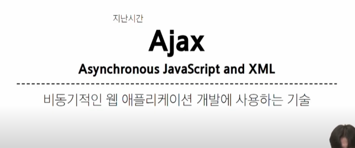
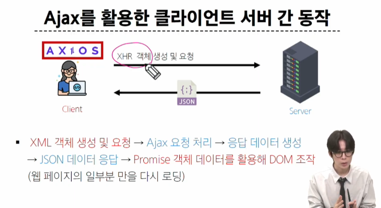

# 비동기 with django

## Ajax와 서버







## Ajax with follow

### 비동기 팔로우 구현

- 팔로우도 누르면 새로고침이 된다.

#### Ajax 적용


# offline


```html
<!-- detail.html -->

 
<h2>DETAIL</h2>
<h3>{{ article.pk }} 번째 글</h3>
<hr />
<p>제목 : {{ article.title }}</p>
<p>내용 : {{ article.content }}</p>
<p>작성시각 : {{ article.created_at }}</p>
<p>수정시각 : {{ article.updated_at }}</p>
<hr />

<a href="">[UPDATE]</a>
<form id="delete-form" data-article-id="{{article.id}}" data-my-test="119">
  
  <input type="submit" value="DELETE" />
</form>

<a href="">[back]</a>
<hr />
<h4>댓글 목록</h4>

<p><b>{{ comments|length }}개의 댓글이 있습니다.</b></p>

<ul id="comment-container">
  
  <li>
    {{ comment.user }} - <span>{{ comment.content }}</span>
    
    <form
      id="delete-comment-form"
      class="d-inline"
      data-article-id="{{article.id}}"
      data-comment-id="{{comment.id}}"
    >
      
      <!-- {{comment_form}} -->
      <input type="submit" value="DELETE" />
    </form>
    <button
      id="comment-update"
      data-article-id="{{article.id}}"
      data-comment-id="{{comment.id}}"
    >
      update
    </button>
    
  </li>
  
  <p>댓글이 없어요..</p>
  
</ul>

<hr />

<form id="comment_create_form" data-article-id="{{article.id}}">
  {{ comment_form }}
  <input type="submit" />
</form>

<a href="">[댓글을 작성하려면 로그인하세요.]</a>


<script src="https://cdn.jsdelivr.net/npm/axios/dist/axios.min.js"></script>
<script>
  const articleDeleteForm = document.querySelector("#delete-form");
  const csrfToken = document.querySelector(
    'input[name = "csrfmiddlewaretoken"]'
  ).value;

  articleDeleteForm.addEventListener("submit", function (event) {
    event.preventDefault();
    // console.log('test')

    // ~~ 몇 번 게시글을 지워라!
    // article.id는 어디서 가져와야 하는거?
    // console.log(event.target.dataset)

    const articleId = event.target.dataset.articleId;
    if (confirm("정말 삭제하시겠습니까?")) {
      const url = `/articles/${articleId}/delete/`;
      axios({
        method: "post",
        url,
        headers: {
          "X-CSRFToken": csrfToken,
        },
      })
        .then((response) => {
          // console.log(response)
          location.href = "/articles/";
        })
        .catch((error) => {
          console.log(error);
        });
      /*
          axios.post(url,null,{

          })*/ //위랑 똑같음
    }
  });

  

  const commentContainer = document.querySelector("#comment-container");
  // const deleteCommentForm = document.querySelector('#delete-comment-form')// 얘 떄문에 여러개의 comment에선 문제가 생김(중복, querySelector는 해당 아이디가 여러개 있을 경우 상위 하나만 선택함)
  // 해결? id = 'delete-comment-form-${comment.id}'로 만들면 됨
  // 아니면 버블링 이용
  // deleteCommentForm.addEventListener('submit',function(event){
  commentContainer.addEventListener("submit", function (event) {
    event.preventDefault();
    const articleId = event.target.dataset.articleId;
    const commentId = event.target.dataset.commentId;
    const csrfToken = document.querySelector(
      'input[name = "csrfmiddlewaretoken"]'
    ).value;

    if (confirm("정말 삭제하시겠습니까?")) {
      const url = `/articles/${articleId}/comments/${commentId}/delete/`;
      // const url = `comments/${commentId}/delete/`
      // 이렇게 써줘도 된다.
      axios({
        method: "post",
        url,
        headers: {
          "X-CSRFToken": csrfToken,
        },
      })
        .then((response) => {
          location.href = `/articles/${articleId}/`;
        })
        .catch((error) => {
          console.log("삭제 실패");
        });
    }
  });
  //댓글 생성
    const commentCreateForm = document.querySelector("#comment_create_form");
    commentCreateForm.addEventListener("submit", function (event) {
      event.preventDefault();
      const articleId = event.target.dataset.articleId;
      // const csrfToken = document.querySelector('input[name = "csrfmiddlewaretoken"]').value // 이거 어디서든 쓰니깐 그냥 위로 올려줌

      const formData = new FormData(commentCreateForm);
      // console.log(formData.has(content))
      const url = `/articles/${articleId}/comments/`;
      axios({
        method: "post",
        url,
        data: formData,
        headers: {
          "X-CSRFToken": csrfToken,
        },
      }).then((response) => {
        console.log(response.data.username);

        // 댓글 수정 버튼 넣기
        const updateButton = document.createElement("button");
        // updateButton.id = 'comment-update'
        //HTML 요소를 넣고 싶을 때
        //updateButton.innerHtml
        //문자열을 넣고 싶을 때
        updateButton.textContent = "UPDATE";
        updateButton.classList.add("comment-update");
        updateButton.dataset.articleId = articleId;
        updateButton.dataset.commentId = response.data.pk;

        // 댓글 삭제 버튼 만들기
        const deleteForm = document.createElement("form");
        deleteForm.classList.add("d-inline");
        deleteForm.id = "comment-delete-form";
        deleteForm.dataset.articleId = articleId;
        deleteForm.dataset.commentId = response.data.pk;
        deleteForm.innerHTML = '<input type="submit" value="DELETE">';

        const liTag = document.createElement("li");
        liTag.innerHTML = `${response.data.username}-<span>${response.data.content}</span>`;
        liTag.appendChild(updateButton);
        liTag.appendChild(deleteForm);
        commentContainer.appendChild(liTag);
        // commentContainer.appendChild(updateButton)
        commentCreateForm.reset();
      });
    });
  // 댓글 수정
  commentContainer.addEventListener("click", function (event) {
    // console.log(event.target,'클릭됨!')
    if (event.target.id == "comment-update") {
      console.log("업데이트 버튼 클릭됨!");

      // 기존 comment 내용을 가져와야 한다.
      console.log(event.target.parentElement); // 부모 요소 갖고 오기

      // 댓글 내용은 event.target의 부모 요소에 존재한다.
      const comment = event.target.parentElement;
      const oldContent = comment.querySelector("span").textContent;
      const articleId = event.target.dataset.articleId
      const commentId = event.target.dataset.commentId
      const newContent = prompt("수정할 내용을 입력하세요", oldContent);
      if (newContent != oldContent && newContent != null) {
        const formData = new FormData(); // 여기에 들어가는건 키- 벨류 형태이기 때문에 oldContent를 바로 집어넣으면 오류가 난다.
        formData.append("content", newContent); // content의 벨류에 new content를 집어넣어라
        const url = `/articles/${articleId}/comments/${commentId}/update/`;
        axios({
          method: "post",
          url,
          data : formData,
          headers: {
            "X-CSRFToken": csrfToken,
          },
        })
          .then((response) => {
            console.log(response)
            comment.querySelector("span").textContent = response.data.content;
            // location.href = `/articles/${articleId}/`;
          })
          .catch((error) => {
            console.log(error);
          });
      }
    }
  });
</script>

```

```py
# views.py


@require_POST
def comments_create(request, pk):
    if request.user.is_authenticated:
        article = get_object_or_404(Article, pk=pk)
        comment_form = CommentForm(request.POST)
        if comment_form.is_valid():
            comment = comment_form.save(commit=False)
            comment.article = article
            comment.user = request.user
            comment.save()
            return JsonResponse({
                'pk' : comment.pk,
                # 'article_pk': article.pk,
                'username':comment.user.username,
                'content': comment.content,
            })
        # return redirect('articles:detail', article.pk)
    return redirect('accounts:login')

@require_POST
def comments_update(request, article_pk,comment_pk):
    if request.user.is_authenticated:
        comment = get_object_or_404(Comment, pk=comment_pk)
        if request.user == comment.user: # 본인만 수정 가능
            comment_form = CommentForm(request.POST,instance = comment)
            if comment_form.is_valid():
                comment_form.save()
                return JsonResponse({
                    'pk' : comment.pk,
                    'content' : comment.content,
                })
            return JsonResponse({'error_message':'입력 제대로 하세요!'})
        return JsonResponse({'error_message':'본인만 수정 가능!'})
    return JsonResponse({'error_message : 로그인이 필요합니다.'})

    # return 
                


@require_POST
def comments_delete(request, article_pk, comment_pk):
    if request.user.is_authenticated:
        comment = get_object_or_404(Comment, pk=comment_pk)
        if request.user == comment.user:
            comment.delete()
    return redirect('articles:detail', article_pk)

```

```py

#url.py

from django.urls import path
from . import views


app_name = 'articles'
urlpatterns = [
    path('', views.index, name='index'),
    path('create/', views.create, name='create'),
    path('<int:pk>/', views.detail, name='detail'),
    path('<int:pk>/delete/', views.delete, name='delete'),
    path('<int:pk>/update/', views.update, name='update'),
    path('<int:pk>/comments/', views.comments_create, name='comments_create'),
    path('<int:article_pk>/comments/<int:comment_pk>/delete/', views.comments_delete, name='comments_delete'),
     path('<int:article_pk>/comments/<int:comment_pk>/update/', views.comments_update, name='comments_update'),
    path('<int:article_pk>/likes/', views.likes, name='likes'),
]

```


### 추가 공부

prototype javascript 공부해봐라

class없고, 상속 없고, 