# 01 DOM

## INTRO

- 웹 표준의 중요성
- 브라우저를 조작하는 JS

## DOM

### 웹 브라우저에서의 JS

- 웹 페이지의 **동적인** 부분을 담당


#### JS 실행 환경 종류

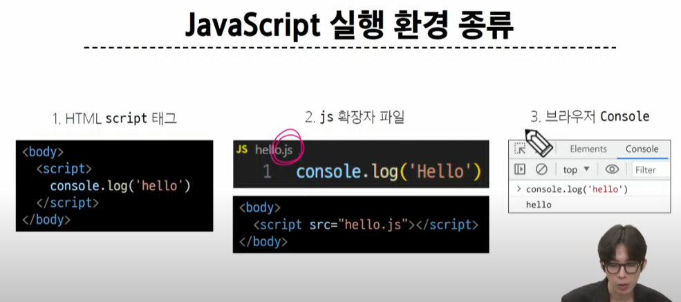


### DOM


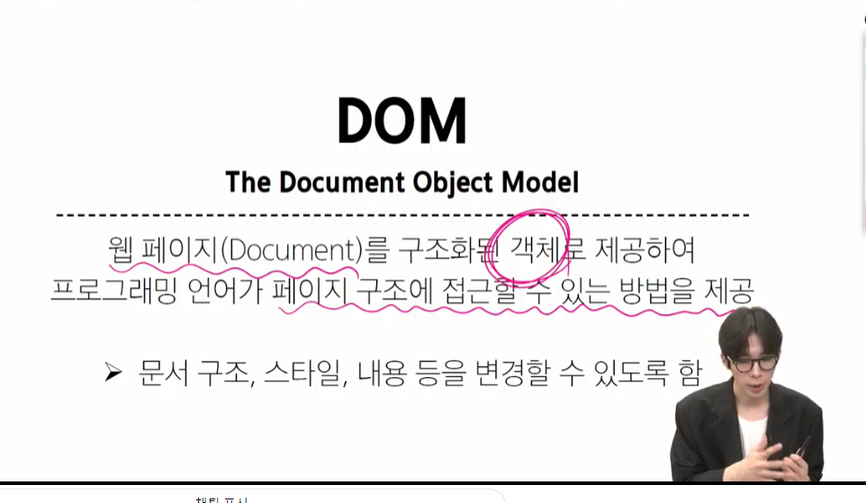

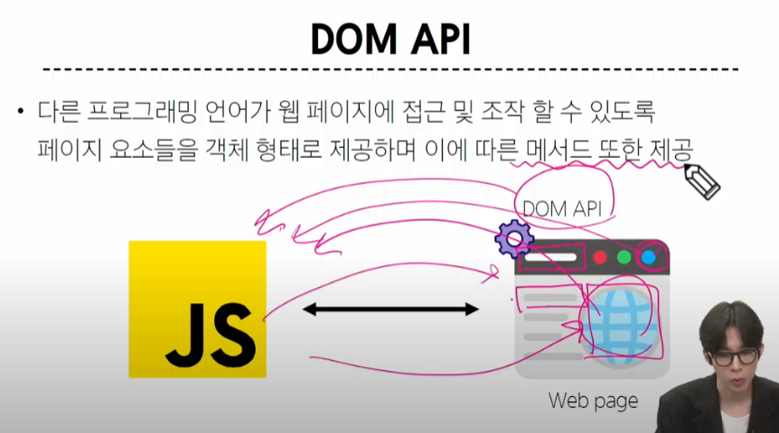

DOM -> 트리 구조 / ex) document.title

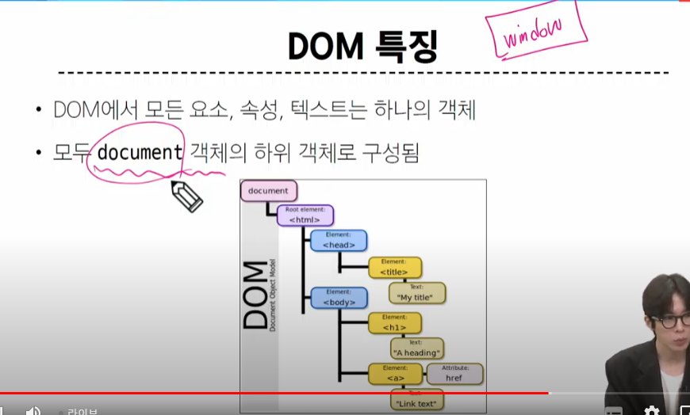


> 결국 모든 요소를 객체로 제공하여 하나하나 따로 수정할 수 있도록 

### Document 객체

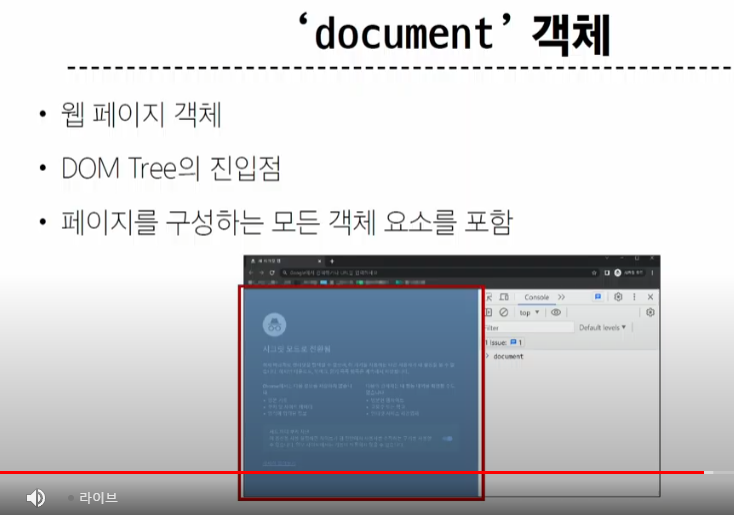

> 이 부분에 접근해서 수정할 수 있다.

## DOM 선택
-> 조작(생성,수정,삭제)의 시작, 일종의 조회

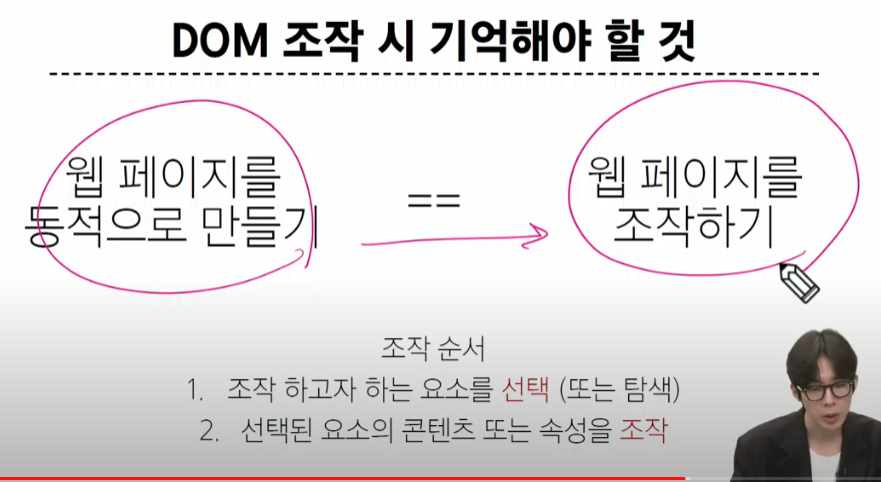

### 선택 메서드


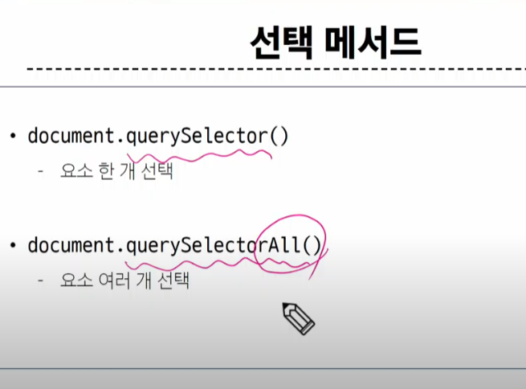

CSS에서 배운 선택자들이 여기서도 쓰임

.a

a

a > b

메서드의 괄호에 들어가는 것들이 이 선택자임


다중이기 때문에 NodeList로 반환. 일종의 배열

> 선택자 Tip. 개발자 모듈의 Elements에서 원하는 항목 우클릭해서 selector 복붙 가능

```html
<!DOCTYPE html>
<html lang="en">

<head>
  <meta charset="UTF-8">
  <meta name="viewport" content="width=device-width, initial-scale=1.0">
  <title>Document</title>
</head>

<body>
  <h1 class="heading">DOM 선택</h1>
  <a href="https://www.google.com/">google</a>
  <p class="content">content1</p>
  <p class="content">content2</p>
  <p class="content">content3</p>
  <ul>
    <li>list1</li>
    <li>list2</li>
  </ul>

  <script>
    console.log(document.querySelector('.heading')) //이 문서에서 클래스가 헤딩인 애들
    // <h1 class="heading">DOM 선택</h1>

    console.log(document.querySelector('.content'))
    // <p class="content">content1</p>

    console.log(document.querySelectorAll('.content'))
    // NodeList(3)
    // 0: p.content
    // 1: p.content
    // 2: p.content
    // length: 3
    // [[Prototype]]: NodeList
  

    console.log(document.querySelectorAll('ul > li')) // ul 아래의 li들


</script>
</body>

</html>

```


### DOM 조작


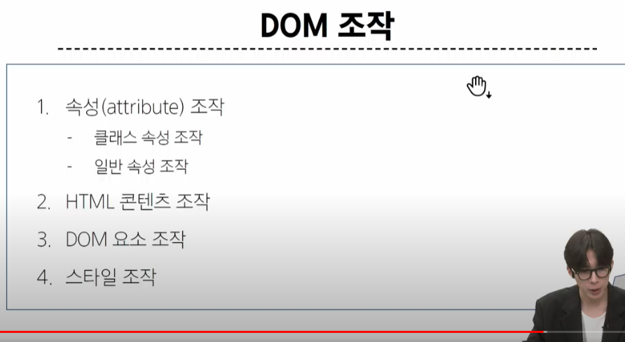

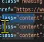

> 이런 애들이 속성


#### 속성 조작

1. 클래스 속성 조작
2. 일반 속성 조작


1. 클래스 속성 조작


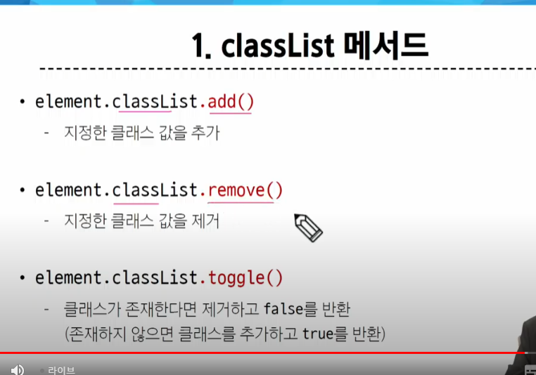


```html
<!DOCTYPE html>
<html lang="en">

<head>
  <meta charset="UTF-8">
  <meta name="viewport" content="width=device-width, initial-scale=1.0">
  <title>Document</title>
  <style>
    .red {
      color: crimson;
    }
  </style>
</head>

<body>
  <h1 class="heading">DOM 조작</h1>
  <a href="https://www.google.com/">google</a>
  <p class="content">content1</p>
  <p class="content">content2</p>
  <p class="content">content3</p>
  <ul>
    <li>list1</li>
    <li>list2</li>
  </ul>

  <script>
    // 스타일을 스크립트에서 설정
    // 클래스 속성 조작

    const h1Tag = document.querySelector('.heading')
    h1Tag.classList  // 적용된 클래스 조회. 여기엔 heading

    h1Tag.classList.add('red') // h1Tag의 classList에 red 클래스를 추가
   
    h1Tag.classList.remove('red') // h1Tag의 classList에 red 클래스를 삭제
   
    h1Tag.classList.toggle('red') // h1Tag의 classList에 red 클래스 존재 여부 확인. 있으면 빼고 없으면 추가


</script>
</body>

</html>

```

2. 일반 속성 조작 메서드

- 일반속성 ? a태그의 href, 이미지 속성의 src 같은거

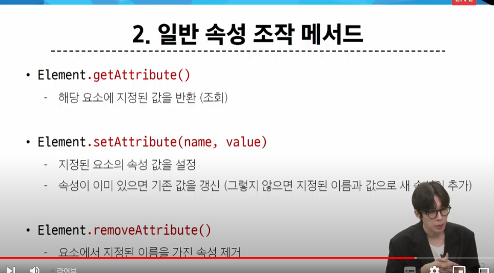

```html
<!DOCTYPE html>
<html lang="en">

<head>
  <meta charset="UTF-8">
  <meta name="viewport" content="width=device-width, initial-scale=1.0">
  <title>Document</title>
  <style>
    .red {
      color: crimson;
    }
  </style>
</head>

<body>
  <h1 class="heading">DOM 조작</h1>
  <a href="https://www.google.com/">google</a>
  <p class="content">content1</p>
  <p class="content">content2</p>
  <p class="content">content3</p>
  <ul>
    <li>list1</li>
    <li>list2</li>
  </ul>

  <script>
    // 스타일을 스크립트에서 설정
    // 1. 클래스 속성 조작

    const h1Tag = document.querySelector('.heading')
    h1Tag.classList  // 적용된 클래스 조회. 여기엔 heading

    h1Tag.classList.add('red') // h1Tag의 classList에 red 클래스를 추가
   
    h1Tag.classList.remove('red') // h1Tag의 classList에 red 클래스를 삭제
   
    h1Tag.classList.toggle('red') // h1Tag의 classList에 red 클래스 존재 여부 확인. 있으면 빼고 없으면 추가

    // 2. 일반 속성 조작

    const aTag = document.querySelector('a')
    console.log(aTag)

    aTag.getAttribute('href')

    aTag.setAttribute('href','https://www.naver.com/')

    aTag.removeAttribute('href')
    

</script>
</body>

</html>
```

#### 3. HTML 콘텐츠 조작

내부 컨텐츠? 태그 안의 컨텐츠들


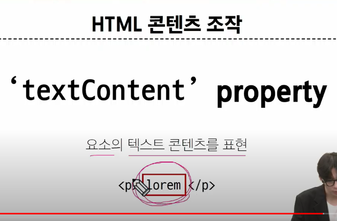

물론 **요소를 먼저 선택해야함**

접근 이후엔 그냥 파이썬 쓰듯이 바꾸면 된다.

#### 4. DOM 요소 조작

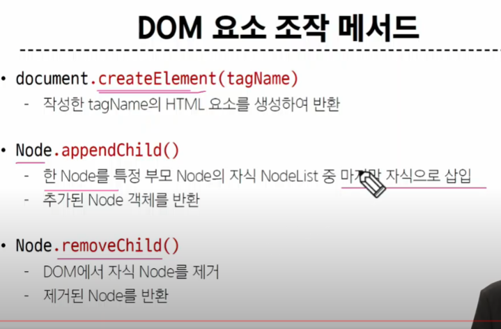

```html
<!DOCTYPE html>
<html lang="en">

<head>
  <meta charset="UTF-8">
  <meta name="viewport" content="width=device-width, initial-scale=1.0">
  <title>Document</title>
</head>

<body>
  <div></div>

  <script>
    // 내용 넣는 것도 JS로 할거다

    // 생성
    const h1Tag = document.createElement('h1') // 태그 생성

    h1Tag.textContent = '제목' // 내용 넣기


    // 이제 해당 변수를 렌더링 하기 위해 html에 추가

    // 추가
    const divTag = document.querySelector('div') //우선 부모를 먼저 선택
    divTag.appendChild(h1Tag) // 자식 넣기

    // 삭제
    divTag.removeChild(h1Tag)
  </script>
</body>

</html>

```


#### 5. style 조작

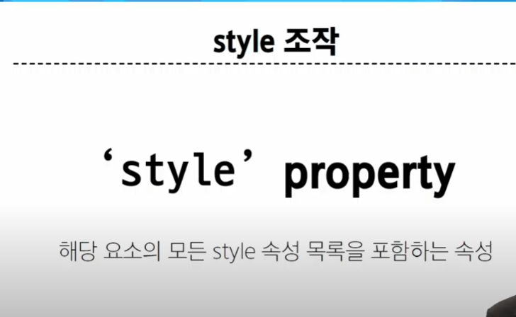

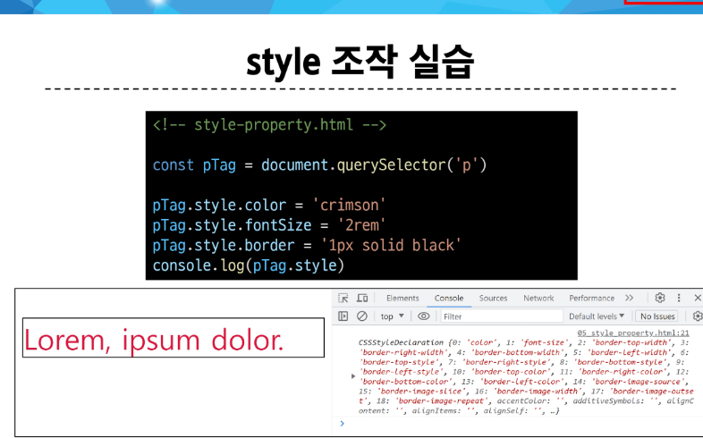

```html
<!DOCTYPE html>
<html lang="en">

<head>
  <meta charset="UTF-8">
  <meta name="viewport" content="width=device-width, initial-scale=1.0">
  <title>Document</title>
</head>

<body>
  <p>Lorem, ipsum dolor.</p>

  <script>
    const pTag = document.querySelector('p')
    console.log(pTag.style) // style 속성 출력

    pTag.style.color = 'crimson' // 스타일의 color에 crimson 적용
    
    pTag.style.fontSize = '2rem'

    pTag.style.border = '1px solid black'
    
  </script>
</body>

</html>

```

> Inline으로 들어간다

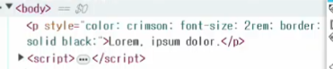

# OFFLINE

우리 코드를 브라우저가 화면으로 만드는 것? '렌더링'

- HTML 코드를 Live Server를 통해서 실행라면, 어떤 원리로 화면을 눈으로 볼 수 있을까?
  1. Live Server가 켜진다.
    - ex) 주소 : 'http://127.0.0.1:5501/%ED%95%84%EA%B8%B0/JS/240416/test.html'
  2. 사용자가 브라우저를 활용해서 해당 주소로 접근한다.
  3. Live Server가 브라우저에게 'test.html'을 전달
  4. 렌더링을 해준다(화면을 그려준다)

- JS 코드들은 무슨 원리로 실행될까> 어떻게 화면을 변경시킬 수 있을까?
> DOM
- JS는 항상 화면을 바꿔준다는 사실을 잊지 말아야 한다. 
  - -> html에 작성되어 있는 내용들이 수정된다.
- JS는 HTML 요소를 수정한다. -> 이 때, DOM이라는 것이 사용된다. 

- DOM(Document Object Model)
  - Document(HTML)을 수정할 수 있는 Object 처럼 만들어주는 Model
  - 웹페이지의 문서 구조를 표현하는 객체 모델
    - -> 원하는 내용만 찾아서 수정할 수 있도록 -> Parsing이 쉽도록 
  - 브라우저가 원하는 부분을 쉽게 찾을 수 있도록 구조화 해놓음 
    - **트리 형태로** 구조화를 해놓음 (DOM 트리)
  - 하는 역할
    - HTML 문서를 트리 형태의 객체 모델로 변환(DOM 트리) -> 찾기 쉽도록 구조 변경
    - JS가 문서 내용을 조작할 수 있도록 도와주는 일종의 API -> 조작 가능
    - 웹 페이지의 컨텐츠(요소, 속성, 스타일 등)에 대한 프로그래밍 인터페이스를 제공한다.
      - 웹페이지의 구조나 내용을 동적으로 변경하는데 사용

'https://youtu.be/mFawNZz_Uu0?si=K6WDAVwAo-5AWPJ_'


- 자바스크립트 엔진(해석기)
  - 크롬 브라우저 (V8)
  - 엔진의 구성 요소는 나중에(문법을 배운 후에)

- 자바스크립트 런타임
  - 자바스크립트 코드를 실행하는 환경 (브라우저)
  - 자바스크립트가 서버 쪽에서도 사용이 되기 시작함 (Node.js)
  - 런타임의 동작 원리(문법을 배운 후에)


# 과제

### 과제 1

> id를 통해서 원소 찾기
>
> .getElementById('아이디 이름')

```html
<!DOCTYPE html>
<html>
<head>
  <title>나의 포트폴리오</title>
</head>
<body>
  <h1>안녕하세요, 제 이름은 <b id="name">홍길동</b>입니다.</h1>
  
  
  
  <h2>소개</h2>
  <p>저는 <b id="job">[직업/전공]</b>으로 일하고 있습니다. <b id="experience">[간단한 경력/학력]</b>을 가지고 있으며, <b>[특기 또는 관심 분야]</b>에 대해 꾸준히 공부하고 있습니다.</p>
  
  <h2>프로젝트</h2>
  <ul id="list-group">
    <li><b>프로젝트 1:</b> <span class="project-1">[프로젝트 1 제목]</span></li>
    <li><b>프로젝트 2:</b> <span class="project-2">[프로젝트 2 제목]</span></li>
    <li><b>프로젝트 3:</b> <span class="project-3">[프로젝트 3 제목]</span></li>
  </ul>
  
  <h2>연락처</h2>
  <p>이메일: <b id="email">[이메일 주소]</b></p>
  <p>전화번호: <b id="phone">[전화번호]</b></p>
  
  <script>
    const imgTag = document.querySelector('img')
    console.log(imgTag)
    imgTag.setAttribute('src','profile.jpg')

    const b1 = document.getElementById('job')
    console.log(b1)
    b1.textContent = '의적'
    
    document.getElementById('experience').textContent = '서당'

    document.getElementById('email').textContent = 'hgd@korea'

    document.getElementById('phone').textContent = '010-1234-1234'
    
  </script>
</body>
</html>
```

> 이렇게도 가능

```html
<!DOCTYPE html>
<html>
<head>
  <title>나의 포트폴리오</title>
</head>
<body>
  <h1>안녕하세요, 제 이름은 <b id="name">홍길동</b>입니다.</h1>
  
  
  
  <h2>소개</h2>
  <p>저는 <b id="job">[직업/전공]</b>으로 일하고 있습니다. <b id="experience">[간단한 경력/학력]</b>을 가지고 있으며, <b>[특기 또는 관심 분야]</b>에 대해 꾸준히 공부하고 있습니다.</p>
  
  <h2>프로젝트</h2>
  <ul id="list-group">
    <li><b>프로젝트 1:</b> <span class="project-1">[프로젝트 1 제목]</span></li>
    <li><b>프로젝트 2:</b> <span class="project-2">[프로젝트 2 제목]</span></li>
    <li><b>프로젝트 3:</b> <span class="project-3">[프로젝트 3 제목]</span></li>
  </ul>
  
  <h2>연락처</h2>
  <p>이메일: <b id="email">[이메일 주소]</b></p>
  <p>전화번호: <b id="phone">[전화번호]</b></p>
  
  <script>
    const name = document.querySelector('#name')
    const job = document.querySelector('#job')
    const experience = document.querySelector('#experience')
    const email = document.querySelector('#email')
    const phone = document.querySelector('#phone')

    name.textContent = '홍길동'
    job.textContent = '의적'
    experience.textContent = '서당'
    email.textContent = 'hgd@korea'
    phone.textContent = '010-1234-1234'
  
    const img = document.querySelector('img')
    img.setAttribute('src', 'profile.jpg') 
    img.setAttribute('alt', '프로필 사진') 
  
  </script>
</body>
</html>
```

### 과제 2

