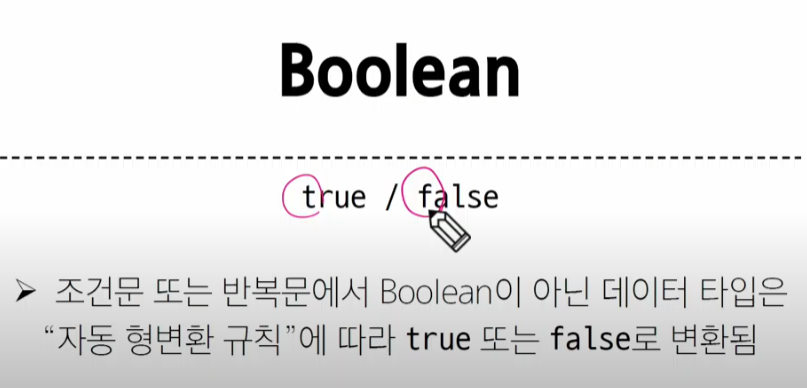
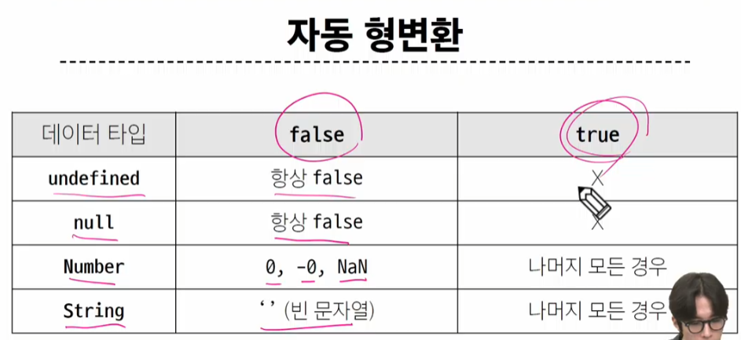

# 02. Basic Syntax


- standard JS


## 변수

### 변수 선언 키워드


3가지

- let
- const
- var 

### let

- 블록 스코프를 가진다 


- 재할당이 가능
- 재선언 불가능


### const

- 블록 스코프를 갖는 지역 변수 선언
- 재할당 불가능
- 재선언 불가능
- const는 constant -> 상수 -> 재할당, 재선언 불가능
- 선언 시 반드시 초기값이 들어가야 함


### 어떤 변수 선언 키워드를 사용?

- 기본적으로 const사용
- 재할당이 필요하면 그 때 let로 변경해서 사용

> 왜 const부터 사용?
>
> 유지 보수를 위해
>
> 변수가 쉽게 변한다면 오히려 변수가 너무 많아져서 유지보수가 힘들어짐


## 데이터 타입


### 원시 자료형 예시


### 참조 자료형 예시


### 원시 자료형

#### 1. Number

-정수 또는 실수형 숫자를 표현하는 자료형


- 'ab'/3 = NaN -> 우리가 직접 선언하는 경우는 거의 없음

#### 2. string

- '+' 연산자를 통해서 문자열끼리 결합
- 뺄셈,곱셈,나눗셈 불가능


> 두 번째 프로그래밍 언어는 보통 내 기존 언어와의 '차이점'을 기준으로 생각

- 템프릿 리터럴 -> f-string 같은거


#### 3. Null과 undefined


> 왜 구분? JS의 설계 실수


#### 4. Boolean




- 얘도 자동 형변환이 존재함




### 연산자

#### 할당 연산자


#### 증가&감소 연산자


- 할당하고 변화하냐/ 변화하고 할당하냐가 문제에 따라 다름

#### 비교 연산자


#### 동등 연산자

> 예외 사항이 굉장히 많음

why? 암묵적 타입 변환


> 여기서 헷갈릴까봐 새로운 연산자가 추가된다

#### 일치 연산자(===)


> 특수한 경우? null과 undefined

#### 논리 연산자


## 조건문

- 엥간하면 일치 연산자 써라

```javascript
  <script>
    const name = 'customer'

    if (name === 'admin') {
      console.log('관리자님 안녕하세요.')
    } else if (name === 'customer'){
      console.log('고객님 안녕하세요')
    } else {
      conseole.log(`반갑습니다.${name}님`)
    }
  </script>
```
```js
if (조건) {
    실행문
} else if (조건) {
    실행문
}else{
    실행문
}

```

### 삼항 조건문

> true 일 때와 false일 때의 경우 파악


```js
// 삼항 연산자

  const age = 20
  const message = (age>=18) ? '성인' : '미성년자'
  console.log(message) // '성인'
```

- 웬만하면 if else로 풀어써라


## 반복문

- 4가지 종류


### while


### for


- 초기문 실행
- 가운데 조건문이 false가 될 때까지,
- 조건문이 true라면 블럭 안 실행문 시행한 후 마지막 실행문 실행


### for ... in : 객체


- 객체를 반복할 때 사용

- 객체의 열거 가능한 속성(= 딕셔너리의 키)에 대해 반복


### for ... of : 객체를 제외한 반복 가능한 객체

- 반복 가능한 객체(배열,문자열 등)에 대해 반복
- **순서**가 있을 때 !== for in


> JS의 iterable은 반복가능+순서 존재

### forin 과 forof를 나눈 이유?

> 반환 값의 차이

- 속성(인덱스)와 값

['a','b','c'] == {0:'a',1:'b',2:'c'} 

> forin은 순서를 보장하지 않는다. 1 2 0 이런 식으로 나올 수도 있음


> for of는 순서가 있는 것만 -> 단순 객체는 (딕셔너리 같이 생긴거) for of를 아예 사용할수가 없음


#### 반복문 사용 시 const 사용 여부


> for in 과 for of는 다른 반복문과 다르게 새로운 변수로 선언하는거라 생각
>
> 함수 지역 변수 같은거라 생각

### 반복문 종합


```js
    // while

    let i = 0

    while (i<6) {
      console.log(i)
      i += 1
    }

    // for

    for (let i = 0; i<6; i++){
      console.log(i)
    }

    // for...in
    const object = {
      a: 'apple',
      b: 'banana'
    }

    for (const property in object) {
          console.log(property) // 속성(키)들
          console.log(object[property]) // 값들
        }


    // for...of
    const numbers = [0, 1, 2, 3]

    for (const number of numbers) {
          console.log(number) // 속성(키)들
        }


    const myStr = 'apple'

    for (const char of mysrt) {
          console.log(char) // 속성(키)들
        }


    // for...in 과 for...of 의 차이
    const arr = ['a', 'b', 'c']
```

## 참고

### 세미콜론

- 자바스크립트는 문장 마지막 세미콜론을 **선택적으로** 사용 가능
- 세미콜론이 없으면 ASI에 의해 자동으로 세미콜론이 삽입됨
  - Automatic Semicolon Insertion

### var


- 예전 버전에서 사용하던 변수 선언 명령어 
- 왜 이제 안 쓰냐?
  - 호이스팅
  - 모든 코드 통틀어서 이 선언만을 가장 위로 올려버린다(할당은 x)


### NaN을 반환하는 경우


해당 경우는 결과가 모두 NaN

# offline

- node.js 다운로드(외부에서)
- LTS는 Long Term Support라는 뜻
  - 계속 지원

## 데이터 타입


원시 타입과 참조 타입이 존재

- 원시 타입
  - 객체가 아니면서 메서드도 가지지 않는 타입
    - 1. Number : 숫자
    - 2. String : 문자열
    - 3. Boolean : true or false
    - 4. null : 데이터가 없음
    - 5. undefined : 데이터가 없음(값이 할당되지 않음)
    - 6. [심화] symbol : ES6에서 새로 추가된 타입
        - 유일하고 변경 불가능한 값
        - ex) 객체 속성의 키 값, 이벤트 이름 등
- 참조 타입
  - 일반 객체(object)
    - 파이썬의 딕셔너리 같은 것
    - 속성(property)의 집합 -> 딕셔너리의 키 같은거
  - 배열(array) = []
  - 함수(Function) = function(){}
  - 내장 객체 (Built-in Object)
    - 설치를 따로 하지 않아도 내가 가져올 수 있는것
    - String,Number같은 원시 타입의 데이터도 객체로 갖고 올 수 있다
      - "test" -> 원시 타입
      - String("test") -> 내장 객체 String 타입

## 변수 선언
- const, let, var
- 기본적으로 무조건 const 사용
- 변수를 수정해야하네? let 사용

```js
// var 는 버그가 나지 않는다!

// var b = 10;

// var b = 10;

// console.log(b)

// 키워드 쓰지 않아도 버그는 안난다.

// 단, 이렇게 하지 마라!!!

num = 3

num = 3

console.log(num)
```

### 호이스팅 : 면접 단골

- 변수 선언 전에도 변수를 사용할 수 있게 되는 케이스
- var에서 발생하는 것
- 변수 선언 전에 접근(정확히는 참조)이 가능한 현상 
- let은 호이스팅이 안 생겨서 버그난다


## 스코프

- 변수를 가져오는 위치
- 1. 전역 변수 -> 전역 스코프에서 갖고 온다
- 2. 블록 스코프 -> 중괄호 안 쪽


```js

// 1. 전역 스코프(상단)
console.log('1. 전역 스코프 --------------')
let a = 10

//2. 블록 스코프
console.log('2. 블록 스코프 ---------------')

{
  
  console.loa(a) // 오류. 호이스팅 발생 안 한다!!
  let a = 20 //중괄호 없으면 오류/ 중괄호로 독립적인 영역을 생성
  console.log(a) //20
  // 만약 let a = 20이 없다면?>
  // 오류가 안 난다!!
  // 상위 스코프(전역)에 있는 a를 탐색한다 -> 10이 출력
}

{
  let b = 39
}

{
  console.log(b) // 버그 발생. 동급의 스코프가 아니라 상위 스코프 탐색
}


// 3. 함수 스코프
console.log("3. 함수 스코프 -------------")

function func() {
    const y = 40
    console.log(y)
}

func()  // 40
// console.log(y)  // 외부에서 함수 스코프 내부로 접근할 수 X


// 4. 렉시컬 스코프(Lexical Scope) -> 함수 안의 함수, 객체 안의 함수 등 포함이 되어 있을 때

// 함수를 어디에 **선언했는지에** 따라 상위 스코프가 결정되는 것

// 사용을 어디서 하던, 선언을 한 위치가 본인의 스코프

console.log('4.렉시컬 스코프-----------------')

function outer() {
  const z = 100

  function inner() {
    console.log(z)
  }

  return inner
}

const outerFunc = outer()

outerFunc() // 100

//5. 자유변수
// 클로저 내부에서 선언되지 않았으나, 해당 함수에서 사용되고 있는 변수

console.log('5. 클로저(Closure------------')

function outer2() {
  let x = 10; // 자유변수라 부름


    function inner(y){
      x = x + y
      console.log(x)
    }

  return inner

  }

  const addFunc = outer2()
  addFunc(5) //15
  addFunc(10) //25 -> 15의 데이터가 x에 저장되어 있다. why? addFunc가 사라지지 않았다. x 메모리엔 15가 담겨버림. 이건 addFunc 메모리가 사라지는거 아니면 의미가 없음 return 되는거는 inner

  // 자바스크립트 클로저 개념
  // 파이썬도 똑같은 개념이 있다. 

  const addFunc2 = outer2()
  addFunc2(10) // 20 // 별도의 메모리가 만들어진거니깐 여기는 x가 10

```

