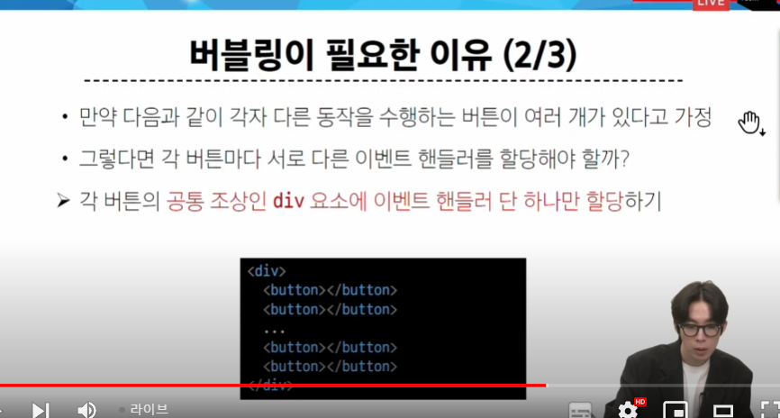

# Event

- 우리가 JS를 쓰는 이유는 특정 행위로 웹을 조작하기 위해서


## EVENT


> 이벤트가 발생하면 우린 그에 대한 처리를 할 수 있어야 함


### event handler


- 이벤트가 발생했을 때 실행되는 함수


#### .addEventListener()


```javascript
<body>
  <h1></h1>
  <button id="btn">클릭</button>
  <input type="text" id="text-input">

  <script>
    //1.버튼 선택
    // 버튼을 선택하는 것부터 시작
    const btn = document.querySelector("#btn")

    // 2.콜백 함수
    // 이건 콜백 함수가 너무 길어질 때
    const detectClick = function(event){
      console.log(event)
      console.log(this) // 메서드 호출 대상 -> btn
      console.log(event.currentTarget) // this와 가리키는게 똑같다
    }
    
    // 3. 버튼에 이벤트 핸들러를 부착
    btn.addEventListener('click',detectClick) // 여기서 부를거면 인자는 쓰지 않는다. 
    // {
    //   console.log(event)
    //   console.log(this) // 메서드 호출 대상 -> btn
    //   console.log(event.currentTarget) // this와 가리키는게 똑같다
    // })
  </script>
```


### 버블링


```html
<body>
  <form id="form">
    form
    <div id="div">
      div
      <p id="p">p</p>
    </div>
  </form>

  <script>
    const formElement = document.querySelector('#form')
    const divElement = document.querySelector('#div')
    const pElement = document.querySelector('#p')

    const clickHandler1 = function (event) {
      console.log('form이 클릭되었습니다.')
    }
    const clickHandler2 = function (event) {
      console.log('div가 클릭되었습니다.')
    }
    const clickHandler3 = function (event) {
      console.log('p가 클릭되었습니다.')
    }

    formElement.addEventListener('click', clickHandler1)
    divElement.addEventListener('click', clickHandler2)
    pElement.addEventListener('click', clickHandler3)
  </script>
</body>
```

> p 


> div


> form


> 하위를 누르면 상위에 있는 이벤트 핸들링까지 실행된다. 


> 그럼 하위/상위 말고 특정 값으로 접근하는 방법은 없을까?

> 타겟 속성을 변경


```html
<body>
  <div id="outerouter">
    outerouter
    <div id="outer">
      outer
      <div id="inner">inner</div>
    </div>
  </div>

  <script>
    const outerOuterElement = document.querySelector('#outerouter')
    const outerElement = document.querySelector('#outer')
    const innerElement = document.querySelector('#inner')

    const clickHandler = function (event) {
      console.log('currentTarget:', event.currentTarget.id) // 버블링
      console.log('target:', event.target.id) // 우리가 누르는 놈
    }

    outerOuterElement.addEventListener('click', clickHandler)
  </script>
</body>
```


> current target : eventhandling이 연결된 구간까지 계속해서 실행되다가 만나는 순간 멈춘다고 생각하면 된다. 

#### 캡쳐링 -> 버블링의 반대, 개발자가 직접 건들 일은 없음

#### 버블링이 필요한 이유




## event handler 활용


### 1. 버튼을 클릭하면/ 숫자를 1씩 증가해서/ 출력

```html
<!DOCTYPE html>
<html lang="en">

<head>
  <meta charset="UTF-8">
  <meta name="viewport" content="width=device-width, initial-scale=1.0">
  <title>Document</title>
</head>

<body>
  <button id="btn">버튼</button>
  <p>클릭횟수 : <span id="counter">0</span></p>

  <script>
    // 1. 버튼을 클릭하면 -> 버튼 선택
    
    const btn = document.querySelector("#btn")
    // console.log(btn)
    
    // 3. 초기값 선언
    let count = 0
    
    // 2. 이벤트 핸들러 부착

    btn.addEventListener("click",function(event){
      // 3.1 초기값 증가
      count += 1
      
      // 2.1 카운팅을 늘려야 한다? 카운트 할 요소 선택부터
      const spanTag = document.querySelector("#counter")

      // 2.2 카운트 할 요소 안에 숫자를 선택
      // const counterNumber = spanTag.textContent // 이게 0을 준거다. 
      spanTag.textContent = count
  

      // 3.2 증가된 숫자를 counterNumber에 재할당
      // counterNumber = count
      

    })

  </script>
</body>

</html>

```

### 2. 사용자가 입력하면/ 실시간으로 출력하기

- Input 이벤트 실행하기


- 이벤트가 뭘 감지할 것이냐
- 실시간 출력 - > p 태그 안에 이벤트안의 문자열을 대입

```html
<!DOCTYPE html>
<html lang="en">

<head>
  <meta charset="UTF-8">
  <meta name="viewport" content="width=device-width, initial-scale=1.0">
  <title>Document</title>
</head>

<body>
  <input type="text" id="text-input">
  <p></p>

  <script>
    // 3.2 p 태그 선택

    const pTag = document.querySelector("p")
    
    // 1. input 태크 선택
    const inputTag = document.querySelector('#text-input')
    

    // 2. 콜백함수
    // input 태그에 input 이벤트가 발생할 때마다 실행되는 코드

    const inputHandler = function(event){
      //3.1 사용자가 입력한 데이터가 어디에 있는지 찾기
      
      // console.log(event) // 뭘 조작해야하는지 확인해야하기 떄문에 이게 중요한거임
      // 우리는 값을 누적해야함
      // console.log(event.currentTarget) //이건 null 나옴. 아직 안 들어가서 그런거임. 당황하지 말고 아래꺼 봐라
      // console.log(this) // 속성이 끝없이 있는데...
      

      // console.log(event.currentTarget.value)
      // console.log(event.this.value) // 같음

      // 3.2 사용자 입력 데이터를 p 태그의 컨텐츠로 지정
      pTag.textContent = event.currentTarget.value
      
    }


    // 3. 선택한 input 태그에 이벤트 핸들러 부착
    inputTag.addEventListener("input",inputHandler)

  </script>
</body>


</html>

```


### 3. 2 + '+'버튼을 클릭하면/ 출력한 값의 css 스타일을 변경하기

```html
<!DOCTYPE html>
<html lang="en">

<head>
  <meta charset="UTF-8">
  <meta name="viewport" content="width=device-width, initial-scale=1.0">
  <title>Document</title>
  <style>
    .blue {
      color: blue;
    }
    /* 이 style을 js를 통해 넣어주면 된다. -> 저번 수업 */
  </style>
</head>

<body>
  <h1></h1>
  <button id="btn">클릭</button>
  <input type="text" id="text-input">

  <script>
    //1.버튼 선택
    // 버튼을 선택하는 것부터 시작
    const btn = document.querySelector("#btn")
    
    //0.1
    const inputTag = document.querySelector('#text-input')
    const h1Tag = document.querySelector("h1")

    // 2.콜백 함수
    // 이건 콜백 함수가 너무 길어질 때

    const inputHandler = function(event){
      h1Tag.textContent = event.currentTarget.value
    }    
    // 4. 버튼에 클릭 이벤에 반응하는 콜백함수
    const clickHandler = function(event){
      //4.1 클래스 목록에서 블루라는 클래스를 h1 태그에 넣는다
      // h1Tag.classList.add('blue')

      // 만약 또 눌렀을 때 없애고 싶으면?
      // if문을 써도 되지만 toggle로
      h1Tag.classList.toggle('blue')

    }
    // 3. 버튼에 이벤트 핸들러를 부착
    // btn.addEventListener('click',detectClick) // 여기서 부를거면 인자는 쓰지 않는다. 
    // {
    //   console.log(event)
    //   console.log(this) // 메서드 호출 대상 -> btn
    //   console.log(event.currentTarget) // this와 가리키는게 똑같다
    // })
    inputTag.addEventListener('input',inputHandler)

    // 5. 버튼 태그에 이벤트 핸들러 부착
    btn.addEventListener('click',clickHandler)
  </script>
</body>

</html>

```

### 4. todo 프로그램 구현

```html
<!DOCTYPE html>
<html lang="en">

<head>
  <meta charset="UTF-8">
  <meta name="viewport" content="width=device-width, initial-scale=1.0">
  <title>Document</title>
</head>

<body>
  <input type="text" class="input-text">
  <button id="btn">+</button>
  <ul></ul>

  <script>
    // ul 태그 안에 todo 목록들을 넣는다.

    // 1. 필요한 태그를 모두 선택

    const inputTag = document.querySelector(".input-text")
    const btn = document.querySelector(".btn")
    const ulTag = document.querySelector('.ul')


    // 2. 콜백 함수 addTodo 작성
    const addTodo = function(event){
      // 2.1 사용자 입력 데이터를 저장
      const inputData = inputTag.value

      // 3. 빈문자열 방지?
      if (inputData.trim()){ // trim은 양 옆 빈 문자열 제거
        
        // 2.2 ul 에 li 만들어서 넣기
        const liTag = document.createElement('li')
  
        // 2.3 생성한 li 태그에 텍스트 컨텐츠에 사용자 입력 값을 할당
        liTag.textContent = inputData
  
        // 2.4 완성한 li 태그를 ul 태그에 자식 요소로 추가
        ulTag.appendChild(liTag)
  
        // 2.5. input의 value를 비우기 -> 지저분하게 남아있지 않게
        inputTag.value = ''
      } else{
        window.alert('할 일을 입력하세요') // 경고창 띄우기
      }
      
    }
    // 3. btn에 클릭 이벤트 핸들러 부착
    btn.addEventListener('click',addTodo)
  </script>
</body>

</html>
```

### 5. 로또 번호 생성기 구현
13m

# offline

- 오늘은 queryselector()와 addeventlistner()만 알면 됨
- 다만 event 종류가 많아서 실습 풀기 어려움
- 당연히 다 외우는거 아님

- jquery -> $가 들어가는거. js에서 바로 사용은 못 함
- 챗지피티가 이걸로 알려주면 바닐라 버전으로 알려달라 해야함
- 예전엔 필수였지만 요즘은 좀 뒤쳐진 기술임

- 구글링을 자주 해야함
- js 마우스 휠 이벤트 같이

## 실습 3

- 팁) form 태그의 버튼은 자동으로 submit으로 들어간다

```html
<!DOCTYPE html>
<html lang="en">
<head>
  <title>Document</title>
  <!-- CSS only -->
  <link href="https://cdn.jsdelivr.net/npm/bootstrap@5.1.3/dist/css/bootstrap.min.css" rel="stylesheet" integrity="sha384-1BmE4kWBq78iYhFldvKuhfTAU6auU8tT94WrHftjDbrCEXSU1oBoqyl2QvZ6jIW3" crossorigin="anonymous">
</head>
<body>
  
  <div class="container">

    <form id="form" class="my-3">
      <div class="mb-3">
        <input type="text" class="form-control" id="title">
      </div>
      <div class="mb-3">
        <textarea class="form-control" id="content" rows="3"></textarea>
      </div>
      <div class="d-grid gap-2">
        <button class="btn btn-primary">add</button>
      </div>
    </form>
    
    <section id="cardsSection" class="row">
      
      <!-- 카드 예시 -->
      <!-- <article class="col-4">
        <div class="card m-1">
          <div class="card-body">
            <h5 class="card-title">Example</h5>
            <p class="card-text">Lorem ipsum dolor sit, amet consectetur adipisicing elit. Deleniti placeat odit rerum asperiores beatae vitae doloremque consectetur magni delectus, fuga autem laudantium, quidem iusto voluptates non earum dolorem totam dolores.</p>
          </div>  
        </div>
      </article> -->
      <!-- 카드 예시 -->
      
    </section>

  </div>

  <script>
    /* 
      사용자가 form 에 title과 content를 입력하고 submit하면, 예시와 같은 카드를 생성하여 div#cardSection에 추가하는 코드를 작성하시오.
      기능을 모두 구현하면 카드 예시 마크업은 주석처리 하거나 삭제한다.
    */
    
    // 1. form 태그를 통해서 데이터를 가져와야한다,.
    // form 태그 서브밋 호출 시 이벤트 등록
    // - form 태그 가져오기
    // - 이벤트 등록(카드 생성)

    const form = document.querySelector('#form')
    const section = document.querySelector('#cardsSection')

    // submit 이벤트 발생 시 로직 실행
    form.addEventListener('submit',function(event){
      // 데이터를 가져와서 카드를 만들어주면 된다. 
      const title = document.querySelector("#title")
      const content = document.querySelector("#content")

      // 선택된 요소로 카드 생성
      // 카드 예시에서 확인
      // <article class="col-4">
      //   <div class="card m-1">
      //     <div class="card-body">
      //       <h5 class="card-title">Example</h5>
      //       <p class="card-text">Lorem ipsum dolor sit, amet consectetur adipisicing elit. Deleniti placeat odit rerum asperiores beatae vitae doloremque consectetur magni delectus, fuga autem laudantium, quidem iusto voluptates non earum dolorem totam dolores.</p>
      //     </div>  
      //   </div>
      // </article>

      // 요소 만들고 클래스 추가

      const article = document.createElement('article')
      article.classList.add("col-4")
      // 추가할 땐 add , 삭제할 땐 remove, 껐다 켰다 할 때는 toggle

      const card = document.createElement('div')
      card.classList.add("card","m-1")

      const cardBody = document.createElement('div')
      cardBody.classList.add("card-body")

      const cardTitle = document.createElement('h5')
      cardTitle.classList.add('card-title')
      // 내용 넣기
      cardTitle.innerText = title.value // innerText는  <p> ' ' </p> 에서 ' '에 들어갈 내용을 넣어주는거

      const cardText = document.createElement('p')
      cardText.classList.add('card-text')
      cardText.innerText = content.value 
      
      // 계층 구조 -> appendChild
      cardBody.appendChild(cardTitle)
      cardBody.appendChild(cardText)
      card.appendChild(cardBody)
      article.appendChild(card)

      // 이렇게만 하면 아직 안 나옴
      
      
      // 1. article을 생성하고 section 태그 안에 안 넣어줌
      // const cardSection = document.querySelector("cardSection")
      section.appendChild(article) // 이제 화면에는 보인다. 근데 보였다가 사라짐.

      // why? 
      // 2. preventDefault -> 수업 내용
      title.value = ''
      content.value = ''
      event.preventDefault() // 웬만하면 디버깅을 위해 얘를 위로 올려라.
      // 얘는 새로고침을 막아주는 역할 -> 디버깅에도 간편함

    })


  </script>
</body>
</html>
```


## 실습 4


```html
<!DOCTYPE html>
<html lang="ko">
<head>
  <meta charset="UTF-8">
  <meta name="viewport" content="width=device-width, initial-scale=1.0">
  <meta http-equiv="X-UA-Compatible" content="ie=edge">
  <link rel="stylesheet" href="https://stackpath.bootstrapcdn.com/bootstrap/4.3.1/css/bootstrap.min.css" integrity="sha384-ggOyR0iXCbMQv3Xipma34MD+dH/1fQ784/j6cY/iJTQUOhcWr7x9JvoRxT2MZw1T" crossorigin="anonymous">
  <title>momentum</title>
  <style>
    html,
    body {
      width: 100%;
      height: 100%;
      margin: 0;
			background-size: cover;
      background-position: center;
    }
    .parent {
      height: 100%;
    }
    #time {
      font-size: 5rem;
			padding: 0 2rem;
      background-color: rgba(0, 0, 0, 0.2);
      border-radius: 10px;
    }
    .row {
      margin: 0;
    }
  </style>
</head>

<body>
  <div class="parent row justify-content-center align-items-center">
    <div id="time" class="font-weight-bold text-light"></div>
  </div>

  <script src="https://cdn.jsdelivr.net/npm/lodash@4.17.21/lodash.min.js"></script>
  <script>
    /* 
      div#time의 내부 content가 매 초마다 갱신되어 
      화면에 출력될 수 있도록 formatTime 함수를 완성하시오.
    */
    
    // lodash 를 활용하여 1.jpg ~ 6.jpg 중 하나의 경로로 body의 backgroundImage url을 설정
    // hint
    
      const num = _.sample([1,2,3,4,5,6])
      console.log(num)
      // const random_num = _.sampleSize(numbers,1)
      // console.log(num)
      // 배경화면 style.backgroundImage
      // 1. jpg
      document.body.style.backgroundImage = `url(./${num}.jpg)`
    
      
      const timeDiv = document.querySelector('#time')
      const formatTime = function () {
        // 아래 now를 활용하여 timeDiv의 innerText를 적절하게 re-format
        const now = new Date()
        let hours = now.getHours()
        let minitues = now.getMinutes()
        let seconds = now.getSeconds()
        let ampm = '오전'

        if(hours > 12){
          hours -= 12
          ampm = '오후'
        }
        
        if(hours == 12){
          ampm = '오후'
        }
        
        if (seconds < 10){
          seconds = '0' + seconds
        }

        if (minitues < 10){
          minitues = '0' + minitues
        }

        timeDiv.innerText = ampm+' ' + hours + ":" + minitues + ":" + seconds
    }
    
    // 1초에 한번 formatTime 함수 실행
    setInterval(formatTime, 1000)
  </script>
  <script src="https://cdn.jsdelivr.net/npm/bootstrap@5.1.3/dist/js/bootstrap.bundle.min.js" integrity="sha384-ka7Sk0Gln4gmtz2MlQnikT1wXgYsOg+OMhuP+IlRH9sENBO0LRn5q+8nbTov4+1p" crossorigin="anonymous"></script>
</body>

</html>

```

#### 자바스크립트 두더쥐게임 구현해봐라