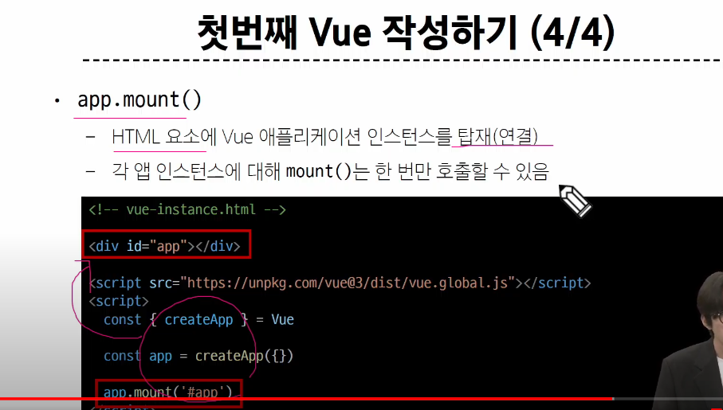

# 01_Introduction of Vue

## Index

- Frontend Development
- Vue
- Vue Tutorial

## Frontend Development

### Client-side Frameworks

- 클라이언트 측에서 사용하는 프레임워크


### SPA

- Single Page Application
- 단일 페이지로 구성된 애플리케이션
- 페이지 한 개를 두고 지속적으로 쓰고 지우고를 반복하는 것


- CSR? 


> '클라이언트에서'

템플릿은 서버가 화면을 그린것, 여기서부턴 재료를 서버로부터 받아서 클라이언트가 그리는 것

백엔드는 재료를 서버가 주도록 하고, 프론트엔드는 이걸 토대로 화면을 그린다.


> 장점?


> 단점?


#### 반대개념


## VUE

> 목적 : 사용자 인터페이스 제작

#### Vue를 사용하는 방법?

1. CDN 사용 - 일단 이걸로
2. 노드를 통해서 설치

> <script src="https://unpkg.com/vue@3/dist/vue.global.js"></script>


```html
<!DOCTYPE html>
<html lang="en">

<head>
  <meta charset="UTF-8">
  <meta name="viewport" content="width=device-width, initial-scale=1.0">
  <title>Document</title>
</head>

<body>
  <div id="app">
    <h1>{{ message }}</h1>
    <button @click = "count++">카운팅 : {{count}}</button>
  </div>

  <script src="https://unpkg.com/vue@3/dist/vue.global.js"></script>

  <script>
    // 1) vue와 어느 부분을 연결할지 정한다.
    const {createApp,ref} = Vue // 구조 분해 할당

    const app = createApp({
      // setup = function (){

      // }
      // setup에서 리턴하는게 연결된 애들한테 쓸 수 있는 애들이다
      setup(){
        const message = ref('Hello Vue!')
        
        const count = ref(0)

        return {
          // message : message
          message, // 이렇게 써도 된다.(객체 단축, js 문법)
          count
        }//객체를 리턴한다.여기서 리턴하는게 아래 영역에서 쓸 수 있는 애들
      }
    })
    app.mount('#app') // 이게 연결하는 것, 위의 div가 이제 연결되었다.  // 이 밖의 영역은 vue의 영역이 아니다. 
  </script>
</body>

</html>

```


### Vue Tutorial




> mount는 딱 한 번만

### ref()


- 결국 실시간 변화하는 변수를 만들 수 있는 함수


### Vue 기본 구조


```html
  <div id="app">
    <button></button>
  </div>

  <script src="https://unpkg.com/vue@3/dist/vue.global.js"></script>
  <script>

    const {createApp} = Vue

    const app = createApp({
      setup(){

        return {}
      }
    })

    app.mount('#app')
  </script>

```

### 템플릿 렌더링


### Event Listener in Vue -'v-on'

```html
<!DOCTYPE html>
<html lang="en">

<head>
  <meta charset="UTF-8">
  <meta name="viewport" content="width=device-width, initial-scale=1.0">
  <title>Document</title>
</head>

<body>
  <div id="app">
    <button v-on:click = 'increment'>카운트 : {{count}}</button>
  </div>

  <script src="https://unpkg.com/vue@3/dist/vue.global.js"></script>
  <script>

    const {createApp,ref} = Vue

    const app = createApp({
      setup(){
        count = ref(0)
        const increment = function(){
          // count ++ // 주의!!!!! 이건 ref 객체. 이 문법 자체가 말이 안 된다.
          count.value++
        }
        return {
          count,
          increment//주의!!!!!!!!!!!!!!
        }
      }
    })

    app.mount('#app')
  </script>


</body>

</html>

```


## 참고

### Ref Unwrap 주의사항

- ref 객체는 ref가 최상위 속성인 경우에만 적용 가능


- 한 번만 풀려야 된다.


> 이게 가장 권장된다.

> ref 객체가 필요한 이유?


- 결국 참조 자료형 -> 객체 -> 반응형 -> ref


### 반응형 변수 vs 일반 변수

```html
<!DOCTYPE html>
<html lang="en">

<head>
  <meta charset="UTF-8">
  <meta name="viewport" content="width=device-width, initial-scale=1.0">
  <title>Document</title>
</head>

<body>
  <div id="app">
    <p>반응형 변수: {{refValue}} </p>
    <p>일반 변수: {{normalValue}} </p>
    <button v-on:click = 'increment'>값 업데이트</button>
  </div>

  <script src="https://unpkg.com/vue@3/dist/vue.global.js"></script>
  <script>
    const { createApp, ref } = Vue

    const app = createApp({
      setup() {

        // 일반 변수
        // const normalValue = 0
        let normalValue = 0

        // 반응형 변수
        const refValue = ref(0)
        
        const increment = function(){
          normalValue++ // 여기서 오류가 생긴다.
          // const라서 재할당 불가능. 
          refValue.value++
          // 얘는 객체 자체가 바뀌는게 아니다. 그래서 그냥 변경 가능

          // 근데 그래도 일반 변수는 변경 x, click을 추적 불가
        }
        return {
          normalValue,
          refValue,
          increment
        }
      }
    })

    app.mount('#app')
  </script>
</body>

</html>

```


> vue를 써도 일반 변수를 써도 된다. 다만 반응형 쓰고 싶으면 ref 함수 써라

```js
const refArray = ref([1,2,3,4,5])

// refArray.push(1) // value 생각

refArray.value.push(1)
```

### SEO 


### CSR & SSR

> 흑백 개념이 아니다!


# Off-line


- Vue도 우리 생각보다 훨씬 많이 쓰인다.
- 대표적으로 카카오
- 하지만 리액트가 압도적이긴 하다.
- vue derective 검색하면 추가 공부 가능