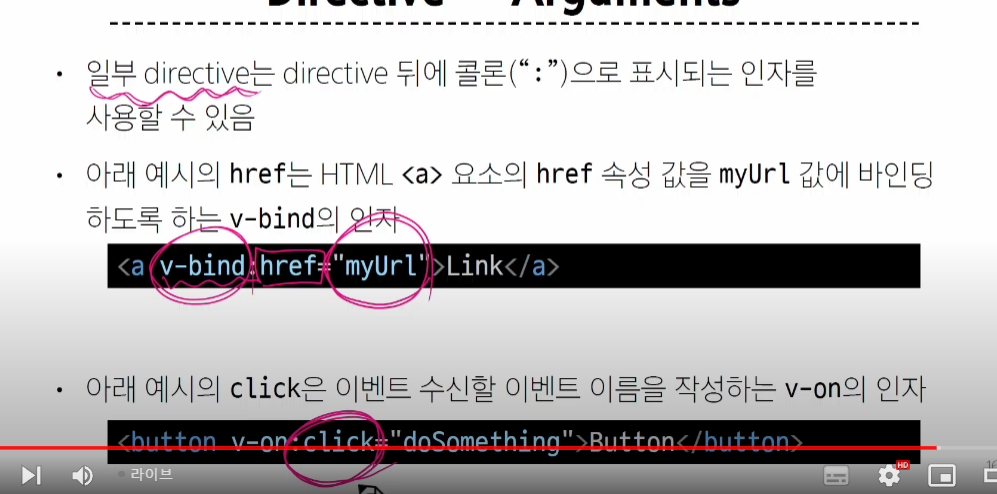

# Basic Syntax


## Template Syntax


- bind -> 연결
- {{}} 사용 가능
- 반응형 변수와 실제 값을 연결


1. Text Intrepolation = {{}}


2. Raw Html


3. 속성 바이딩


4. JS 표현


### Directive

- 'v-' 접두사가 있는 특수속성


#### Directive - argument



#### Modifiers


> 이제 directive 구체적으로 뭐가 있는지
### Dynamically data binding : 동적 데이터 연결

#### v-bind

- 하나 이상의 속성 또는 컴포넌트(Vue 인스턴스) 데이터를 표현식에 동적으로 바인딩


1. attribute (속성) 바인딩


```html
<body>
  <div id="app">
     
    <!-- 속성과 vue의 연결 -->
     
    <!-- v-bind의 생략 구문 -->

    <a v-bind:href="myUrl">이동!!</a>
    <a :href="myUrl">이동!!</a>


  </div>

  <script src="https://unpkg.com/vue@3/dist/vue.global.js"></script>
  <script>
    const { createApp, ref } = Vue

    const app = createApp({
      setup() {
        const imageSrc = ref('https://picsum.photos/200')
        const myUrl = ref('https://www.google.co.kr/')
        const dynamicattr = ref('title')
        const dynamicValue = ref('Hello Vue.js')
        return {
          imageSrc,
          myUrl,
          dynamicattr,
          dynamicValue
        }
      }
    })

    app.mount('#app')
  </script>
</body>
```


> [] 안에 있는 속성 명은 무조건 소문자로만 써야한다. 


### class and style bindings > 좀 중요함


1. Class


```html
<!DOCTYPE html>
<html lang="en">

<head>
  <meta charset="UTF-8">
  <meta name="viewport" content="width=device-width, initial-scale=1.0">
  <title>Document</title>
  <style>
    .active {
      color: crimson;
    }

    .text-primary {
      color: blue;
    }
  </style>
</head>

<body>
  <div id="app">

    <!-- Binding to Objects -->
    <div v-bind:class="{active}">Text</div>
    <div v-bind:class="{active:isActive}">Text</div>
    <!-- <div :class="{active:isActive}">Text</div> -->
    <div class="static" :class = "{active : isActive,'text-primary':hasInfo}">Text</div>
    <!-- 왜 active는 그냥 쓰는데 'text-primary'는 문자열? 자바스크립트에서 오브젝트의 키를 쓸 때 문자열의 ''를 생략할 수 있는데, text-primary같이 한 단어가 아니면 불가능 -->
    <div class="static" :class = "classObj">Text</div>
    <!-- 똑같음 -->


    <div class="static">Text</div>

    <!-- Binding to Arrays : 배열 형태로 넣기 -->
    <div :class="[activeClass,infoClass]">Text</div>
    <div :class="[{active:isActive},infoClass]">Text</div>

  </div>

  <script src="https://unpkg.com/vue@3/dist/vue.global.js"></script>
  <script>
    const { createApp, ref } = Vue

    const app = createApp({
      setup() {
        const isActive = ref(false)
        const hasInfo = ref(true)
        const classObj = ref({
          actice : isActive,
          'text-primary': hasInfo
        })
        const activeClass = ref('active')
        const infoClass = ref('text-primary')
        return {
          isActive,
          hasInfo,
          classObj
        }
      }
    })

    app.mount('#app')
  </script>
</body>

</html>
```


# offline

- 바인딩? 
  - 우리의 자바스크립트 코드를 바디에 출력하도록 해주는것.(단방향 바인딩) : v-bind
  -  양방향 : input tag 같은거. 페이지에서 값이 바뀌면 vue 안에 있는 값도 값이 바뀌어야 함.  v-model 사용

```html

<!DOCTYPE html>
<html lang="en">
<head>
    <meta charset="UTF-8">
    <meta name="viewport" content="width=device-width, initial-scale=1.0">
    <title>Document</title>
    <style>
        .red{
            color:red;
        }
    </style>
</head>
<body>


    <div id="app">
        <p>{{content}}</p> 
        <!-- 이거 새로고침 계속 하면 {{content}}라는 말이 test보다 먼저 나와버린다. why? 코드 자체가 위에서부터 처리해서 -->
        <input type="text" v-model = 'content'>
        <!-- script로 바로 값이 간다.  -->
        <input type="text" v-bind:value ='content'>
        <!-- 여기서 script로 값이 가지 않는다 -->
        
        <hr>

        <input type="checkbox" v-model="isRed">
        <!-- 양방향이라 얘가 isRed값에 영향을 준다 -->
        <p :class="{red:isRed}" >{{content}}</p>
        <!-- isRed값에 따라서 red의 여부가 결정된다. -->

    </div>


    <script src="https://unpkg.com/vue@3/dist/vue.global.js"></script>

    <script>
        const { createApp,ref } = Vue

        const app = createApp({
            // 객체의 생성자와 비슷. 파이썬의 __init__ 함수 같은거임 
            setup() {
                const content = ref("test") //이래야 페이지에서 바뀐걸 화면에 반영함
                const content2 = "test"
                // 차이? 반응형 변수의 여부
                 
                const isRed = ref(true)

                return {
                    content,
                    isRed
                }

            }
        })//.mount('#app') 여기다가 바로 써도 된다.
        app.mount('#app') // 이게 뷰와 html을 연결히ㅏ는 역할을 한다. 
    </script>
</body>
</html>
```
```html
<!DOCTYPE html>
<html lang="en">
<head>
  <meta charset="UTF-8">
  <meta name="viewport" content="width=device-width, initial-scale=1.0">
  <title>Document</title>
  <style>
    .is-selected {
      background-color: #eee;
    }

    .is-required {
      color: red;
    }
  </style>
</head>
<body>
  <div id="app">
    <h1>다양한 전시 정보</h1>
    <hr>
    <ul>
      <!-- <li id="{{info.enTitle}}"> -->
        <!-- 이런 식으로 쓰면 안된다.-->
        <li :id="info.enTitle" :class="{'is-selected':info.isSelected}"> 
          <!-- id는 자바스크립트 변수값이란걸 명시하기 위해 콧수염기호가 아니라 이런 식으로 쓴다.  -->
          <!-- 왜?????????????????????????????????-->
          <!-- 속성이나 모델은 바인드 기호 -->
          <label for="isSelected">전시 선택</label>
          <input type="checkbox" v-model="info.isSelected" id="isSelected">
        <h3>{{info.koTitle}}</h3>
        <!-- 일반 출력은 콧수염 기호 -->
        <p v-html="info.description">
          <!-- 우리가 쓴게 html요소라는 의미가 v-html -->
        </p>
        <hr>
        <p>입장권 구매하기</p>
        <div>
          <span>인원 수 : {{info.number}} 명 </span>

          <!-- v-on: => @로 축약 가능 -->
          <button @click = 'decreaseNum' :disabled="info.number <=0 ">-</button>
          <!-- 결국 뒤에 조건이 true냐 false냐만 판단할 수 있으면 앞에꺼의 적용 여부를 결정할 수 있다. -->
          <button @click = 'increaseNum' :disabled="info.number >= 10">+</button>
        </div>
        <p :class="{'is-required':info.number > 0 }">총 입장료 : {{info.totalMoney}}원</p>
        <hr>
      </li>
    </ul>
  </div>
  <script src="https://unpkg.com/vue@3/dist/vue.global.js"></script>
  <script>
    /*
      - Vue3 CDN을 사용한다.
        1. 새로운 app instance를 생성하여 아이디가 app인 container에 mount 하시오.
        2. 제시된 각 전시 정보들을 각각의 변수에 할당한다.
          - koTitle : 모네 인사이드
          - enTitle : monet-inside
          - artMuseum : 예술의 전당
          - museumURL : 'https://www.sac.or.kr/'
          - description : <p> &lt;모네 인사이드&gt; 는 빛의 화가 <b>클로드 모네</b>가 남긴 소중한 명작들을 현대적 감각으로 재해석해 음악과 함께 감상하는 미디어아트 전시입니다. </p>
        3. 각 객체들을 li태그에서 렌더링 될 수 있도록 directive를 사용한다.
          - 미리 작성된 li태그 예시를 참고하여 렌더링한다.
          - 전시 정보 중, enTitle은 li태그의 id에 할당한다.
          - 전시 정보 중, 전시장 url은 a 태그의 href에 할당한다.
    */

    const {createApp,ref}=Vue

    createApp({
      setup(){
        const money = ref(1000)
        const info = ref({
          enTitle : 'monet-inside',
          koTitle : '모네인사이드',
          enTitle:'예술의 전당',
          museumURL:'https://www.sac.or.kr/',
          description:'<p>&lt모네 인사이드&gt;는 <b>클로드 모네</b>가 남긴 소중한 명작들을 현대적 감각으로 재해석해 음악과 함께 감상하는 미디어아트 전시입니다.',
          number: 0,
          totalMoney: 0,
          money:1000,
          // totalMoney: money.value*number.value,
          isSelected:false,
          })
          const totalMoney = ref(info.value.number*money.value)
          // number와 totalMoney는 ref 객체 안에 들어있다 -> info.value.number로 접근해야 한다!!!
          const decreaseNum = function(){
            // if(info.value.number>0){
            info.value.number -= 1
            info.value.totalMoney = info.value.number*info.value.money
          // }
          }
          const increaseNum = function(){
            info.value.number += 1
            info.value.totalMoney = info.value.number*info.value.money
          }


        return {info,
          
        decreaseNum,
      increaseNum,
      
    }
      }

    }).mount('#app')
  </script>
</body>
</html>

```