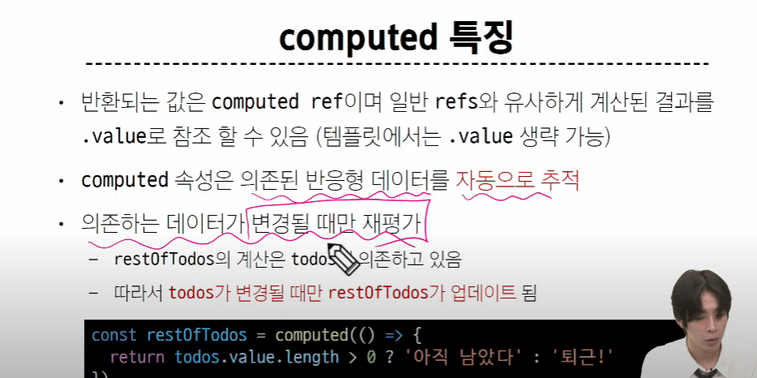

## computed properties

- 계산된 속성

### computed


- 불필요한 반복 연산 줄이기


> 굳이 매번 todos 길이를 구하는 메서드를 부르지 말고, 변할 때만 계산하자!

```html
<!DOCTYPE html>
<html lang="en">

<head>
  <meta charset="UTF-8">
  <meta name="viewport" content="width=device-width, initial-scale=1.0">
  <title>Document</title>
</head>

<body>
  <div id="app">
    <h2>남은 할 일</h2>
    <!-- <p>{{ todos.length > 0 ? '아직 남았다' : '퇴근!' }}</p> -->
    <p>{{restOfTodos}}</p>
  </div>

  <script src="https://unpkg.com/vue@3/dist/vue.global.js"></script>
  <script>
    const { createApp, ref, computed } = Vue

    const app = createApp({
      setup() {
        const todos = ref([
          { text: 'Vue 실습' },
          { text: '자격증 공부' },
          { text: 'TIL 작성' }
        ])

        const restOfTodos = computed(()=>{
          return todos.value.length > 0 ? '아직 남았다' : '퇴근!'//여긴 value가 들어가야지. ref 객체니깐. 
        })
        //=> 이거 자체가 computed 'ref'객체임. => 값을 사용하려면 .value 써야함

        // Write operation failed: computed value is readonly
        // const a = ref(0)
        // const b = computed(() => {
        //   return a.value + 1
        // })
        // console.log(b.value++)

        return {
          todos,
          restOfTodos,
        }
      }
    })

    app.mount('#app')
  </script>
</body>

</html>
```

> computed의 가장 큰 특징 -> 반응형 객체를 자동으로 추적한다!
>
> 누군가에게 의존하여 그 값을 추적한다. 여기선 todos에 의존하는 것
>
> 그 의존 데이터가 변경 될 때만 재평가!!!





#### computed vs method


## Conditional Rendering

### v-if

- true냐 false냐에 따라 화면에 나타내는 여부를 결정함


### v-if vs v-show


- On/Off의 개념
- 일단 그리고(렌더링) false면 안 보이게 가리는 것 -> 개발자 도구 보면 존재는 함. 그런데 display:none으로 가려져있음
- v-if는 아예 그리는거 조차 안 함


+) v-show는 추가 조건을 걸 수는 없음
```html
<!DOCTYPE html>
<html lang="en">

<head>
  <meta charset="UTF-8">
  <meta name="viewport" content="width=device-width, initial-scale=1.0">
  <title>Document</title>
</head>

<body>
  <div id="app">
    <!-- if else -->
    <p v-if="isSeen">true일때 보여요</p>
    <p v-else>false일때 보여요</p>
    <button @click="isSeen=!isSeen">토글</button>

    <!-- else if -->
    <div v-if="name==='Alice'">Alice입니다</div>
    <div v-else-if="name==='Bella'">Bella입니다</div>
    <div v-else-if="name ==='Cathy'">Cathy입니다</div>
    <div v-else>아무도 아닙니다.</div>

    <!-- v-if on <template> -->
    <!-- 여러 요소에 대한 v-if -->
    <template v-if="name==='Cathy'">
      <div>Cathy입니다</div>
      <div>나이는 30살입니다</div>
    </template>
    <!-- 실제로 개발자 도구 들어가보면 template 태그는 렌더링 되지 않는다. -->

    <!-- v-show -->
    <div v-show="isShow">v-show</div>
  </div>

  <script src="https://unpkg.com/vue@3/dist/vue.global.js"></script>
  <script>
    const { createApp, ref } = Vue

    const app = createApp({
      setup() {
        const isSeen = ref(true)
        const name = ref('Cathy')
        const isShow = ref(false)

        return {
          isSeen,
          name,
          isShow
        }
      }
    })

    app.mount('#app')
  </script>
</body>

</html>

```

## List Rendering

### v-for


- 소스 데이터? 반복 가능한거


- 파이썬 반복구조랑 똑같이 생김


```html
<!DOCTYPE html>
<html lang="en">

<head>
  <meta charset="UTF-8">
  <meta name="viewport" content="width=device-width, initial-scale=1.0">
  <title>Document</title>
</head>

<body>

  <!-- 기본적인 v-for -->
  <div id="app">
    <div v-for="(item,index) in myArr">
      <!-- 만약 요소랑 인덱스랑 같이 뽑아내고 싶으면 이 순서는 바꿀 수 없다. -->
      {{index}}/{{item}}
    </div>
    <!-- 과연 값만 반복될까 아니면 div까지 반복될까 -->
    <!-- v-for가 붙은 div가 하나씩 만들어진다.  -->


    <div v-for="(value,key,index) in myObj">
      {{index}} / {{key}} / {{value}}
    </div>

    <!-- v-for on <template> -->
      <!-- 여러 요소에 대한 v-for -->
    <ul>
      <template v-for="item in myArr">
        <li>{{item.name}}</li>
        <li>{{item.age}}</li>
        <hr>
      </template>
    </ul>

    <!-- nested v-for -->
    <!-- 중첩 for문 -->
    <ul v-for="info in myInfo">
      <li v-for="friend in info.friends">
        {{info.name}}의 친구들 - {{friend}}
      </li>
    </ul>

  </div>

  <script src="https://unpkg.com/vue@3/dist/vue.global.js"></script>
  <script>
    const { createApp, ref } = Vue

    const app = createApp({
      setup() {
        const myArr = ref([
          { name: 'Alice', age: 20 },
          { name: 'Bella', age: 21 }
        ])
        const myObj = ref({
          name: 'Cathy',
          age: 30
        })

        // nested v-for
        // 이중for문 용 -> 중첩 형태
        const myInfo = ref([
          { name: 'Alice', age: 20, friends: ['Bella', 'Cathy', 'Dan'] },
          { name: 'Bella', age: 21, friends: ['Alice', 'Cathy'] }
        ])

        return {
          myArr,
          myObj,
          myInfo
        }
      }
    })

    app.mount('#app')
  </script>
</body>

</html>
```


#### v-for with key


> 우리를 위해 쓰는게 아니라 vue를 위해 쓰는거임.
>
> 앞으로 for문 쓸 떄 무조건 key를 만들어라


```html
<!DOCTYPE html>
<html lang="en">

<head>
  <meta charset="UTF-8">
  <meta name="viewport" content="width=device-width, initial-scale=1.0">
  <title>Document</title>
</head>

<body>
  <div id="app">
    <div v-for="item in items" :key="item.id"> 
      <!-- 반복되는 요소들을 위해 하나하나 고유한 키를 넣는다.  -->
      <!-- content -->
      <p>{{item}}</p>
    </div>
  </div>

  <script src="https://unpkg.com/vue@3/dist/vue.global.js"></script>
  <script>
    const { createApp, ref, computed } = Vue

    const app = createApp({
      setup() {
        let id = 0

        const items = ref([
          { id: id++, name: 'Alice' },
          { id: id++, name: 'Bella' },
        ])

        return { items }
      }
    })

    app.mount('#app')
  </script>
</body>

</html>

```

### v-for with v-if


```html
<!DOCTYPE html>
<html lang="en">

<head>
  <meta charset="UTF-8">
  <meta name="viewport" content="width=device-width, initial-scale=1.0">
  <title>Document</title>
</head>

<body>
  <div id="app">
    <!-- [Bad] v-for with v-if -->
    <ul v-for="todo in todos" v-if="todo.isComplete === false" :key="todo.id">
      <!-- 이러면 todo를 if에서 읽을 수 없다. if가 for문보다 먼저 실행되므로 if문이 실행될 시점엔 todo가 존재하지 않는다. -->
      <li>
        {{todo.name}}
      </li>
    </ul>

    <!-- [Good 1] v-for with v-if (computed)-->
    <!-- computed를 활용해서 문제 해결 -->
    <!-- computed로 완료되지 않은 todo를 계산해서 넣는다 -->
    <!-- 그렇다면 더는 if문을 쓸 필요가 없음 -->
    <ul>
      <li v-for="todo in completeTodos" :key="todo.id">
        {{todo.name}}
      </li>
    </ul>

    <!-- [Good 2] v-for with v-if -->
    <!-- 결국 핵심은 li가 반복되는것 -->
    <!-- -> 해당 리스트를 template으로 묶는다 -->
    <ul>
      <template v-for="todo in todos" :key="todo.id">
        <li v-if="todos.isComplete === false">
          {{todo.name}}
        </li>
      </template>
    </ul>
  </div>

  <script src="https://unpkg.com/vue@3/dist/vue.global.js"></script>
  <script>
    const { createApp, ref, computed } = Vue

    const app = createApp({
      setup() {
        let id = 0

        const todos = ref([
          { id: id++, name: '복습', isComplete: true },
          { id: id++, name: '예습', isComplete: false },
          { id: id++, name: '저녁식사', isComplete: true },
          { id: id++, name: '노래방', isComplete: false }
        ])

        const completeTodos = computed(() => {
          return todos.value.filter((todo) => !todo.isComplete)//todo가 false인 애들을 뱉어내는거
        })

        return {
          todos,
          completeTodos
        }
      }
    })

    app.mount('#app')
  </script>
</body>

</html>

```


> 정리
>
> 반드시 해야하는것?
> 
> 1. v-for + key
> 
> 2. v-if와 v-for는 함께 쓰지 마라

## watchers

### watch


- computed와 비슷
- 다만 얘는 여러개를 본다


> 버튼 눌러서 1씩 올라가는걸 감시


```html
<!DOCTYPE html>
<html lang="en">

<head>
  <meta charset="UTF-8">
  <meta name="viewport" content="width=device-width, initial-scale=1.0">
  <title>Document</title>
</head>

<body>
  <div id="app">
    <!-- 1 -->
    <button @click="count++">Add 1</button>
    <p>Count: {{ count }}</p>

    <!-- 2 -->
    <input v-model="message">
    <p>Message length: {{ messageLength }}</p>
  </div>

  <script src="https://unpkg.com/vue@3/dist/vue.global.js"></script>
  <script>
    const { createApp, ref, watch } = Vue

    const app = createApp({
      setup() {
        const count = ref(0)
        const message = ref('')
        const messageLength = ref(0)

        // 얘는 따로 변수에 담지 않는다.
        watch(count, (newValue,oldValue)=>{
          console.log(`변화된 값 ${newValue}/변하기 전 값:${oldValue}`)
        })

        watch(message,(newValue)=>{
          messageLength.value = newValue.length
        })

        return {
          count,
          message,
          messageLength
        }
      }
    })

    app.mount('#app')
  </script>
</body>

</html>

```
### computed vs watchers

- 사실 감시 말고는 아예 다른 용도임


> 주의 : 둘 다 원본 데이터를 직접 변경하지 않는다. 
>
> 그래서 computed를 '읽기 전용 속성'이라고도 함

```JS
 // Write operation failed: computed value is readonly
        const a = ref(0)
        const b = computed(() => {
          return a.value + 1
          // computed가 직접 값을 변경한다? 이럼 오류남
        })
        console.log(b.value++)
```

## Lifecycle Hooks

- hook? 걸다. 


- Vue 인스턴스? app 같은거


- 특정 생애주기 시점에 함수를 실행할 수 있도록 '걸어두는' 것
- 생애주기의 특정 시점 자체를 이벤트로 만들어서 axios로 보낼 수 있다!


- 빨간색이 다 타이밍의 함수들
- 이건 공식 문서에도 있다.

### 1. onMounted

- 초기 렌더링 타이밍

### 2.  onUpdated

- mounted 이후 무언가 수정되서 다시 렌더링 된 이후

```html
<!DOCTYPE html>
<html lang="en">

<head>
  <meta charset="UTF-8">
  <meta name="viewport" content="width=device-width, initial-scale=1.0">
  <title>Document</title>
</head>

<body>
  <div id="app">
    <button @click="count++">Add 1</button>
    <p>Count: {{ count }}</p>
    <p>{{ message }}</p>
  </div>

  <script src="https://unpkg.com/vue@3/dist/vue.global.js"></script>
  <script>
    const { createApp, ref, onMounted,onUpdated } = Vue

    const app = createApp({
      setup() {
        const count = ref(0)
        const message = ref(null)

        // 처음 렌더링 될 때
        onMounted(()=>{
          console.log('mounted')
        })
        
        // 무언가 수정되서 다시 렌더링될 때
        onUpdated(()=>{
          console.log('updated')
        })
        // 이 함수는 우리가 가져가서 실행하는게 아니라 자동으로 해당 시점에서 실행되는거임.
        return {
          count,
          message
        }
      },
    })

    app.mount('#app')

  </script>
</body>

</html>

```

> 주의 : 얘네 자체를 어딘가의 콜백 함수로 쓰면 안 된다. 정해진 타이밍에 실행되는 것이기 때문에 동기적 형태가 되면 안됨. 무조건 비동기


> 응용

```html
<!DOCTYPE html>
<html lang="en">

<head>
  <meta charset="UTF-8">
  <meta name="viewport" content="width=device-width, initial-scale=1.0">
  <title>Document</title>
</head>

<!-- lifecycle 응용 -->
<body>
  <div id="app">
    <button @click="getCatImage">냥냥펀치</button>
  </div>

  <script src="https://cdn.jsdelivr.net/npm/axios/dist/axios.min.js"></script>
  <script src="https://unpkg.com/vue@3/dist/vue.global.js"></script>
  <script>
    const { createApp, ref,onMounted } = Vue
    const URL = 'https://api.thecatapi.com/v1/images/search'

    const app = createApp({
      setup() {

        // 원래 기존 axios는 특정 신호를 보내지 않으면 시작할 때 동작을 하지 못 했음

        // 이제 가능하네?

        onMounted(()=>{
          getCatImage()
        })

        const getCatImage = function () {
          axios({
            method: 'get',
            url: URL,
          })
            .then((response) => {
              imgUrl = response.data[0].url
              return imgUrl
            })
            .then((imgData) => {
              imgElem = document.createElement('img')
              imgElem.setAttribute('src', imgData)
              document.body.appendChild(imgElem)
            })
            .catch((error) => {
              console.log('실패했다옹')
            })
        }

        return { getCatImage }
      }
    })

    app.mount('#app')
  </script>
</body>

</html>

```

## 참고

### Vue Style Guide


#### 반드시 해야한다? A단계

- v-for에 key 사용하기
- v-if와 v-for를 함께 사용하지 않기

### 주의 : computed의 반환 값은 변경하지 말 것


- 사실 이것도 얕은 복사긴 함

### 배열과 v-for 관련

- v-for과 배열을 함께 사용시 배열의 메서드를 주의해서 사용해야 함
- 돌고있는 소스가 바뀌어버리면 머리 아파진다. 

```html
<div v-for="i in list">
    이 안에서 원본인 list를 바꾸면 안 된다.
    </div>
```


#### v-for와 배열을 활용해 '필터링/정렬' 활용하기

- 원본 데이터를 수정하거나 교체하지 않고 필터링하거나 정렬된 새로운 데이터를 표시하는 방법
  - 1. computed 활용
  - 2. method 활용(computed가 불가능한 중첩된 v-for의 경우 사용)


```html
<!DOCTYPE html>
<html lang="en">

<head>
  <meta charset="UTF-8">
  <meta name="viewport" content="width=device-width, initial-scale=1.0">
  <title>Document</title>
</head>

<body>
  <div id="app">
    <!-- 필터링/정렬 결과 표시하기 -->
    <!-- 1. computed 활용 -->
    <ul>
      <li v-for="num in evenNumbers">
        {{num}}
      </li>
    </ul>

    <hr>

    <!-- 2. method (computed가 불가능한 중첩된 v-for 경우) -->
    <ul v-for="numbers in numberSets">
      <li v-for="num in evenNumberSets(numbers)">
        {{num}}
      </li>
    </ul>
  </div>

  <script src="https://unpkg.com/vue@3/dist/vue.global.js"></script>
  <script>
    const { createApp, ref, computed } = Vue

    const app = createApp({
      setup() {
        const numbers = ref([1, 2, 3, 4, 5])
        const numberSets = ref([
          [1, 2, 3, 4, 5],
          [6, 7, 8, 9, 10]
        ]) // 중첩된 애들은 바로 computed로 접근이 불가능

        const evenNumbers = computed(() => {
          return numbers.value.filter((number) => number % 2 === 0)
        })


        // computed로 한 번에 안 끝날 경우
        const evenNumberSets = function (numbers) {
          return numbers.filter((number) => number % 2 === 0)
        } // 메서드 활용
         // computed는 의존된 데이터에 대한 리턴만 할 수 있는데, 얘는 이런 식으로도 가능

        return {
          numberSets,
          evenNumbers,
          evenNumberSets
        }
      }
    })

    app.mount('#app')
  </script>
</body>

</html>

```

> 배열 쓸 땐 웬만하면 원본을 건들지 말자


### 주의 : 배열의 인덱스를 v-for의 key로 사용하지 말 것


>  why? 인덱스는 value의 고유한 값이 될 수 없다
>
> 앞에 애 하나 빠져서 인덱스 달라지면 어떡하게?


# offline

### v-for 에서 key 값의 역할과 어떻게 지정을 해야 하는 지 ?

```html
<!DOCTYPE html>
<html lang="en">
<head>
    <meta charset="UTF-8">
    <meta name="viewport" content="width=device-width, initial-scale=1.0">
    <title>Document</title>
</head>
<body>
    <div id="app">
        <ul>
            <!-- key 값을 안쓰는 경우는 언제일가 ? -->
            <!-- 단순 출력을 할 때는 안써도 문제가 없다! -->
            <!-- 그렇지만, 권장 사항 X -->

            <!-- vue 는 렌더링할 때 "변경된 부분만" 최소한으로 재렌더링한다. -->
            <!-- 즉, 내가 지금 당장 다시 그리지 않아도 되면 재렌더링 하지 않는다. -->
            <!-- 이론: virtual DOM -->
            <!-- v-for 에서 key 역할 -->
            <!-- for 문내의 내용들을 하나로 묶어주는 역할 -->
            <!-- 주의사항! index 를 key 값으로 주면 안된다! -->
            <!-- index 로는 각 내용들을 독립적으로 구분하지 않고, 그저 순서만 가지고 있다. -->
            
            <!-- 따라서, key 값은 항상 index 가 아닌, unique 한 값으로 정해주어야 한다. -->
            <li v-for="(el, index) in lists" :key="index">
                {{ el }} : <input type="text">
            </li>
        </ul>
        <button @click="shift">shift</button>
    </div>
    
    <script src="https://unpkg.com/vue@3/dist/vue.global.js"></script>
    <script>
        const { createApp, ref } = Vue

        const app = createApp({
            setup() {
                const lists = ref(['a', 'b', 'c'])

                function shift() {
                    lists.value.push(lists.value.shift())
                }

                return {
                    lists,
                    shift
                }
            }
        })

        app.mount('#app')
    </script>
</body>
</html>
```

### 실습 1
```html
<!DOCTYPE html>
<html lang="en">

<head>
  <meta charset="UTF-8">
  <meta name="viewport" content="width=device-width, initial-scale=1.0">
  <title>Document</title>
  <style>
    .is-completed {
      text-decoration: line-through;
    }
  </style>
</head>

<body>
  <div id="app">
    <h1>Todo Application</h1>

    <ul>
      <li v-for="(index,todo) in todos" :key="todo.id" :class="{'is-completed':todo.isCompleted}">
        <!-- <span :style="{"text-decoration": todo.isComplicated ? 'line-through' : 'none'}"> 이 안에 사용해도 된다.</span> -->
       
        <input type="checkbox" v-model="todo.isCompleted">{{todo.text}}
      </li>
    </ul>
  </div>

  <script src="https://unpkg.com/vue@3/dist/vue.global.js"></script>
  <script>
    const { createApp,ref } = Vue

    const app = createApp({
      setup() {
        const todos = ref([
          {
          id : 1,
          text : '생필품 구입',
          isCompleted:false
        },
        {
          id:2,
          text:'빨래',
          isCompleted:false,
          
        },
        {
          id:3,
          text:'방 청소',
          isCompleted:false
        }
      ])
        return {todos,}
      }
    })

    app.mount('#app')
  </script>
</body>

</html>

```

### 실습 2

```html
<!DOCTYPE html>
<html lang="en">

<head>
  <meta charset="UTF-8">
  <meta name="viewport" content="width=device-width, initial-scale=1.0">
  <title>Document</title>
  <style>
    .is-completed {
      text-decoration: line-through;
    }
  </style>
</head>

<body>
  <div id="app">
    <h1>Todo Application</h1>
    <form @submit.prevent="addTodo">
      <input type="text" v-model="message">
      <input type="submit" value="Add" >
    </form>
    <!-- form 태그는 자동으로 자기 자신 url에게 요청한다(django 생각)-->

    <ul>
      <!-- <li v-for="todo in todos" :key="todo.id"> -->

      <li v-for="(index,todo) in todos" :key="todo.id">
        <!-- 굳이 findIndex 안 써도 된다.  -->
        <input type="checkbox" v-model="todo.isCompleted">
        <span :class="{ 'is-completed': todo.isCompleted }">{{ todo.text }}</span>
        <!-- <button @click="deleteTodo(todo)">Delete</button> -->
        <button @click="deleteTodo(index)">Delete</button>

</li>
      <!-- <input type="text" v-model="message">
      <input type="submit" @click="addTodo"> -->
    </ul>
  </div>

  <script src="https://unpkg.com/vue@3/dist/vue.global.js"></script>
  <script>
    const { createApp, ref } = Vue

    const app = createApp({
      setup() {
        const todos = ref([
          {
          id : 1,
          text : '생필품 구입',
          isCompleted:false
        },
        {
          id:2,
          text:'빨래',
          isCompleted:false,
          
        },
        {
          id:3,
          text:'방 청소',
          isCompleted:false
        }
      ])
      const message = ref('')
      const addTodo = function(){
          if (message.value.trim()!==''){
          const newTodos=ref({
            id:Date.now(),
            text:message.value,
            isCompleted:false,
          })
          
          todos.value.push(newTodos.value)
          message.value=''
          
        } 
        else {
          alert('빈칸은 못 들어간다.')}}
    //   const deleteTodo = function(todo){

      const deleteTodo = function(index){

        const index = todos.value.findIndex(item => item.id === todo.id)
        if (index !== -1) {
          todos.value.splice(index, 1)
        }}
      

        return { 
          todos,
          addTodo,
          deleteTodo,
          message
        
        }
      }
    })

    app.mount('#app')
  </script>
</body>

</html>

```

### 실습3 : computed


- 화면에 계산이 완료된 결과가 출력되어야 한다? **대부분 computed**


```html

<!DOCTYPE html>
<html lang="en">

<head>
  <meta charset="UTF-8">
  <meta name="viewport" content="width=device-width, initial-scale=1.0">
  <title>Document</title>
  <style>
    .is-completed {
      text-decoration: line-through;
    }
  </style>
</head>

<body>
  <div id="app">
    <h1>Todo Application</h1>

    <p>Completed Count:{{completedCount}} </p>
    <select v-model="status"> 
      <!-- select ->옵션 값에 따라서 해당 바디에 담기는거 -->
      <option value="all">전체 todo</option>
      <option value="completed">완료된 todo</option>
      <option value="incompleted">미완료된 todo</option>
    </select>

    <form @submit.prevent="addTodo">
      <input type="text" v-model="newTodo">
      <input type="submit" value="Add">
    </form>

    <ul>
      <!-- <li v-for="todo in todos" :key="todo.id"> -->
        <!-- 여기서 todos가 filteredTodos로 바뀌어야 함 -->
        <li v-for="todo in filteredTodos" :key="todo.id">

        <input type="checkbox" v-model="todo.isCompleted">
        <span :class="{ 'is-completed': todo.isCompleted }">{{ todo.text }}</span>
        <button @click="deleteTodo(todo.id)">Delete</button>
      </li>
    </ul>
  </div>

  <script src="https://unpkg.com/vue@3/dist/vue.global.js"></script>
  <script>
    const { createApp, ref, computed, watch } = Vue
    // 필터링 

    // 
    const app = createApp({
      setup() {
        const todos = ref([])
        const newTodo = ref('')

        const addTodo = function () {
          if (newTodo.value.trim() !== '') {
            const todoObj = {
              id: Date.now(),
              text: newTodo.value,
              isCompleted: false
            }
            todos.value.push(todoObj)
            newTodo.value = ''
          }
        }

        const deleteTodo = function (todoId) {
          const index = todos.value.findIndex(todo => todo.id === todoId)
          if (index !== -1) {
            todos.value.splice(index, 1)
          }
        }
        const status=ref('all')


        //computed
        // 1. 계산된 결과를 반환한다.
        // 2. 변수 값이 변할 때마다 자동으로 새로 계산해준다. + 렌더링 
        //    - 우리 예시에서는 status, todos 값이 변하면 자동으로 재계산
        const filteredTodos = computed(()=>{

          if (status.value === 'all'){
              return todos.value
          }
          else if(status.value === 'completed'){

             // 화살표 함수 생략 과정
          //     return todos.value.filter((element,index,array)=>{

          //     })

          // return todos.value.filter(todo=>{
          //   return todo.isCompleted
          // })
         
          return todos.value.filter(todo=>todo.isCompleted)
        
        }
          else if(status.value === 'incompleted'){
            return todos.value.filter(todo=> !todo.isCompleted)
          }

        })

        // completedCount 구현

        // 변수 값에 따라 변경된 내용이 출력
        // --> computed와 watch 모두 구현 가능

        // // 1) computed
        // const completedCount = computed(()=>{
        //   return todos.value.filter(todo => todo.isCompleted).length
        // })

            // computed를 쓰면 안 되는 경우?
            // 1. 중첩 for문에서는 못 쓴다. 
            // 2. computed에서는 다른 값을 변경하지 말자!
            //    - 의존하는 데이터 값을 변경하지 말자(todos.value) (필수!) -> 계속 compute 해야해서 *무한 루프 발생*
            //    - 다른 데이터 값도 웬만하면 변경하지 말자(money.value) (권장)


        // 2) watch

        const completedCount = ref(0)

        watch(todos,(newTodos,oldTodos)=>{
          console.log('newTodos=',newTodos)
          console.log('oldTodos=',oldTodos) // 얘넨 ref 객체가 아니다 console 결과물 보면 알 수 있음
          completedCount.value = newTodos.filter(todo=>todo.isCompleted).length 
        },{deep:true})
        // deep:true? watch 안에 있는 값만 바뀌더라도 watch가 이를 감지할 수 있도록 하게 하는 옵션. 기존엔 밖에 있는 애들의 변경만 감지가 가능하다
        
        return { todos, newTodo, addTodo, deleteTodo,status, filteredTodos,completedCount }
      }
    })

    app.mount('#app')
  </script>
</body>

</html>

```