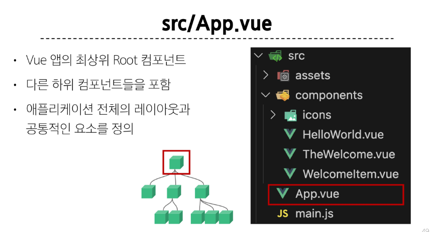
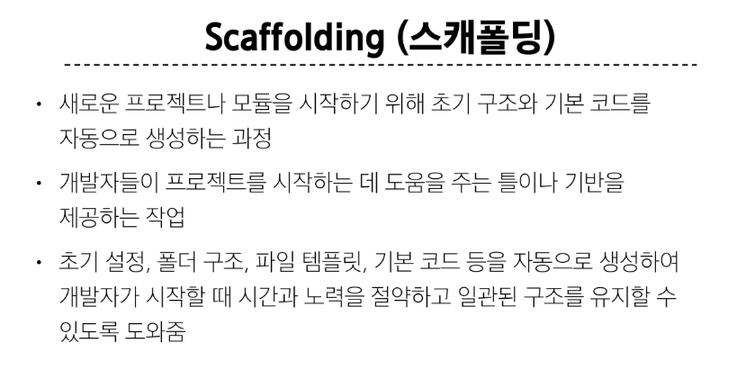

# 04_Single-File Components

## Component

- *재사용 가능한* 코드 블록

### Component 특징


- Article과 Item이라는 같은 컴퍼넌트가 재사용된다.
- 따로 여러번 작성하지 않고 여러번 재사용하고 있다. 

- 이처럼 반복적으로 보이는 레이아웃은 재사용이 가능하다. 


### Single-File Components

- 여러 개의 컴포넌트, 템플릿(HTML), 로직(JS) 및 스타일(CSS)을 하나의 파일로 묶어낸 특수한 파일 형식(.vue 파일)
- SPC 생각


- 이 파일 하나가 컴포넌트
- 이게 여러개가 생기고, 트리 형태를 이루면서 하나의 페이지를 이룬다. 

```vue
<!-- MyComponent.vue -->

<!-- 시작은 vbase-3-setup -->
<template>
    <!-- html -->
    <div>
        <p class="greeting">{{ msg }}</p>


    </div>
</template>

<script setup>
// JS
// 여기선 우리가 사용하던 setup 함수가 이미 적용되고 있음
// 그냥 여기가 setup 함수의 안이라 생각

import {ref} from 'vue' //이제 이런 식으로 갖고와라


const msg = ref('Hello')


// return {msg}
// 이제 더 이상 리턴하지 않는다

</script>


<!-- <style lang="scss" scoped> -->
<style scoped>
/* css */

.greeting{
    color:crimson
}
</style>
```


- vue 공식 문서는 script가 더 중요하므로 그걸 올려서 보여준다.

#### template


- 하나의 파일이 여러 컴퍼넌트를 구성할 수 없다


#### **script** setup


#### **style** scoped


## 그럼 이 컴퍼넌트를 어떻게 사용? Vite

- 전용 빌드 도구(Vite)등을 이용
- 없이도 가능은 한데...


> 과정은 교안 다시 확인

### Build


### NPM 

- 파이썬에서의 pip 와 같은 역할


- 브라우저에 갇혀있던 JS를 밖으로 꺼내준게 node.js
- 브라우저에서 벗어났기에 서버를 건드리는 백엔드에서 또한 사용 가능


### 모듈과 번들러

- 모듈
  - 프로그램을 구성하는 독립적인 코드 블록(.js 파일)


- venv보다 훨씬 무겁다 


#### 번들러


> 결국 우리가 따로 해야할건 없다


## Vue 프로젝트

### 프로젝트 구조

#### node_modules


- 일종의 venv
- 모든 npm들이 여기에 따로 관리됨
- 프로젝트마다 따로 있음

> 그럼 이걸 어떻게 공유? (파이썬에선 requirements.txt) package-lock.json


#### public 디렉토리

- 주로 정적 파일(static 파일)


#### src(소스)/assets

- SRC가 가장 중요





#### index.html


## Vue Component 활용 - 교안 다시 확인


- SFC : 컴포넌트 하나하나가 파일 하나다
- SPA : 전체가 하나의 파일로 이루어져 있다


- 이 2개는 무조건 진행해야 함


- 일반적인 html의 div 태그 처럼 사용할 수 있지만 조금 다르게 쓸 수 있다(파스칼 케이스)

```html
<MyComponent/>
```


## 추가 주제


### Virtual DOM


> Vue가 실제 DOM을 건드리는게 아니라 가상 DOM을 만들어놓고 수정 사항만 확인한다고 이해하면 된다.


- querySelector나 addEventListener를 안 쓰고 있는 이유도 실제 DOM을 안 건드리고 있고, Vue가 해주고 있기 때문
- 대신 v-on, v-model등 vue의 문법을 사용하고 있다.


> 다만 직접 접근해야 하는 경우가 있긴 하다


- 얘가 querySelector를 대체했다고 생각

> 주의점 : 
>
> input같이 이름이 같아야 하고, 이건 단순히 선택하는 문법이기 때문에 ref 안에 null 만 넣는다.


### Vue의 코드 작성 방법 : Composition API & Option API

#### composition api


- 우리가 지금 쓰고 있는 방법
- import 해서 component를 갖고 오고, 이걸로 사용하는거
- 이게 권장 방식(Vue3부터)

#### Option Api


- 하나의 큰 객체를 활용
- 단점?


> 이런 식으로 코드가 커졌을 때 다른 열역에 있는 변수나 함수를 참조하기 어렵고, 유지 보수가 어려움


- Component같이 하나의 영역에서 작성하는 것이 아니라 영역끼리 **깊이**가 존재한다. 


> 결론 : Option API 안 쓸거다. 


### 주의사항


### Scoped

- 쓰는걸 권장


#### 주의!!!!!!!


> 아무리 scoped가 있다고 하더라도 자식의 최상위 요소는 부모의 css에 영향을 받을 수 있다. 


> 이걸 방지하려면? tag에 style 넣지 말고 class 만들어서 class 바인딩 해라


### --




### 왜 vue는 여러 언어를 하나의 파일에 쓰까놨냐?


## 추가) vue에 bootstrap 추가

- Bootstrap 적용하는 방법
  - cdn 추가하는 방법으로는 vite 앱에 적용시킬 수 없습니다. 설치를 진행해야 합니다.
1. bootstrap 설치
   - 참고문서: Bootstrap & Vite · Bootstrap v5.3 (getbootstrap.kr)
   - vue project base 경로에서, 아래 명령어를 이용하여 bootstrap 을 설치해주세요

``` bash
npm i --save bootstrap @popperjs/core
```

2. main.js 수정
   - 아래의 코드 처럼 css를 직접 가져오는 방법으로 import 하면 됩니다.
``` js
// src/main.js

import { createApp } from 'vue'
import App from './App.vue'

// 아래 두 줄을 추가하시면 됩니다. 

import 'bootstrap/dist/css/bootstrap.min.css'
import * as bootstrap from 'bootstrap'

createApp(App).mount('#app')
```


### vue를 쓰는 이유


```html
<!DOCTYPE html>
<html lang="en">
<head>
  <meta charset="UTF-8">
  <meta http-equiv="X-UA-Compatible" content="IE=edge">
  <meta name="viewport" content="width=device-width, initial-scale=1.0">
  <title>Document</title>
</head>
<body>
  <div id="app1">텍스트를 변경</div>
  <div id="app2">DOM 직접 조작</div>
  <div id="app3">{{ message }}</div>

  <script src="https://unpkg.com/vue@3/dist/vue.global.js"></script>
  <script>
    const { createApp, ref } = Vue;

    // App 1: 텍스트를 변경(자바스크립트)
    const app1 = document.querySelector('#app1');
    const updateFunc1 = function() {
      for(let i = 0 ; i < 10000 ; i++) {
        app1.textContent = '변경하기';
      }
    }
    const start1 = performance.now();
    updateFunc1();
    const end1 = performance.now();
    console.log(`textContent 변경 = ${end1 - start1}`);
    // 2번째. 얘가 vue보다 더 빠를 때도 있음

    // App 2: DOM 직접 조작(html 변경)
    const app2 = document.querySelector('#app2');
    const updateFunc2 = function() {
      for(let i = 0 ; i < 10000 ; i++) {
        app2.innerHTML = '변경';
      }
    }
    const start2 = performance.now();
    updateFunc2();
    const end2 = performance.now();
    console.log(`innerHTML 변경 = ${end2 - start2}`);
    // 제일 느림


    // App 3: Vue로 조작
    const app3 = createApp({
      setup() {
        const message = ref('뷰로 조작');
        const updateFunc3 = function() {
          for(let i = 0 ; i < 10000 ; i++) {
            message.value = 'Vue 에서 변경';
          }
        }
        const start3 = performance.now();
        updateFunc3();
        const end3 = performance.now();
        console.log(`Vue 로 변경 = ${end3 - start3}`);

        return { message };
      }
    }).mount('#app3');
    // 평균적으로 얘가 제일 빠름
  </script>
</body>
</html>
```

## NPM

- pip랑 동일한 역할
  - 자바스크립트 **패키지 관리자**
  - 전역적으로 관리하거나, 현재 프로젝트에만 포함시키는 등 관리가 가능
  - 현재 츠로젝터(현재 디렉토리)를 따로 관리 가능하기 때문에, 가상환경(nvm)은 커리큘럼에서 제외!

### NPM 명령어

- 챗 지피티 치면 다 나옴


- nodejs 에서 사용하는 pip 랑 동일한 역할
  - 자바스크립트 패키지 관리자
  - 전역적으로 관리하거나, 현재 프로젝트에만 포함시키는 등 관리가 가능
  - 현재 프로젝트(현재 디렉토리)를 따로 관리가능 하기 때문에, 가상환경(nvm) 은 커리큘럼에서 제외!

## NPM 명령어

- chat gpt 를 참고하세요
- `npm init`: Node.js 패키지 관리하겠다고 초기화하는 도구
  - package.json 파일이 생성됨
- `npm install`: 패키지를 설치하는 도구
  - package.json, package-lock.json 파일을 확인하여 필요한 패키지를 설치
- `npm install <패키지명>`: 현재 프로젝트에 특정 패키지 추가
- `npm install -g <패키지명>`: 전역 영역에 패키지 추가
- `npm root`: 현재 프로젝트가 참조하고 있는 패키지 목록(node_modules) 확인
- `npm audit`
  - 보안 및 의존성 취약점을 해결하기 위해 도와주는 도구
  - 보안 취약점?
    - 개발자가 악성 코드를 넣어놓으면, 그대로 노출됨
    - 최소한의 보안 취약점을 검사해주기 위해 npm 에서 제공하는 명령어
    - 전래동화
      - 무슨 기준으로 보안 취약점을 검색할까 ?
      - Github 경보(Advistory) DB 를 기준으로 프로젝트 취약점을 분석
      - 해당 DB는 아래와 같은 곳에서 데이터를 가져옴
        - 미국 국립 취약점 DB(The National Vulnerability Database)
        - Github 공개 커밋 취약점 분석 커뮤니티
        - Github 에 보고된 보안 경보
        - npm 에 보안 경보 DB
  - 의존성 문제
    - 현재 프로젝트에 구성된 종속성에 대한 설명과 취약성에 대한 보고
    - 취약한 종속성에 대해 호환 가능한 업데이트를 자동으로 설치
    - [주의사항] audit 명령어는 최소한의 해결법
      - 반드시 개발자가 추가로 확인해주어야 한다.

## package.json 의 의미

- 프로젝트의 종속성 목록과 빌드 도구 등 여러 구성 옵션들이 작성되어 있음

- `name`: 프로젝트의 이름
- `version`: 프로젝트의 버전
  - "0.0.0" - "[Major].[Minor].[Patch]"
    - `Major`: 기존 버전과 호환되지 않는 새로운 기능 추가 시
      - 업데이트 안하면 안돌아간다 급의 수정
    - `Minor`: 기존 버전과 호환되는 새로운 기능 추가 시
      - 호환되는 새로운 기능 추가 시 버전 업
    - `Patch`: 기존 버전과 호환되는 버그 수정 및 기능 개선 시
  - 공식문서 release note 각 버전마다 변경사항 기록
- `private`: true 로 설정하면, npm 레지스트리에 해당 프로젝트를 배포할 수 없음
- `type`: ES Modules(ESM) 문법을 사용해서 파일 import/export 
- `scripts`: 프로젝트에서 실행할 수 있는 스크립트들을 정의
  - `dev`: 개발 서버 실행
  - `build`: 배포할 수 있는 형태로 만들어 줌
    - dist 폴더 생성
    - 코드 압축 등
  - `preview`: 배포 화면 미리보기
- `dependencies`: 배포 환경에서 필요한 패키지를 정의
  - 버전 표기법
    - `틸드(~)`: 작성된 패치 버전보다 높거나 같고, 다음 마이너 버전보다 낮은 버전 내에서 자동으로 업데이트
      - `~3.4.21` == `>= 3.4.21` and `< 3.5.0`
      - 전체적인 기능은 비슷하지만, 버그 수정 등이 끝난 최신 버전으로 업데이트
    - `캐럿(^)`: 작성된 패치 버전보다 높거나 같고, 다음 메이저 버전보다 낮은 버전 내에서 자동으로 업데이트
      - `^3.4.21` == `>= 3.4.21` and `< 4.0.0`
      - 많이 사용됨
      - 호환성을 유지하는 버전 중 가장 최신 버전으로 자동 업데이트
- `devDependencies`: 개발 환경에서 필요한 패키지를 정의


## vite (모듈 번들러) 정리 잘 해 놓은 사이트

https://enjoydev.life/blog/frontend/4-module-bundler#%EB%AA%A8%EB%93%88-%EB%B2%88%EB%93%A4%EB%9F%AC


## ------------------

- 앞으로 ctrl shift F 많이 쓸거다. 

