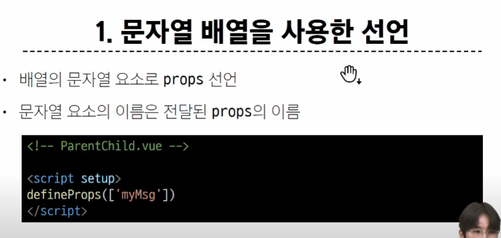
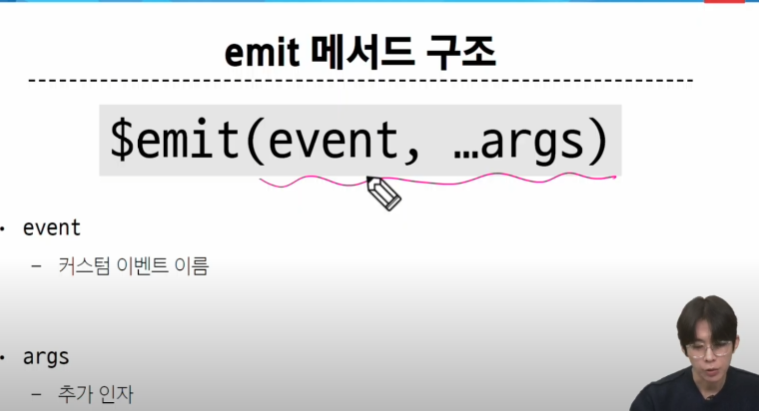
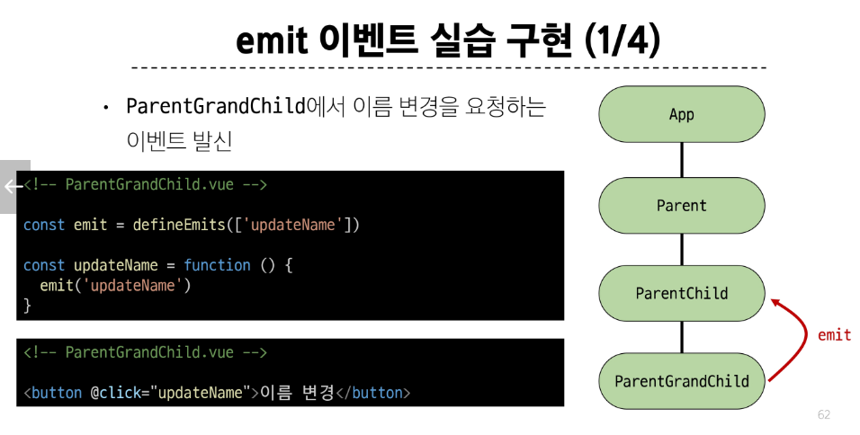

# 05_Component State Flow

- 컴포넌트간의 데이터 교환
## Passing Props


- 컴포넌트끼리는 트리 구조
- 부모 자식끼리 데이터의 흐름이 중요

### Props


- 자식이 내려받은 애를 변경할 수 없음. 담반 부모 컴포넌트에서 변경된 애들은 자연스럽게 모두 바뀜

### One-Way Data Flow


- 하향식/단방향/바인딩

#### 왜 단방향일까?

- 자식이 여러명일 때 부모의 데이터를 수정하고 부모 쪽으로 올린다면, 누가 수정했는지 알 수가 없다.(Git의 merge 같은 것)


### Props 선언

- 처음 만들 떄 헷갈린다면 vue의 공식 문서 들어가면 나와있음
- 근데 한글과 영어 문서가 다름. 영어 문서가 더 빠르게 업데이트되어있음. 영어부터 봐라


> npm create vue@latest
>
> npm install
>





- 배열과 객체 선언 중 객체 선언을 좀 더 추천함


#### 동적 할당 : 동적 변수를 prop

- 차이점? v-bind를 붙여준다.


### props 활용

#### 다른 디렉티브와 함꼐 사용

- ex)v-for와 동적 할당의 콜라보


## Component Events

- 위로 데이터를 보낼 수 없으니 이벤트를 보냄

### Emit Event


- 데이터 바꿔달라고 소리지르는거





### 이벤트 발신(자식) 및 수신(부모)


### emit 이벤트 선언 by defineEmits()


```html

<!-- ParentChild.vue -->
<template>
    <div>
        <p>{{ myMsg }}</p>
        <ParentGrandChild :my-msg="myMsg"/>
        <p>{{ dynamicProps }}</p>
        <button @click="$emit('someEvent')">클릭</button>
        <hr>
        <button @click="buttonClick">defineEmits</button>
        <!-- 위의 2개가 같은거임. -->
    </div>
</template>

<script setup>

import ParentGrandChild from '@/components/ParentGrandChild.vue'

const emit = defineEmits(['someEvent'])

const buttonClick = function(){
    emit('someEvent')
}
```

```html
<!-- Parent.vue -->
<template>
    <div>
        <ParentChild my-msg="message" 
        :dynamic-props="name" 
        @some-event="someCallback" 
        /> <!-- someCallback은 some-event에 대한 반응 -->
        <ParentItem 
            v-for="item in items"
            :key="item.id"
            :my-prop="item"
        />

    </div>
</template>

<script setup>
import ParentChild from './ParentChild.vue';
import ParentItem from './ParentItem.vue';
import {ref} from 'vue'

const name = ref('Alice')

const items = ref([
    {id:1,name:"사과"},
    {id:2,name:'바나나'},
    {id:3,name:'딸기'},

])

// 자식으로부터 데이터를 받았으니 이제 그에 대한 반응을 parent가 해줘야한다.
const someCallback=function(){
    console.log('ParentChild가 발신한 이벤트를 수신했어요.')
}
</script>

<style scoped>

</style>
```

### 이벤트 전달

> 이벤트 인자 : 이벤트 발신 시 추가 인자를 전달하여 **값을 제공할 수 있음**


### emit 이벤트 활용

> emit 할 때 깊이 상관없이 한 번에 손자에서 parent로 올릴 수 없다!





> 1시간 25분부터 1시간 40분까지 다시 봐라

## 참고

### 객체 선언 문법을 권장하는 이유


## emit할 때 특정 값을 같이 보내고 싶으면?

```vue
<template>
    <div class="card">
        <!-- <hr> -->
      
            <h3> 이름 : {{ propOne.name }}</h3>
            <p> 직함 : {{ propOne.title }}</p>
            <button @click="remove(propOne)">명함 삭제</button>

    </div>
</template>

<script setup>
defineProps({
    propOne:Object
})
const emit = defineEmits(['removeCard'])

const remove=function(propOne){
    emit('removeCard',propOne)//인자는 여기서 보내주는거다!!!!!!
}
</script>
```