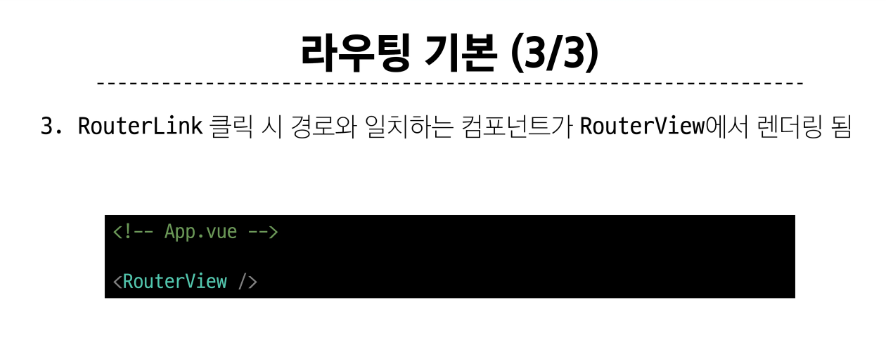
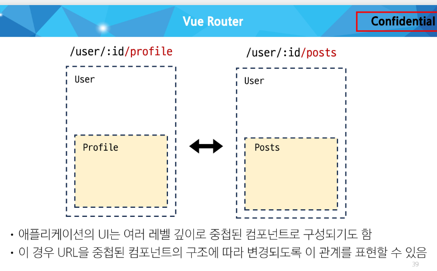
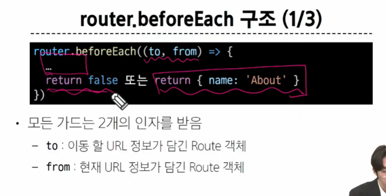

# Vue Router

## Routing
- 페이지 간 이동
- 렌더링 없이


- 더 이상 라우팅을 SSR에서 하지 않는다


- 이제 예전처럼 각 경우에 대한 html을 만들어서 url을 만들지 않음
  - SPA


> 결국 마치 하나의 url로 컴포넌트 변경을 통해 여러 url로 이동하는 것처럼 보이게 한다.


### Vue Router


> about을 누르면 화면을 바뀌지만 새로고침 되지 않는다
>
> 이것처럼, 컴포넌트 교체를 통해 새로운 화면을 보여주는게(새로고침 됐다고 속이는게) 라우팅


#### Vue 프로젝트 구조 변화

1. App.vue 코드 변화

```vue
<script setup>
import { RouterLink, RouterView } from 'vue-router'
import HelloWorld from './components/HelloWorld.vue'
</script>

<template>
  <header>
    

    <div class="wrapper">
      <HelloWorld msg="You did it!" />

      <nav>
        <RouterLink to="/">Home</RouterLink> 
        <!-- 이 router 링크를 통해서 RouterView 영역이 바뀌고 있다.
        + Url을 변경 -->
        <RouterLink to="/about">About</RouterLink>
      </nav>
    </div>
  </header>

  <RouterView />
</template>
```


2. router 폴더 신규 생성
   - 장고의 urls.py와 굉장히 유사


3. views 폴더 신규 생성


- components에 들어있는 애들과 views에 들어있는 애들 둘 다 component임
- 다만 일반 컴포넌트와 라우터에 연결되어 있는 애들을 구분하려고 AboutView.vue와 같이 라우터에 연결되어 있는 애들은 따로 쓴다. 


### Basic Routing

- 장고에서 urls부터 쓰는 것처럼 라우터에선 라우터 폴더의 index.js부터 처리.





### Named Routes

- 장고에서 appname 쓰던 거랑 비슷
- '객체'형태로 쓴다. 


### Dynamic Route Matching

- Url의 일부를 변수로 사용하여 경로를 동적으로 매칭


> params 자체가 props 형태로 뿌리는 거임.


> 다만 이런 식으로 JS 영역에서 반응형 변수 만들어서 집어넣는걸 추천함

### Nested Routes - 중첩 라우트




# 다시 들어라 ~49p


### Programmatic Navigation


1. router.push()
   - 다른 위치로 이동하기
2. router.replace()
   - 현재 위치 바꾸기

#### router.push()


> 뒤로 가기 버튼을 사용할 수 있음


#### router.replace()


> 뒤로 가기 불가능


### Navigation Guard

- LifeCycle Hook 같은 것


#### 1. Globally Guard

- 애플리케이션 전역에서 동작하는 가드 
- 작성위치: index.js


> beforeEach()




> 만약 return을 실수로 안 쓰면 to로 가는게 default


```js
// index.js

import { createRouter, createWebHistory } from 'vue-router'
import HomeView from '../views/HomeView.vue'
import UserView from '../views/UserView.vue'
import UserProfile from '@/components/UserProfile.vue'
import UserPosts from '@/components/UserPosts.vue'
import UserHome from '@/components/UserHome.vue'
const router = createRouter({
  history: createWebHistory(import.meta.env.BASE_URL),
  routes: [
    {
      path: '/',
      name: 'home',
      component: HomeView
    },
    {
      path: '/about',
      name: 'about',
      // route level code-splitting
      // this generates a separate chunk (About.[hash].js) for this route
      // which is lazy-loaded when the route is visited.
      component: () => import('../views/AboutView.vue')
    },
    {
      path:'/user/:id',
      // name:'user',
      component: UserView,
      children:[
        {path:'',name:'user',component:UserHome},
        {path:'profile',name:'user-profile',component:UserProfile},
        {path:'posts',name:'user-posts',component:UserPosts}
      ]
    }
  ]
})

// 전역가드
router.beforeEach((to,from)=>{
  console.log(to)
  console.log(from)
})// 전역가드는 위치랑 상관 없이 url이 변경될 떄마다 호출되는 함수이다. 

// 예시: 로그인 되어있는지 아닌지를 확인할 수 있다.

router.beforeEach((to,from)=>{
  const isAuthenticated = false

  if (!isAuthenticated && to.name !== 'login'){ // 1. 로그인이 안 되어있고, 2. 지금 가는 곳이 로그인 화면이 아니면
    console.log('로그인이 필요합니다.')
    return {name:'login'}
  }
})
// 지금은 임의로 isAuthenticated를 false로 고정했지만, 이제 장고랑 연결하면...

export default router

```

#### 2. Per-route Guard

- 다른데서 해당 url로 이동해 '올 때'
- 여기서 다른 곳으로 갈 때는 실행되지 않음


> 주의 : 아래쪽에 > 부분 잘 읽어봐라


> 예시 : 이미 로그인 한 상태라면 LoginView로 오는 것 막고 HomeView로 이동


#### 3. In-component Guard

- 특정 컴포넌트 내에서만 동작하는 가드
- > 작성위치 : 각 컴포넌트의 < script> 내부


1. onBeforeRouteLeave() : 해당 위치를 **떠날 때**


> true의 return 이 생략되어있다? 자동으로 to(내가 가고자 했던 곳)로 라우팅된다. 

2. onBeforeRouteUpdate() : 같은 라우트 내에서 업데이트 되는 경우

 

> 만약 onBeforeRouteUpdate를 안 쓰면?


> 페이지 url은 바뀌었는데 컴포넌트에 들어가있는 반응형 변수가 바뀌지 않았음.


```vue
<template>
    <div>
        <h1>UserView</h1>
        <RouterLink :to="{name:'user-profile'}">Profile</RouterLink>
        <RouterLink :to="{name:'user-posts'}">Posts</RouterLink>
        <h2>{{ userId }}번 User 페이지</h2>
        <button @click="goHome">홈으로!</button>
        <hr>
        <button @click="routeUpdate">100번 유저 페이지로!</button>
        <!-- 이건 사실상 같은 페이지로 이동하는 것이다. 값만 바뀌는 거임 -->
        <RouterView/>

    </div>
</template>

<script setup>
import { ref } from 'vue';
import {useRoute, useRouter,onBeforeRouteLeave,onBeforeRouteUpdate} from 'vue-router'
const route = useRoute()
const userId=ref(route.params.id) //userRoute는 Route 안의 params의 접근할 떄 사용

const router = useRouter()

const goHome=function(){
    // router.push({name:'home'})
    router.replace({name:'home'})
}
onBeforeRouteLeave((to,from)=>{
    const answer=window.confirm('정말 떠나실건가요?')
    if (answer===false){
        return false
    }
})

const routeUpdate=function(){
    router.push({name:'user',params:{id:100}})
}

onBeforeRouteUpdate((to,from )=>{
    // console.log(to)// 이걸 통해 100이라는 params가 어디에 있는지 개발자모드에서 확인 가능

    userId.value = to.params.id
})


</script>
```

### Navigation Guard 정리


### 참고 - Lazy Loading Route

