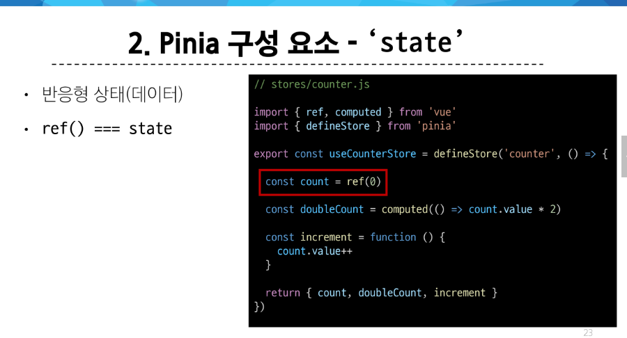
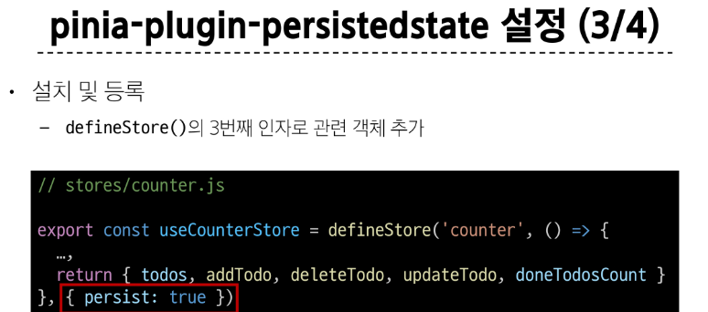

# Vue Statement

## State Management


- 흐름을 보면 단방향으로 이루어진다. 
- 뷰:템플릿
- 액션 : 함수
- 스테이트 : 데이터, 반응형 변수(ref)


### 상태 관리의 단순성이 무너지는 시점

- 여러 컴포넌트가 상태를 공유할 때 : 대표적으로 prop과 emit
  1. 여러 뷰가 동일한 상태에 종속되는 경우
  2. 서로 다른 뷰의 기능이 동일한 상태를 변경시켜야 하는 경우


- 결국 단순하게 만들려 했는데 이게 깨진다
- 트리 구조가 깊어질수록...


> 해결책?

> 모든 컴포넌트에서 참조할 수 있는 전역 구역에 중앙 저장소 개념을 만들자


- 계층 구조에 상관 없이 컴포넌트의 **전역에서** 사용 가능
- 이를 위한 라이브러리의 이름을 **Pinia(피냐)**라고 한다. 
  - 피냐는 기능과 상태를 중앙저장소로 갖고 간다. 
  - **물론 모든 기능과 상태를 가져가는게 아님**


> stores라는 중앙 저장소가 생긴다.

### Pinia


> 전체에서 사용하려면 return을 해야한다


- 첫 번째 인잔 store의 id
- 2번째 인자는 콜백함수. 여기에 우리가 쓰는 스테이트와 액션이 존재




5. 플러그인 - define 함수의 선택적인 3번째 인자


#### 정리

> 주의 : pinia는 여러 개의 store를 가질 수 있음. '중앙' 저장소라고 해서 이게 하나로 통합될 필요는 없음


### pinia 구성 요소 활용


> 주의 : 외부에서 중앙 저장소로 접근해서 데이터를 건들거나 추가할 순 없다. define 함수 내에서 직접 처리해야함

```vue

<script setup>
// App.vue


// 중앙 저장소 import 
import { useCounterStore } from './stores/counter';

const store=useCounterStore()

// 그럼 여기 들어가는 애들은 어떻게 접근? 
// defineStore의 리턴 값은 객체 -> 속성 접근하는것처럼 접근해도 된다


// 1.state: 반응형 변수
console.log(store.count)
const newNumber=store.count + 1


// 2.getters : computed
console.log(store.doubleCount)


// 3.actions: 함수, state 조작, 비동기, api호출이나 다른 로직을 진행할 수 있음
</script>

<template>
 <!-- 여기서 사용? -->

 <!-- 새 변수에 담아서 사용하던가 -->
 <p>{{ newNumber }}</p>
 <!-- 속성으로 접근 -->
 <p>{{ store.doubleCount }}</p>

 <!-- // 3.actions: 함수, state 조작, 비동기, api호출이나 다른 로직을 진행할 수 있음 -->
<button @click="store.increment()">++</button>

</template>

<style scoped>

</style>

```


## Pinia 실습


> pinia 안 쓰면?


> 그럼 이제 pinia를 쓰면?
>
> store 활용


> 주의: 피냐를 쓴다고 해서 prop이나 emit이 사라지진 않는다. 


### Read Todo


### Create Todo


### Delete Todo

> 삭제,수정 : 여러 개의 todo들 중에서 어떤 todo가 선택되었는지 판단해야 한다. 


### Update Todo


### Counting Todo -> getters


## Local Storage





## 참고


# offline

## 디자인 패턴

https://brunch.co.kr/@oemilk/113

https://hayley-0616.tistory.com/68

### MVC

- Model(데이터) View(화면) Contoller(데이터조작)
  - 이 3개를 다른 파일로 구현해놓은 것


## Axios 

- store에 axios를 통해 apiu 데이터를 가쟈ㅕ온다

> npm install axios


```js
// store.js

import { ref, computed } from 'vue'
import { defineStore } from 'pinia'

import axios from 'axios'
export const useProductStore = defineStore('product', () => {
    // const products = ref([
    //     {id:1, title:'Product1' ,body:'asfgagsg'},
    //     {id:2, title:'Product2' ,body:'bsfgafsagsg'},
    //     {id:3, title:'Product3' ,body:'csfgagsg'},


    // ])
    const products = ref([]) 

    const fetchProducts=function(){
    axios({
        method:'get',
        url:'https://jsonplaceholder.typicode.com/posts'
    }).then((response)=>{
        console.log(response)
        products.value =response.data
        console.log(products.value)
    })
    .catch((error)=>{
        console.log(error)
    })
}
// 성공하면 then, 실패하면 catch

    const productCount = computed(()=>{
        return products.value.length
    })

    const deleteProduct = function(productId){
        const index = products.value.findIndex((product)=>product.id===productId)
        products.value.splice(index,1)

    }

    return {products,productCount,deleteProduct,fetchProducts}
})

```

그럼 이걸 어디에 써서 언제 발동되어야 할까??

```vue
<template>
    <div>
        <h1>ProductList</h1>

            
               
                <ProductListItem
                v-for="product in store.products"
                :product="product"
                />
         
    </div>
</template>

<script setup>
import { useProductStore } from '@/stores/product';
import ProductListItem from "./ProductListItem.vue"
import { onMounted } from 'vue';

const store = useProductStore()

// 1. setup 할 때 
// store.fetchProducts()
// 얘는 템플릿쪽에 문제가 생겨도 외부로 요청


// 2. onMounted
// 조금 더 선호하는 유형
// api 호출 코드는 onMounted 안에 다 넣으면 된다.  

onMounted(()=>{
    store.fetchProducts()
})

</script>

<style scoped>

</style>
```


