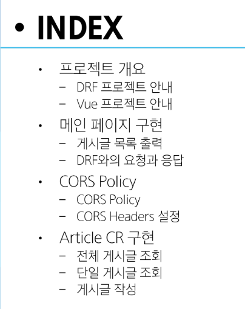
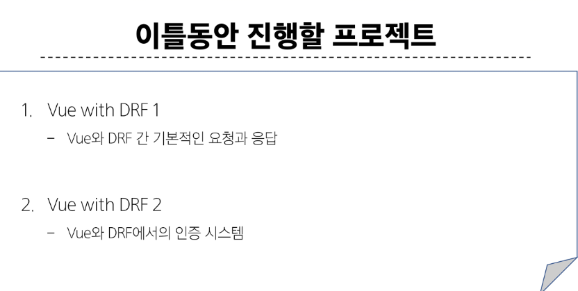
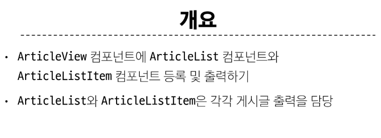

# 08 Vue with DRF






## 메인 페이지 구현

- 무결점의 프로젝트를 만드는 것이 아님
- frontend 프레임워크와 backend 프레임 워크간의 요청과 응답, 그 과정에서 등장하는 새로운 개념과 문제를 해결하면서 하나의 웹 애플리케이션 서비스를 구현하는 과정에 집중하는 것

### 게시글 목록 출력




#### shb


```vue
<template>
  <div>
    <h1>Detail</h1>
    <div v-if="article">

      <p>글번호:{{ article.id }}</p>
      <p>제목:{{ article.title }}</p>
      <p>내용:{{ article.content }}</p>
      <p>작성시간:{{ article.created_at }}</p>
      <p>최종 수정시간:{{ article.updated_at }}</p>
    </div>
  </div>
</template>

<script setup>
import axios from 'axios';
import { onMounted,ref } from 'vue';
import { useRoute } from 'vue-router'; // params에 있는 id를 갖고 오기 위해서 
import { useCounterStore } from '@/stores/counter';

const store= useCounterStore()
const route = useRoute()
const article=ref(null)
onMounted(()=>{
  
  axios({
    method:'get',
    url:`${store.API_URL}/api/v1/articles/${route.params.id}/`,
  }).then((res)=>{
    console.log(res.data)
    article.value=res.data
  }).catch((err)=>{
    console.log(err)
  })
})

</script>

<style>

</style>
```

> https://developer.mozilla.org/ko/docs/WEB/HTTP/CORS


# offline


- 자바스크립트 파일 하나
  - == 하나의 모듈
  - == 내보내기, 가져오기
  - => export , import
- 괄호로 import하는 애와 달리 중괄호를 안 쓰는 애들은 default로 export가 있다. -> 전체 파일이 통으로 나감
> 이거 질문해라

## 외부에서 서버 접근

- ipconfig를 터미널에 치면 아이피 주소가 나온다.
- python manage.py runserver 70.12.102.185:8000
- settings.py의 ALLOWED_HOSTS = ['*']
- 이제 외부에서 내 서버로 접근할 수 있음


## 프로젝트에서 우리가 해야할 것
1. 기획
   1. 요구사항 정의
    - 내가 구현할 기능 목록 - 크게크게 리스트업
    -  -> 브레인스토밍 등등으로 아이디어 회의 
    -  -> 우리 pjt -> 추천 알고리즘 컨셉
       -  여기에 한 3일정도
    - 상세 요구사항 정의
      - 하나하나의 기능마다 세부적으로 무슨 기능들이 필요하셌구나
        - 이 때, 필요한 데이터 목록도 함꼐 나온다
2. ERD 구성 가능
3. 컴포넌트 구성도,(API 명세서) 등등
   - ->구성에 필요한 내용들 
     - 컴포넌트 구성도 : 프론트엔드 파일 구조 어떻게 할 것인가?
     - API 구성도 : API 메서드 종류, 각 메서드 별 파라미터 및 반환하는 데이터
       - -> 이건 자동화 할거임
       - 자세하게 하진 말고 종류 정도만 작성
- 놀랍게도 아직 코드는 한 줄도 안 썼다.