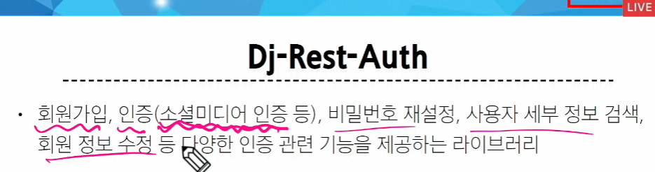
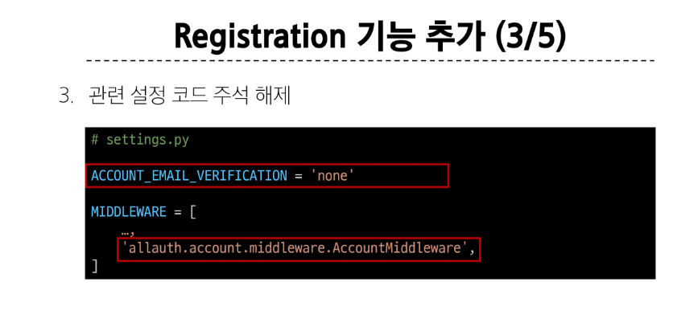

# vue with drf 2

- 장고와 vue를 통한 **인증**


### Token Authentication 설정 방법


> signals.py -> 특정 조건을 만족했을 때 자동으로 실행되는 애들

```py
# signals.py
from django.db.models.signals import post_save
from django.dispatch import receiver
from rest_framework.authtoken.models import Token
from django.conf import settings


# 토큰을 만들어주는 함수
@receiver(post_save, sender=settings.AUTH_USER_MODEL)
def create_auth_token(sender, instance=None, created=False, **kwargs):
    if created:
        Token.objects.create(user=instance)

```




> 소셜 미디어 인증? 카카오로 로그인 같은거


> 회원 가입 기능





### Token 발급 및 활용


# offline

### 토큰

https://velog.io/@lijahong/0%EB%B6%80%ED%84%B0-%EC%8B%9C%EC%9E%91%ED%95%98%EB%8A%94-Django-%EA%B3%B5%EB%B6%80-JWT%EC%99%80-%EC%9D%B8%EC%A6%9D-%EB%B0%A9%EC%8B%9D

> jwt,json 토큰, 토큰 안에 데이터를 넣어둠. 2학기엔 주로 이걸 사용할거다.

### Dj-Rest-Auth

- 회원가입과 관련된 라이브러리. 

결국 라이브러리를 커스텀 할 수 있어야 한다. 

> https://github.com/iMerica/dj-rest-auth/blob/master/dj_rest_auth/registration/serializers.py

