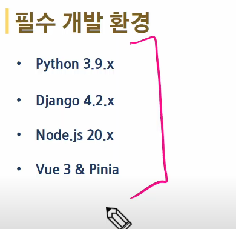
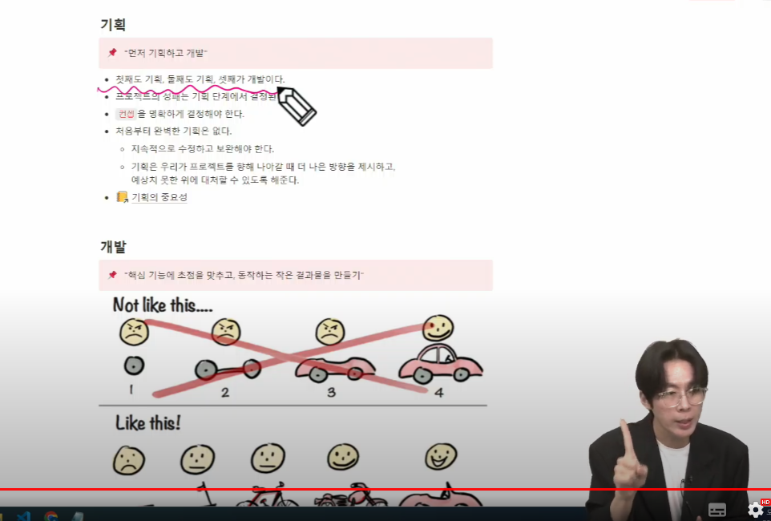

## 기능

1. 예금&적금 금리 비교
2. 신혼 여행을 위한 환율 계산기
3. 내 집 주변 은행 검색
4. 나에게 맞는 상품 추천(가장 중요)
   - 어떤 기준점과 알고리즘을 쓸지는 팀마다 다름

- 차트가 필요하면 chartjs 포함해서 여러 라이브러리가 존재

- 이것저것 여러개를 구현하기보단 필수적인 내용을 가장 먼저 구현해봐라.

- 프레임워크 바꾸지 마라.

### 필수 요구사항

- user 커스텀을 위한 방법은 자료가 제공된다. 

- 굳이 시작부터 실시간 데이터를 쓰려고 할 생각 x, 이건 마지막에 고민
- 굳이 업데이트 안 해도 됨
- 일단 DB에 넣고 시작해라

### 8. 금융 상품 추천 알고리즘

### 9. 오픈 api

- README 매일매일 써라

## 선택 요구사항

### 배포 
- 배포 진행은 공용 문서를 참고
- 우리 다운 받던 public document에 있음(final pjt)

## 11기 전용

- 11기는 처음으로 기본 명세서 기능 완성 후 AI 혹은 생성형 AI 서비스를 활용한 기능 추가 또는 프롬프트를 생성하여 프로젝트를 고도화하는 요구사항이 제공될 예정
- 오늘 오후에 

`기획`이라는 용어는 상황에 따라 의미가 달라집니다. 주로 세 가지 의미를 가지고 있습니다.

### 기획의 중요성

> 기획의 정의

1. **기존 프로덕트를 차별화하여 경쟁 제품보다 우위를 점할 수 있게 해주는 기획** 
2. **시대의 변화에 발맞추어 기존에는 존재하지 않던, 프로덕트를 창조하기 위한 기획** 
3. 내부적으로 발생한 문제를 해결하기 위한 기획

우리는, **첫째와 둘째**에 해당하는 기획을 다루어 보도록 하겠습니다.

기존에 존재하는 유사 서비스들이 가지고 있는 단점을 보완하고 장점을 극대화 시킬 수 있는 방법을 모색할 수 있습니다. 그러기 위해서 선행되어야 할 작업은 기존의 서비스들을 탐방하고 정보를 수집하는 일입니다.

위의 상황에서 기획의 `목적`은 **더 나은 서비스**에 초점을 맞추어 작성합니다. 

**더 나은 서비스**를 구성하는 방법은 또 다시 여러 갈래로 분화 될 수 있습니다. 

- UI/UX에 집중하여 기존의 서비스들이 가지고 있었던 레이아웃, 시스템, 서비스 자체를 수정할 수 있습니다.
- 혹은, 기존 서비스에 존재하지 않는 추가 기능에 집중하여 사용자에게 색다른 경험을 제공하는 방향으로 초점을 맞출 수 있습니다.
- 혹은, 국내 정보에 국한된 서비스나, 특정 기업의 정보만을 제공하는 서비스 등에 대항하는 방대한 데이터베이스를 구축하여 양적 승부를 볼 수도 있습니다.

제시한 각 상황들은 서로 다른 방향성을 가지고 있으나 결국 `목적`은 기존 서비스보다 **더 나은 서비스**에 집중한다는 공통점을 가집니다. 

변화하는 시대에 걸맞는 **아이디어 상품**에 `목적`을 둔다면, 기획의 방향은 달라지게 됩니다. 
기존 서비스들을 참고하지 않을 수는 없으나 그 비중은 상대적으로 낮아질 것입니다. 

기획을 어떻게 `정의`하고 `목적`을 무엇으로 상정하느냐에 따라 프로젝트의 방향성은 이처럼 다양하게 변화할 수 있습니다.

또한, 프로젝트를 진행하기 위한 기초적인 `그라운드 룰`과 `컨벤션`을 정의해 둠으로써 기간 동안 지속적으로 가져가야 할 커뮤니케이션의 효율을 증대 시킬 수 있습니다. 

매번 서로의 동의를 구하여야 하는 비효율적인 업무를 제거 할 수 있습니다.

## 기획의 중요성

> “*아무리 유명한 화가라도 스케치 없이 그림을 완성할 수는 없다.”*
> 

그렇다면, 이러한 기획은 얼마나 중요할까요? 

기획이란 결국, 프로젝트의 방향성을 결정짓는 가장 중요한 지침이 됩니다. 비약적으로 표현하자면 매 주 관통 프로젝트마다 받았던 명세서를 이제는 여러분들이 직접 작성하는 것과 같은 역할을 하게 됩니다. 백지 상태에서 시작하는 작업보다 밑그림이 그려진 상태에서 시작하는 작업은 효율성이 차이가 날 수 밖에 없습니다.

또한, 프로젝트를 진행하기 위한 기초적인 `그라운드 룰`과 `컨벤션`을 정의해 둠으로써 기간 동안 지속적으로 가져가야 할 커뮤니케이션의 효율을 증대 시킬 수 있습니다. 

매번 서로의 동의를 구하여야 하는 비효율적인 업무를 제거 할 수 있습니다.

## 기획에 포함되어야 할 내용

### 1. 무엇을

지극히 당연한 이유로 기획에는 `무엇을` 구현할 것인가가 포함되어야 합니다. 단, 무엇을 구현할 것인지에 대한 구체적인 안내가 포함된 **기획서**를 작성하여야 하는 것은 아닙니다. 또한, 넓은 범위로 생각하자면 이미 `무엇을`에 해당하는 주제는 정해져 있습니다. `금융 상품 비교 애플리케이션` 과 `영화 추천 웹 애플리케이션`이 `무엇을`에 해당됩니다.

예를들어 여기에 구체적인 내용들을 추가 할 수도 있습니다. 

- 사용자 자산 관리 성향에 따른 금융 상품 추천 서비스
- 사용자 MBTI에 따른 영화 추천 서비스

### 2. 왜

무엇을 구현할 것인지 정했다면 다음은 `왜` 입니다. 

예를들어 `무비 살롱`이라는 이름의 영화 공방 모임 프로젝트는 다수의 유저들이 같은 날 같은 영화를 함께 시청할 수 있는 커뮤니티 서비스를 구현하였습니다. 
해당 프로젝트의 경우, **코로나 시국**으로 인해 사람들간의 만남이 제한되었고, 이로 인해 모두가 함께하는 문화가 점차 사라짐을 극복하고, 많은 사람들과 소통하기 위한 서비스를 구현하고자 하였습니다. 
영화를 선택하고, 날짜를 선택하고, 개설된 살롱을 다른 유저들이 참여한다는 매우 단순한 형태임에도 불구하고 당시의 시대적 상황을 적절히 반영한 점을 높이사 최우수 프로젝트로 선정되었습니다.

위 프로젝트는 사실 이미 많은 류의 OTT에서 간접적으로 제공하고 있는 서비스 입니다. 왓챠 함께보기, 넷플릭스 파티 등과 같은 서비스가 있습니다. 

다만 구성이 다릅니다. `무엇을`이 이미 기존에 있던 서비스라고 하더라도 `왜`가 구체적으로 제시 되면서 단순히 `함께 영화보기`에서 벗어나 `많은 사람들이 하나의 영화를 주제로 소통할 수 있는 살롱` 이라는 목표가 제시됩니다. 그리고 이를 구현하기 위한 구체적인 서비스의 틀도 잡을 수 있게 됩니다.

### 3. 어떻게

`왜`를 상정 하였다면 `어떻게`에 더욱 집중할 수 있습니다. 목적이 확실 시 되었다면 이를 구현하기 위한 (문제를 해결하기 위한) 다양한 시도를 나열해 볼 수 있습니다. 여기에는 더욱 상세한 방안을 작성합니다.

### 추가

- live share -> 코드 동시 수정 가능