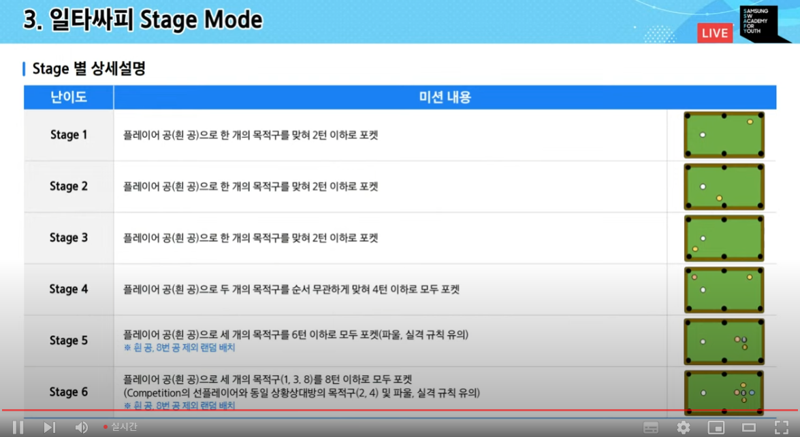
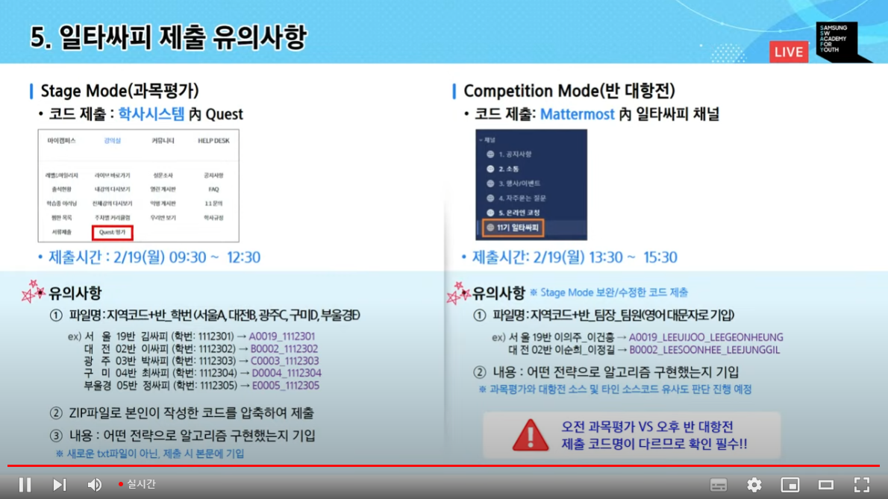
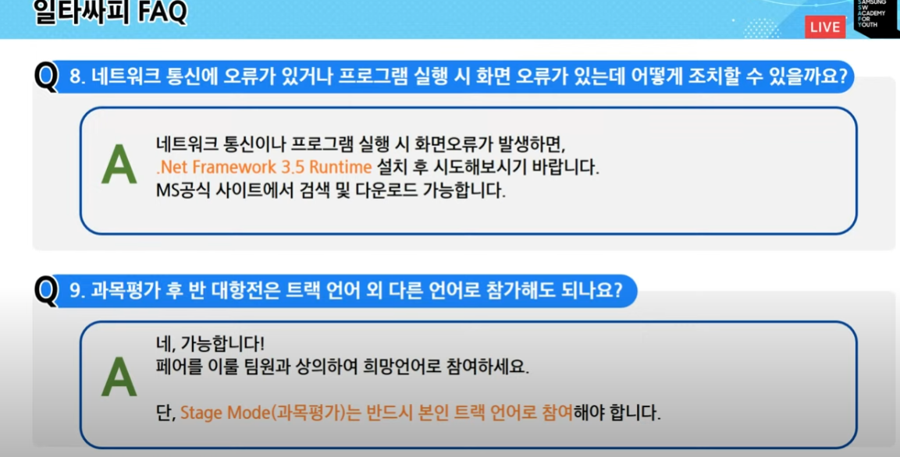
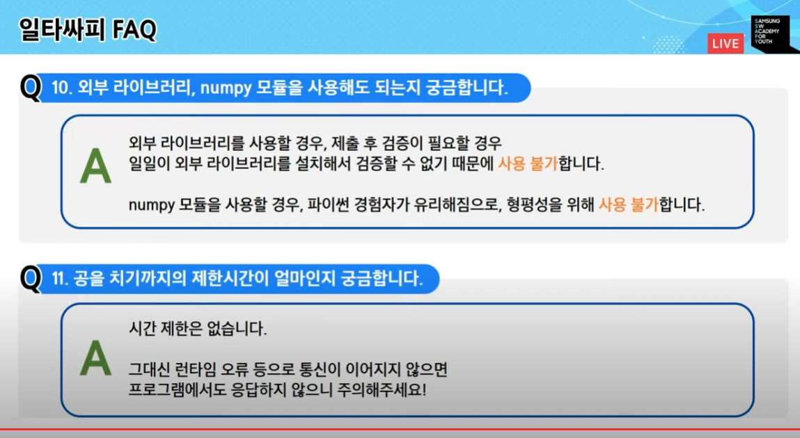
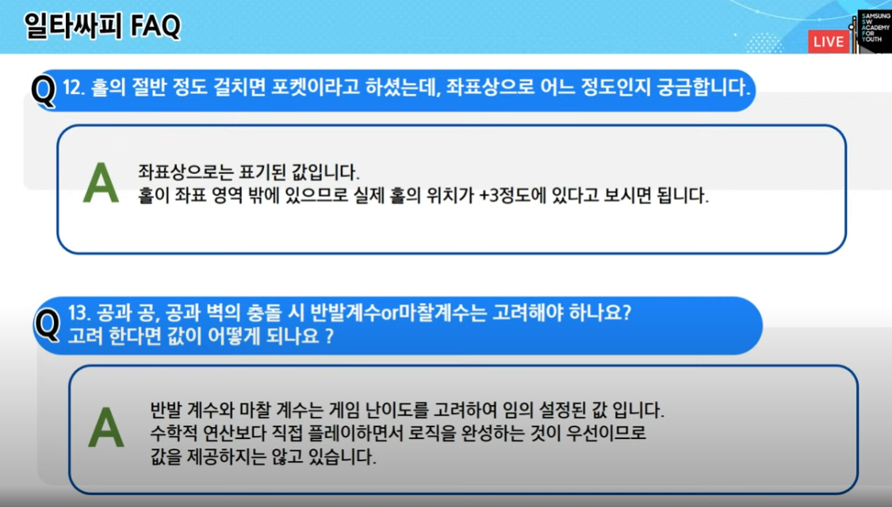

당구 제작 프로젝트

- 포켓볼과 동일한 규칙 적용
- 목적구 3개를 먼저 넣는 팀이 승리
- 게임을 플레이 하는 코드를 알고리즘으로 구현

1. 게임을 실행하면 선플레이어 선택
2. 선플레이어는 1,3,8 후플레이어는 2,4,8
3. 흰 공을 번갈아치고, 자신의 목적구를 먼저 맞혀야 한다.
4. 본인의 목적구를 포켓에 넣으면 한 번 더 칠 수 있는 기회가 주어진다
5. 본인 목적구를 모두 넣으면 8번 공을 넣는다
6. 흰 공을 넣으면 정 가운데에서 다시 시작

3) 게임 종료
   1. 정상적인 플레이에서

싸피 깃-> 플레이-> 나의 팀 정보->

과목평가 소스 코드를 학사 시스템에 12시 반까지 제출해야함

<과목평가>
학사시스템에다가

1. 서울4반 -> A0004
2. zip파일로 압축
3. 어떤 전략으로 알고리즘 구현했는지 기입 (제출 시 본문에)

<반 대항전>
mm에다가

==================

당구대 규격 가로 254 세로 127 공 직경 5.73

홀에 절반정도 들어가면 됨

공을 치는 세기와 각도를 인자로 받음. 거리를 계산할 떄 피타고라스, 각ㄷ를 계산할 때 삼각함수와 라디안

하나의 코드로 모두 클리어 할 수 있도록. 중간에 오류나면 점수 없음

- 외부 라이브러리 사용 불가능

- 홀 좌표로는 +3 정도라 생각
