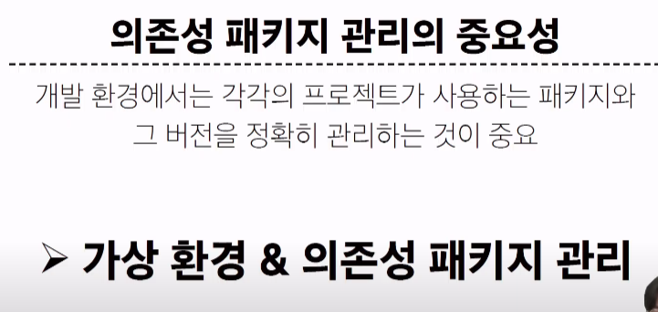
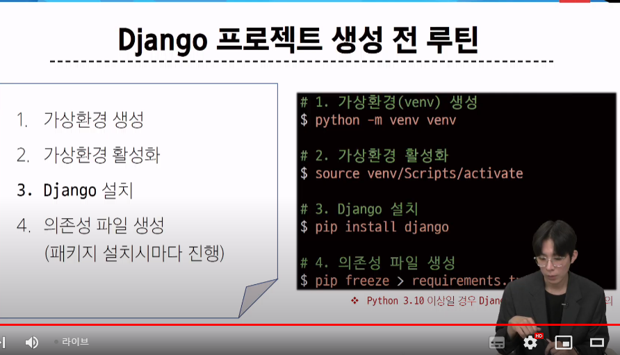
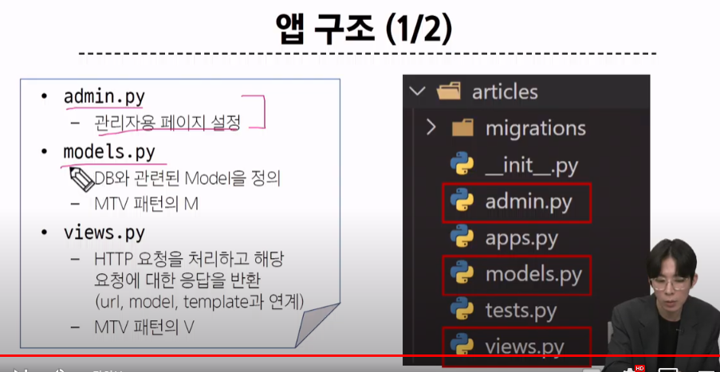

# Django 01 Intro & Design Pattern

파이썬 3.9점대여야 함, git bash -> python -V

## Web Application

> 우리는 장고를 통해서 뭘 만들 것인가?

웹 어플리케이션(웹 서비스) 개발

### 클라이언트와 서버

#### 웹의 동작 방식

우리가 컴퓨터 혹은 모바일 기기로 _웹 페이지를 보게 될 때까지_ 무슨 일이 일어날까?

- 클라이언트

  - 서비스를 요청하는 주체, 우리, (웹 사용자의 인터넷이 연결된 장치, 웹 브라우저)

- 서버
  - 클라이언트의 요청에 응답하는 주체(웹페이지, 앱을 저장하는 컴퓨터)

이 과정이 굉장히 빠르게 일어남. 중요한건 2의 요청과, 3의 응답

### Frontend & Backend

#### 웹개발에서의 프론트와 백

- 프론트엔드
  - 사용자 인터페이스(UI)를 구성하고, 사용자가 애플리케이션과 상호작용할 수 있도록 함
    - HTML,CSS,JS 등
- 백엔드
  - *서버측*에서 동작하며(요청에 대한 응답), 클라이언트의 요청에 대한 처리와 데이터베이스와의 상호작용 등을 담당
    - 서버언어(python,java)및 백엔드 프레임워크, 데이터베이스, API, 보안 등

> 결국 백엔드는 *응답*을 만들어내는 작업

## Franework

### Web Framework

#### '웹 서비스 개발'에는 무엇이 필요한가?

하나의 서비스를 만들 때, 굉장히 많은 작업이 필요하다.

이걸 개발자가 모두 직접 하는건 현실적으로 불가능함

그렇기에 잘 만들어진 것들을 가져와서 좋은 환경에서 내 것으로 잘 사용해야 한다.

> 거인의 어깨 위에서 프로그래밍하기

< Web Framework >

웹 어플리케이션을 빠르게 개발할 수 있도록 도와주는 도구 (기본 구조, 규칙, 라이브러리 등을 제공)

### Django

파이썬 기반의 대표적인 웹 프레임워크

< 왜 장고를 사용할까? >

물론, 이 정도 규모의 어플은 하나의 프레임워크만 사용하진 않음

> 우리의 목적 : Django를 사용해서 서버를 구현할 것(응답을 생성)

### 가상환경

- python 애플리케이션과 그에 따른 패키지들을 격리하여 관리할 수 있는 _독립적인_ 실행 환경
- 우린 기존의 pip install을 통해 Global 환경에 설치하여 사용함(Numpy, pandas 등).
- 이제부턴 독립된 가상환경 사용

< 왜 가상환경이 필요? >

1. 

2. 

< 환경 구조 예시 >

<가상환경 만들기 >

1. 가상환경 venv 생성 (Virtual environment)

깃 배쉬에 하는거임

이름은 내 마음대로 만들 수 있음. 그러나 그러지 마라. 걍 venv로 만든다.

2. 가상 환경 활성화

스위치를 키고 내리는 과정. 우리가 가상 환경으로 들어간다고 생각하면 이해가 힘들다

이거 이후에 이해 안 되면 수업 다시 들어라

Scripts 파일에 있는 activate 파일을 켜라.

주의: 절대로 파일 내를 바꾸지 마라

이걸 켰으면, 이제 이 아래는 이전과 전혀 다른 환경이다.

밖에서 다시 git bash를 키면 global 환경이다.

3. 패키지 목록 확인

환경이 켜진지 확인하려면 pip list 입력해서 내 파이썬에 깔려 있는 라이브러리를 모두 확인해라

< 패키지 목록이 필요한 이유>

<의존성 패키지>

> 그럼 내가 쟤 코드를 실행시키려면 어떤 패키지가 필요한데?

4. 의존성 패키지 목록 생성 - 다른 사람에게 보내주기 위해

이렇게 만들어진걸 깃헙에 올려서 다른 사람에게 보내준다.

## Django 프로젝트

<전처리 >

<시작 >

- 프로젝트 생성

  

  저 뒤의 점은(.) '현재위치'를 의미. 이게 없으면 좀 번거로움.

- 서버 키기

  

  이건 장고 main.py에서 배쉬에 입력

< 장고 프로젝트 생성 루틴 정리 + git >

git ignore는 gitignore.io 사이트에서 만든다

## 참고

### LTS (Long Term Support)

- 안정적인 장기 지원 버전 (사실상 메인 버전)

### Django는 Full stack framework인가?

## Design Pattern

디자인 패턴

- 소프트웨어 설계에서 발생하는 문제를 해결하기 위한 일반적인 해결책(공통적인 문제를 해결하는 데 쓰이는 형식화 된 관행) - > 일종의 표준 틀
  - '애플리케이션의 구조는 이렇게 구성하자'라는 관행

< MVC 디자인 패턴 >

view : 사용자에게 보여주는 부분

장고에서는 이름을 바꿔서

< MTV 디자인 패턴>

### project&app

프로젝트는 앱을 포함한 개념

프로젝트 안에 각각의 역할을 하는 앱이 포함되어 있다.

< 앱을 사용하기 위한 순서 >

1. 앱 생성
2. 앱 등록 on pjt

이 순서를 반드시 지켜야 한다.

참고로 서버 켜져있으면 더 진행 못 한다. ctrl+c를 통해 서버 꺼라

1. 앱 생성

마지막에 나오는 앱의 이름은 복수형으로 쓰는걸 추천

2. 앱 등록

등록은 리스트 맨 앞에 넣는걸 추천

< 프로젝트 구조 >

사실상 우리가 볼건 settings와 urls 뿐

< 앱 구조 >

결국 여기서 볼 건 admin models views 3개.

그럼 MTV의 T는? T는 사용자에게 보여지는 부분이므로 사실상 프론트의 영역

1 2 3 4 순서가 중요/ 작성도 이 순서로 한다.

함수 이름이나 리스트 이름은 프레임워크의 약속이니 딱히 별 생각 안 해도 된다. 의문 가지지 마라.

1. URLs - 입구 on pjt
   

   path 함수의 두 번째 요소는 호출할 view 함수(일을 할 친구)

   근데 view 는 app에 존재 -> import 해야한다.

2. view
   이건 app에 있다.

3. Template

과정 중 약속

< 데이터 흐름에 따른 코드 작성 >

< Render 함수 >

> 규칙

# off-line

초반에 못 따라가면 중간에 손을 놓아버린다

1. 가상환경 제작하기

- 폴더를 만들어서 git bash로 'python -m venv venv'

2. activate 실행

- source venv/Scripts/activate
- deactivate하면 가상환경 벗어나갈 수 있다
- 이러면 이제 venv가 실행되는거다.

3. 장고 설치

- pip install django
- pip list 하면 여러개가 설치됐다 -> 의존성 파일
  if) 업그레이드 필요(warning 뜨면)
- 1.  경로 변경
  - cd venv/Scripts/
- 2.  이후에 나와있는 내용 복붙해서 upgrade
  - python.exe -m pip install --upgrade pip
- 3. 다시 경로 변경
  - cd ../..

4. 의존성 파일(txt) 생성
   - pip freeze > requirements.txt
   - 이거 이름 절대 바꾸지 마라
   - 현재 django 이외의 파일을 '의존성파일'이라 한다
   - 장고 설치하면서 같이 설치되어 의존되는 파일
   - why? 이것도 깃헙할 때 반드시 push한다. 다른 환경에서도 똑같이 해야되기 때문에. 파일들은 clone이 안된다.
   - 그럼 어떻게 하냐?
     > pip install -r requirements.txt

- 이러면 해당 txt 파일 내에 있는 파일들이 다운받아진다.

5. 프로젝트를 생성하고 바로 어플 생성

   - 프로젝트
     - django-admin startproject firstpjt .
     - 뒤에 반드시 . 붙여라. 현재 directory(venv)에 만든다는 뜻
     - _manage.py가 venv 안에 있어야 한다_
     - 아니면 manage.py가 firstpjt 안에 있을거다
   - 앱
     - python manage.py startapp articles
   - 네이버에서 메인 페이지가 프로젝트, 그 안에 메일 같은 기능들이 앱
   - 프로젝트 내에 여러 앱들이 존재한다
   - 먼저 프로젝트의 url로 접근하고, app의 url에 접근한다. (url 맵핑)
   - > 앱을 만들면 항상 등록을 해야한다. 그리고 서버 시간을 바꾼다. 무조건 이거부터 해라
   - pjt의 settings에 들어가서 Installed*Apps 리스트에 articles 이름을 *맨 위에\* 추가
   - 겸사겸사 Timezone을 Asia/Seoul로 바꾼다. 대문자 확인

6. 서버가 잘 만들었는지 확인

   - python manage.py runserver
   - You have 18 unapplied migration(s). Your project may not work properly until you apply the migrations for app(s): admin, auth, contenttypes, sessions.
     Run 'python manage.py migrate' to apply them.
   - 이런 에러가 뜬다. admin 사이트가 없어서 생기는 현상
   - 서버 사이트에 들어가서 주소창 localhost에 /admin 추가하면 admin 접속이 가능
   - 에러를 해결하려면 앱에 있는 admin에 들어가라
   - from .models import Post
   - admin.site.register(Post) # admin.site에 Post를 등록한다
   - 이제 models에 Post를 만들면 된다
   - 다 만들었으면 아래 명렁어 순서대로 입력
   - python manage.py makemigrations
   - python manage.py migrate
   - < admin 계정 생성 >
   - python manage.py createsuperuser
   - 아이디와 패스워드 생성

7. 추가내용

   - 만약 프로젝트의 urls에서 앱의 urls 파일로 접근하고 싶다면?
   - > from django.urls import path,include
   - > path('articles/',include('articles.urls')) # articles의 urls.py로 접근한다. 없으면? 만들면 된다
   - 이제 앱의 urls를 만들어야 한다. 이건 내가 올린 디렉토리 참고
   - 여기서부턴 그걸 참고
   - 만약 html 안 되면 ctrl + , 한 다음 emmet 의 include language에서 django-html , html
     > urls의 마지막은 무조건 ,가 들어가야 한다.
     > 왜 가상환경을 만들까? 독립적인 개발환경을 위해
