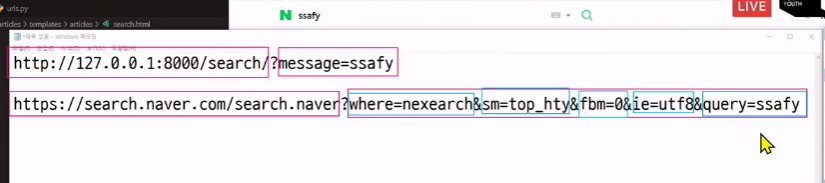

# Template & URLs

- 템플릿 상속
- HTML form

## Template System

데이터의 *표현을 제어*하면서, 표현과 관련된 부분을 담당

> html 콘텐츠를 _변수 값에 따라_ 바꾸고 싶다면?


템플릿 일부분을 변수로서 사용해야 함

템플릿의 변수는 view 함수(템플릿 담당자)에서 적용한다.


이런 식의 문법으로 사용

### Django Template Language(DTL)

- 템플릿에서 _조건, 반복, 변수_ 등의 프로그래밍적 기능을 제공하는 시스템 -> html에도 논리 언어처럼 사용

#### DTL Syntax

1. Variable
2. Filters
3. Tags
4. Comments

5. Variable

- render 함수의 세 번째 인자로 딕셔너리 데이터를 사용
- 딕셔너리 key에 해당하는 문자열이 template에서 사용 가능한 변수명이 됨
- dot('.')을 사용하여 변수 속성에 접근할 수 있음


2. Filters

- 표시할 변수를 수정할 때 사용 ('변수 | 필터')
- 연속된 사용이 가능, 일부 필터는 인자를 받기도 함
- 이미 있는 필터가 존재 ex) 길이를 재는 length 필터
- django 공식 문서의 documentation에서 filter 검색하고 bulit-in template tags and filter
- 혹은 원하는걸 django document + 키워드 를 구글에 검색해라
- django document dtl filter


1. Tags

- *반복 또는 조건*등 논리를 수행하여 제어 흐름을 만듦
- 양 끝이 % 와 {}로 쌓임
- 약 24개 정도 빌트인이 존재
- 일부 태그는 종료 태그가 따로 존재 ex) 반복 {if} {endif}


4. 주석

- {# ~ #}
-  ~ 

### 예시

작성 순서는 항상 url -> view -> template

url 갯수가 우리가 할 수 있는 일

## 템플릿 상속

- 만약 모든 템플릿에 bootstrap 적용하려면 모든 템플릿에 cdn(링크)를 작성해야 할까?

> 부모 템플릿을 만들고 거기에 cdn을 넣은 후, 자식 템플릿이 상속할 수 있게 하면 되지 않을까?

### 템플릿 상속

- 1)페이지의 공통요소를 포함하고, 2)하위 템플릿이 재정의 할 수 있는 공간 을 정의하는 기본 'skeleton' 템플릿을 작성하여 상속 구조를 만드는 것

1. 상위 템플릿(뼈대) 작성
2. block 지정(이름 필요)
3. 하위 템플릿에서 extend
4. 하위 템플릿의 block 작성

#### 데이터를 보내고 가져오기

'form'을 활용하여 사용자와 애플리케이션간 소통 관계를 확인


요청은 어떻게?

1. URL을 입력
2. Form을 활용

< form의 대표적인 예시 >

- 로그인 화면


#### form element

- 사용자로부터 *할당된 데이터*를 서버로 전송
- 웹에서 사용자 정보를 입력하는 여러 방식(text,password,checkbox 등)을 제공

#### fake NAVER 실습

form을 자동완성하면 action을 할당해야함

http://127.0.0.1:8000/search/?message=dsda -> dsda는 내가 입력한 값. message는 key. 결국 서버에 키-벨류 형태로 왔다갔다함



위랑 아래랑 똑같은 구조이다.

URL + ? + 데이터 변수

가장 중요한건 마지막 query = ssafy

이것만 남기고 다 지워도 검색이 된다.

수업 놓침

#### 사용자 입력 데이터를 받아 그대로 출력하는 서버 만들기

##### 오늘 가장 중요한 내용


why? 페이지가 2개. return 하는 페이지가 2개고, 역할이 2개니깐


request의 큰 덩어리의 GET이라는 속성 안에는 딕셔너리 상태로 message가 키, 입력값이 value로 존재


### DTL 주의사항


## URLs

url 내부에 변수를 할당할 수도 있음

### url 주의 사항


# off-line

1. url 매핑
2. 템플릿 상속
3. DTL
4. GET 방식, POST 방식
5. variable routing

## 템플릿 상속

> base 디렉토리에다가 templates를 만들면?

템플릿 상속 -> 템플릿의 재사용성 때문에 하는것.

프로젝트의 settings에 들어가서 비어있는 Templates의 'DIRS'를 'BASE_DIR / 'templates',' 로 바꿔야함. 기존엔 app의 템플릿으로 디폴트 되어있었지만 이젠 바뀜


### DTL 반복, 조건

```django
  <li>{{food}}</li></ul>

   <p>메뉴가 소진되었습니다</p> 
   <p>무엇을 드시겠습니까?</p>
  


```

### 가짜 네이버

#### GET과 Post 차이?

GET : URL에 데이터가 노출

POST: URL에 데이터가 노출 x

> 그냥 POST만 쓰면 될걸, 왜 굳이 GET을 쓸까?

GET 방식이 훨씬 쓰기 간단하기 때문


### throw catch


> 만약 안 된다면?

pjt의 urls에서 include 앞에 ''를 공백으로 안 해놔서


## Variavble routing

url 안에 변수를 넣는 것


# 실습

### django_ws_2_c - variable routing

- 항상 입구는 urls


### django_hw_2_4 - variable routing

- 시작할 때 변수는 pjt의 urls에서 관리한다

- 다른 변수 지정해주는 애들은 다음 url에서 쓸 수 있도록 만들어주는것


