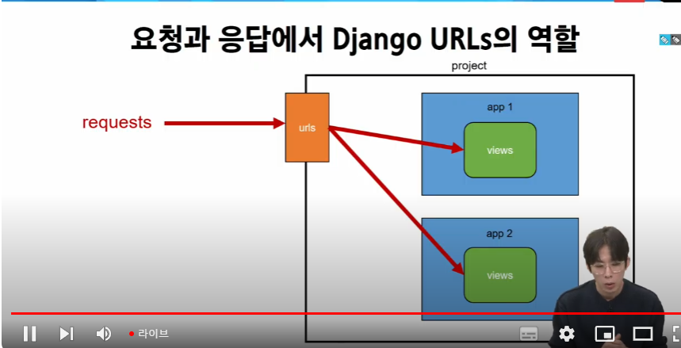

# Model

### APP, URL mapping

> 각자의 앱이 각자의 url을 관리하는 것

현재는 프로젝트에서 url을 관리하는 urls가 존재. 근데 프로젝트의 urls만 관리하면 너무 어지러워진다.

> urls를 각자의 앱으로 분산하자. 

그리고 각 앱마다 urls를 만들어준다.

> include('앱이름.urls')

#### URL 구조 변경에 따른 문제점

> url에 이름을 지어주면, 경로를 굳이 외우고 모든 url을 바꾸는게 아니라 이름만 알고 있으면 됨

> path 함수는 3번째 키워드 인자로 name을 넣을 수 있다.
> path('index/',views.index,name = 'index')

#### 주의 : 만약 여러 앱에서 이름이 겹친다면?

충돌이 일어난다.

< 해결방법 >

1. 이름 앞에 태그를 쓴다. ex) articles_index

how?

### URL 이름 공간

> app_name = '' , 이거 변수 이름 바뀌면 안됨. django 내장 변수임

변수 넣으려면 이런 식으로

다만 이러려면 index도 num이라는 변수를 받아야 함

views에서 받아야 한다.

## Model

장고의 MTV 디자인 패턴의 M, 우리가 지금까지 했던 것들 중에 유일하게 Templates와 View는 썼지만 Model은 안 썼음

- DB와 연결되어 DB를 관리한다. 주의 : 둘은 같은 개념이 아니다. 
- 우리가 지금 사용하는 데이터는 휘발성 데이터
  - throw에서 한 번 catch로 보낸건 출력 한 번 하면 사라진다.
  - why? model을 쓰고 있지 않아서
  - 우리가 쓰는 데이터를 누적시키고, 메인 페이지에 출력하려면 model과 DB가 필요하다. 
  - 이제 우리는 우리가 쓰는 데이터를 저장할 수 있다.

### Django Model

DB의 *테이블을 정의*하고 *데이터를 조작*할 수 있는 기능들을 제공

-> 테이블 구조를 설계하는 청사진

#### 테이블

> DB는 여러 테이블의 집합. 엑셀의 시트 같은 거라 생각. 
> 이 테이블들을 model에서 설계한다

오늘 할 일 ? model.py에서 설계도 만들기 배우는거

### 코드 시작

이런 테이블을 만들고 싶다

id는 장고가 알아서 만들어준다

2가지를 생각해야함. 

title과 content는 column의 이름

장고는 행렬의 줄을 Field라고 함

> charfield는 길이 제한 있는 문자열. 내가 잘못 알았네

### migrations

- 우리가 설계한 model의 변경사항(필드생성, 수정 삭제 등)을 DB에 최종 반영하는 방법

< migrations 과정 >

2가지 과정이 필요

1. model class(설계도 초안)
2. *makemigration* -> migration으로 옮기기(db가 이해할 수 있도록 해석된 최종 설계도)
3. *migrate* -> db로 최종 이동

< 핵심 명령어 2가지>

1. python manage.py makemigrations

이런 식으로 최종 설계도가 migration 파일에 들어간다

> 주의: 수정 절대 하지 마라. 수정은 model.py에서 이뤄져야 한다. 

2. python manage.py migrate
   
이제 최종적으로 db.sqlite3에 설계도를 보내는 것

최종 테이블 이름은 "앱이름_모델클래스이름"으로 합성해서 만듦

### 추가 migration

만약 이미 있는 model에 migration을 추가적으로 해야한다면?

1. model에 추가되는 내용을 작성한다.
2. 그러나 빈 필드는 추가할 수 없다
3. 기본값을 넣어야 함. -> 알림창에 나오는데로 진행하면 된다.
4. 아니면 넣을 때 기본인자로 'default = 어쩌구 저쩌구' 넣으면 된다.

1번 설계도의 일부 값을 가져와서 만든다. 

-> DP와 비슷

계속 쌓아나가는 형식. why? 이전 값으로 돌아갈 가능성이 있어서

5. migrate

< 정리 >

### 모델 필드

필드 종류

정리된건 교재 확인 

### Admin site

장고는 admin site가 자동으로 되어있다. -> 데이터 확인 및 테스트 등을 진행하는데 매우 유용

1. admin 계정 생성 - runserver 안 한 상태에서 해야한다.]
2. > python manage.py createsuperuser

3. 우리가 만든걸 admin 사이트에서 쓰려면 admin.py에 등록을 해야한다. 

< 데이터베이스 초기화 >

< CRUD >

소프트웨어가 가지는 기본적인 데이터 처리 기능

- Create(저장)
- Read (조회)
- Update (갱신)
- Delete(삭제)

# offline

이게 무슨 역할??

article에서 보이는 거

DB
- 유료:
- 무료: sqlite
