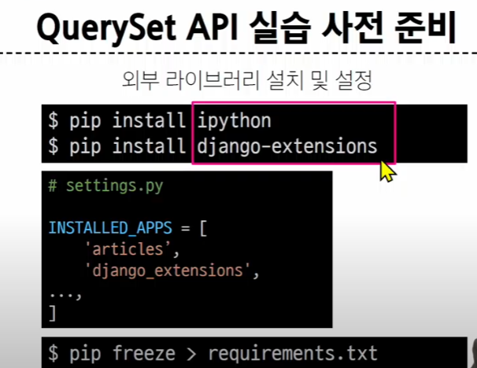
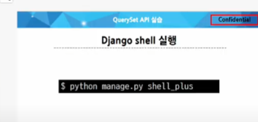
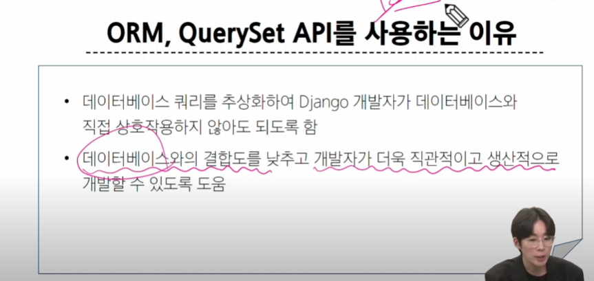

# ORM

admin 페이지 없이 데이터 건들기

## ORM

- Object-Realtional-Mapping
- 객체 지향 프로그래밍 언어를 사용하여 호환되지 않는 유형의 시스템 간에 데이터를 변환하는 기술


ORM을 쓰려면, ORM이 받을 수 있는 정의된 문법으로 써야한다.

그게 뭐다?

## QuerySet API

ORM에서 데이터를 검색,필터링,정렬 및 그룹화 하는 데 사용하는 도구

> API를 사용하여 *SQL이 아닌 Python 코드로 데이터를 처리*


QUERYSET은 다중 데이터, INSTANCE는 단일 데이터 

Instance는 Class로 만들어짐

### QuerySet API 구문

Article.objects.all()


all()이 행동,Article이 주체, Objects는 그냥 메서드들을 갖고 있는 애들(별로 중요하지 않음)

해당 명령문은 Article의 데이터를 모두 열람한다. 


우리 목표는 1과 4를 잘 다루는거

> Query? '요청'


> QuerySet? '객체의 모음', 순회가 가능함,리스트처럼 다루면 됨, 단일 데이터의 경우 인스턴스로 반환


결국 QuerySet API는 python의 모델 클래스(Article)와 인스턴스를 활용해서 DB에 데이터를 저장, 조회, 수정, 삭제(CRUD)하는 것


### 실습

장고가 이뤄지는 쉘 안에서...




shell -> ```python -i```로 들어갈 수 있음

```exit()``` 로 나갈 수 있음



그리고 이걸 settings의 applications에 추가해줘야함

#### 데이터 객체를 만드는(생성) 3가지 방법

#### 1


클래스/인스턴스


다 작성하면?


테이블 자체(뼈대)를 만들려면 migrate 해야한다

하려면 exit() 하고 venv 환경에서 해줘야함

> python manage.py migrate

이걸 해줘야 완전히 끝난거임

#### 2

> article = Article(title = 'second', content - 'django!')
> article.save()

article이란 변수는 뭘로 하든 상관 없음


#### 3

save까지 한 번에 by .create()

> Article.objects.create(title = 'second', content - 'django!')


### Read -조회


위는 다중데이터, 아래는 단일데이터

#### all()

전체데이터 조회

데이터를 반환 받으므로 articles = Article.objects.all() 로 변수에 할당 가능

#### filter() -> 특정 조건 데이터 조회

> Article.objects.filter(content = 'django!')


#### get() -> 단일 데이터 조회(인스턴스) => 조건이 들어갈수밖에 없음


> 고유성을 보장하는 조회에서 사용. 고유성 보장하는 속성? pk-> primary key, 유일 id


### update -수정

데이터 수정

> 수정/삭제 -> 먼저 조회를 해야한다!


수정하고자 하는 속성을 조회부터 해야한다.

이후엔 변수에 재할당하는것마냥 하면 된다.

물론 save()를 해야 적용된다.

### delete -삭제

> 얘도 마찬가지로 먼저 조회를 해야한다


> article.delete()

+) 지워진다고 해도, 새로 작성해도 지워진 애의 pk로 생성되지 않는다. pk는 진짜 '고유'값

## 참고

### Field lookups

- 특정 레코드에 대한 더 자세한 조건을 설정하는 방법


언더바 2개 사용하는게 대표적인 예시


### 공식문서

구글에 django queryset api


queryset은 결국, 해당 값을 리턴하거나 리턴하지 않거나 2분류 중 하나.


### ORM과 QuerySet API를 사용하는 이유



QuerySet 문법을 이용해 장고를 사용하여 DB에 바로 접근 

내일부터는 view 함수를 이용해서 할거다.

오늘 했던걸 main page에 출력해야한다. 

> url -> view -> templates : 데이터 흐름이자 작성 흐름

# offline

QuerySet API : DB에 데이터를 CRUD 하기 위한 도구(파이썬 문법)

앞으로 4일간 뭘 할거냐??

> **CRUD**

(DjangoShell을 이용해서) CRUD
   - C(reate): 게시글 생성 R(ead): 게시글 조회 U(pdate): 게시글 수정 D(elete): 게시글 삭제

## < 2일차 >

> QuerySet API를 Views.py에 적용하는게 핵심 ( 오늘 수업 마지막에 한거 + 내일부터) -> 이게 좀 어렵다

- create
  - new 메서드와 create메서드 2개를 만든다. 
  - why 2개? 
  - new : 페이지 렌더링, render - html 페이지를 사용자에게 보여주기 위해
  - create : 데이터를 DB에 저장, redirect : 경로에 대한 요청
- read
  - 이것도 2개 index와 detail
  - why 2개?
  - index: 전체 페이지(오늘한거), index.html
  - detail: 단일페이지
- update
  - edit과 update
  - why?
  - edit : 페이지를 렌더링
  - update : 수정된 데이터를 db에 저장
- delete
  - delete

## < 3일차 , 4일차 >

> create에 new를 넣어서 하나로 합친다. 그리고 update에 edit을 넣어서 하나로 합친다.

### how?

조건문으로 나눠서 합친다. create에 if/else를 넣어서

POST방식일 때와 아닐 때를(GET방식) 조건문으로 나눈다. 

> Post방식이 언제 적용될까? 사용자가 어떤 액션을 취했을 때?

- 사용자가 생성(create)/수정(update) 버튼을 눌렀을 때 포스트 방식이 적용된다.


## 추가 실습

생성하는 3가지 방법 중 2번을 써라

3번은 엥간하면 x

1,2번과 3번의 차이는 save를 하지 않냐, 하냐의 차이인데, 바로 save() 해버리면 불상사 발생 가능

데이터 관리의 핵심 원칙 :

1. 보안성
2. 안정성
 
=> 데이터를 저장할 때 바로 값만 넣는 것 보다는 중요한 몇 가지 과정을 거쳐서 저장한다.
