# Django Form

view 함수의 최종 형태

- Django Form
  - Form class
  - widgets
- Django ModelForm
- Handlng HTTP


## Django Form

- Html 태그에서 이미 사용 중이었음
  - 사용자 데이터를 받아서 특정 사이트로 보내주는 역할

### 개요

- 지금까지 사용자로부터 데이터를 받기 위해 활용한 방법
- 비정상적 혹은 악의적인 요청을 필터링할 수 없다는 단점 존재
  
> 유효한 데이터인지에 대한 확인 필요

### 유효성 검사

: 수집한 데이터가 정확하고 유효한지 확인하는 과정

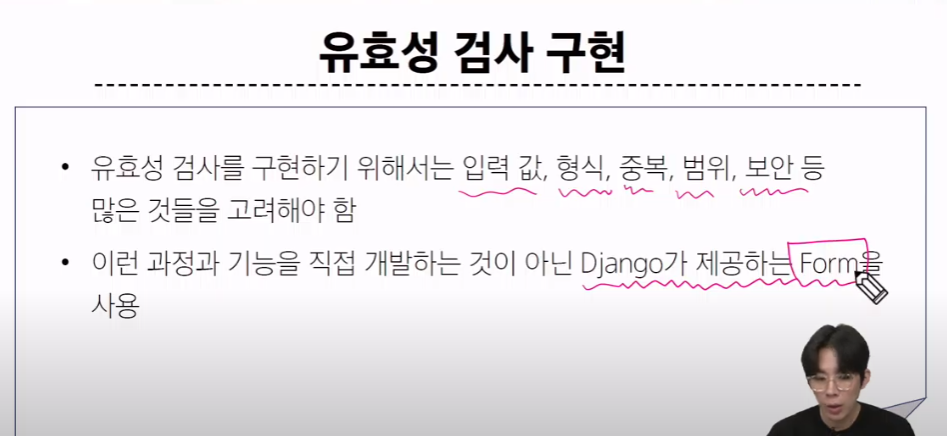


### Form Class

이 Form이 Class로 존재함

### Django Form

사용자 입력 데이터를 수집하고, *처리 및 유효성 검사*를 수행하기 위한 도구

> 유효성 검사를 단순화하고 자동화 할 수 있는 기능을 제공

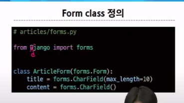

근데 forms.py 가 없으니깐 만들어줘야함

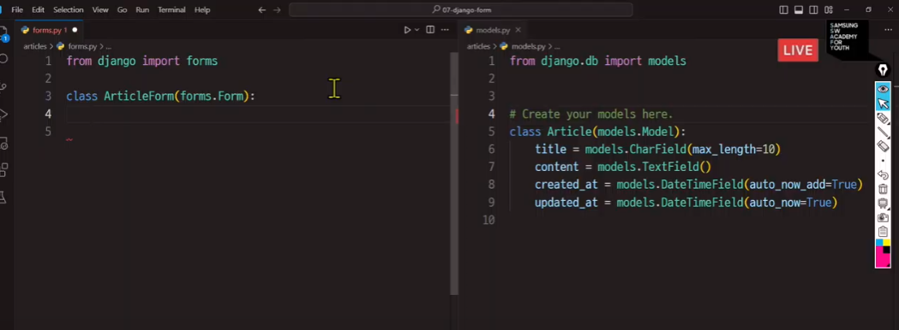

model과 굉장히 유사


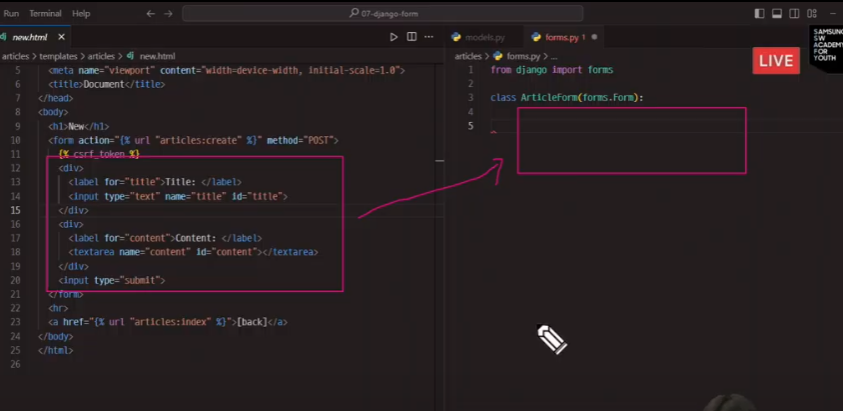

지금까지 form 블럭을 이용해 직접 표기하던걸 클래스로 작성할거다.

model의 CharField와 Form의 CharField는 아예 다른거다

그럼 그렇게 작성한걸 view 함수에서 어떻게 사용하냐?

1. from .forms import ArticleForm

2. 사용할 수 있도록 함수 내에 장착한다.

```py
def new(request):
    form = ArticleForm()
    context = {
        'form' : form
    }

    return render(request,'article/new.html',context)
```

3. 그럼 이걸 html에서는 어떻게 사용하냐?

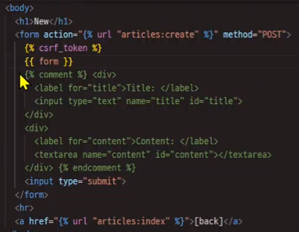

> 주의 : submit과 토큰은 들어있지 않다.


>근데 이 상태에선 유효성 검사가 제대로 되지 않는다. 

실질적으로 DB에 저장해놓는건 create()함수

> div로 묶을 수가 없는데?
> 이건  {{form.as_p}}를 html에 넣으면 됨 -> 각각의 라벨을 < p >로 묶는 명령어
> as_div,as_table,as_p,as_ul 4가지 존재

> 특정 스타일을 넣고 싶은데?
> widgets

### widgets

input의 표현을 변경

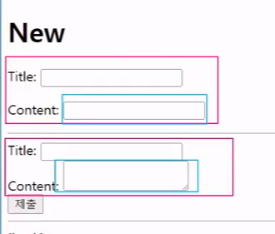

아래가 예전꺼다. content의 텍스트 계열을 바꾸고 싶은데..

*widget은 클래스에서 작성해야 한다*

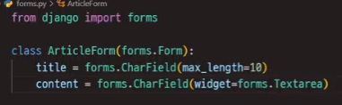

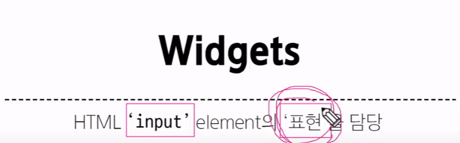

거창한거 없이 표현만 담당

### Django 'Model'Form


우리가 지금까지 사용하던건 Form. 근데 용도에 따르면 ModelForm 쓰는게 더 이득

> 만약 사용자 입력 데이터가 많으면?

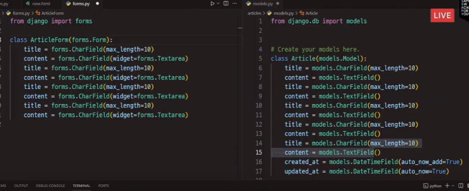

이걸 처리할 수도 있음

modelForm은 모델에 있는걸 자동으로 인식할 수 있기 위해서 존재하는거임

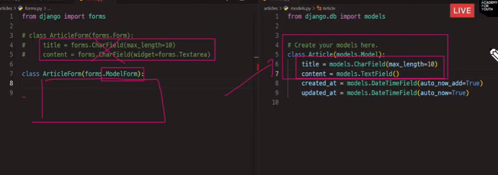

#### ModelForm 사용법

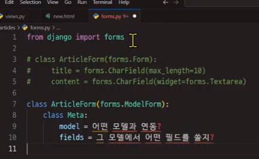

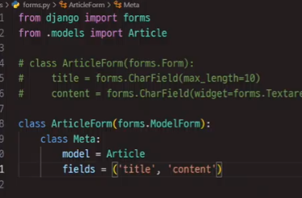

> 전체 필드를 가져오려면?

> fields = '__ all __'


+) 메타? 메타데이터의 그 메타

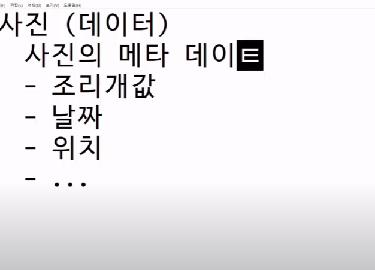

=> 데이터에 대한 데이터

그럼 메타 클래스는 클래스에 대한 클래스


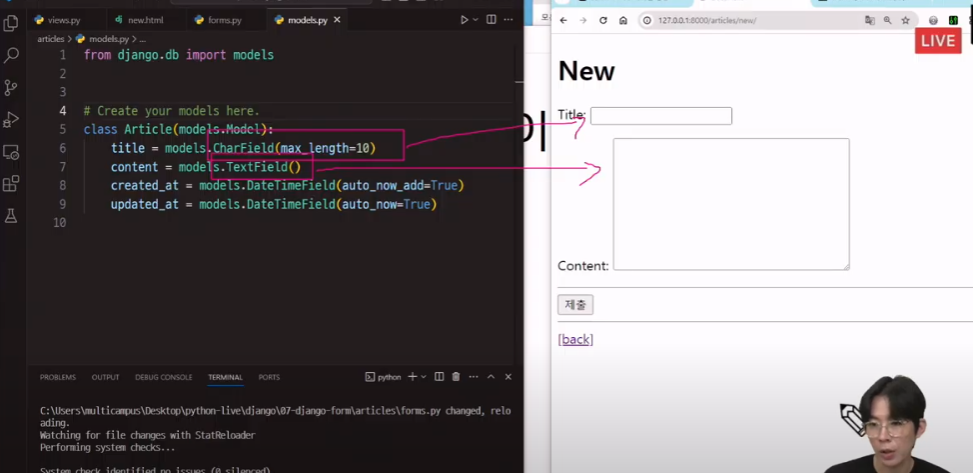

심지어 widget을 안 해줬어도 content를 textarea로 만들어줌. why? model을 읽어오는 거라서

#### Meta Class

ModelForm의 '정보를 작성'하는 곳 이라고 생각

#### exclude

특정 데이터만 빼고 싶다면 exclude = (~) 사용하면 됨

### ------------------------
> 아직 유효성 검사는 안 했음

> save()직전에 ModelForm에서 유효성 검사를 한 번 할 예정이다


### ModelForm을 활용한 create 함수 (DB) 저장

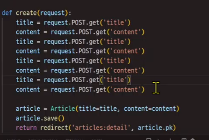

기존엔 데이터를 이렇게 사용했지만, 이젠 굳이 그럴 필요가 없음

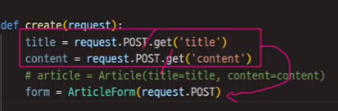

데이터 덩어리만 잘 넣어주면 나머진 ModelForm 이 판단한다.

#### 유효성 검사, is_valid( )

> form.is_valid() -> 리턴 값이 True 아니면 False임 => 기준점을 토대로 여부 확인 가능
> => 조건문 활용

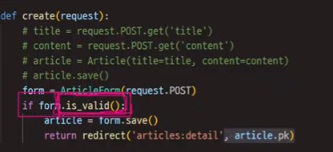

그럼 유효성 검사를 통과하지 못한다면?

참고) 공백값(그냥 띄어쓰기만 쓰는거)은 따로 제한조건 넣지 않는다면 False

+) 빈 값이 아니라 아예 안 쓰면 HTML에서 안 써줌

> is_valid를 통과하지 못한 form은 모델 폼이 하나의 정보를 넣어둔다
> *에러메세지*
> 그래서 이 에러메세지를 출력할 수 있다


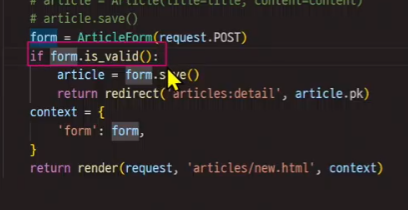


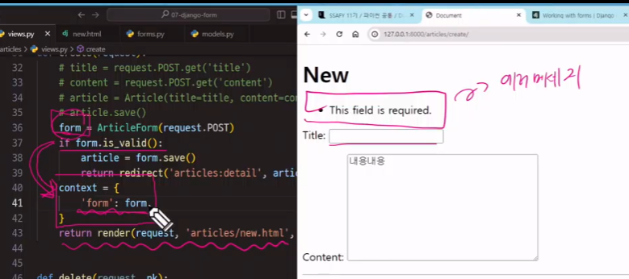

>근데 왜 굳이 redirect가 아닐까?

1. 바뀐 form을 가져갈 수 없다
2. new로 되돌아가는게 아니라, new를 *재실행* 시키는것. => new함수의 form 변수가 새로 생성되서 사용된다.

> 결국 errormessage를 볼 수가 없다


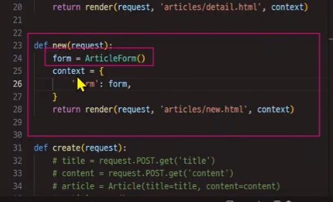

### edit 페이지 

> todo 앞에 수업 내용 더 있음

#### save()의 생성, 수정 판단

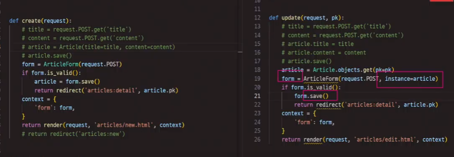

> 생성과 수정을 가르는건 결국 이전 정보의 여부
> 만약 수정을 하고 싶다면, form의 데이터를 받는 부분에 인스턴스 요소로 기존 데이터를 넣어줘야 한다.
> 그래야 save()가 생성과 수정을 구분한다.


#### edit page의 pk

일반 공백으로 넣으면 페이지 자체에 에러가 생겨버린다.

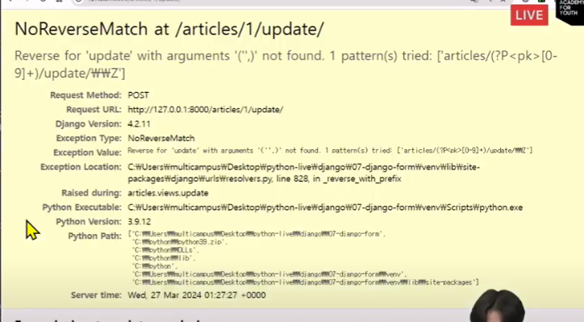

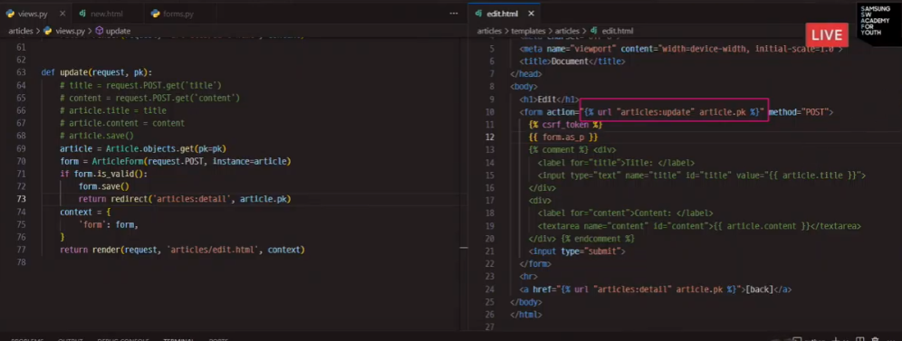

그럼 뭐가 문제일까? 

> is_valid 전에는 잘 되는데 -> 이 이후가 문제
> articles/edit.html에 갔을 떄, article.pk가 존재하지 않음(context에서 안 보내줌)
> => article 정보를 context에 추가해준다.


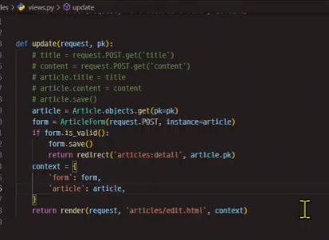


## Handling HTTP requests

### view 함수 구조 변화

> new와 create의 공통점과 차이점?


> 차이점을 기준으로 2개의 view 함수를 하나로 합친다.

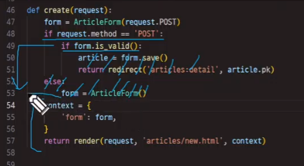

> post에서 is_valid를 통과하지 못 할 경우를 대비해서 들여쓰기를 하지 않는다

> 왜 if post냐?
> form의 데이터를 직접적으로 건들기 때문에, 가장 중요한 케이스인 POST를 건드는 것
> todo 이 부분 다시 들어라


# offline

> form과 modelform의 차이?

- 사용자의 입력을 받은 후 DB에 저장하냐, 안 하냐의 차이


1. 먼저 forms.py를 제작하고 작성해야 한다.

```py

from django import forms # 장고의 forms 모듈부터 갖고 와야 django form을 만들 수 있음

# class ArticleForm(forms.Form): # 장고의 Form을 상속받아서 새로운 폼 작성
#     title = forms.CharField(max_length=10)
#     content = forms.CharField(widget=forms.Textarea) # 크기 조절이 가능하도록 위젯 사용
    
# 사실 일반 폼이 아니라 modelform을 사용해야함

from .models import Article

class ArticleForm(forms.ModelForm):
    class Meta:
        model = Article # 갖고오고 싶은 모델이 있다. 걔를 적용할거. 근데 사용하려면? import를 해줘야함
        field = '__all__' # 필드는 내가 갖고 오고 싶은 테이블 내 행의 종류.(데이터 종류), 여기서 '__all__'은 싹 다 갖고오라는 뜻
        # widget을 적용하고 싶다? 강의자료의 widget 응용 확인
        

```

2. 이제 이걸 적용해야한다

> 위에서 아래로 외우는게 아니라 흐름의 순서대로 작성

#### create() 함수

> 우리가 하려고 하는 것

1) 사용자가 폼 페이지를 처음 방문(GET요청), 비어있는 폼을 랜더링, 사용자가 데이터를 입력할 수 있도록 하려고 함

2) 폼을 제출하면(POST 요청), 제출된 데이터로 인스턴스를 생성하고 
3) 유효성 검사, 유효하면 DB에 저장하고 사용자를 상세 페이지로 리다이렉트

1 - 1) 제출 버튼을 누르지 않은 경우(POST 요청이 아닌 경우) -> 모든 필드가 비어있는 상태로 사용자에게 보여지게

```py
# 1qjs
from .models import Article
from .forms import ArticleForm
def create(request):
    form = ArticleForm(request.POST)
    context = {
        'form' : form
    } # 여기까지가 1번
    
    return render(request,'articles/create.html',context)
```

```py
from .models import Article
from .forms import ArticleForm
def create(request):
    if request.method == 'POST': # 제출 버튼을 누른 경우 -> 받아서 유효성검사를 해야함 
        form  = ArticleForm(request.POST)
        # 유효성검사
        # 1. 모든 필수 필드가 채워져있다
        # 2. 입력된 데이터가 필드의 조건(ex 데이터 형식)을 만족해야 한다.
        if form.is_valid():
            article = form.save()
            return redirect('articles:detail',article.pk)
    else: # 제출버튼을 누르지 않은 경우
        form = ArticleForm() # 1-1. 비어있는 폼 보내기
        
    # form = ArticleForm(request.POST)
    context = {
        'form' : form
    } # 여기까지가 1번
    
    return render(request,'articles/create.html',context)
```


#### edit()

```py
def update(request,pk):
    article = Article.objects.get(pk=pk)
    
    if request.method == POST: # 제출버튼을 눌렀다
        form = ArticleForm(request.POST,instance=article) # 기존 데이터도 넣어주기
        
        if form.is_valid(): # 유효성 검사. 유효하다면
            form.save() # form에 새로운 데이터로 수정한거까지 저장
            return redirect('articles:detail',article.pk)
            
        
    else: # 제출버튼 누르기 전. 얘부터 작성
        
        # 기존 데이터를 form instance에 넣어준다
        form = ArticleForm(instance = article)
        
    context = {
        'article' : article,
        'form' : form,
    }
    
    return render(request,'articles/update.html',context)
```


#### 이제 html 내에서도 바꿔야ㅐ 한다.


```html
<!-- index -->



<h1>Articles</h1>
<hr>
<a href="">NEW</a>
<hr>

<p>글 번호 : {{article.pk}} </p> 
<a href="">
    <p>글 제목 : {{article.title}} </p>
</a>

<p>글 내용 : {{article.content}} </p>


 이제 반복문 때문에 articles 안에 있는 article들의 정보 모두 나온다(1번글, 2번글 3번글) 



```

```html

<!-- detail.html -->




<h2>DETAIL</h2>
<hr>
<h3>{{article.pk}}번째 글</h3>
<hr>
<h3>제목 : {{article.title}}</h3>
<h3>내용 : {{article.content}} </h3>
<h3>작성시간 : {{article.created_at}} </h3>
<h3>수정시간 : {{article.updated_at}}</h3>

 백버튼 만들기 
<a href="">[BACK]</a>

 삭제 버튼 만들기 
<form action=""method = 'POST'>
    
    <input type="submit" value = "DELETE">
</form>

<a href="">EDIT</a>
 이거 edit에서 update로 


```
> 실질적인 form 변경

```html
<!-- create.html -->

<form action="" method = "POST"> 
     이거 new에서 create으로 
     포스트 방식 


{{form as_p}}
<!-- 이게 추가된거임 -->
```

#### urls.py

안 쓰는 애들은 주석처리

```py
from django.contrib import admin
from django.urls import path,include
from . import views

app_name = 'articles'

urlpatterns = [
    path('',views.index,name = 'index'),
    path('<int:pk>',views.detail,name = 'detail'),
    # path('new/',views.new,name = 'new'),
    path('create/',views.create,name = 'create'),
    path('<int:pk>/delete/', views.delete, name = 'delete'),
    # path('<int:pk>/edit/',views.edit, name = 'edit'),
    path('<int:pk>/update/',views.update,name = 'update'),
]
```

