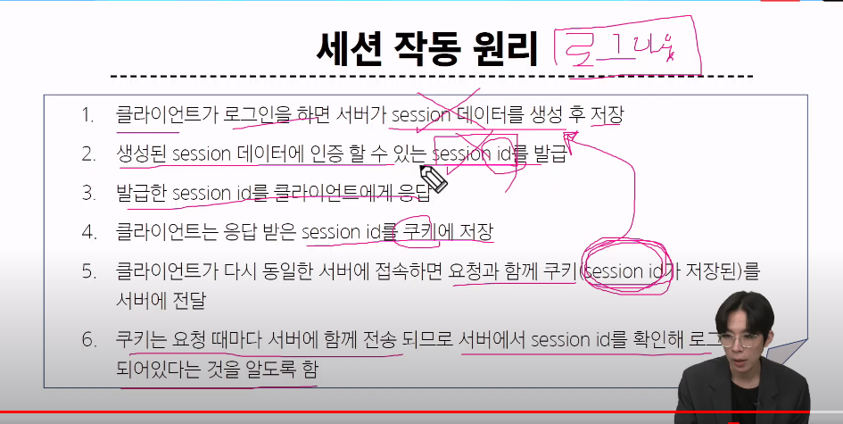

# Authentication system

HTTP는 서버에 요청에 대해 응답할 때 서버를 끊어버림


상태가 존재하지 않음

- 장바구니에 담은 상품을 유지할 수 없음
- 로그인 상태를 유지할 수 없음

> 상태를 유지하기 위한 기술이 필요
> 쿠키

## 쿠키

- 서버가 사용자의 웹 브라우저에 전송하는 *작은 데이터 조각*
- 클라이언트 측에서 저장되는 작은 데이터 파일이며, 사용자 인증, 추적, *상태 유지* 등에 사용되는 데이터 저장방식

> 쿠키의 사용


내가 로그인 했다는 정보를 유지하기 위해 매 요청마다 쿠키를 함께 보낸다


결국 쿠키는 **상태를 유지하기 위해** 사용되는 기술


웹브라우저에서 개발자도구의 네트워크 탭을 통해 확인할 수 있음


> 쿠키의 사용 목적

1. 세션 관리
2. 개인화
3. 트래킹

### 세션

서버 측에서 생성되어 클라이언트와 서버 간의 상태를 유지


 



> 세션 데이터를 주는게 아니라 접근 가능한 key(session id)를 주는 것
> 세션은 서버에서 저장

+) 쿠키의 수명


> 세션 IN DJANGO

이미 세션 테이블이 존재함

중요한건 쿠키와 세션의 원리만 알고 있으면 된다. 관리는 우리가 안 하고 장고가 알아서 해 줌


## 인증 시스템

### 인증

사용자가 자신이 누구인지 확인하는 것(신원확인)

#### 인증에 대한 사전 준비

- app을 새로 만들어야 함.
- 지금까지의 앱은 게시판 용, 얘는 로그인 용
- accounts로 지정하는 것을 권장  
- 이제 프로젝트 urls를 수정해야함

#### custim user model

User Model => 우린 이미 사용하고 있었다. admin 계정


저 안에 user model에 대한 설계도가 있었음. 이제 이걸 custom 해야함

> why?


> 어떤 사이트는 이메일로 아이디를 사용할 수도 있음
> 근데 있는 그대로의 user model로는 그게 불가능하고, 이걸 수정할 수도 없음
> 그래서 대체할거임.

< 대체하기 >

1. models에서 user class를 만들거임


AbstractUser는 현재 내장되어 있는 유저 모델과 완전히 같음. 이제 이걸 그대로 복붙해오고, 여기서 수정할거임

2. 근데 장고는 아직 기본 설정을 내장된 유저 모델로 사용하고 있음. 이걸 수정해야함

> settings에서!


> AUTH_USER_MODEL을 auth.user 에서 accounts.user로 변경

3. admin 사이트에 등록

- admin에서 user라는 그룹은 내장되어 있었기 때문에 기본으로 보였음
- 다시 보여지려면 이제 이걸 재등록해줘야함


# offline


항상 이 흐름 생각

## 1. 사용자 모델 설정

```py
AUTH_USER_MODEL = 'accounts.User' # 사용자 모델로 accounts 앱에 있는 User 클래스를 사용하겠다
```

새로 작성

## 2. project의 url부터 (흐름 생각)

urls에서 accounts 관련 추가

```py
urlpatterns = [
    path('admin/', admin.site.urls),
    path('articles/', include('articles.urls')),
    path('accounts/',include('accounts.urls')),
]
```

## 3. app의 url로

```py
from django.contrib import admin
from django.urls import path

from . import views

app_name = 'accounts'

urlpatterns = [
 path('login/',views.login,name = 'login'),
 path('logout/',views.logout,name = 'logout'), 
]

```

## 4. views.py

```py
from django.shortcuts import render,redirect

# Create your views here.
from django.contrib.auth.forms import AuthenticationForm # 사용자 인증과 관련된 Form

from django.contrib.auth import login as auth_login # 로그인 기능 사용하기 위해

from django.contrib.auth import logout as auth_logout # 로그아웃 기능 사용하기 위해


def login(request):
    if request.method == 'POST': # 2. 로그인 버튼을 눌렀으면(갔다 왔으면)
        form = AuthenticationForm(request, request.POST) # 4. 인증폼을 생성하고(request), 로그인 정보를 넣었으면 그 정보를 처리해라(request.POST)
        
        if form.is_valid(): # 5. 유효성 검사
            # create과 달리 얘는 save()할 게 아니라 유효하면 로그인 기능을 사용하면 됨
            auth_login(request,form.get_user()) # 6. 유효하면 사용자 로그인
            return redirect('articles:index') # 7. 기본 페이지로 리다이렉트
        
    else: # 2. POST 요청이 아닐 때(로그인 버튼을 누르기 전), 이거부터 해라. # else부터 처리
        form = AuthenticationForm() # 1. 처음에 로그인 요청을 접근하면(GET요청, 단순 클릭) 로그인을 위한 url로 빈 form과 함께 넘어가면 된다. 
        # 3. 로그인 버튼 누르기 전에는 빈 인증폼 생성
    
    context = {
        'form' : form
    }
    return render(request,'accounts/login.html',context) # 빈 인증폼을 로그인을 위한 html로 보낸다. 이 html은 입력한 정보를 POST 방식으로 다시 해당 함수로 보내줌


def logout(request):
    pass
```

## 5. model! ... 건들기 전에 admin.py 부터

```py
from django.contrib import admin

# Register your models here.
from django.contrib.auth.admin import UserAdmin
# UserAdmin : 사용자 모델 관리자, 장고의 기본 디폴트. 

from .models import User # 클래스명 반드시 이걸로 지어야 한다. 
# why? settings에서 AUTO_USER_MODEL = 'accounts.User' 했음

admin.site.register(User,UserAdmin) # UserAdmin을 통해 User를 사용하겠다.
```

## 6. models.py

> 팁 : from django.contrib.auth.models 이거 외우기 귀찮으면 django의 settings에 설치된 앱 보면 나와있음

```py
from django.db import models

# Create your models here.

from django.contrib.auth.models import AbstractUser
# 이건 클래스임. 기본 사용자 모델을 확장하기 위함

class User(AbstractUser): ##### 이거 이름 중요!!!!!!!!!!!
    pass # 이건 내일 
# AbstractUser 클래스를 상속 받은거임
```

#### 주의 : 아직 migration 하면 안 된다

## 7. migration

- 초기화를 하고 migration을 해야 함.
- 초기화 방법은 따로 알아보자


## 8. Templates

```html

<!-- login.html -->




<h1>로그인</h1>
<form action=""method = "POST">
    
    {{form.as_p}} 
    <!-- form 만든거 넘겨주니깐 그냥 이거 쓰면 됨 -->
    <input type="submit" value = '로그인'>
</form>


```

인덱스에도 추가

```html
<!-- index.html -->

 <a href=""> LOGIN </a>

  <h3>Hello, {{user.username}}</h3>
  <!-- user: 현재 로그인 한 사용자
    username: django 사용자 모델에서 기본적으로 제공하는 기본 필드 -->
```

# logout

