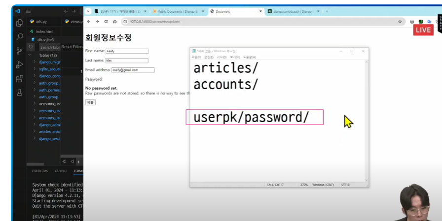

## 회원가입
- User 객체를 Create 하는 과정

### UserCreationForm()

- 회원 가입 시 사용자 입력 데이터를 받는 built-in *ModelForm* => DB에 저장

urls 작성 -> views 작성 -> html 작성


modelform은 인자 구성이

```python
UserCreationForm(데이터)
```
> 사실상 create와 판박이
> 근데 유효성 검사가 뭔가 이상함


> why? UserCreationForm이 모델 폼이다.


> 모델폼은 기반이 되는 모델이 존재한다

> 우린 프로젝트의 디폴트를 auth.User에서 accounts.User로 바꿨는데 얘는 안 바뀜(빌트인이라서)


> create 뿐만 아니라 change도 수정해줘야함 (미리)

```py
# - forms.py 제작한 후 -


from django.contrib.auth.forms import UserCreationForm, UserChangeForm

# from .models import User

from django.contrib.auth import get_user_model # 현재 django 프로젝트에 활성화된 User 객체를 반환하는 함수
class CustomUserCreationForm(UserCreationForm):
    class Meta(UserCreationForm.Meta):
        model =  get_user_model() #우리가 대체한 유저모델
        # 왜 그냥 모델에서 User을 안 갖고오냐? 
        # 직접 참조하지 않고 간접 참조하는게 이득인 이유?
        # 이름 변경이나 User의 대체 등을 대비하기 위해
        
        
class CustomUserChangeForm(UserChangeForm):
    class meta(UserChangeForm):
        model = get_user_model()
```

> 이제 이 form을 views에서 적용해야 함

```py

# views.py

from django.contrib.auth.forms import UserCreationForm
def signup(request):
    if request.method == 'POST':
        form = UserCreationForm(request.POST)
        if form.is_valid():
            form.save()
            return redirect('articles:index')
    else:
        form = UserCreationForm()
    context = {
        'form' : form,
    }
    return render(request,'account/signup.html',context)

```
> 이걸 변경

```py
# from django.contrib.auth.forms import UserCreationForm
from .forms import CustomUserCreationForm
def signup(request):
    if request.method == 'POST':
        form = CustomUserCreationForm(request.POST)
        if form.is_valid():
            form.save()
            return redirect('articles:index')
    else:
        form = CustomUserCreationForm()
    context = {
        'form' : form,
    }
    return render(request,'account/signup.html',context)
```

> 이제 메인페이지에 회원가입 버튼 추가

```html
-index.html-

 <a href="">[SignUp]</a>
```

## 회원 탈퇴

1. Urls


2. views

```py
def delete(request): # article을 delete하는 것과 비슷
    # 삭제하고자 하는 User를 조회 후 삭제?
    # 주의!!!!!!!!!! 로그인을 했건 안 했건 현재 request에 user 정보가 들어있다
    request.user.delete() 
    return redirect('articles:index')
```

3. 삭제 버튼 추가

```html
<!-- index.html -->
 <form action="" method = 'POST'>
    
    <input type="submit" value = '회원탈퇴'>
  </form>
```

> 에러가 뜬다. why? 로그인을 안 했기 때문에
>
> 로그인 이후에 해라. -> 마지막에


## 회원정보 수정(Update)

### UserChangeForm()

- 얘도 DB에 저장하므로 modelForm


> 근데 그냥 사용하면 사용자가 보면 안 되는 정보들도 많음
>
> why? admin에서 갖고 온거라
>
> => forms.py에서 fields를 수정

``` py
#forms.py
class CustomUserChangeForm(UserChangeForm):
    class meta(UserChangeForm):
        model = get_user_model()
        fields = ('first_name','last_name','email',)
```

> 비밀번호 변경은 별도의 form이 존재 

### views

```py
from .forms import CustomUserChangeForm
def update(request):
    now_user = request.user # 굳이 조회할 필요 없다 + 그냥 변수 지정 안 하고 집어넣어도 된다
    if request.method == 'POST':
        form = CustomUserChangeForm(request.POST, instance = now_user)
        form.save()
        return redirect('articles:index')
    else:
        form = CustomUserChangeForm(instance = now_user)
    
    context = {
        'form' : form
    }
    return render(request,'accounts/update.html',context)
```

## 비밀번호 저장

### PasswordChangeForm()

> 얘는 모델폼이 아니다

why? 패스워드는 암호화되어 저장된다.



> 다만 urls가 문제가 있다

주의 : 장고가 userpk/password라는 특정 url을 지정해놓는다.


```py
# 프로젝트의 urls
from accounts import views

urlpatterns = [
    path('admin/', admin.site.urls),
    path('articles/', include('articles.urls')),
    path('accounts/', include('accounts.urls')),
    path('<int:user_pk>/password/', views.change_password,name = 'change_password' ) # 주의 : 여기는 appname이 존재할 수 없다
]

```

```py

# accounts의 views.py
from django.contrib.auth.forms import PasswordChangeForm
def change_password(request):
    if request.method == 'POST':
        form = PasswordChangeForm(request.user,request.POST)
        if form.is_valid():
            form.save()
            return redirect('articles:index')
    else:
        form = PasswordChangeForm(request.user) # 얜 무조건 첫번째 인자로 user가 들어가야 한다.
    
    context = {
        'form' : form
    }
    return render(request,'accounts/change_password.html',context)
```

```html
<!-- change_password.html -->
<!DOCTYPE html>
<html lang="en">
<head>
  <meta charset="UTF-8">
  <meta name="viewport" content="width=device-width, initial-scale=1.0">
  <title>Document</title>
</head>
<body>
  <h1>비밀번호 수정</h1>
  <form action="" method="POST"> 
     앱네임이 없고 그냥 프로젝트 이름만 
    
    {{ form.as_p }}
    <input type="submit">
  </form>
</body>
</html>
```

```html
<!-- index.html -->
<a href="">[회원정보수정]</a>
```
### 세션무효화(비밀번호 변경 후 로그아웃) 방지하기


```py
#views
# 기존 비밀번호 변경에서 수정
from django.contrib.auth import update_session_auth_hash
def change_password(request):
    if request.method == 'POST':
        form = PasswordChangeForm(request.user,request.POST)
        if form.is_valid():
            user = form.save()
            update_session_auth_hash(request,user) # 요청과, 방금 막 바뀐 애
            return redirect('articles:index')
    else:
        form = PasswordChangeForm(request.user)
    
    context = {
        'form' : form
    }
    return render(request,'accounts/change_password.html',context)
```

## 인증된 사용자에 대한 접근 제한

### 1. is_authenticated 속성(attribute) => 호출(뒤에 ()붙이는거)하면 안된다


- true 아니면 false


> 어떻게 html에서 따로 안 보내도 request라는 변수를 쓸 수 있을까?


> 모든 템플릿에서 request를 기본으로 사용할 수 있음
>

- 근데 request 안에 user가 존재한다.
- 그래서 그냥 user보다는 request.user를 사용한다(상관은 없는데 직관성 때문에)


#### index 수정

```html
  
  <h2>반갑습니다, {{ user.username }} 님</h2>
  <a href="">[회원정보수정]</a>
  <a href="">CREATE</a>
  <form action="" method="POST">
    <input type="submit" value="Logout"> 
    <form action="" method = 'POST'>
    
    <input type="submit" value = '회원탈퇴'>
  </form>
  </form>
  
  <a href="">Login</a>
  <a href="">[SignUp]</a>
    
  
```

> 근데 이건 단순히 출력만 바꾼거고, 진짜 접근제한을 하려면 views를 바꿔야 함


#### views 수정


```py
def login(request):
    if request.user_is_authenticated: # 이미 인증된 사용자라면(로그인 되어있다면)
        return redirect('articles:index') # 다시 메인 페이지로
    if request.method == 'POST':
        form = AuthenticationForm(request, request.POST)
        if form.is_valid():
            auth_login(request, form.get_user())
            return redirect('articles:index')
    else:
        form = AuthenticationForm()
    context = {
        'form': form,
    }
    return render(request, 'accounts/login.html', context)
```

### 2. 데코레이터 활용


# offline

# 회원가입
## 1. pjt url부터
```py
from accounts import change_pw
urlpatterns = [
    path('admin/', admin.site.urls),
    path('articles/', include('articles.urls')),
    path('accounts/',include('accounts.urls')),
    path('<int:user_pk/password/',views.change_pw,name = 'change_pw'),
]
```
## 2. app의 url

- 회원가입
- 회원탈퇴
- 회원정보변경

```py
from django.contrib import admin
from django.urls import path

from . import views

app_name = 'accounts'

urlpatterns = [
 path('login/',views.login,name = 'login'),
 path('logout/',views.logout,name = 'logout'),
 path('signup/',views.signup,name = 'signup'), # 회원가입
 path('delete/',views.delete,name = 'delete'), # 회원탈퇴
 path('update/',views.update,name = 'update'), # 회원정보변경
]
```

## 3. views

# 회원탈퇴

# 비밀번호 변경

### urls 

```py
# 프로젝트의 urls
from django.contrib import admin
from django.urls import path, include
from accounts import views
urlpatterns = [
    path('admin/', admin.site.urls),
    path('articles/', include('articles.urls')),
    path('accounts/',include('accounts.urls')),
    path('<int:user_pk/password/',views.change_pw, name = 'change_pw'), # 뒤에 / 빼먹지 마라
]
```

### views

```py
from django.contrib.auth.forms import PasswordChangeForm # 사용자 인증과 관련된 Form
from django.contrib.auth import update_session_auth_hash # 사용자 세션에 대한 인증 해쉬, 사용자 비밀번호를 변경했을 때 주로 호출, 사용자의 세션 인증에 사용되는 해시가 업데이트 되었을 때 사용
# 사용자 계정 보안을 강화하기 위해 사용

def change_pw(request,user_pk):
    if request.method == 'POST':
        form = PasswordChangeForm(request.user,request.POST)
        if form.is_valid():
            user = form.save()
            
            # 세션의 인증 해시 업데이트
            ###########################
            # 이 부분이 다르다.
            update_session_auth_hash(request,user)
            return redirect('articles:index')
    else:
        form = PasswordChangeForm(request.user)
    context = {
        'form' : form,
    }
    return render(request,'accounts/change_pw.html',context)

### templates

```html
<!-- change_pw.html -->



<h1>비밀번호 변경</h1>
<form action="" method = "POST">
    <!-- 여기서 user_pk 같이 보내줘야 한다 + urls 확인 -->
    
    {{form.as_p}}
    <input type="submit" value = '비밀번호 변경'>
</form>



```