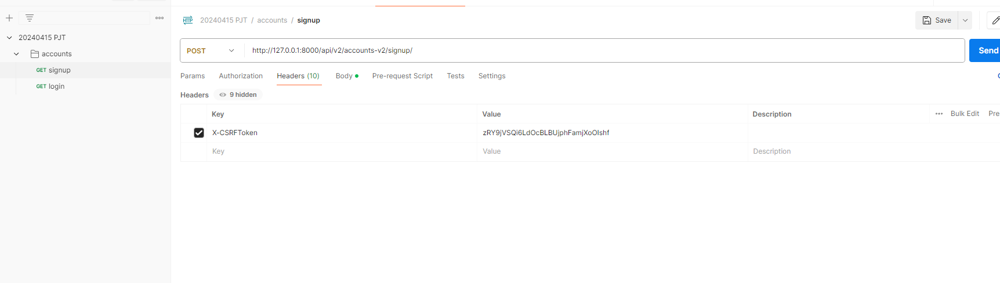

# DFI

Django REST Framework

1. DRF가 뭔지?
   - 뭐하는 친구인지?
   - REST가 무엇인지?
     - 지금까진 장고로 백엔드, 프론트엔드 다 섞었는데/ 이제 분리.
     - Frontend -> 화면. 무언가를 누르면 뭐가 발생하는가. 
     - 장고는 서버, 다른건 클라이언트(프론트)
     - API는 장고와 프론트 사이 데이터를 왔다갔다 할 수 있게 하는거
    > 우리의 목적 : API 서버를 개발하는 것

    - 그런데 우리는 API 서버를 '잘' 만들어야 한다!
    - -> API 서버를 잘 만드는 **방법론** = REST
    - REST (Representational State Transfer)
    - 방법론 : ~~한 규칙이나, 가이드가 존재
    - 규칙?
      - 1. URI는 리소스를 표현해야 한다.
        - URI : 리소스를 식별하는 문자열
        - ex) 'http://127.0.0.1:8000/articles/'
        - 행위에 대한 표현은 여기에 들어가지 말아야 한다. 
          - ex) GET /articles/1/   -> o
          - ex) GET /articles/1/delete -> x(잘못된 URI 구성)/ 삭제라는 행위가 들어감
          - ex) DELETE /articles/1/    -> o(차원에 대한 표현 = URI/ 행위 = HTTP Method)
      - 2. 행위는 HTTP Method로 표현한다.
        - GET : 조회. 서버로부터 화면을 가져옴
        - POST : 생성(삽입) -> 서버로 데이터를 보낼 때
        - PUT : 수정(전체 수정)
        - PATCH : 수정(부분 수정)
        - DELETE : 삭제
      - 추가적인 규칙
        - 1. 슬래시 구분자(/)는 계층 관계를 나타내는데 사용한다.
          - 유저가 가진 articles를 조회?
          - GET users/{userid}/articles
        - 2. 언더바(_)는 URI에 사용하지 않는다.
          - 하이픈(-)은 URI의 가독성을 높이는 데 사용
          - ex) user example
          - GET users/userexample/  -> x
          - GET users/userExample/  -> x
          - GET users/user_example/ -> x
          - GET users/user-example/ -> o
        - 3. URI에는 소문자를 쓰자
          - RFC3986(URI 문접 형식 표준) 대소문자를 구별하도록 규정
          - 대소문자에 따라 다른 리소스로 인식
        - 이외에도 수많은 규칙들이 존재
        - 참고하면 좋은 영상
          - .

- API 서버이기 때문에 return을 render같이 화면을 주지 않을 것이다.
- 데이터를 돌려주는 것!
- 무슨 형태(타입)로? JSON
- DJANGO 코드 -> JSON 변환(serializer가 해줌) -> 클라이언트 반환
- se

## password 암호화

serializers.py에서 수정

## 쿠키와 세션

##

