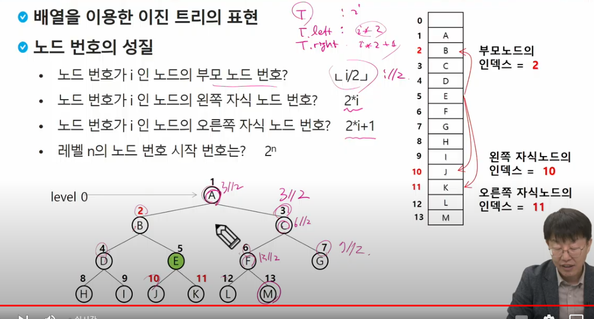
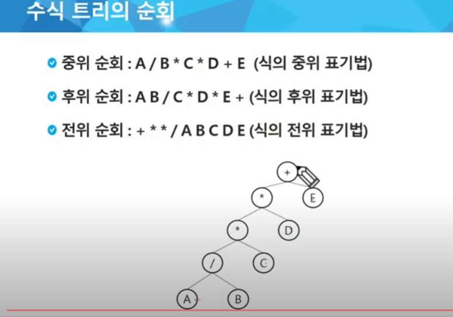
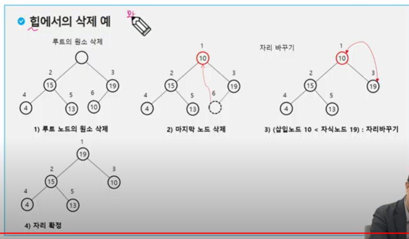

# 8. 트리

## 트리

### 트리의 개념

- 비선형 구조
- 원소들 간에 1:n 관계를 가지는 자료구조
- 원소들 간에 계층관계를 가짐
- 상위 원소에서 하위원소로
- _한 개 이상의 노드로 이루어진_ 유한집합이며 다음 조건을 만족한다.
  - 노드 중 최상위 노드를 루트라 한다
  - 나머지 노드들은 n개의 분리집합(T1,T2,T3...Tn)으로 분리될 수 있다
- 이 분리집합들은 각각 하나의 트리가 되며(재귀적 정의) 루트의 부 트리(subtree)라 한다
- 끝쪽을 단말노드, 혹은 잎노드 라고 한다.
- 노드 - 트리의 원소
- 간선(edge) -노드를 연결하는 선, 부모 노드와 자식 노드를 연결
- 루트 노드 : 트리의 시작 노드
- 형제 노드(sibling node) - 같은 부모 노드의 자식 노드들
- 조상 노드 - 간선을 따라 루트 노드까지 이르는 경로에 있는 모든 노드들 (부모를 쭉 따라가는거)
- 서브트리 부모 노드와 연결된 간선을 끊었을 떄 생성되는 트리
- 자손노드 - 서브 트리에 있는 하위 레벨의 노드들
- 차수(degree)
  - 노드의 차수: 노드에 연결된 자식 노드의 수
  - 트리의 차수: 트리에 있는 노드의 차수 중에서 가장 큰 값
  - 단말노드(리프노드) : 차수가 0. 트리의 마지막. 자식 노드가 없는 노드
- 높이
  - 노드의 높이: 루트에서 노드에 이르는 간선의 수. 노드의 레벨
  - 트리의 높이: 트리에서 최대 레벨

+) 자식 노드끼리 연결되면 트리라 하지 않는다

## 이진트리

- 모든 노드들이 2개의 서브트리를 갖는 특별한 형태의 트리
- _각 노드가 자식 노드를 최대 2개 까지만 가질 수 있는 트리_
  - 왼쪽 자식 노드(left child node)
  - 오른쪽 자식 노드(right child node)
- shb) 이지선다
- 1:2의 관계가 지속된다

### 이진트리 특성

- 레벨 i에서 노드의 최대 개수는 2^i개
- 높이가 h인(레벨 0부터 h까지) 이진 트리가 가질 수 있는 노드의 최소 개수는 (h+1)개(모두 1개)가 되며, 최대 개수는 (2^0+2^1+2^2+2^3 = 2^4 -1!, 2^(h+1)-1)개(루트노드만 1개고 모두 2개)(자식 노드만 따지는건가?)가 된다

### 포화 이진 트리(Full Binary Tree)

- 모든 레벨에 노드가 포화 상태로 차 있는 이진 트리(모든 노드가 2개의 자식 노드를 가짐) (조건1)
- 높이가 h일 때, 최대의 노드 개수인 (2^(h+1)-1)의 노드를 가진 이진 트리
- 루트를 1번으로 하여 2^(h+1)-1까지 *정해진 위치*에 대한 노드 번호를 가짐(조건2)

### 완전 이진 트리

- 높이가 h이고 노드 수가 n개일 때., 포화 이진 트리의 노드번호 1번부터 n번까지 빈 자리가 없는 이진트리
- shb) 덜 된 포화이진트리

### 편향 이진 트리

- 높이 h에 대한 최소 개수의 노드르 가지면서, 한 쪽 방향의 자식 노드만을 가진 이진 트리
  - 왼쪽 편향 이진 트리
  - 오른쪽 편향 이진 트리
- 선형 구조와 차이가 없는, 상대적으로 비효율적인 트리(트리의 장점을 못 살림)

## 순회

이진 트리를 돌아다니는 것

- 순회란 트리의 각 노드를 중복되지 않게 전부 방문(visit)하는 것. 트리는 비 선형 구조이기 때문에 선형구조에서와 같이 선후 연결 관계를 알 수 없다.
- 트리의 노드들을 체계적으로 방문하는 것
- 따라서 특별한 방법이 필요하다 - 3가지
- 3가지의 기본적인 순회방법 - 부모의 위치에 따라 용어가 달라짐 (V: 부모노드. L:왼쪽서브트리 R: 오른쪽서브트리)
  - 전위 순회VLR
    - 부모 노드 방문 후, 자식 노드를 좌,우 순서로 방문(처리)한다.
  - 중위순회 : LVR
    - 왼쪽 자식노드, 부모노드, 오른쪽 자식 노드 순으로 방문한다
  - 후위순회 : LRV
    - 자식 노드를 죄우순서로 방문한 후, 부모노드로 방문한다.

## 구현방법

### 전위순회

- 수행방법
  1. 현재 노드n을 방문하여 처리한다 -> V
  2. 현재 노드 n의 왼쪽 서브트리로 이동 -> L
  3. 현재 노드 n의 오른쪽 서브트리로 이동한다 -> R
- 전위 순회 알고리즘

```py
def prorder_traverse(T): #전위 순회
    if T: #T가 존재, 실제 존재하는 노드라면
        visit(T) #print(T.item)
        preorder_traverse(T.left) # 왼쪽 서브트리, 이게 return 되면 아래 있는 코드 처리
        preorder_traverse(T.right) # 오른쪽 서브트리
```

트리의 깊이가 100개만 되도 2^100 -1 정도의 노드가 나와버린다. 재귀로만 해도(최대 998) 충분함

> 트리 -> 정점이 굉장히 많아도 깊이를 얕게 할 수 있음

트리의 순회 순서를 잘 확인해라 (교재 그림 확인)


### 중위 순회

- 수행방법

1. 현재 노드 n의 왼쪽 서브트리로 이동 :L
2. 현재노드 n을 방문하여 처리 :V
3. 현재노드 n의 오른쪽 서브트리로 이동 :R

- 중위 순회 알고리즘

  ```py
  def inorder_traverse(T): #전위 순회
    if T: #T가 존재, 실제 존재하는 노드라면
        inorder_traverse(T.left) # 왼쪽 서브트리
        visit(T) #print(T.item)
        inorder_traverse(T.right) # 오른쪽 서브트리
  ```

  

  왼쪽 맨아래가 제일먼저, 맨아래의 부모, 맨아래의 오른쪽 자식노드 이런순서

### 후위 순회

- 수행방법
  1. 현재 노드 n의 왼쪽 서브트리 :L
  2. 현재 노드 n의 오른쪽 서브트리 :R
  3. 현재 노드 n을 방문하여 처리 :V
- 후위 순회 알고리즘

```py
  def postorder_traverse(T): #전위 순회
    if T: #T가 존재, 실제 존재하는 노드라면
        postorder_traverse(T.left) # 왼쪽 서브트리
        postorder_traverse(T.right) # 오른쪽 서브트리
        visit(T) #print(T.item)
```


- 루트를 가장 마지막에 처리

## 이진트리 표현 1 - 어떻게 구현할 것이냐

### 배열을 이용한 이진 트리의 표현

- 이진 트리에 각 노드 번호를 다음과 같이 부여
- 루트의 번호를 1로 함
- 레벨 n에 있는 노드에 대하여 왼쪽부터 오른쪽으로 2^n부터 2^(n+1)-1까지 번호를 차례로 부여


- 그럼 완전이진트리가 아닌 경우엔?

- 노드 번호의 성질
  - 노드 번호가 i인 노드의 부모노드 ? i//2
  - 노드 번호가 i인 노드의 왼쪽 자식 노드번호? i\*2
  - 노드 번호가 i인 노드의 오른쪽 자식 노드번호> i\*2 + 1
  - 레벨 n의 노드 번호 시작 번호는? 2^n



- 최대 노드는 2^i

## 이진트리 저장 방법2

1. 부모 번호를 인덱스로 자식 번호를 저장

T , T.left , T.right

c[T] = (T.left,T.right) 이런 식으로

2. 자식 번호를 인덱스로 부모 번호를 저장
   -> 루트 찾기, 조상 찾기에 편함
   - 부모가 없는(해당 인덱스에서 원소가 없으면) 노드가 루트 노드

## 연습문제


```py
def pre_order(T): # 전위순회
    if T:
        print(T, end = ' ')
        pre_order(left[T])
        pre_order(right[T])


N = int(input()) #1번부터 N번까지인 정점
E = N-1 # 간선의 갯수
arr = list(map(int,input().split()))
left = [0]*(N+1) #부모를 인덱스로 왼쪽 자식 번호 저장
right = [0]*(N+1) #부모를 인덱스로 오른쪽 자식 번호 저장
par = [0]*(N+1) # 자식을 인덱스로 부모 저장

for i in range(E):
    p,c = arr[i*2],arr[i*2+1] #부모,자식
# for i in range(0,E*2, 2):
#     p,c = arr[i*2],arr[i*2+1] # 이런 식으로 해도 된다.

    if left[p] == 0: #왼쪽 자식이 없으면
        left[p] = c
    else:
        right[p] = c

    par[c] = p # 자식 인덱스로 부모 저장하는 배열

c = N
while par[c] != 0: #부모가 있으면
    c = par[c]      # 부모를 새로운 자식으로 제할당해서 다시 부모를 확인
    # 부모가 0이면(부모가 없으면) 이게 root
root = c
print(root)
pre_order(root)
```

# Off - Line

## subtree

```py
def subtree(node):
    global cnt
    for i in range(2): # 왼쪽자식, 오른쪽 자식
        if tree[i][node]:
            n = tree[i][node]
            subtree(n)

T = int(input())

for t in range(1,T+1):
    E,N = map(int,input().split())
    temp = input().split()
    # 이진트리 초기화 --> 노드번호 1번부터 E+1

    tree = [[0 for _ in range(E+2)] for _ in range(2)]

    for i in range(E):
        p_node = int(temp[2*i]) #부모노드 -> 짝수번째
        c_node = int(temp[2*i+1]) #자식노드 -> 홀수번째

        if tree[0][p_node]==0 : #왼쪽에 자식이 없으면 왼쪽에 할당, 있으면 오른쪽에 할당
            tree[0][p_node] = c_node
        else:
            tree[1][p_node] = c_node
    cnt = 1
    subtree(N)
    print(f'#{t} {cnt}')
```

## 완전이진트릭의 규칙 on 문제

부모노드의 인덱스: n

왼쪽 자식 노드의 인덱스? 2n

오른쪽 자식 노드의 인덱스? 2n + 1

### 수식 트리

- 수식을 표현하는 이진 트리
- 수식 이진 트리 라고 부르기도 함
- 연산자는 루트 노드이거나 가지 노드
- 피연산자는 모두 잎 노드
  

### 이진탐색트리

- 탐색 작업을 효율적으로 하기 위한 자료구조
- 모든 원소는 서로 다른 유일한 키를 갖는다
- key(left) < key(root) < key(right)
- 왼쪽 서브트리와 오른쪽 서브트리도 이진 탐색 트리다.
- 중위 순회하면 오름차순으로 정렬된 값을 얻을 수 있다.

### 이진탐색트리 - 연산

#### 탐색연산

- 루트에서 시작한다
- 탐색할 키 값 x를 루트 노드의 키 값과 비교한다.
  - 키 값 x = 루트노드의 키 값 : 원하는 원소를 찾았으므로 탐색 연산 성공
  - x < rx : 루트 노드의 왼쪽 서브트리에 대해서 탐색 연산 수행
  - x > rx : 루트 노드의 오른쪽 서브트리에 대해서 탐색 연산 수행

#### 삽입 연산

1. 먼저 탐색 연산을 수행
   - 삽입할 원소와 같은 원소가 트리에 있으면 삽입할 수 없으므로, 같은 원소가 트리에 있는지 탐색하여 확인
   - 탐색에서 탐색 실패가 결정되는 위치가 삽입 위치가 된다
2. 탐색 실패한 위치에 원소를 삽입한다.

### 이진 탐색 트리- 성능

- 탐색, 삽입, 삭제 시간은 트리의 높이만큼 시간이 걸린다
- 평균의 경우
  - 이진 트리가 균형적으로 생성되어 있는 경우 O(log(n))
- 최악의 경우
  - 한 쪽으로 치우친 경사 이진트리의 경우 ~= 선형구조
  - O(n)
  - 순차탐색과 시간 복잡도가 같다.


#### 삭제 연산

## 힙 - 완전 이진트리의 일종

- 완전 이진트리에 있는 노드 중에서 키 값이 가장 큰 노드나 키값이 가장 작은 노드를 찾기 위해서 만든 자료구조
- 최대힙
  - 키값이 가장 큰 노드를 찾기 위한 _완전이진트리_
  - 부모노드의 키 값 > 자식 노드의 키 값
  - 루트노드: 키 값이 가장 큰 노드
- 최소힙
  - 키값이 가장 작은 노드를 찾기 위한 _완전이진트리_
  - 부모노드의 키 값 < 자식 노드의 키 값
  - 루트 노드 : 키 값이 가장 작은 노드

완전 이진트리를 만드는 법?

1차원 배열을 하나 만든다. 크기는 들어올 최대 갯수+1 만큼


```py
# 최대힙

N = 10 #필요한 노드 수
h = [0] * (N+1) # 최대힙

# 7 2 5 3 4 6 순으로 들어오도록

# 초기엔 마지막 노드가 0인 상태
last = 0    # 힙의 마지막 노드 번호


def enq(): # 삽입
    # 마지막 노드 추가(완전 이진 트리로 유지하기 위해)
    global last
    last += 1
    h[last] = n# 마지막 노드에 데이터 삽입

    # 부모> 자식 을 유지할 조건 추가
    c = last
    p = c//2 # 부모 노드 번호 구하는 법

    while p >= 1 and h[p] < h[c]: #p가 존재하고, 부모값이 자식 값보다 작으면
        h[p],h[c] = h[c],h[p] # 자리 바꾸기
        c = p
        p = c//2 # 다음 탐색을 위한 재할당(위 레벨로 올라감)
```

### 힙연산 - 삭제

- 힙에서는 루트 노드의 원소만을 삭제할 수 있다.
- 루트 노드의 원소를 삭제하여 반환한다.
- 힙의 종류에 따라 최대값 또는 최소값을 구할 수 있다.



- 완전 이진 트리를 유지하기 위해 실제 삭제는 마지막 노드만 삭제한다.
  - 루트를 꺼내서 일단 어딘가에 보관하고, 마지막 노드를 루트에 넣어놓는다
  - 라스트를 감소시킨다
  - 자리를 바꾼다

```py
def deq(): # 삭제
    global last
    tmp = h[1] # 루트의 키값 보관
    h[1] = h[last] #일단 루트에 마지막 노드를 옮겨놓는다
    last -= 1
    p = 1   # 새로 옮긴 뤁
    c = p*2 # 왼쪽 자식 번호

    while c<=last: # 자식이 하나라도 있으면
        if c+1 <= last and h[c] < h[c+1]: # 오른쪽 자식도 있고 오른쪽 자식이 더 크면
            c += 1 # 오른쪽 자식과 비교
        if h[p] < h[c] : #자식이 더 크면 최대힙이니깐 바꿔줘야한다
            h[p],h[c] = h[c],h[p]
            p = c
            c = p * 2
        else: #부모가 더 크면 -> 끝
            break
    return tmp # 삭제된 루트노드 값

```
