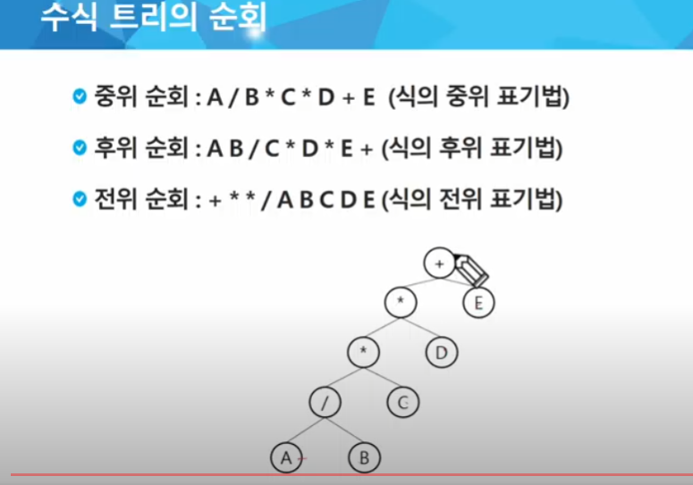
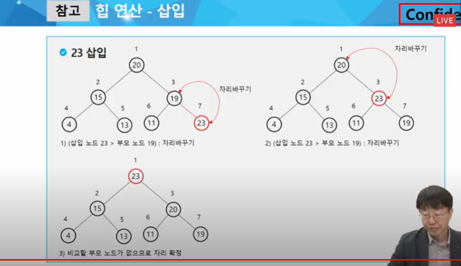
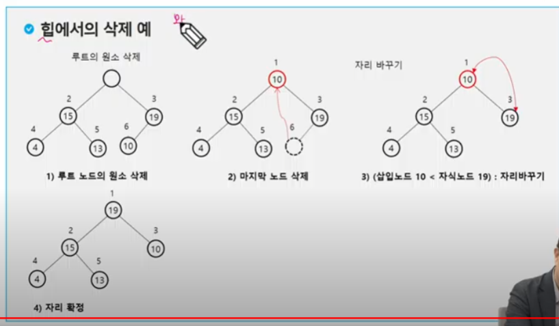

### 수식 트리

- 수식을 표현하는 이진 트리
- 수식 이진 트리 라고 부르기도 함
- 연산자는 루트 노드이거나 가지 노드
- 피연산자는 모두 잎 노드
  

### 이진탐색트리

- 탐색 작업을 효율적으로 하기 위한 자료구조
- 모든 원소는 서로 다른 유일한 키를 갖는다
- key(left) < key(root) < key(right)
- 왼쪽 서브트리와 오른쪽 서브트리도 이진 탐색 트리다.
- 중위 순회하면 오름차순으로 정렬된 값을 얻을 수 있다.

### 이진탐색트리 - 연산

#### 탐색연산

- 루트에서 시작한다
- 탐색할 키 값 x를 루트 노드의 키 값과 비교한다.
  - 키 값 x = 루트노드의 키 값 : 원하는 원소를 찾았으므로 탐색 연산 성공
  - x < rx : 루트 노드의 왼쪽 서브트리에 대해서 탐색 연산 수행
  - x > rx : 루트 노드의 오른쪽 서브트리에 대해서 탐색 연산 수행

#### 삽입 연산

1. 먼저 탐색 연산을 수행
   - 삽입할 원소와 같은 원소가 트리에 있으면 삽입할 수 없으므로, 같은 원소가 트리에 있는지 탐색하여 확인
   - 탐색에서 탐색 실패가 결정되는 위치가 삽입 위치가 된다
2. 탐색 실패한 위치에 원소를 삽입한다.

### 이진 탐색 트리- 성능

- 탐색, 삽입, 삭제 시간은 트리의 높이만큼 시간이 걸린다
- 평균의 경우
  - 이진 트리가 균형적으로 생성되어 있는 경우 O(log(n))
- 최악의 경우
  - 한 쪽으로 치우친 경사 이진트리의 경우 ~= 선형구조
  - O(n)
  - 순차탐색과 시간 복잡도가 같다.


#### 삭제 연산

## 힙 - 완전 이진트리의 일종

- 완전 이진트리에 있는 노드 중에서 키 값이 가장 큰 노드나 키값이 가장 작은 노드를 찾기 위해서 만든 자료구조
- 최대힙
  - 키값이 가장 큰 노드를 찾기 위한 _완전이진트리_
  - 부모노드의 키 값 > 자식 노드의 키 값
  - 루트노드: 키 값이 가장 큰 노드
- 최소힙
  - 키값이 가장 작은 노드를 찾기 위한 _완전이진트리_
  - 부모노드의 키 값 < 자식 노드의 키 값
  - 루트 노드 : 키 값이 가장 작은 노드

완전 이진트리를 만드는 법?

1차원 배열을 하나 만든다. 크기는 들어올 최대 갯수+1 만큼



```py
# 최대힙

N = 10 #필요한 노드 수
h = [0] * (N+1) # 최대힙

# 7 2 5 3 4 6 순으로 들어오도록

# 초기엔 마지막 노드가 0인 상태
last = 0    # 힙의 마지막 노드 번호


def enq(): # 삽입
    # 마지막 노드 추가(완전 이진 트리로 유지하기 위해)
    global last
    last += 1
    h[last] = n# 마지막 노드에 데이터 삽입

    # 부모> 자식 을 유지할 조건 추가
    c = last
    p = c//2 # 부모 노드 번호 구하는 법

    while p >= 1 and h[p] < h[c]: #p가 존재하고, 부모값이 자식 값보다 작으면
        h[p],h[c] = h[c],h[p] # 자리 바꾸기
        c = p
        p = c//2 # 다음 탐색을 위한 재할당(위 레벨로 올라감)
```

### 힙연산 - 삭제

- 힙에서는 루트 노드의 원소만을 삭제할 수 있다.
- 루트 노드의 원소를 삭제하여 반환한다.
- 힙의 종류에 따라 최대값 또는 최소값을 구할 수 있다.



- 완전 이진 트리를 유지하기 위해 실제 삭제는 마지막 노드만 삭제한다.
  - 루트를 꺼내서 일단 어딘가에 보관하고, 마지막 노드를 루트에 넣어놓는다
  - 라스트를 감소시킨다
  - 자리를 바꾼다

```py
def deq(): # 삭제
    global last
    tmp = h[1] # 루트의 키값 보관
    h[1] = h[last] #일단 루트에 마지막 노드를 옮겨놓는다
    last -= 1
    p = 1   # 새로 옮긴 뤁
    c = p*2 # 왼쪽 자식 번호

    while c<=last: # 자식이 하나라도 있으면
        if c+1 <= last and h[c] < h[c+1]: # 오른쪽 자식도 있고 오른쪽 자식이 더 크면
            c += 1 # 오른쪽 자식과 비교
        if h[p] < h[c] : #자식이 더 크면 최대힙이니깐 바꿔줘야한다
            h[p],h[c] = h[c],h[p]
            p = c
            c = p * 2
        else: #부모가 더 크면 -> 끝
            break
    return tmp # 삭제된 루트노드 값

```

# off-line

< 완전이진트리 규칙 >

- 부모노드의 인덱스: n

- 왼쪽 자식 노드의 인덱스? 2n

- 오른쪽 자식 노드의 인덱스? 2n + 1

### 이진탐색

```py
def bst(n): #n은 인덱스(노드 번호)
    global node # 박아넣을 값

    if n <= N: #전체 노드의 수 N보다 n이 작거나 같을 때

        bst(n*2) # 왼쪽 자식 노드로 이동

        tree[n] = node #현재 노드
        node += 1

        bst(n*2+1) # 오른쪽 자식 노드로 이동

T = int(input())

for t in range(1,T+1):
    N = int(input())
    tree = [0 for i in range(N+1)]
    node = 1
    bst(1)
    print(f'#{t} {tree[1]} {tree[N//2]}')
```

### 이진 힙

```py
import heapq

T = int(input())

for t in range(1,T+1):
    N = int(input())
    tree = N
    nums = list(map(int,input().split()))
    for num in nums:
        heapq.heappush(tree,num) #힙에 추가되면서 자동으로 정렬
    sum_v = 0 # 마지막 노드의 조상 노드의 합
    N = len(tree)//2 # 마지막 노드의 부모 노드 인덱스 계산

    while N:
        sum_v += tree[N-1] #인덱스는 0부터 시작이기 때문에 1을 뺀다
        N //= 2 # 부모 노드로 올라가기 위해

    print(f'#{t} {sum_v}')
```

### 노드의 합

```py
T = int(input())

for t in range(1,T+1):
    N,M,L = map(int,input().split()) #N: 노드의 갯수, M: 리프 노드의 갯수, L: 노드 번호

    tree = [0 for _ in range(N+1)] # 완전이진트리로 저장할 리스트

    for _ in range(M): # M : 리프 노드의 갯수
        idx,value = map(int,input().split())
        tree[idx] = value #리프 노드의 인덱스에 값을 저장

    for i in range(N,0,-1): #노드의 갯수부터 1까지 역행
        if i // 2 > 0 : #부모 노드의 인덱스가 0보다 크면
            tree[i//2] += tree[i] #자식 노드의 값을 계속 더한다

    result = tree[L]
    print(f'#{t} {result}')
```
