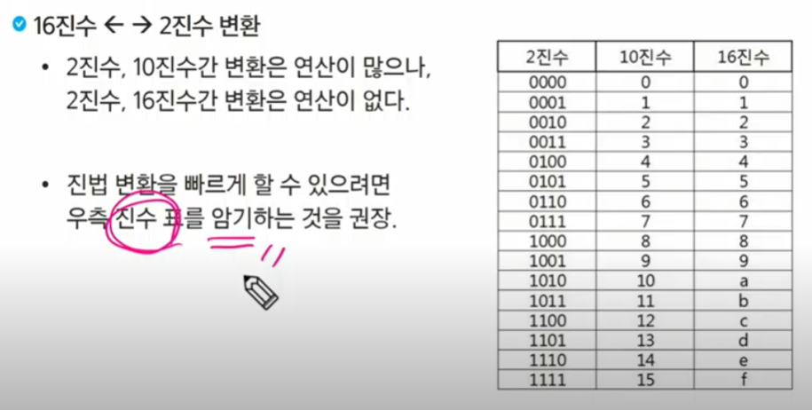
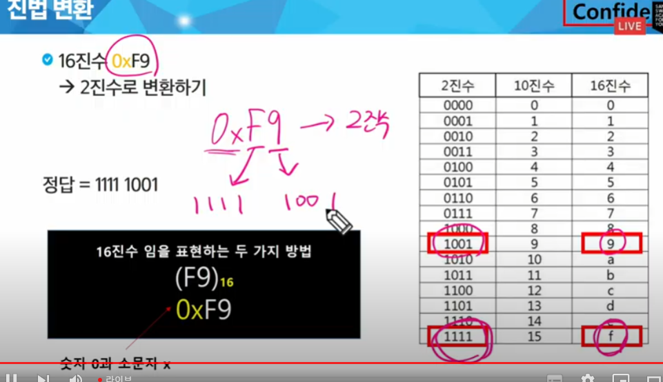

# 알고리즘 응용

# 1. Start

## sw 문제 해결 - 코딩 문제를 잘 푸는 법 -> 3가지 전략

### sw문제해결역량 이란?

라이브러리, 자료구조, 알고리즘에 대한 지식을 쓰면서 문제를 잘 푸는 능력

그럼 알고리즘을 왜 푸냐? 왜 배우냐?

- 기업 코테 합격
- sw역량테스트

## 문제 해결 과정 전략

1. 이해
   - 하나하나, 꼼꼼히, 한 문장도 빼놓지 않고 -> 특정 조건을 넣지 않거나 하는 경우를 방지
2. 계획 - A4용지, 펜

   > 여기까진 키보드에 손을 안 댄다 => 설계 과정이 중요

3. 구현 및 검증 -> 디버깅

#### 리스트에 숫자 넣기

```py
N = int(input())

lst = [[0]*7 for _ in range(2)]

t1 = N
for i in range(4):
    lst[0][i] = t1
    t1 += 1

t2 = N
for i in range(6,2,-1):
    lst[1][i] = t2
    t2 -=1
```

### sw 문제 해결 능력을 기르는 이유

- 코딩을 더 잘하게 하는 능력을 기르기 위함 for 기업코테
- 이를 통해 능숙도를 올릴 수 있어야 한다

### SWEA 문제를 잘 풀기 위한 전략

1. 이해
2. 설계
3. 구현

# 복잡도 분석

### 알고리즘?

- 문제를 해결하기 위한 방법
- 문제 해결 절차
- 연산 횟수에 따라 복잡도가 정해진다

### 알고리즘의 효율

- 공간적 효율성과 시간적 효율성
  - 적은 메모리 공간 -> 공간적 효율성 (변수, 리스트 할당 등)
  - 적은 실행시간 -> 시간적 효율성
  - 효율송 <-> 복잡도

### 복잡도 표기

1. 빅오
2. 빅오메가
3. 빅세타

```py
n = int(input())

for i in range(50):
    print(i)
```

> => O(1)

### 자주 사용하는 O-표기

- O(log(n)) : 로그(대수) 시간 -> o(1)과 느리지만 유사한 성능 ex) 이진탐색
- O(nlog(n)) : 로그 선형 시간 -> 로그시간보단 느리지만 유사한 성능 ex) sort
- 참고) 얘네는 올림 처리 한다

# 표준 입출력 방법

콘솔에다가 입력하는것말고는 방법이 없나?

sys모듈 -> 파일을 입력받는것.

중요한거? 같은 디렉토리. 아니면 경로설정 따로 해줘야 함

```py
sys.stdin('sample_input.txt') # 콘솔에 인풋이 나온다
import sys
sys.stdin = open('input.txt','r') # r은 read
# 과목평가 때는 위의 두 줄을 주석처리 해야한다.

n = int(input())
print(n)
```

왜 쓸까? 편리하니깐

```py
import sys
sys.stdin = open('input.txt','r')
sts.stdout = open('output.txt','w') #output 파일이 없어도 생긴다

a,b = map(int,input().split())
result = a+b,a*b
print(result)
```

# 진수(진법) \*\*\*

## 진수

- 2진수, 8진수, 10진수, 16진수
- 16진수 매우 중요, 2진수를 더 가독성있게 사용, 연산속도가 훨씬 빠름, 그래서 현업에서 사용

계산기 -> window + r -> calc

## 진법 변환

- 10진수 -> 타진수로 변화
  - 원하는 타진법의 수로 나눈 뒤 *나머지*를 거꾸로 읽는다
- 2진수 -> 10진수
  - 맨 끝자리가 2^0 자리, 점점 2^1, 2^2...

> 16진수 -> 2진수

- 현업에선 진수 표를 암기
- 
- 
-

### 2진수 코드 구현

```py
tar = 149
result = []

while tar != 0:
    rasult.append(tar%2)
    tar //= 2
result.reverse()
print(*result)
```

# off-line

## 이진수

1. 진수표 활용
2. 16진수 -> 10진수 변환 함수, 10진수 -> 2진수 변환 함수 직접 작성
3. 파이썬 내장함수 활용

```py
dic = {'0' : '0000', '1' : '0001', '2' : '0010', '3' : '0011',
       '4' : '0100', '5' : '0101', '6' : '0110', '7' : '0111',
       '8' : '1000', '9' : '1001', 'A' : '1010', 'B' : '1011',
       'C' : '1100', 'D' : '1101', 'E' : '1110', 'F' : '1111'}

T = int(input())

for t in range(1,T+1):
  N,hex = input().split()
  K = 0
  result = ''
  for i in range(int(N)):
    if hex[i] == 'A':
      T = 10
    elif hex[i] =='B':
      T = 11
      .
      .
      .
      .
      .
```

```py
#2


```

# 평가

방향배열 또 나옴

<서술형>

- swea 4873 반복문자 지우기(3주차 stack2)- 여기서 어떤 자료구조가 쓰였는지+ 디버깅 모드 돌려서 어떤 식으로 반복 문자가 제거되는지, 리스트 상에서 어떤 식으로 해결되는지
- 이진트리에서 전위, 중위, 후위 순회, pfd의 그래프 잘 봐라
- 사격 방향배열 문제 다수
- bfs,dfs,탐색도 복습
