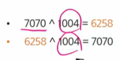

## 비트연산

### 비트와 바이트

- 1bit :0 or 1
- 1byte : 8 bit

### 비트연산

- 컴푸터의 CPU는 0과 1로 동작하고, 내부적으로 비트 연산을 사용

### 챕터 목적

- 비트 연산을 활용한 코딩 방법을 익혀본다

## 비트 연산자

### and or

- a AND b : &, 둘 다 1일때 결과가 1
- a OR b : |, 둘 중 하나가 1일 때 1

  - 111&101=101, 101|111 = 111

```py
# 10진수를 2,16진수로
print(bin(10)) #0b1010
print(hex(10)) #0xa

# 2,16진수 문자열을 10진수로

print(int('1010',2))
print(int('1b',16))

print(0b1101111 & 0b11011)
print(0x4a3|25)
```

### XOR 연산자

- ^ : XOR연산자는 OR 연산자와 비슷한데, 둘 다 1인 경우는 0이다. => 같으면 0, 다르면 1
- 어떤 값이던 임의의 수로 2회 XOR 하면 원래 수로 돌아온다.
  

=> 암호화에 활용 가능

```py
KEY = 1004

def encode_decode(num):
    return num ^ KEY
print(encode_decode(1000))
print(encode_decode(3))
```

### Left, Righr Shift

- << 특정 수 만큼 비트를 왼쪽으로 밀어낸다(우측에 0이 생성된다.)
- />> 특정 수만큼 비트를 오른쪽으로 밀어낸다 (우측 비트들이 제거된다)

```py
print(bin(0b1101<<2)) # 0b1101'00'
print(bin(0b1101>>2)) # 0b11
```

```py
for i in range(5):
    n = 0b1<<i
    print(bin(n),int(n))
```

### 비트연산 응용1

- 1<<n
  - 2\*\*n의 값을 갖는다
  - 임베디드 분야에서 계산을 빠르게 하기 위해 사용된다

### 비트연산 응용2

- i & (1<<n) -> 부분집합 할 때 for문에 들어가 있는거 했었다
  - i의 n번비트가 1인지 아닌지를 확인할 수 있다.
    - (1101)&(1<<2) = 0100 (True) -> 2번 비트가 1이라면 1, 0이라면 0이 되어서 True, False 확인 가능
  - 이해했으면 그냥 암기해라

### 음수 표현 방법

- 컴퓨터는 음수를 '2의 보수'로 관리한다
- 맨 앞 자리 비트(Most bit,MSB)는 음수, 양수를 구분하는 비트이다.
  - MSB = 1 -> 음수
  - MSB = 0 -> 양수

### 2의 보수

- 10001의 2의 보수
  1. 수를 모두 뒤집고
  2. +1을 한다
  - 10001 -> 01110 -> 01111
  - 1111000 -> 0000111 -> 0001000 (+1 하면서 0 있는 곳까지 싹 다 올라가버림)

### 신기한 2의 보수

- 2의 보수를 두 번 취하면 원래의 값으로 돌아온다

- -5를 2의 보수로 표현하는 방법(수를 8bit로)
  - 맨 앞자리는 1
  - 5를 2진수로 나타내고 보수처리(n)
  - 1n

### NOT 연산자 (~)

- 모든 비트를 반전 시킨다
  - but, print(~4) = -5
    - why? ~0100 -> 1011 -> 1+ (011) -> 1+101(보수처리) -> -5

#### 10726. 이진수 표현

```py
'''전략
1. for문 돌려서
1) >> 연산자 사용

2. 싹 다 1일 때 1을 더하면 자릿수가 바뀌는거 이용
'''
M = 31
N = 5

def test():
    tar = M
    for i in range(N):
        if tar & 0x1 == 0:
            return False
        tar = tar >> 1
    return True
print(test())
```

## 실수

f string 문법을 지향한다. 만약 소수 둘째자리까지만 보고 싶다면?

> t2.2f # 소수 둘 째자리까지 반올림

## \*\*\* 근삿값

print(0.1+0.1+0.1 == 0.3) #False -> 알고리즘 문제에선 잘 신경 안 쓴다.

why? 생각 안 해도 될정도로 작은 차이라

### **\*\*** 근사값 원리

swea 이진수2에 포함

소수점이 있는 10진수를 2진수로 변환 예시

0.75 = 2**(-1) + 2**(-2)
= (0.1(2)) + (0.01(2))
= 0.11

## 연습문제

### 연습문제1

1. 7개씩 자르기? 반복하며 슬라이싱
