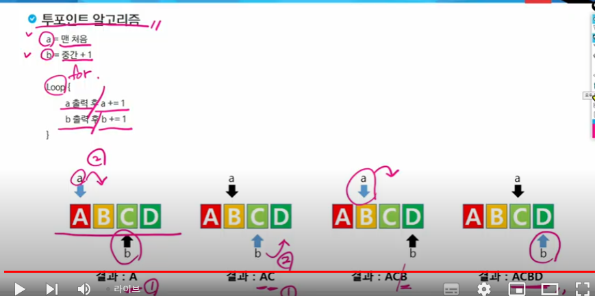

# 문제풀이

## 6019 기차 사이의 파리
```py
'''
파리가 움직인 거리를 구하는 문제.
파리의 속도 F에다가 시간 T를 곱하면 됨
T = 250/(A+B) *F

- 유의 사항
나눗셈을 먼저 하면 오차가 커지고, 오차에 F를 곱하면 오파가 더욱 커진다.
=> 곱하기를 먼저 한다.

T = 250*F/(A+B)
'''

```

```py
#shb
T = int(input())
 
for t in range(1,T+1):
    D,A,B,F = map(int,input().split())
    v = A+B
    time = D/v
    rst = F*time
    print(f'#{t} {rst:6f}')
```

## 원 안의 점

```py
def get_count(N):
    cnt  = 0

    for y in range(-N,N+1):
        ans  = x**2 + y ** 2
        if ans <= N**2:
            cnt += 1
    
    return cnt
        
```


## 퍼펙트 셔플

### 투포인트 알고리즘
```
a = 맨처음

b = 중간 +1

이렇게 포인트 2개

Loop{
    a 출력 후 
    
    a += 1

    b 출력 후 
    
    b += 1 
}

```


```py
T = int(input())

N = 0

arr = []

def get_result():
    a = 0
    b = (len(arr) + 1) // 2
    
    for turn in range(len(arr)):

        if turn % 2 == 0:
            print(arr[a],end = ' ')
            a += 1
        
        else:
            print(arr[b],end = ' ')
            b += 1

for t in range(1,T+1):
    N = int(input())
    arr = list(map(str,input().split()))
    print(f'#{t}' ,end = '')
    get_result()
    print()


```

## 10580 전봇대

타겟팅 하는건 강의 다시 봐라

```py
def get_result():
    # 리스트 arr : 튜플 형태로 a전봇대와 b전봇대를 저장할 리스트
    size = len(arr)
    cnt = 0
    for i in range(size):
        for target in range(i):
            # a 전봇대 : 튜플의 첫 번재 요소, b 전봇대 : 튜플의 두 번째 요소
            i_a , i_b = arr[i][0],arr[i][1]
            tar_a , tar_b = arr[tar][0], arr[tar][1]

            if i_b < tar_b:
                cnt += 1
    return cnt

T = int(input())

for t in range(1,T+1):
    N = int(input())

    arr = []
    for n in range(N):
        a,b = map(int,input().split())
        arr.append((a,b))

    #첫 번째 원소(시작점) 기준으로 정렬해야함

    arr.sort(key = lambda x : x[0]) # 첫 번째 원소를 기준으로, 오름차순 정렬
    result = get_result()

    print(f'#{t} {result}')
```