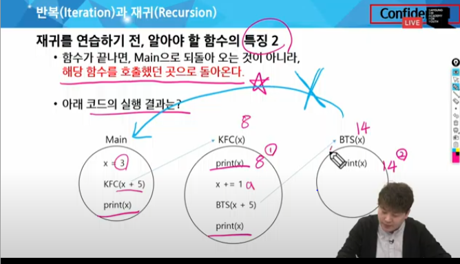
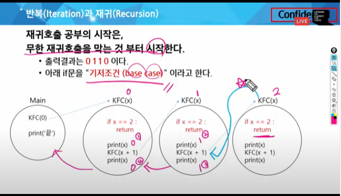
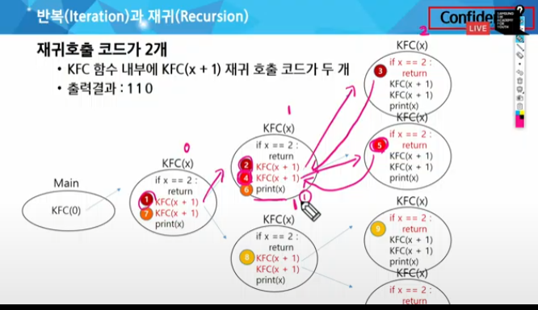
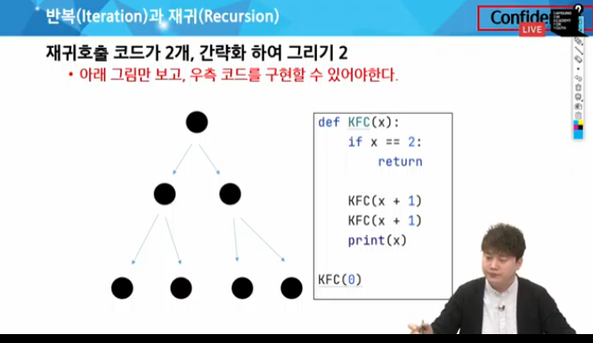
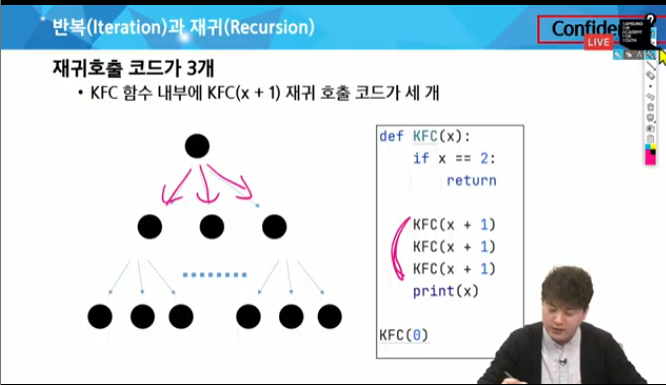
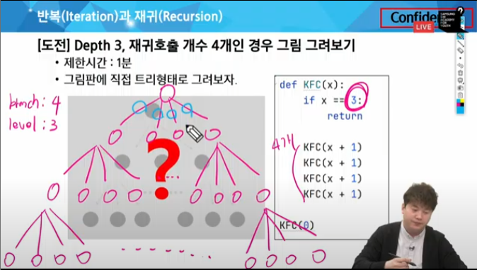
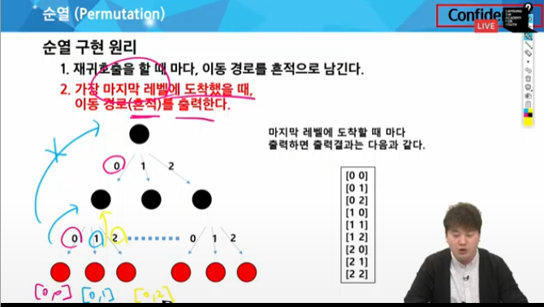
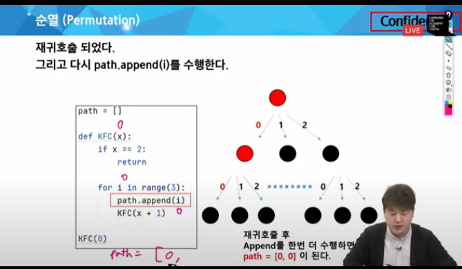
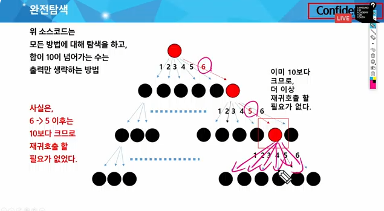
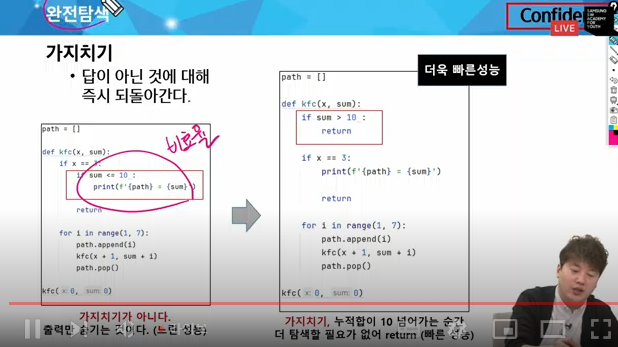

# 4. 완전탐색

재귀 호출과 완전 탐색

## 반복과 *재귀* - 차이점?, 오늘의 핵심은 재귀

- 반복과 재귀는 유사한 작업을 수행할 수 있다.
- 반복은 수행하는 작업이 완료될 때까지 계속 반복
    - n번 반복
- 재귀는 주어진 문제의 해를 구하기 위해 동일하면서 더 작은 문제의 해를 이용하는 방법
    - n중 반복을 만들 수 있음

```py
for i in range(1,4):
    for j in range(1,4):
        for k in range(1,4):
            for l in range(1,4):
                m = i * 1000 + j * 100 + k * 10 + l
                print(m)
# 4중 for문이 필요
# 모든 경우의 수가 다 나왔다 -> 중복 순열
# N개면 N중 for문 -> 재귀로 처리한다.
```

<재귀를 연습하기 전 알아야할 함수의 특징>
1. 값만 복사 - 내부에서 변수로 개지랄을 해도 global이나 return 아니면 main에선 안 바뀐다

 -> 재귀에서 가장 중요한 부분임



결과는 8 14 9 3

- 재귀호출 공부의 시작은 무한 재귀호출을 막는 것부터 시작한다
    - how? *기저조건*을 넣으면서

    

```py
def recursion(n):
    if n == 6:
        return 

    print(n)
    recursion(n+1)
    print(n) # 이게 중요

recursion(0)
'''
output:

0
1
2
3
4
5
5
4
3
2
1
0
'''
# 2. 함수가 끝나면 main으로 돌아오는게 아니라, *해당 함수를 호출했던 곳*으로 돌아온다

```

- 만약 재귀 호출이 2개 있다면?





- 마치 트리처럼 생김. 근데 트리는 아니다. 단순히 트리 *형태*
- 재귀 호출의 갯수만큼 가지 형태가 생긴다. 기저조건만큼 레벨이 생긴다
- branch: 각 지점마다 경우의 수, level: 이걸 몇 번 해야하냐






```py
def recursion(n):
    if n == 3:
        return
    recursion(n+1)
    recurion(n+1)
```
```py
def run(level):
    if level == 3: 
        return
    for i in range(2): # 재귀를 몇 번 하냐 # branch
        run(level+1)
run(0)
# 어디에 print 할 지는 순열에서
```
## 순열
순열이란? 
- 서로 다른 N개에서 R개를 중복없이, 순서를 고려하여 나열하는 것

### 중복순열
중복순열이란? 중복을 허용하고, 순서를 고려하여 나열하는 것

#### 중복순열 구현 원리
1. 재귀호출을 할 때 마다, 이동 경로를 *흔적*으로 남긴다.
2. 가장 마지막 레벨에 도착했을 때, 이동 경로를 출력한다.



how? path 리스트를 사용

```py
path = []

def KFC(x):
    if x == 2:
        print(path) # 마지막 레벨에서 출력한다
        return
    
    for i in range(3):
        path.append(i)
        KFC(x+1) # -> 트리 구조를 잘 기억해라
        path.pop() # 이 직전 내용을 빼야 한다.

KFC(0)
```


[1,1,1] 부터 [6,6,6] 까지

branch? 6

level? 3

```py
path = []
def run(n):
    if n == 3:
        print(path)
        return
    
    for i in range(1,7):
        path.append(i)
        run(n+1)
        path.pop()

run(0)
```

### 중복 없는 순열 구현 방법

1. 중복 순열 코드를 작성한다
2. *중복을 제거하는 코드*를 추가하면 순열 코드가 된다.

중복을 제거하는 원리?
- *전역 리스트*를 사용하면 이미 선택했던 숫자인지 아닌지 구분할 수 있다.
- 이를 used배열, 혹은 visited 배열 이라고 한다.

> *재귀호출하기 직전*, 이미 선택했던 숫자인지 아닌지 검사하는 코드가 필요하다 -> 이미 used 되어 있으면 continue 해버리면 된다.

used
1. 기록
2. 삭제

```py
used = [False] * b # b은 branch의 갯수
path = []
def run(n):
    if n == 3:
        print(path)
        return
    
    for i in range(1,7):
        if used[i]: continue
        used[i] = True # 1. 기록
        path.append(i)
        run(n+1)
        path.pop()
        used[i] = False # 2. 삭제

run(0)
```


#### 주사위

```py
path = []
def type1(x):
    if x == n:
        print(path)
        return
    
    for i in range(1,7):
        path.append(i)
        type1(x+1)
        path.pop()

used = [0] * 7
def type2(x):
        if x == n:
        print(path)
        return
    
    for i in range(1,7):
        if used[i]:
            continue

        path.append(i)
        used[i] = 1
        type1(x+1)
        path.pop()
        used[i] = 0

N,type = map(int,input().split())

if type == 1:
    type1(0)
if type == 2:
    type2(0)
```
## ***완전탐색*** 조오오오오오온나 중요함

= 브루트포스 알고리즘

모든 가능한 경우를 모두 시도해서 정답을 찾아내는거

### 주사위 합

누적합 sum이라는 변수를 추가.

- sum = 지금까지 구한 합
- i = 선택한 주사위 눈금
- 재귀호출할 때 sum+i 값을 전달

```py
def kfx(x,sum)
    if x == 3:
        if sum <= 10:
            
        print(path)
        return
    
    for i in range(1,7):
        path.append(i)
        type1(x+1)
        path.pop()
```



가지치기 -> 백트래킹



5189.전자카트 -> 모든 구역을 다 돈다. 자료구조상 그래프

# offline

### 최소합
```py
dir = [(0,1),(1,0)]

def dfs(x,y,sum_v=arr[0][0]):
    global result

    if sum_v >= result: # 가지치기
        return
    
    if x == N-1 and y == N-1: # 목표지점에 도착한 경우
        if sum_v < result:
            result = sum_v
        return
    
    for dx,dy in dir:
        nx,ny = x + dx, y+dy
        if -1 < nx < N and -1< ny < N:
            dfs(nx,ny,sum_v+arr[nx][ny])

T = int(input())

for t in range(1,T+1):
    N = int(input())
    arr = [list(map(int,input().split())) for _ in range(N)]
    dfs(0,0)


```

### 전자 카트
```py
def dfs(cut,start,total):
    global result
    if cur == N-1: # 가지치기
        result = min(result,arr[start][0]+total)
        return
    
    for i in range(1,N):
        if not vst[i] and start != i:
            vst[i] = 1
            dfs(cur+1,i,total + arr[start][i])
            vst[i] = 0

T = int(input())

for t in range(1,T+1):
    N = int(input())
    arr = [list(map(int,input().split())) for _ in range(N)]
    vst = [0] * N
    result = float('inf')
    dfs(0, 0, 0)
    print(f'#{tc} {result}')

```

### ABC 초콜렛

강의 내용 중 카드 문제와 유사


```py
def same(level):
    if level <3:
        return True
    if path[level-3] != path[level-2]:
        return True
    if path[level-2] != path[level-1]:
        return True
    return False # 셋 다 같은 경우

def run(level):
    global cnt
    if not same(level):
        return
    
    if level == n:
        cnt += 1
        return
    
    for i in range(3):
        path[level] = chr(ord('A')+i)
        run(level+1)
        path[level] = ''
    # 중복 순열과 똑같음

n = int(input())
run(0)
print(cnt)

```

###  다섯종류의 숫자카드

```py
name = input()
path = ['']
cnt  = 0

def run(level):
    global cnt
    if level == 4:
        cnt += 1
        return

    for i in range(5):
        if not(level > 0 and abs(ord(path[level-1])-ord(name[i]))>3):
            pass[level] = i
            run(level+1)
            path[level] = ''

run(0)
print(cnt)
```

