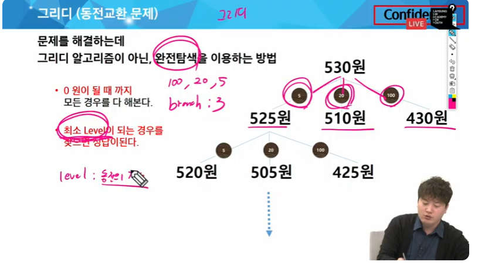

## 부분집합
- 집합에 포함된 원소들을 선택하는 것
    - 아무것도 선택하지 않은 경우도 집합에 포함된다.(공집합)
### 구현 방법
1. 완전탐색
    - 재귀호출 이용
    - 트리 형태로 구성
2. Binary counting - 이걸 추천

1. 완전탐색


Branch : 2, level : 3


```py

```

2. Binary counting
- 원소 수에 해당하는 N개의 비트열을 이용한다
    - 0 0 1 이면 {A}
    - 1 1 0 이면 {B,C}
- 첫 번째 비트가 1인지 확인하는 과정을 거친다. 
- for문은 2*n 만큼 why? 1<< n 이 2**n을 의미하니깐.
- 그럼 111, 110 이런 애들을 어떻게 사용할까? (어떻게 부분집합으로 바꿀까)

```py
def get_sub(tar):
    for i in range(n):  # 3비트
        if tar & 0x1: # 마지막 비트가 1이면, 1로 써도 되긴 하는데 가독성 때문에..
            print(arr[i],end='') # 101이면 CBA에서 A와 C만 포함되므로 얘네만 들어간다.
        tar >> = 1 # 비트를 하나씩 오른쪽으로 민다. -> 끝자리 제거

for tar in range(1<<n): # = range(0,8)
    print('{',end = '')
    get_sub(tar)
    print('}')
```


## 조합
- 순열과 달리 ABC와 BAC가 같다
- n개 중 r개를 *순서없이* 골라낸 것

> 5개 중 3개를 고르는 경우, 2개를 골라놓으면 하나를 동적으로 고르면 됨
> A를 고른 경우(0~4), B의 위치는 a+1~4, C의 위치는 b+1~4 


start를 새로운 변수로 지정하면 재귀가 가능함

=> 재귀호출 구현이 필요


매개변수로 start가 들어간 중복순열 코드

```py
path = []
N = 3
def dice(level=0,start=1):
    if level == N:
        print(path)
        return
        
    for i in range(start,7):
        path.append(i)
        dice(level+1,i) # start를 i 그대로
        path.pop()

dice() 
```
## 탐욕 알고리즘(Greedy)
- 현재 기준에서 최선의 선택지

< 대표적인 문제 해결기법 >
1. 완전탐색
2. Greedy *
3. DP
4. 분할정복




```py
person = [15,30,50,10]
```


```py
n = 3 # 물건 3개
target = 30 
things = [(5,50),(10,60),(20,140)]

things.sort(ket = lambda x: (x[1]/x[0]),reverse = True) # 키로당 가격을 기준으로 역정렬

sum = 0

for kg,price in things:
    per_price = price/kg
    # 만약 가방에 남은 용량이 얼마 되지 않는다면, 물건을 잘라 가방에 넣고 끝낸다.
    
    if target < kg:
        sum += target * pre_price
        break

    sum += price
    target -= kg

print(int(sum))
```


#### 회의실 배정


1. 끝나는 시간 기준 오름차순 정렬
2. 끝나는 시간이 짧은것(빠르게 끝나는 회의를 선택 후 확정)
3. 이후로 가능한 회의 중, 빠르게 끝나는 회의를 선택하여 확정(반복)


# offline

### 회의실 배정

1. 종료 시간이 빠른 회의를 먼저 선택한다.


### 화물 도크

시작 시간과 완료 시간

```py

T = int(input())
for tc in range(1, T + 1):
    N = int(input())
    # 시작시간, 완료시간
    arr = [list(map(int, input().split())) for _ in range(N)]
    # 람다함수 사용해서 완료시간 빠른 작업부터 처리
    arr.sort(key = lambda x : x[1])
    # 완료시간
    end = 0
    # 화물차의 수
    cnt = 0

    for s, e in arr:
        #작업수행 -> 작업의 시작시간이 작의 종료시간보다 같거나 크면
        if s >= end:
            # 종료 시간 갱신
            end = e
            # 화물차 수 1증가
            cnt += 1
    print(f'#{tc} {cnt}')
'''
'''
T = int(input())
for tc in range(1, T + 1):
    #N : 컨테이너의수, M : 트럭수 , w : 컨테이너의 무게, t : 각 트럭의 적재 용량
    N, M = map(int, input().split())
    w = list(map(int ,input().split()))
    t = list(map(int, input().split()))
    # 내림차순 정렬
    w.sort(reverse = True)
    t.sort(reverse = True)

    result = 0
    j = -1
    for i in range(M):
        # 각 트럭이 옮길수 있는 화물을 찾는다
        while j < N - 1:
            j += 1
            # 트럭의 적재용량이 컨테이너 무게보다 크거나 같으면.
            if t[i] >= w[j]:
                # 컨테이너의 무게를 합계에 누적
                result += w[j]
                break

    print(f'#{tc} {result}')
```

### 베이비진

```py
def baby_gin(cards):
    cnt = [0] * 10 # 각 숫ㅈ별 카드 개수 저장
    for num in cards:
        cnt[num] += 1 # 카드의 숫자 세기
    
    #trplet부터 확인
    if 3 in cnt:
        return True
    
    #run 확인
    for i in range(8):
        if 0 not in cnt[i:i+3]:
            return True
    
    return False

T = int(input())

for t in range(1,T+1):
    all_cards = list(map(int,input().split()))
    p1 = []
    p2 = []
    winner = 0 # 초기값 무승부

    for i in range(6):
        p1.append(all_cards[i*2]) #플레이어 1의 카드
        if len(p1)>2 and baby_gin(p1): # 카드가 3장 이상일 때 확인
            winner = 1 #플레이어 1 승리
            break
            
        p2.append(all_cards[i*2+1]) #플레이어 2의 카드
        if len(p2)>2 and baby_gin(p2):
            winner = 2 #player 2가 승리
            break
    
    print(f'#{t} {winner}')
```