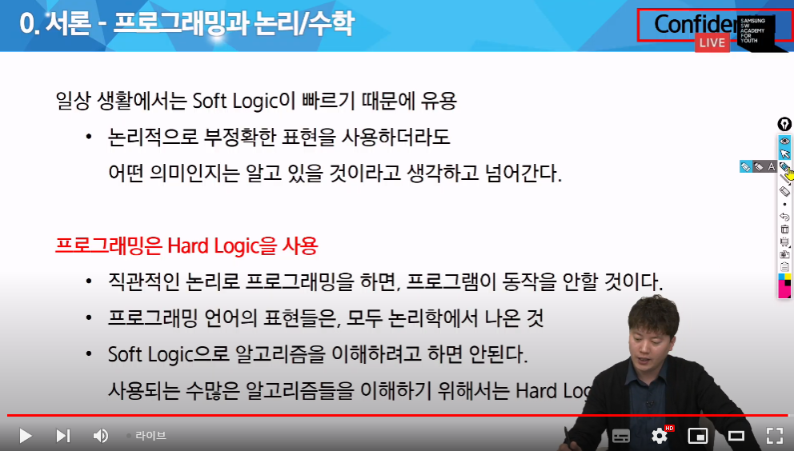

# 기초 논리 & 수학 - 1.논리학과 2.알고리즘 성능 계산법

## 0. 서론 - 프로그래밍과 논리/수학


3만원을 내야될 때 친구가 1만원을 더 낸다고 하면 나는 얼마를 내야 할까?

hard logic - 2.5 why? 친구가 3.5를 낼테니깐

soft logic - 2.0

논리: 근거와 주장을 잇는 것

이치: 과정의 순서가 올바르게 연결

논리 : 이야기의 이치 -> 이야기의 과정의 순서가 올바르게 연결

논리학에서 중요한 것? 형식. p->q . p 이면 q이다. 

### 전제 2가지

1. 배중률 : True/False 무조건 중간이 없는 것

2. 모순율 : True와 False가 동시에 성립 x

[참고] 부정과 반대의 차이


<or도 종류가 있다>




## 과목평가에 마지막 20분 내용이 답으로 나온다.
big-o 표기법으로 풀이하는 것

pdf 99~107 8 문제 중 1번 아니면 2번 아니면 4번이 서술형으로 나온다

# offline

## 투 포인터 알고리즘

주로 리스트와 같은 시퀀스 타입에서 두 개의 포인터를 사용하여 문제를 해결하는 방법
1. 포인터를 low,high 또는 left,right로 나누다.
2. (일반적으로)low는 범위 좁히기, high는 범위 넓히기
3. for 특정 조건을 만족하는 구간 찾기. or 두 요소간 합이나 차이를 구하기

#### shb
슬라이딩 윈도운데, 창문 끝과 끝이 자유롭게 움직임. 고무줄처럼


### 예제문제

1부터 10000 사이의 n개의 자연수 중에서 연속된 순서를 더했을 때, 합이 m이 되는 경우는 몇가지 인가요?
(투 포인터 -> 구간의 크기가 정해지지 x)

input
10 5 = n,m
1 2 3 4 2 5 3 1 1 2

output = 3
```python
n,target = map(int,input().split())
arr = list(map(int,input().split()))

cnt, sum = 0,0

# 투 포인터 high,low
high,low = 0,0
while True:
    if sum >= target or high == n: # 합이 타겟보다 크거나 같다면(범위 좁히기)
        sum -= arr[low]
        low += 1
    elif sum < target: #합이 타겟보다 작다면(범위 넓히기)
        sum += arr[high]
        high += 1
    if sum == target:
        cnt += 1
    if low == n: break
```

## 슬라이딩 윈도우 

1. 시퀀스 타입(리스트 같은)에서 일정 크기의 '윈도우'를 정한다. 
2. 그 윈도우를 데이터의 처음부터 끝까지 움직여서 해결한다
3. when? 예를 들어 연속된 숫자들 중에서 최대값이나 최소값을 구하는 문제에 사용

### 예제문제

1부터 10000 사이의 n개의 자연수 중에서 연속된 m개의 정수를 더했을 때, 최대는?

```python
# 예제 문제
# n개의 정수를 입력받고, 연속된 m개의 정수들의 합을 구할 때 최대값 구하기
# 합이 가장 큰 구간의 값은 무엇일까요? (2 <= m, n <= 100,000)

n, m = map(int, input().split())
arr = list(map(int, input().split()))
sum = 0

# 처음 m개의 정수들의 합
for i in range(m) :
    sum += arr[i]
    max_v = sum

# n - m번 만큼 반복(슬라이딩 윈도우를 이동시키며 계산)
for i in range(n - m) :
    # 1. 윈도우를 한 칸 오른쪽으로 이동시키고 그 값을 더한다
    # 2. 이전값을 빼준다
    sum += arr[i + m]
    sum -= arr[i]
    if sum > max_v :
        max_v = sum # 최대값을 구하기 위해
print(max_v)
```


### 슬라이딩 윈도우

```python
T = int(input())
for tc in range(1, T + 1):
    n, m = map(int, input().split()) #n : 피사체의 개수, m : 사진기의 폭
    arr = list(map(int, input().split()))
    start = 0
    end = m - 1
    sum_v = 0
    for i in range(end): #처음 윈도우의 합
        sum_v += arr[i]
    ans = float('-inf')
    s_index = 0
    e_index = 0
    while end < n: # 윈도우의 끝이 피사체 개수를 벗어나지 않을 때까지 반복
        sum_v += arr[end] # 합에 추가(윈도우의 끝에 해당하는 피사체 점수)
        if sum_v > ans:
            ans = sum_v #최대 점수 업데이트
            s_index = start
            e_index = end
        sum_v -= arr[start] # 합에 제거(윈도우 시작에 해당하는 피사체 점수)
        start += 1 # 윈도우를 오른쪽으로 한 칸씩 이동
        end += 1
    print(f'#{tc} {s_index} {e_index} {ans}')
    
```

### 예식장 안내

```python
T = int(input())
for tc in range(1, T + 1):
    arr = [0] * 200002
    DAT = [0] * 201 # 번호가 나온 횟수
    n, r = map(int, input().split())
    foods = list(map(int, input().split()))
    for i in range(n):
        arr[i] = foods[i] # 해당 자리에 앉은 손님이 먹을 음식의 번호
        arr[i + n] = foods[i] #원형 탁자(끝과 시작이 이어짐)

    start = 0
    end = 2 * r
    flag = 0 # 중복된 음식이 있는지 여부 체크

    for k in range(start, end):
        DAT[arr[k]] += 1
        if DAT[arr[k]] > 2 : # 중복된 음식이 있을 경우
            flag = 1
            break

    while end < n * 2 and flag == 0: # 윈도우를 이동하면서, 중복된 음식이 있는지 확인
        DAT[arr[end]] += 1
        if DAT[arr[end]] > 2: # 중복된 음식이 있을 경우
            flag = 1
            break
        DAT[arr[start]] -= 1
        start += 1 #윈도우를 오른쪽으로 이동
        end += 1

    if flag == 1:
        print(f'#{tc} NO')
    else:
        print(f'#{tc} YES')

```