# 알고리즘 설계기법의 종류

1. 전체를 그냥 다 보자. 완전탐색-Brute Force
   - 배열 : for문, while문
   - 그래프(관계가 있는 데이터)
   - DFS,BFS

> 완전 탐색을 구현하면, 시간 or 메모리 초과가 되더라!

2. 상황마다 좋은 걸 고르자 (Greedy - 그리디)
   - 규칙 + 증명 -> 구현

3. 큰 문제를 작은 문제로 나누어 부분적으로 해결하자(Dynamic Programming)
   - 분할 정복과 다르게 작은 문제가 중복
   - 중복된 문제의 해답을 저장해놓고 재활용하자! (Memoization)

4. 큰 문제를 작은 문제로 나누어 부분적으로 해결하자 (분할 정복)

5. 전체 중 가능성 없는 것을 빼자 (Backracking - 백트래킹)


-> 이 기본들을 기반으로 더 고급 알고리즘들이 개발됨


# 분할정복 & 백트래킹

- 분할 정복
- 대표적인 분할 정복 알고리즘
  - 병합 정렬
  - 퀵 정렬
  - ************이진검색****************

정렬같은 경우, 10~15년 전에는 면접 단골 질문이었음. 이젠 너무 기본으로 + 구현할 일이 없음. 

병합정렬과 퀵정렬은 그림 그리면서 할 수 있을 정도로

이진 검색은 소스코드까지 완벽하게. 코테 단골

## 분할정복

- 문제를 분할해서 해결하는 분할정복(Divide and Conquer)
- 작은 문제로 쪼개고, 이걸 합쳐서 큰걸 해결

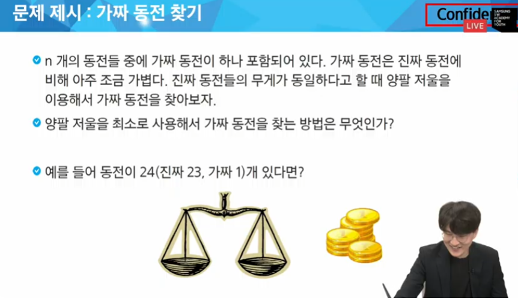

> 반씩 나눠서 계산한다.

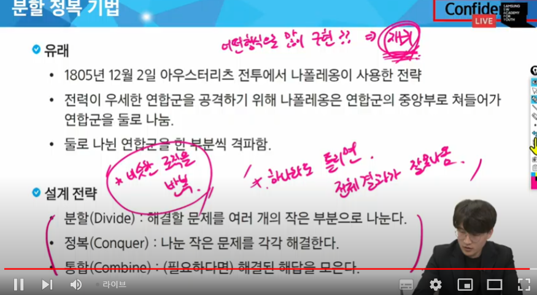

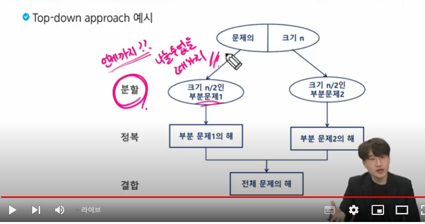

### 분할정복 기법 예시 

- C의 n제곱 구하기

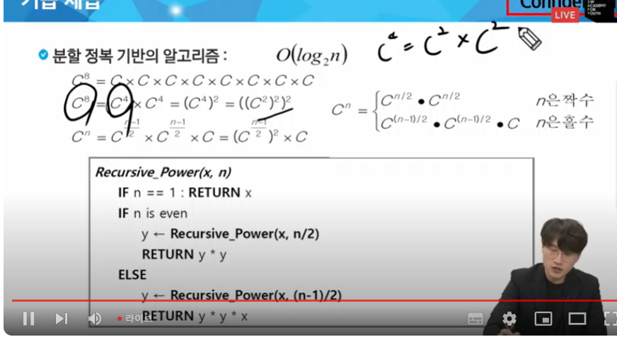


## 병합 정렬

- 여러 개의 정렬된 자료으ㅟ 집합을 병합하여 한 개의 정렬된 집합으로 만드는 방식
- 활용
  - 자료를 최소 단위의 문제까지 나눈 후에 차례대로 정렬+결합하여 최종 결과를 얻어냄
  - top-down 방식
- 시간복잡도 O(nlogn)

 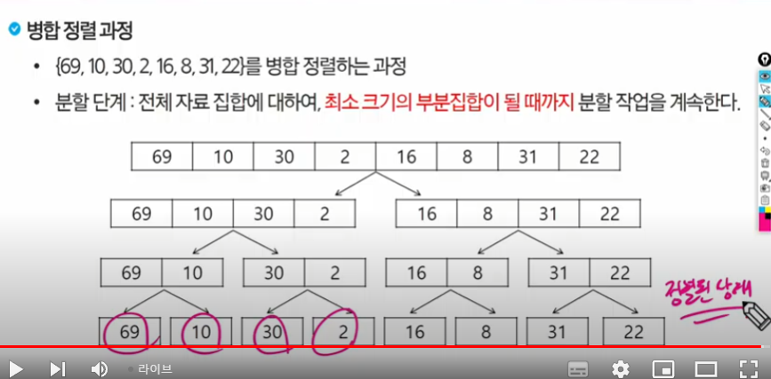

 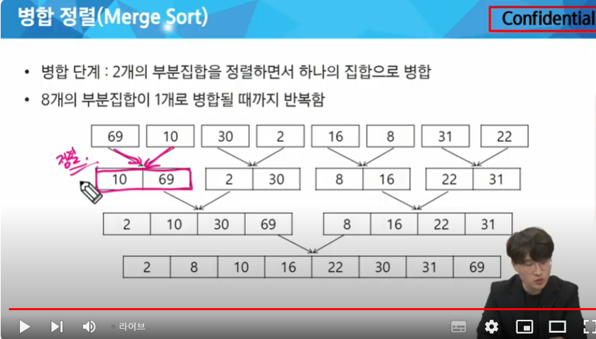

 분할할 때 logn번 발생, 비교할 때 n번 병합할 때 logn번 => nlogn

 잘 모르겠으면 직접 그려서 확인해봐


 ### 알고리즘

< 분할과정 >

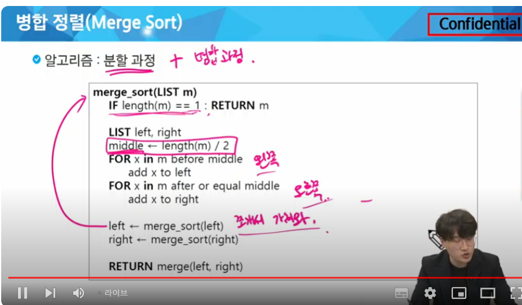

 < 병합과정 >

왼쪽과 오른쪽에서 가장 작은 값들을 하나씩 빼주고, 이 둘을 비교 후 정렬해서 넣는다. 

근데 양 쪽에 (1,2,3) (4,5,6) 이면?

챌린지 형식으로, 남은 애를 집어넣지 말고 계속 비교

한 쪽만 남아있다면 그대로 result에 삽입

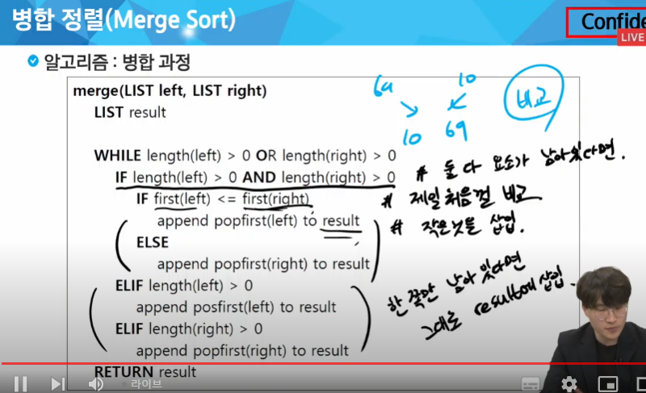

## 퀵 정렬

- 주어진 배열을 두 개로 분할하고, 각각을 정렬한다
  - 병합 정렬과 동일?
- 다른점1: 병합 정렬은 그냥 두 부분으로 나누는 반면에, 퀵 정렬은 분할할 때, * 기준 아이템(pivot item) 중심으로 분할*한다.
  - 기준보다 작은것은 왼편, 큰 것은 오른편에 위치시킨다
- 다른점2 : 각 부분 정렬이 끝난 후,ㅡ 병합정렬은 '병합'이란 후처리 작업이 필요하나, 퀵 정렬은 필요하지 않다

- 평균적으로 효율이 좋음

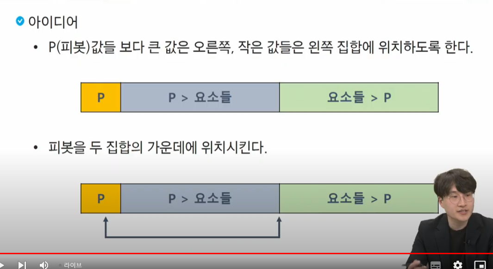

왼쪽, 오른쪽은 각각 정렬은 되어있지 않지만, pivot 기준으로 작은거, 큰거가 모여있다

> 그럼 pivot은 어떻게 설정?


제일 왼쪽, 제일 오른쪽, 중간 셋 중 하나

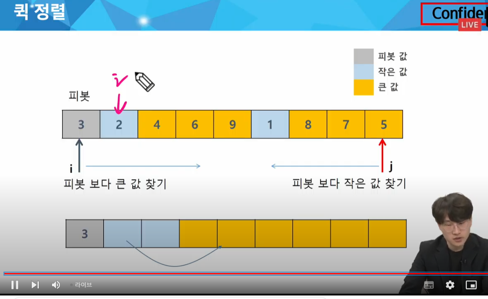

왼쪽, 오른쪽에서 같이 움직인다, 인덱스 기준으로 움직이게 된다. 

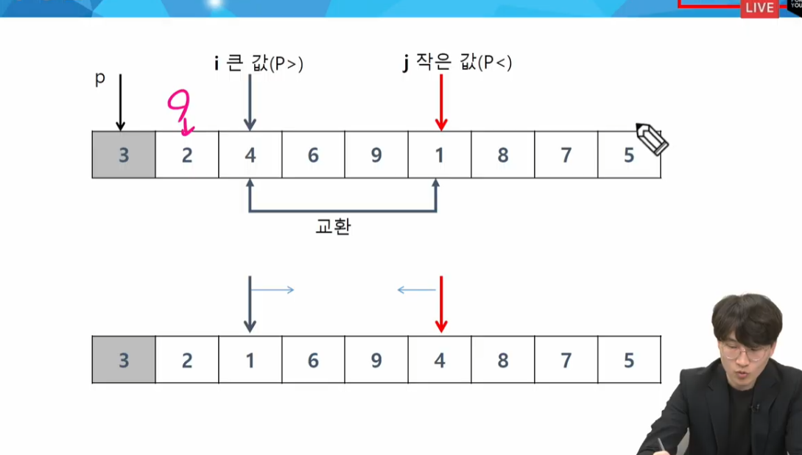

마지막에 피봇과, 기준점 위치의 원소를 바꿔서 피봇이 가운데에 오도록 한다. 

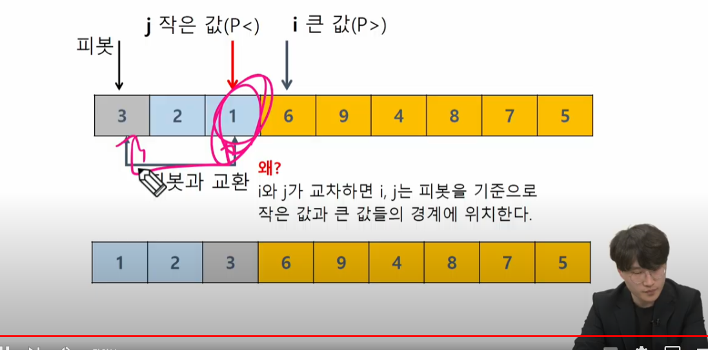

< 소스코드 >

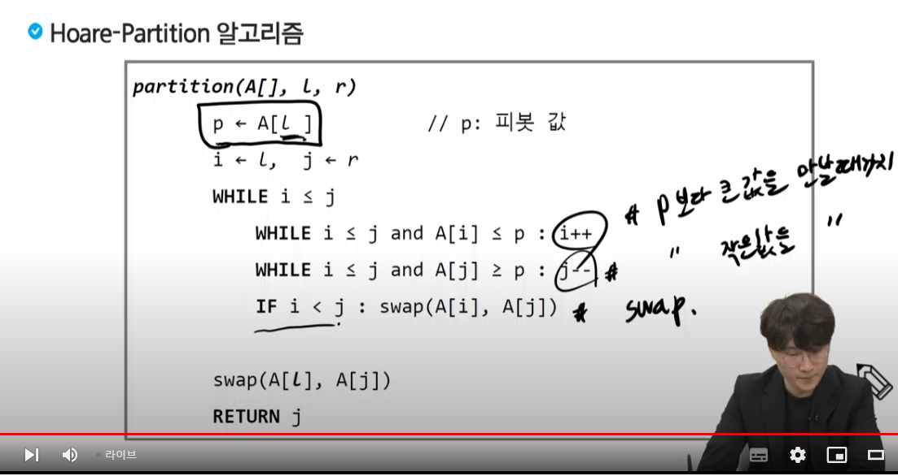

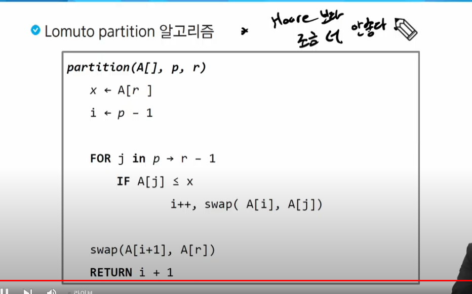

### 분할정복 알고리즘 정리

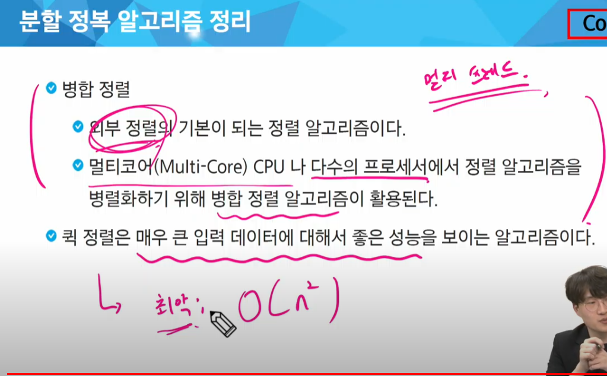

퀵정렬에서 거꾸로 정렬된 케이스일 때 계속 교환해야 하므로 O(n^2) 발생 평균은 nlogn(같은 nlogn 중에서 가장 효율적)


## 이진 검색

코테 단골 문제. 굉장히 중요

- 자료의 가운데에 있는 항목의 키 값과 비교하여 다음 검색의 위치를 결정하고 검색을 계속 진행하는 방법
  - 목적 키를 찾을 때까지 이진검색을 순환적으로 반복 수행함으로써 검색 범위를 반으로 줄여가면서 보다 빠르게 검색을 수행함

> 이진 검색을 하기 위해서는 **자료가 정렬된 상태** 여야 한다 -> sort()

```py
arr = [324, 32, 22114, 16, 48, 93, 422, 21, 316]

# 1. 정렬된 상태의 데이터

arr.sort()

# 2. 이진검색 - 반복문 버전

def binarySearch(target):

    # 인덱스 확인 
    low = 0
    high = len(arr) -1

    # 해당 숫자를 찾으면 종료
    # 더 이상 쪼갤 수 없을 때까지

    while low <= high: # 더 이상 쪼갤 수 없을 떄까지
        mid = (low+high)//2

        if arr[mid] == target: #해당 숫자를 찾으면
            return mid

        elif arr[mid] > target: # 왼쪽에 있는게 정답
            high = mid-1 # mid로 해도 상관은 없음
        
        elif arr[mid] < target: # 오른쪽에 있는게 정답
            low = mid + 1 # mid로 해도 상관 없음
 
print(f'21 = {binarySearch(21)}')

# 3. 이진검색 - 재귀함수 버전

def bs_rec(target): 
    # 기저조건(언제까지 재귀가 반복되어야 할까?)
    if low > high:
        return -1


    # 다음 재귀 들어가기 전엔 무없을 해야할까?
    mid = (low+high)//2
    
    if target == arr[mid]:
        return mid
    
    # 다음 재귀 함수 호출( 다음엔 뭘 가져가야 할까?파라미터 생각 잘 하기!)
    if target < arr[mid]:
        return bs_rec(low,mid-1,target)
    else: return bs_rec(mid+1,high,target)
    # 재귀 함수에서 돌아왔을 떄 어떤 작업을 해야할까?
ㅣ

```


### 재귀 꿀팁

    # 기저조건(언제까지 재귀가 반복되어야 할까?)


    # 다음 재귀 들어가기 전엔 무없을 해야할까?

    # 다음 재귀 함수 호출에 뭘 가져가야 할까?(파라미터)

    # 재귀 함수에서 돌아왔을 떄 어떤 작업을 해야할까?


### 이진 검색 정리

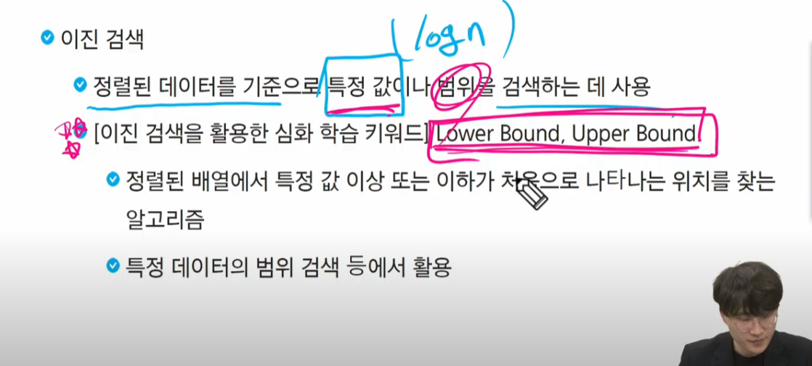