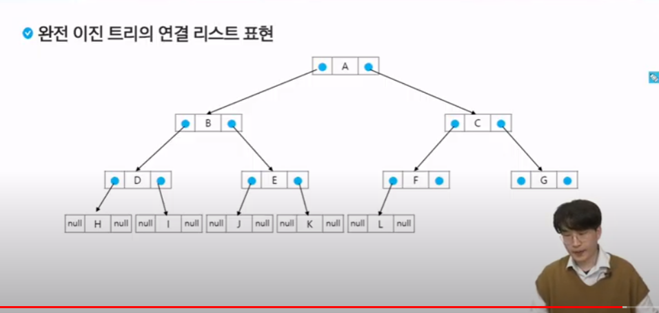
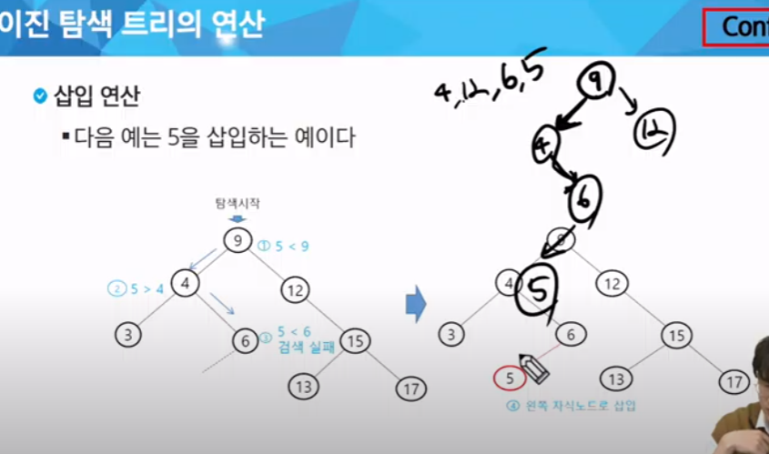
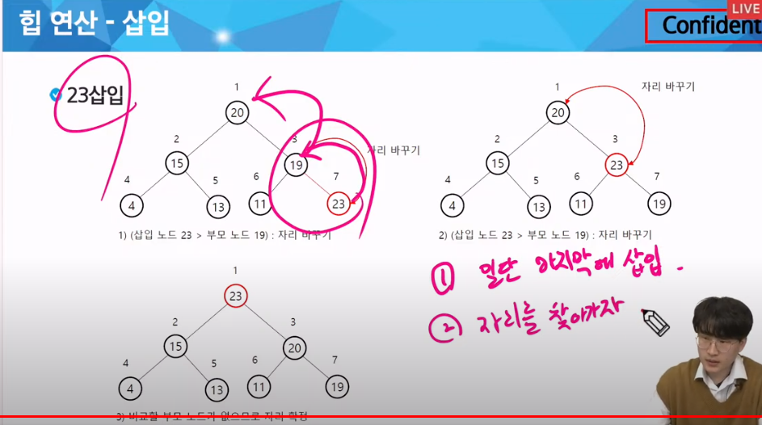

## 백트래킹 응용

완전탐색 + 가지치기

가능성이 없는(볼 필요 없는) 경우의 수를 제거하는 기법

완전 탐색이 베이스
1. 완전 탐색 - 여기서 문제, 재귀
2. 조건(언제 가지치기 할까. 볼 필요 없는 조건)
   - if와 continue

### 순열

#### 중복된 순열
111,112,113,121,.....


재귀함수 -> 특정 시점으로 돌아오는게 핵심!


```py
arr = [i for i in range(1,4)]
path = [0]*3
# 코드로 짜고 싶으면 그림을 그릴 줄 알아야 한다.

# 재귀함수 팁 : 파라미터는 바로 작성 x 구조를 먼저 잡으면 자연스럽게 필요한 변수들이 보인다

def dfs(level):
    # 기저조건 -> 반복 조건
    # 이 문제에서는 3개를 뽑았을 떄까지 반복
    if level == 3:
        print(*path)
        return 

       
    # 들어가기 전
    # 다음 재귀 호출
    #   - 다음에 갈 수 있는 곳들은 어디인가? 3군데. 1 2 3
    
    # 갔다와서 할 로직
    # path[level] = 1
    # dfs(level+1) 

    # path[level] = 2
    # dfs(level+1) 

    # path[level] = 3
    # dfs(level+1) 
    for i in range(1,4):
        path[level] = i
        bfs(level+1)
```


#### 조합

- 숫자가 중복되지 않게
- 123 132 213 231 ...
- 숫자는 한 번만 사용해라

```py
arr = [i for i in range(1,4)]
path = [0]*3

def bfs(level):
    if level == 3:
        return

    for i in range(len(arr)):
        # 백트래킹 -> 갈 수 없는 경우를 활용
        if arr[i] in path:
            continue
        
        path[level] = arr[i]
        dfs(level+1)
        # 돌아왔을 떄 로직
        # 기존 방문을 초기화
        path[level] = 0
```

결국 백트래킹은 2개가 전부

가지치기와 초기화.

> 백트래킹은 시간복잡도가 어떻게 될까??

계산하기 너무 힘들다!

최악의 경우 : 완전탐색

내가 가지치기를 어떻게 하느냐에 따라 너무 크게 달라진다.

1. 완탐 경우의 수 계산
2. 가지치기로 인한 대략적인 감소 예측

만약 시간초과가 나면 기저조건과 가지치기를 잘 확인


## 트리

### 트리 개요

- 트리는 사이클이 없는 무향 연결 그래프이다
  - 1. 사이클? 
      - 원래 내가 방문했던 노드로 다시 돌아오는 다른 경로가 있는 경우
  - 2. 이게 없으면 무향
      - 간선의 방향이 없다(양방향)
  - 3. 연결 그래프
      - 모든 꼭짓점이 서로 갈 수 있는 경로가 있다.
      - 
  - 두 노드 사이에는 유일한 경로가 존재한다
  - 각 노드는 최대 하나의 부모노드가 존재할 수 있다
  - 각 노드는 자식노드가 없거나 하나 이상이 존재할 수 있다


- 비선형 구조
  - 원소들 간에 1:n 관계를 가지는 자료구조
  - 원소들 간에 계층관계를 가지는 계층형 자료구조

- 한 개 이상의 노드로 이루어진 유한 집합이며 다음 조건을 만족한다
  - 1. 노드 중 부모가 없는 노드를 추트라 한다.
  - 2. 나머지 노드들은 n(>=0)개의 분리 집합 T1...TN으로 분리될 수 이싿.
- 이들 T1, ... , TN은 각각 하나의 트리가 되며(재귀적 정의) 루트의 서브 트리라 한다.


x

형제 노드끼리 연결되면 사이클이 되서 애초에 트리가 아님. 간선이라고 부르지 않음


#### 차수와 높이 -> 문제 풀 때 중요

차수는 후보군, 높이는 시간복잡도를 파악 가능

- 차수
  - 노드의 차수 : 노드에 연결된 자식 노드의 수 => 다음 후보군의 수


## 이진트리

- 모든 노드들이 최대 2개의 서브트리(자식)를 갖는 특별한 형태의 트리
- 각 노드가 자식 노드를 최대 2개까지만 가질 수 있는 트리
  - 왼쪽 자식 노드
  - 오른쪽 자식 노드


### 이진트리 특성

- 높이 h는 어떻게 구할까?
  - 노드의 개수가 N개일 때, 이진 트리의 높이 h는 log(N)이 이상적이다.
  - 최악의 경우 편향 이진 트리(한 쪽으로 쭉 가는거) -> h=N 
  - 근데 최악의 경우 사용할거면 그냥 리스트 씀
  -  logN <= h <= N

### 포화 이진 트리 - 굉장히 중요
- 높이가 h이고 노드 수가 n개일 때 (단, 2^h <= n <2^(h+1)-1), 포화 이진 트리의 노드 번호가 1번부터 n번까지 빈 자리가 없는 이진틀이


### 편향 이진트리 => 최악의 경우


### 순회

어떻게 이진트리의 노드를 중복되지 않게 전부 방문할까

트리-> 비선형구조 => 선후관계를 확인하는게 힘듦


< 트리 표현 정석 by class>



```py

arr = [​​1, 2, 1, 3, 2, 4, 3, 5, 3, 6, 4, 7, 5, 8, 5, 9, 6, 10, 6, 11, 7, 12, 11, 13]

# 1) 정석 개발 버전
class TreeNode:
    def __ init__(self,value):
        self.value = value
        self.left = None
        self.right = None
    
    def insert(self,child):
        if not self.left:
            self.left = child
            return
        
        if not self.right:
            self.right = child
            return
        
        # 삽입 실패
        return
    
    def inorder(self): # 중위 순회 LVR , 다른 순회는 순서 바꿔서
        if self != None:
            if self.left:
                self.left.inorder() #L

            print(self.value, end = ' ') # V

            # 오른쪽이 있으면 계속 탐색
            if self.right:
                self.right.inorder() #R
            


#이진트리 만들기

#1. 노드들을 생성
nodes = [Treenode(i) or i in range(0,14)]

#2. 간선 연결
for i in range(0,len(arr),2):
    parent_node = arr[i]
    child_node = arr[i+1]
    nodes[patent_node].insert(nodes[child_node])
        

# 2) 코딩테스트에선 더 간단하게 -> 인접 리스트

nodes = [[] for _ in range(14)]
for i in range(0,len(arr),2):
    parent_node = arr[i]
    child_node = arr[i+1]
    modes[parent_node].append(child_node)

# 자식이 없다는걸 표시하기 위해 None
for li in nodes:
    for _ in range(len(li),2):
        li.append(None)


# 중위순회 구현

def inorder(nodeNum):
    if nodeNum == None:
        return

    # 왼쪽으로 갈 수 있다면 진행
    inorder(nodes[nodeNum][0])

    # V
    print(nodeNum,end = ' ')
    
    #오른쪽으로 갈 수 있다면 진행
    inorder(nodes[nodeNum][1])
```

# 이진트리의 활용 -> BST와 힙

## 이진탐색트리(BST)

- '탐색' 작업을 효율적으로 하기 위한 자료구조

> 부모보다 작은건 무조건 왼쪽, 큰건 오른쪽


### 탐색 연산


이진 검색과 비슷 

탐색 연산의 횟수 = 트리의 높이만큼


### 삽입 연산



1. 먼저 탐색 연산을 수행
   - 삽입할 원소와 같은 원소가 트리에 있으면 삽입할 수 없으므로, 같은 원소가 트리에 있는지 탐색하여 확인한다.
   - 탐색에서 **탐색 실패가 결정되는 위치가 삽입 위치**가 된다.
2. 탐색 실패한 위치에 원소를 삽입한다.

### 삭제 연산 -> 얘가 좀 힘듦


< 차수가 0인 경우 >


영향 없어서 그냥 지우면 됨


< 차수가 1인 경우 >


지우고 9에다 연결만 해주면 됨(서브트리 이동)

node.right = child.child

< 차수가 2인 경우 > -> 얘가 핵심 : 삭제할 노드ㅜ가 리프 노드가 아닌 경우


최대한 가운데 값을 후보군으로 지정해서 올린다. **작은 것들 중에서 제일 큰 것**


### 성능


## 힙트리 -> 우선순위 큐에 많이 사용

### 힙

- 완전 이진트리에 있는 노드 중에서 키 값이 가장 큰 노드나 키 값이 가장 작은 노드를 찾기 위해서 만든 자료구조

- 최대 힙
  - 키 값이 가장 큰 노드를 찾기 위한 **완전 이진트리**
  - 부모노드의 키값 > 자식 노드의 키값 , 이게 핵심 But 형제끼리는 정렬이 안 된다
  - 루트노드 : 키 값이 가장 큰 노드
- 최소 힙
  - 키 값이 가장 작은 노드를 찾기 위한 **완전 이진트리**
  - 부모노드의 키값 < 자식 노드의 키값
  - 루트 노드 : 키값이 가장 작은 노드


완전 이진트리가 아니라서

### 힙연산 - 삽입


크기 비교할 필요 없음. 일단 완전이진트리 생각




서브 트리도 최소/최대 힙이 되어야 한다.

### 힙연산 - 삭제

- 힙에서는 루트 노드의 원소만을 삭제할 수 있다.
- 루트노드의 원소를 삭제하여 반환한다.,
- 힙의 종류에 따라 최대값(max_heap) 또는 최소값(min_heap)을 구할 수 있다.
  - 우선순위 큐와 비교


### 힙의 활용

- 힙을 활용하는 대표적인 2가지 예는 *특별한 큐의 구현(우선순위 큐,heapq A형에 많이 나옴)*과 *정렬*이다.
- 우선순위 큐를 구현하는 가장 효율적인 방법이 힙을 사용하는 것이다
  - 노드 하나의 추가/삭제가 시간복잡도가 O(logN)이고 최대값/최소값을 O(1)에 구할 수 있다
  - 완전 정렬보다 관리 비용이 적다


# 실습과제

learn->course_>Programming Advanced -> 백트래킹 -> 전기버스2, 최소생산비용


## 전기버스2

```py
# import sys
# sys.stdin = open("input.txt", "r")

# 시간초과 발생 시
# - 1. 기저 조건에서 가지치기가 불가능한 지 확인
# - 2. 가지치기 조건을 추가할 수 없는 지 확인
def dfs(now, cnt):
    global ans

    # 기저 조건(base case)
    # 1. 이미 최소 횟수 cnt 를 넘어가면 더 이상 확인할 필요 없음
    if cnt >= ans:
        return

    # 2. N 에 도착했으면
    if now >= N - 1:
        # 최소 cnt 횟수를 구한다.
        ans = min(ans, cnt)
        return

    # 현재 배터리로 갈 수 있는 곳(후보군) 을 모두 반복하면서
    for i in range(1, li[now] + 1):
        # 다음 위치 = now + i
        dfs(now + i, cnt + 1)


TC = int(input())
for tc in range(1, TC + 1):
    N, *li = map(int, input().split())
    ans = 10000000
    dfs(0, -1)
    print(f'#{tc} {ans}')
```

```py
#shb


T = int(input())

for t in range(1,T+1):
    lst = list(map(int,input().split()))
    N = lst[0] +1
    bats = [0] + lst[1:] + [0] #마지막 정류장엔
    now = 1
    temp = bats[now]
    min_v = float('inf')
    flag = False

    def eat(now,temp = bats[now],cnt = 0):
        global min_v
        if cnt >= min_v:  # 가지치기
            return
        # if temp == 0:
        #     eat(now,bats[now],cnt+1)
        #     return

        for i in range(1,temp+1):
            temp2 = bats[now+i]
            if temp2 >= N-(now+i+1):# 탈출할 수 있으면
                min_v = min(min_v,cnt+1)
                break
            else: # 탈출할 수 없으면
                # eat(now + i, temp - i, cnt)
                eat(now+i,temp2,cnt+1) # 먹고 계속 ㄱ
                # 일단 다 맥이고 생각각
        return

    eat(now)
    print(f'#{t} {min_v}')
```

## 최소생산비용

```py
TC = int(input())


# A형 도전
# 히든 테케를 스스로 만들 줄 알아야 한다.
# sum_cost: 특정 시점에 누적합
def dfs(level, sum_cost):
    global min_cost

    if level == N:
        # 누적합의 최솟값 계산
        min_cost = min(min_cost, sum_cost)
        return

    # 이미 누적합이 최솟값 이상이라면 더 볼 필요 없다.
    if sum_cost >= min_cost:
        return

    # 후보군: 0 ~ N - 1
    for i in range(N):
        # 이미 방문한 공장이라면 pass
        if visited[i]:
            continue
        # 방문 처리
        visited[i] = 1
        dfs(level + 1, sum_cost + factories[level][i])
        # 돌아왔을 때는, 방문하지 않은걸로 초기화
        visited[i] = 0


for tc in range(1, TC + 1):
    # 입력
    N = int(input())
    factories = [list(map(int, input().split())) for _ in range(N)]
    # 초기화
    visited = [0] * N
    min_cost = 10000000
    dfs(0, 0)
    print(f'#{tc} {min_cost}')

```

```py
T = int(input())

for t in range(1,T+1):
    N = int(input())
    ftr = [list(map(int,input().split())) for _ in range(N)]
    vst = [0] *N

    min_v = float('inf')
    def choice(temp =0 ,level=0):
        global min_v
        if level == N:
            min_v = min(min_v,temp)
            return

        if temp >= min_v: # 가지치기
            return

        for j in range(N):
            if not vst[j]:
                vst[j] = 1
                choice(temp+ftr[level][j],level+1)
                vst[j] = 0

    choice()
    print(f'#{t} {min_v}')
```

## 백준 1991 트리순회