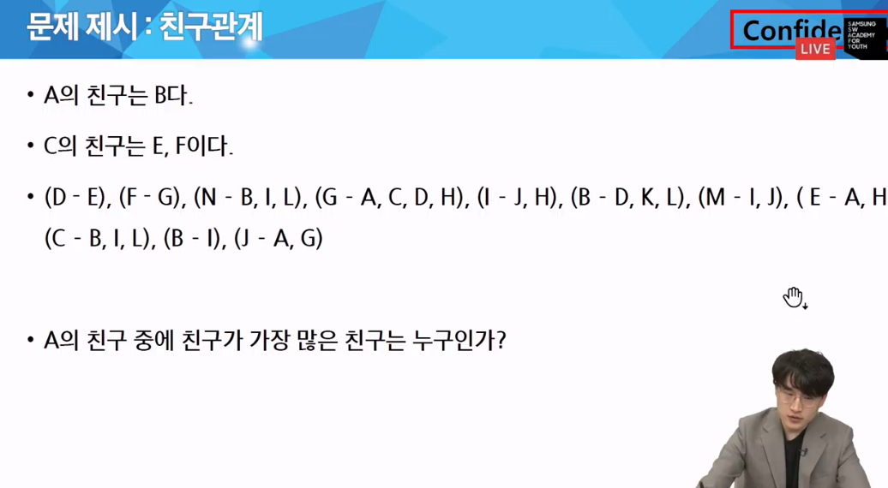
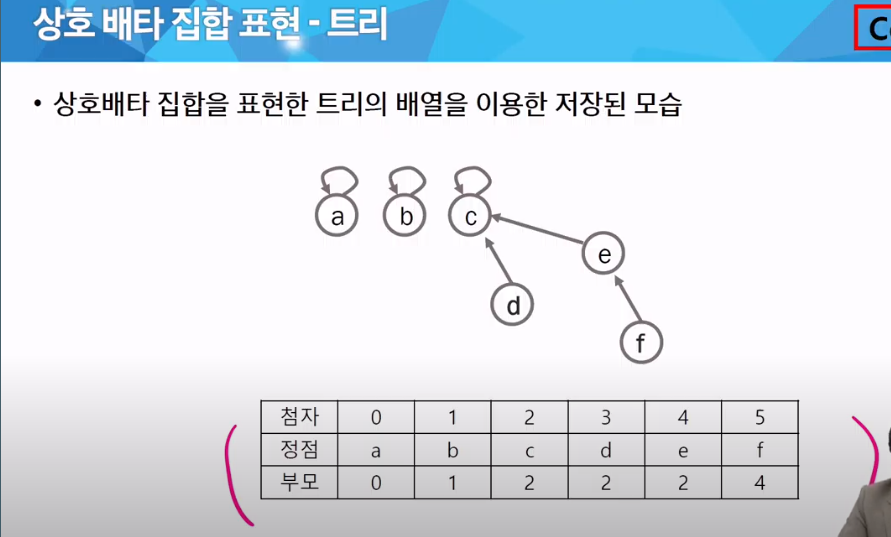
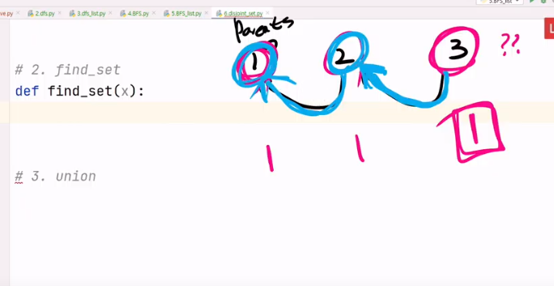

# 그래프1

- 그래프 기본
- DFS
- BFS
- Union-Find(Disjoint set)

그래프 -> 노드 + 간선으로 이루어진 자료구조, 데이터간 관계를 표시하기 위해

### 예시



## 그래프


## 그래프 유형

- 무향 == 양방향
- 유향 -> 가역 불가능
- 가중치 -> 도달하기 위해서 가중치(weight), 혹은 비용(cost) 필요
  - 내일은 가중치 알고리즘을 주로 다룸
- 사이클 없는 방향 그래프


- 완전 그래프
  - 정점들에 대해 가능한 모든 간선들을 가진 그래프
  - 노드 하나당 v-1개의 간선을 가짐
- 부분 그래프
  - 원래 그래프에서 일부의 정점이나 간선을 제외한 그래프


### 인접 정점
- 인접 => 이 말이 나오면 그래프 문제
  - 두 개의 정점에 간선이 존재(연결됨)하면 서로 인접해있다고 한다.
  - 완전 그래프에 속한 임의으ㅟ 두 정점들은 모두 인접해있다


### 그래프 경로

- 경로란 간선들을 순서대로 나열한 것
- 경로 중 한 정점을 최대한 한 번만 지나는 경로를 **단순경로**라 한다
  - 0-2-4-6, 0-1-6
- 시작한 정점에서 끝나는 경로를 **사이클**이라고 한다

## 완전탐색


1. 그래프를 코드로 표현
 - 연결리스트-> 잘 사용하지 않음, 
 - 인접행렬
   - V*V 배열을 활용해서 표현
   - 갈 수 없다면 0, 있다면 1(가중치)을 저장
   - 장점
     - 노드간의 연결 정보를 한 방에 확인 가능
     - 행렬곱을 이용해서 탐색이 쉽게 가능하다
     - 간선이 많을수록 유리
   - 단점
     - 노드 수가 커지면 메모리가 낭비된다. why? 연결이 안 된 것도 저장
     - => **메모리 제한 반드시 확인할것!!!**
 - 인접리스트
   - V개의 노드가 갈 수 있는 정보만 저장
   - 장점
     - 메모리 사용량이 적다
     - 탐색할 때 갈 수 있는 곳만 확인하기 때문에 시간적으로 효율
   - 단점
     - 특정 노드 간 연결 여부를 확인하는데 시간이 걸린다

```py
# 인접행렬
graph = [
    [0,1,0,1,0],
    [1,0,1,0,1],
    [0,1,0,0,0],
    [1,0,0,0,1],
    [0,1,0,1,0]
]
# 양방향 그래프는 중앙 우하단 대각선 기준으로 대칭이다. 


# 인접리스트
graph = [
    [1,3],
    [0,2,4],
    [1],
    [0,4],
    [1,3]
]
```

### DFS,BFS


#### DFS

```py

# 인접 행렬

visited = [0] * 5

def dfs(now):
    # !!기저조건
        # 지금 문제에선 없다
    # !!다음 재귀 호출 전
    print(now,end = ' ' )

    
    # !!다음 재귀 호출
    # !! 가기 전에 작업
    # dfs: 현재 노드에서 다른 노드들을 확인
    # 다른 노드들 == 반복문

    for to in range(5):
        # 갈 수 없다면 pass
        if graph[now][to] == 0:
            continue

        if visited[to]:
            continue
        visited[to] = 1
        dfs(to)
        # 이후에는 돌아왔을 때의 작업
# dfs(0)

```
```py
# 인접리스트 

visited =  [0]*5
def dfs(now):
    # !!기저조건
        # 지금 문제에선 없다
    # !!다음 재귀 호출 전
    print(now,end = ' ' )

    
    # !!다음 재귀 호출
    # !! 가기 전에 작업
    # dfs: 현재 노드에서 다른 노드들을 확인
    # 다른 노드들 == 반복문

    for to in graph[now]: # 이게 다름
        # 갈 수 없다면 pass

        if visited[to]:
            continue
        visited[to] = 1
        dfs(to)

```

#### BFS

```py

def bfs(start):
    visited = [0] * 5

    # 시작 노드를 큐에 추가 + 방문 표시
    queue = [start]
    visited[start] = 1

    while queue:
        now = queue.pop(0)
        print(now,end = ' ')

        # 갈 수 있는 곳을 체크
        for to in range(5):
            if graph[now][to] == 0:
                continue
            
            if visited[to] :
                continue

            visited[to] = 1
            queue.append(to)
```

>DFS와 BFS는 무조건 많이 풀어보는게 능사임


## Union-Find(Disjoint set), 서로소 집합 알고리즘ㄴ

- 서로소 또는 상호배타 집합들은 *서로 중복 포함된 원소가 없는 집합들*이다. 다시 말해 교집합이 없다
- 집합에 속한 하나의 특정 멤버를 통해 각 집합들을 구분한다. 이를 대표자(representative)라 한다. 

'데이터가 같은 집합에 속해있다' => **관계**가 있다 -> 그래프의 일종, 특히 트리로 많이 구현

- 상호 배타 집합을 표현하는 방법
  - 연결리스트
  - 트리
- 상호 배타 집합 연산 -> 구현에 필요한 것들
  - Make-Set(x) : 집합 만들기. 처음엔 자기 자신이 대표!
  - Find-Set(x) : 대표 누구야?
  - Union(x,y) : 같은 집합으로 묶자


### 연결리스트 이용

- 같은 집합의 원소들은 하나의 연결리스트로 관리한다
- 연결리스트의 맨 앞의 원소를 집합의 대표 원소로 삼는다
- 각 원소는 집합의 대표원소를 가리키는 링크를 갖는다


### 상호 배타 집합 표현 : 트리 활용

- 하나의 집합(a disjoint set)을 하나의 트리로 표현한다
- 자식 노드가 부모 노드를 가리키며 루트 노드가 대표자가 된다




```py
# 1~6번까지 노드가 존재

#1.makeset

def make_set(n):
    return [i for i in range(n)] # 자기자신이 댛표인 데이터 6개가 리스트로 생성
    #[0,1,2,3,4,5] # 뭘 의미할까? 대표자 인덱스
    # 자기자신이 대표인 데이터 6개가 리스트로 생성

# 2.find_set : 대표자가 누구냐
# 부모 노드를 보고, 부모 노드도 연결이 되어 있다면 다시 반복
# 언제까지? 자기 자신이 대표인 데이토를 찾을 때까지
parents = make_set(7) # 1번부터 6번까지 쓰고 0은 버림
def find_set(x):
    #자기 자신이 대표네? 끝
    if parents[x] == x:
        return x
    return find_set(parent[x])

# 3. union

def union(x,y):

    x = find_set(x)
    y = find_set(y)

    if x<y:
        parents[y] = x
    
    elif x>y: # 이건 라이브가 잘못된거 같은데... 만약 둘이 같으면 어떡함?
        parents[y] = x


    parents[y] = x
    #만약 이미 연결되어있으면?


def count_groups(): # 그룹 수 세기
    cnt = 0
    for i in range(1, len(parent)):
        if parent[i] == i:
            cnt += 1
    return cnt
```



< union의 주의점 >


< union 결과 >


# offline

 코테 유형

 - 80% 완탐. +백트래킹 + 이진검색(lower bound, upper bound) + 최소비용(MST,다익스트라)
 - 20%는 DP,그리드,UnionFind


```py
import sys
sys.stdin = open("input.txt", "r")

# 문제에서 집합의 수, ~~ 집합으로 묶을 수 있다.
# --> union-find 문제일 가능성이 있다.

# 코테 유형
# - 80% 완탐 + backtracking + 이진 검색(lower bound, upper bound) + 최소 비용(MST, dijkstra)
# - 20% DP, 그리디, union-find

# Union-Find
#   - 코테나 A형에서 자주 나올까 ?


def find_set(x):
    # 아래와 같은 코드는 뭐가 문제일까?
    #  == 대표자가 아닌 연결된 부모노드를 출력
    #  == 제대로된 대표자 데이터를 출력하지 않는다!
    # return parents[x]

    # 기저조건: 대표자가 자기 자신일 때 종료
    if parents[x] == x:
        return x

    rep = find_set(parents[x])
    return rep


def union(x, y):
    # 아래 처럼 바로 초기화를 하면
    # 싸이클이 발생할 수 있다.
    # parents[y] = x

    # 싸이클 발생 막기-------------------------
    # x 와 y 의 대표자를 찾아서
    x = find_set(x)
    y = find_set(y)

    # x 와 y 의 대표자가 같다
    # == 이미 같은 집합에 속해있다.
    # ==> 그러면 아무 행동 안함
    if x == y:
        return

    # 대표자를 바꾸는 기본 코드
    # parents[y] = x

    # 문제 조건에서 "낮은 번호를 대표자로 만들어라" 라는 내용들이 추가되면
    # 아래처럼 조건문을 작성
    if x < y:
        parents[y] = x
    else:
        parents[x] = y


T = int(input())

for tc in range(1, T + 1):
    N, M = map(int, input().split())
    li = list(map(int, input().split()))

    # 예시로 N = 5
    # 아무 행동도 하지 않았을 때, 집합은 몇 개 인가?
    # 자기자신이 대표인 그룹을 N + 1 개 생성: make_set
    parents = list(range(N + 1))

    for i in range(0, len(li), 2):
        union(li[i], li[i + 1])

    cnt = 0
    # 대표자의 수만 count
    for i in range(1, len(parents)):
        # 인덱스 == 자기 자신 번호가 들어있으면, 해당 그룹의 대표자
        if i == parents[i]:
            cnt += 1

    print(f'#{tc} {cnt}')

```

사실 이렇게 하면 parents가 한 번에 대표자를 띄운다는 보장이 없다.

### path compression - 경로압푹
- Find-set을 행하는 과정에서 만나는 모든 노드들이 직접 root를 가리키도록 포인터를 바꿔준다.
```py

def find_set(x):
    if parents[x] == x:
        return
    
    parents[x] = find_set(parents[x])
    return parents[x]

print(parents[x])
for i in range(1,N):
    find_set[i]

print(parents[x])

```

### 랭크를 이용한 union (level 이용, 다만 레벨의 방향은 반대(맨 아래가 0))

```py
T = int(input())

for tc in range(1, T + 1):
    N, M = map(int, input().split())
    li = list(map(int, input().split()))

    # 예시로 N = 5
    # 아무 행동도 하지 않았을 때, 집합은 몇 개 인가?
    # 자기자신이 대표인 그룹을 N + 1 개 생성: make_set
    parents = list(range(N + 1))
    # 랭크 저장
    ranks = [0] * (N + 1)

    for i in range(0, len(li), 2):
        union(li[i], li[i + 1])

    print()
    for i in range(1, 7):
        find_set(i)

    cnt = 0
    # 대표자의 수만 count
    for i in range(1, len(parents)):
        # 인덱스 == 자기 자신 번호가 들어있으면, 해당 그룹의 대표자
        if i == parents[i]:
            cnt += 1

    print(f'#{tc} {cnt}')
```
