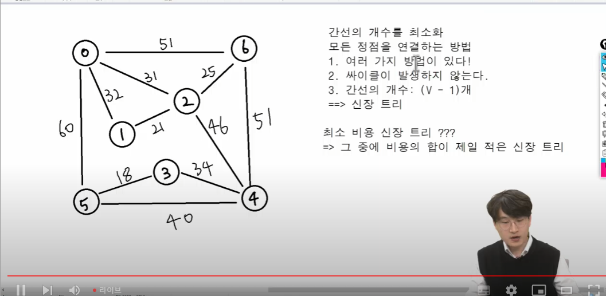

# 그래프

- 최소 비용 신장 트리(MST)
  - Prim 알고리즘
  - Kruskal 알고리즘
- 최단 경로(다익스트라)


## 최소비용신장트리 - 가중치가 있는 그래프

### 신장트리



### 최소비용 신장 트리


1. 완탐? 모든 신장 트리를 구해야 함. 시간이 너무 오래걸림
2. 백트래킹도 쳐낼 가지가 너무 많음
3. dp,그리디 -> 제일 작은것부터 고르자
    - 1) 제일 작은것부터 (18,21,25...)  => KRUSKAL
    - 2) 특정 노드를 시작으로 갈 수 있는 곳들 중 작은 곳으로 PRIM

prim과 kruskal 둘 다 그리디 알고리즘


### 1. Prim 알고리즘

- 하나의 정점에서 연결된 간선들 중에 하나씩 선택하면서 MST를 만들어가는 방식
  - 1) 임의 정점을 하나 선택해서 시작
  - 2) 선택한 정점과 인접하는 정점들 중의 최소 비용의 간선이 존재하는 정점을 선택 -> 인접한걸 먼저 간다는 점에서 bfs와 비슷
  - 3) 모든 정점이 선택될 때까지 1),2) 과정을 반복
  - 최소비용은 어떻게 주냐? queue에 우선순위를 준다 => 우선순위 큐


```py
''' 
7 11
0 1 32
0 2 31
0 5 60
0 6 51
1 2 21
2 4 46
2 6 25
3 4 34
3 5 18
4 5 40
4 6 51
'''

import sys
sys.stdin = open("input.txt","r")

V,E = map(int,input().split())
#인접행렬로 시작
# - [실습] 인접 리스트로 저장

graph = [[0] * V for _ in range(V)]

for _ in range(E):
    s,e,w = map(int,input().split())
    # 가중치 저장


    # [기존] 3-> 4로 갈 수 있다
    # graph[3][4] = 1

    # [가중치 그래프] 3->4로 가는데 31이라는 비용이 든다
    # graph[3][4] = 31

    graph[s][e] = w
    # 무방향 그래프
    graph[e][s] = 2

from heapq import heappop, heappush # 우선순위 큐
def prim(start):
    pq = [] # 힙
    mst = [0]*V # visited

    #최소비용
    sum_weight = 0

    # 시작점
    # [기존 BFS] 노드 번호만 관리 -> pq.append(start)

    # [PRIM] 우선 순위가 가중치에 따라 => 가중치가 낮으면 먼저 나와야 한다
    #  => 관리해야할 데이터 : 가중치, 노드번호 2가지
    # -> 동시에 두 가지 데이터 다루기
    # 1. 노드를 class로 만들기, 쓰진 않을거임 3개부턴 고려
    # 2. 튜플로 관리

    heappush(pq,(0,start))

    while pq:
        weight,now = heappop(pq)

            
        # 방문했다면 continue
        if mst[now]:
            continue
        # 얘가 BFS엔 없고 PRIM에 있는 이유>
        # BFS: 무조건 방문.
        # PRIM:: 일단 pq에 넣고 방문 x => 마지막에 남아있음
        # 우선순위 큐의 특성 상 더 먼거리로 가는 방법이 큐에 저장이 되어 있기 떄문에 기존에[ 미이 더 짧은 거리로 방문했다면, continue

        
        # 방문처리
        mst[now] = 1
        # 누적합 추가
        sum_weight += weight


        # 갈 수 있는 노드들을 보면서 
        for to in range(V):

            # print(now,'/',mst)

           

     
            # 갈 수 없거나 이미 방문했다면 pass
            if not graph[now][to] or mst[to]:
                continue

            heappush(pq,(graph[now][to],to))

        
    
    print(f'최소비용: {sum_weight})

```


prim에 continue가 하나 더 있는 이유

### Kruskal 알고리즘

- 간선을 하나 선택해서 mst를 찾는 알고리즘
  - 1) 최초, 모든 간선을 가중치에 따라 오름차순으로 정렬
  - 2) 가중치가 가장 낮은 간선부터 선택하면서 트리를 증가시킴
        - 사이클이 존재하면 다음으로 가중치가 낮은 간선 선택
  - 3) n-1개의 간선이 선택될 때까지 2) 반복
- 정렬과 사이클 탐색이 가장 중요
- 정렬은 sort, 사이클 탐색은 union-find 활용


```py
# 1. 전체 그래프를 보고, 가중치가 제일 작은 간선부터 뽑자
#   -> 코드로 구현 : 전체 간선 정보를 저장 + 가중치로 *정렬*

# 2. 방문 처리 : *사이클이 발생하면 안된다!* -> 크루스칼의 가장 중요한 2가지는 정렬과 사이클 탐색
# 사이클 여부? union-find 알고리즘 활용

V,E = map(int,input().split())
edges = [] # 간선 정보들을 모두 저장

for _ in range(E):
    s,e,w = map(int,input().split())

    edges.append([s,e,w])

edges.sort(key=lambda x:x[2]) #가중치를 기준으로 정렬

parents = list(range(V))
def find_set(x):
    if parents[x] == x:
        return x
    
    # 경로 압축
    parents[x] = find_set(parents[x])
    return parents[x]


def union(x,y):
    x = find_set(x)
    y = find_set(y)

    if x== y:
        return
    
    if x<y:
        parents[y] = x
    
    else:
        parent[x] = y


cnt = 0

for s,e,w in edges: #간선들을 모두 확인한다.
    # 사이클이 발생하면 pass, 사이클-> 이미 같은 집합에 속해있다. 1-2-3-1 => 1,2,3이 모두 1을 가리킴
        # how? 이미 같은 집합에 속해 있다면 pass
    if find_set(s) == find_set(e):
        print(s,e,w.'/사이클 발생. 탈락.')
        continue
    
    print(s,e,w)
    #k
    cnt += 1

    # 사이클이 없으면 통과
    # 사이클이 없으면 방문 처리
    union(s,e) # 얘가 방문처리, 둘에게 같은 대표자를 부여해서 사이클이 나오지 않도록 함
    sum_weight += w

    #k
    if cnt == V -1: # MST 완성! 간선 갯수 V-1
        break
```


굳이 2-4는 왜? 코드에선 사이클이 없어서 같이 처리됨. 현실에선 '신장트리'(모든 노드들이 연결되어 있다)를 위해


MST 완성 이후로는 필요 없는 부분

MST 완성 -> 간선이 V-1 => 이 조건을 추가, 위 코드에서 k라고 작성함


## 다익스트라 - 최단경로

- 최단 경로 정의 
- MSt는 최소비용 '신장트리' -> 전체를 연결해야함
- 얘는? 두 정점 사이의 경로들 중에 간선의 가중치의 합(누적거리)이 최소인 경우
- 다익스트라
  - 음의 가중치를 허용하지 않음


이건 교안 보면서, 다시보기 하면서 확인, 그냥 쭉 보면 이해 완벽하게 될거다


그리고 양방향 아니다

```py
from heapq import heappush, heappop

INF = int(1e9) # 엄청 큰 수, 얘는 대충 10억 

V,E = map(int,input().split())
start = 0 # 시작 노드 번호

# 인접 리스트

graph = [[] for _ i n range(V)]

# 누적 거리를 저장할 변수
distance = [INF] * V

# 간선 정보 저장
for _ in range(E):
    s,e,w = map(int,input().split())
    graph[s].append([w,e])

def dijkstra(start):
    pq = []

    # 시작점의 weight,node번호 한 번에 저장
    heappush(pq,(0,start)) 

    #**시작 노드 초기화 -> 현재는 INF라 안 하면 더 작은 누적거리가 존재해서 사이클 발생 가능
    distance[start] = 0

    while pq:
        #최단거리 노드에 대한 정보
        dist,now = heappop(pq)

        # pq의 특성 때문에 더 긴 거리가 미리 저장되어 있음.
        # now가 이미 더 짧은 거리로 온 적이 있다면 pass
        if distance[now] < dist:
            continue

        # now에서 인접한 다른 노드 확인
        for to in graph[now]:
            next_dist = to[0]
            next_node = to[1]

            # 누적거리 게산
            new_dist = dist + next_dist # 지금까지 온 거리 + 다음 가중치

            # 이미 더 짧은 거리로 간 경우 pass

            if new_dist >= distance[next_node]:
                continue
            
            # 만약 가장 적은 거리라면 최단 거리로 갱신
            distance[next_node] = new_dist
            heappush(pq,(next_dist,next_node)) # next_node의 인접 노드들을 pq에 추가

# path를 추가하는건 힘들다
# 팁: vst를 append 하는게 아니라 vst를 초기화
    
```

# offline

## prim이 덜 중요한 이유

- 더 느려서
- kruskal로 못 푸는 문제유형이 하나밖에 없음
  - 그래프가 끊겨 있는 경우
  - 너무 억지다(신장 트리 못 만든다)

## 시간복잡도

### prim (힙을 사용했을 때)

- O(VlogV + ElogV)
- heappush,heappop 시간 : logV (트리의 높이)
- 정점의 갯수:V
  - 모든 정점을 pq에 한 번씩은 넣어야 함
  - -> VlogV 시간 발생
- 간선의 갯수 : E
  - 최악의 경우 모든 간선을 확인 : ElogV 시간이 발생

### Kruskal 
- 연산 : 정렬(sort), union-find
  - 정렬 : VlogV
  - union-find -> 경로 압축 시 O(1), 최악의 경우는 높이만큼(logV)
- ->최종적으로는 VlogV라고 계산
  


## 실습 문제

learn -> course -> Programming-advanced -> 그래프의 최소 비용 문제

- 7일차 최소신장트리
- 7일차 최소비용
- 7일차 최소 이동 거리 3문제